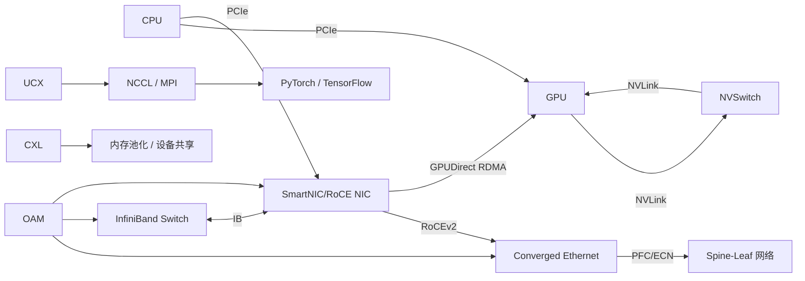

# HPC 关键网络互联技术

在 **高性能计算（HPC）、云计算、AI 训练** 场景中，所有关键的**网络与互联技术**

我们将从**物理层到应用层**，按“**层级结构 + 功能分类**”进行组织，并清晰地解释各项技术之间的**关联与演进逻辑**。

---

## 🧱 一、整体架构层级图（从内到外）

```
+---------------------------------------------------------+
|                    应用层（Application）                  |
|  AI训练（PyTorch DDP, Horovod）、HPC MPI、存储系统等     |
+----------------------+----------------------------------+
                       |
           +-----------v------------+     +------------------+
           |     通信框架/库层       |<--->| RDMA 编程接口     |
           | (UCX, libibverbs, MPI)  |     | (Verbs, RDMA CM)  |
           +-----------+------------+     +------------------+
                       |
        +--------------v---------------+  +------------------+
        |     传输协议层（Transport）   |  | TCP/IP, UDP      |
        | RDMA (RoCEv2, InfiniBand)     |  | iWARP, SCTP       |
        +--------------+---------------+  +------------------+
                       |
        +--------------v---------------+
        |     网络层（Network Layer）   |
        | IP Routing (RoCEv2), IB Subnet|
        +--------------+---------------+
                       |
        +--------------v---------------+
        |  数据链路层（Data Link Layer）|
        | Ethernet (PFC/ECN), InfiniBand |
        | (Reliable/Unreliable VCs)      |
        +--------------+---------------+
                       |
        +--------------v---------------+
        |     物理层（Physical Layer）  |
        |  Cable, Optical, DAC, AOC     |
        +--------------+---------------+
                       |
        +--------------v---------------+
        |      互连总线（Internal Bus） |
        | PCIe, NVLink, CXL, UCIe       |
        +------------------------------+
```

下面我们按**功能模块 + 层级**详细展开。

---

## 📌 二、分层详解：HPC/AI/云计算中的网络与互联技术

---

### 🔹 1. **内部互连总线（On-Node Interconnects）**
这是**单台服务器内部**的高速互联技术，决定 CPU、GPU、内存、加速器之间的通信效率。

#### ✅ 1.1 **PCIe（Peripheral Component Interconnect Express）**
- **作用**：通用高速串行总线，连接 CPU 与外设（GPU、SSD、网卡）。
- **版本演进**：
  - PCIe 3.0 → 4.0 → 5.0 → 6.0
  - 带宽翻倍：x16 插槽，PCIe 5.0 ≈ 64 GB/s 双向
- **局限**：共享总线结构，带宽有限，不适合 GPU 间高频通信。

#### ✅ 1.2 **NVLink（NVIDIA）**
- **作用**：NVIDIA 开发的**GPU 间高速互联技术**，远超 PCIe 带宽。
- **特点**：
  - 点对点直连，带宽可达 900 GB/s（NVLink 4.0）
  - 支持 GPU 内存共享（如 NVSwitch 架构）
- **应用场景**：DGX 服务器、AI 大模型训练
- **与 PCIe 关系**：NVLink 是 PCIe 的**高性能替代/补充**，用于 GPU 集群内部。

#### ✅ 1.3 **CXL（Compute Express Link）**
- **作用**：基于 PCIe 物理层的**缓存一致性互联协议**，支持内存池化、设备共享。
- **三种模式**：
  - CXL.io（类似 PCIe）
  - CXL.cache（CPU 可缓存设备内存）
  - CXL.mem（设备可访问主机内存）
- **目标**：实现 CPU 与加速器（GPU/FPGA/智能网卡）的**内存统一视图**
- **应用场景**：云计算资源池化、AI 推理、内存扩展

#### ✅ 1.4 **UCIe（Universal Chiplet Interconnect Express）**
- **作用**：芯片级互联标准，用于封装内多个“芯粒（Chiplet）”之间的高速通信。
- **目标**：打破单芯片尺寸限制，构建异构计算系统
- **与 PCIe/NVLink 关系**：更底层，用于芯片封装内部，不直接暴露给用户。

> 🔗 **关联总结**：
> - PCIe 是通用基础
> - NVLink 专为 GPU 加速
> - CXL 实现内存一致性
> - UCIe 是芯片级互联

---

### 🔹 2. **远程直接内存访问（RDMA）技术栈**
这是**跨节点通信**的核心技术，实现低延迟、高吞吐、低 CPU 开销。

#### ✅ 2.1 **RDMA（Remote Direct Memory Access）**
- **本质**：一种通信语义，允许**网卡直接读写远程内存**，无需 CPU 和内核参与。
- **优势**：
  - 微秒级延迟
  - 零拷贝
  - CPU 开销极低（<5%）
- **依赖**：需要专用硬件（支持 RDMA 的网卡）和网络协议。

#### ✅ 2.2 **RDMA 的三种实现方式**
| 协议 | 全称 | 基于网络 | 特点 |
|------|------|----------|------|
| **InfiniBand (IB)** | 原生 RDMA 协议 | 专用 IB 网络 | 原生支持 RDMA、QoS、拥塞控制，性能最强 |
| **RoCE** | RDMA over Converged Ethernet | 以太网 | RoCEv1（二层）、RoCEv2（UDP/IP 三层） |
| **iWARP** | Internet Wide Area RDMA Protocol | 以太网 | 基于 TCP，兼容性好，但延迟较高，较少用 |

> 🔗 **RoCEv2 是当前主流**：在标准以太网上实现 RDMA，结合 PFC/ECN 实现无损网络。

---

### 🔹 3. **网络协议与传输层技术**

#### ✅ 3.1 **Converged Ethernet（融合以太网）**
- **定义**：支持多种流量（数据、存储、RDMA）的以太网。
- **关键技术**：
  - **PFC（Priority Flow Control）**：基于优先级的流控，防止 RoCE 丢包
  - **ECN（Explicit Congestion Notification）**：拥塞通知，用于 RoCE 拥塞控制
  - **DCB（Data Center Bridging）**：IEEE 标准套件，支持 PFC、ECN 等
- **目标**：让以太网具备“无损”特性，支持 RoCE

#### ✅ 3.2 **RoCEv2（RDMA over UDP/IP）**
- **封装方式**：InfiniBand 帧 → UDP → IP → Ethernet
- **端口**：UDP 4791
- **优势**：支持跨子网路由，适合大规模部署
- **依赖**：必须部署 PFC + ECN + DCQCN（拥塞控制算法）

#### ✅ 3.3 **InfiniBand（IB）协议栈**
- **原生支持**：RDMA、多路径、服务质量（SL）、子网管理（SM）
- **传输类型**：
  - RC（可靠连接）
  - UC（不可靠连接）
  - UD（不可靠数据报）
- **优势**：协议简单、延迟极低、拥塞控制完善
- **劣势**：生态封闭、成本高、需专用交换机

---

### 🔹 4. **GPU 直连与加速技术（GPU Direct）**

#### ✅ 4.1 **GPUDirect RDMA（GDR）**
- **作用**：允许 RDMA 网卡（如 Mellanox）**直接访问 GPU 显存**，避免 CPU 和系统内存中转。
- **流程**：
  1. GPU 显存注册为“可直接访问”
  2. RDMA 网卡通过 PCIe 直接读写显存
- **效果**：减少两次内存拷贝，延迟降低 30%+，带宽提升

#### ✅ 4.2 **GPUDirect Storage（GDS）**
- **作用**：GPU 直接访问 NVMe SSD，用于 AI 数据加载
- **依赖**：支持 GPUDirect 的 SSD 和驱动

#### ✅ 4.3 **NVSwitch / NVLink Switching (NVLS)**
- **作用**：通过 NVSwitch 芯片，实现多 GPU 全互连（全连接拓扑）
- **应用场景**：NVIDIA DGX A100/H100，8 GPU 全互联，带宽高达 600 GB/s

> 🔗 **GDR + NVLink + RoCE/IB = 完整的 GPU-to-GPU over Network 方案**

---

### 🔹 5. **通信编程接口与运行时库**

#### ✅ 5.1 **Verbs API（libibverbs）**
- **作用**：InfiniBand/RoCE 的底层编程接口
- **特点**：复杂但性能极致，常用于高性能 MPI 实现

#### ✅ 5.2 **UCX（Unified Communication X）**
- **作用**：开源通信框架，统一支持：
  - RDMA（IB/RoCE）
  - TCP/IP
  - shared memory
  - CUDA IPC
- **优势**：自动选择最优路径，广泛用于 AI 框架（如 PyTorch、Horovod）

#### ✅ 5.3 **MPI（Message Passing Interface）**
- **作用**：HPC 标准通信库，支持点对点、集合通信（AllReduce、Broadcast）
- **实现**：
  - OpenMPI、MVAPICH2、Intel MPI
  - 后端可使用 IB、RoCE、TCP

#### ✅ 5.4 **NCCL（NVIDIA Collective Communications Library）**
- **作用**：专为 NVIDIA GPU 设计的集合通信库，优化 AllReduce、AllGather 等操作
- **特点**：
  - 自动使用 NVLink、PCIe、RoCE/IB 多路径
  - 支持 Ring、Tree 等通信拓扑
- **应用**：PyTorch DDP、TensorFlow MirroredStrategy

---

### 🔹 6. **网络运维与管理（OAM）**

#### ✅ 6.1 **OAM（Operations, Administration & Maintenance）**
- **作用**：监控、诊断、维护 RDMA/IB/RoCE 网络
- **工具**：
  - `ibstat`, `iblinkinfo`（InfiniBand）
  - `rdma` 命令（RoCE）
  - `ethtool -S`（以太网统计）
- **功能**：
  - 链路质量检测
  - 丢包、重传、拥塞监控
  - QoS 配置

#### ✅ 6.2 **Telemetry & Observability**
- 如 NVIDIA UFM、Mellanox Onyx、Prometheus + Grafana
- 实时监控 RoCE 拥塞、PFC pause 帧、ECN 标记等

---

### 🔹 7. **前沿与补充技术**

#### ✅ 7.1 **OCS（Optical Circuit Switching）**
- **作用**：光电路交换，用于动态重构数据中心拓扑
- **优势**：低延迟、高带宽、节能
- **应用**：AI 训练中动态调整通信拓扑

#### ✅ 7.2 **DPU / SmartNIC**
- **作用**：卸载网络、存储、安全任务
- **支持**：RoCE、GDR、CXL、OVS 加速
- **厂商**：NVIDIA (BlueField), Intel (IPU), AWS (Nitro)

#### ✅ 7.3 **SR-IOV / VFIO**
- **虚拟化技术**：让虚拟机直接访问网卡硬件，降低虚拟化开销
- **用于**：云环境中提供高性能 RDMA 服务

---

## 🔄 三、技术关联与生态图谱



---

## ✅ 四、典型场景技术选型建议

| 场景 | 推荐技术组合 |
|------|---------------|
| **AI 大模型训练（千卡级）** | RoCEv2 + PFC/ECN + NVLink + NCCL + UCX + GDR |
| **超算中心 / HPC** | InfiniBand + MPI + Slurm + IB Subnet Manager |
| **云服务商高性能实例** | RoCE + DPU + SR-IOV + CXL 内存扩展 |
| **AI 推理 / 低延迟交易** | CXL + PCIe 5.0 + RoCE + 用户态协议栈 |
| **前沿研究 / 动态拓扑** | OCS + RoCE + 可编程交换机 |

---

## 📚 总结：核心逻辑链

> **目标：降低通信开销，提升计算效率**

1. **单节点内**：用 **PCIe → NVLink → CXL** 提升 GPU/内存互联带宽
2. **跨节点通信**：用 **RDMA（RoCE/IB）** 替代 TCP，实现零拷贝、低延迟
3. **GPU 直连**：用 **GDR** 避免内存拷贝
4. **通信优化**：用 **NCCL/UCX/MPI** 实现高效集合通信
5. **网络保障**：用 **PFC/ECN/OAM** 构建无损以太网
6. **未来趋势**：**CXL、DPU、OCS、UCIe** 推动“内存池化”和“解耦架构”

---

如果你有具体场景（如“如何搭建一个 100 节点的 AI 训练集群？”或“RoCE 与 IB 如何选型？”），我可以进一步提供架构设计建议。欢迎继续提问！