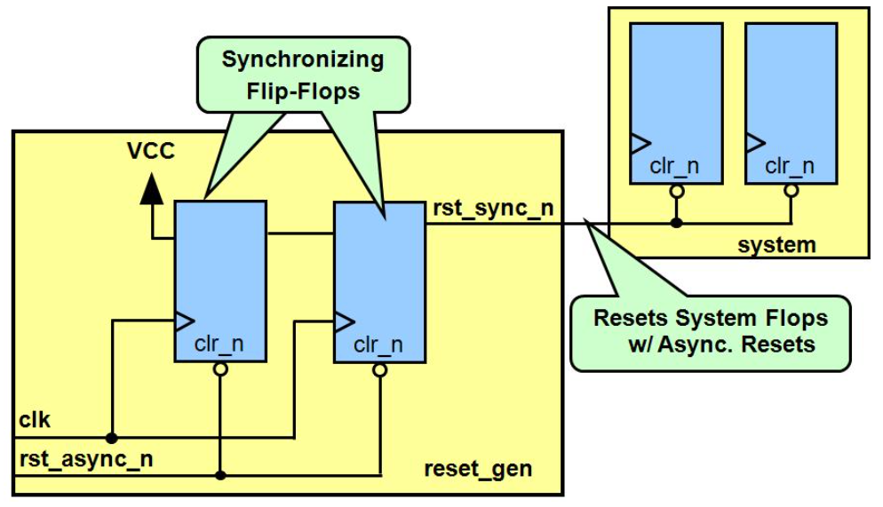

https://zhuanlan.zhihu.com/p/120863919

# 同步与异步
## 同步

同步复位电路的优点：

- 有利于仿真器的仿真
- 基本上没有亚稳态问题
- 同步时序电路，有利于时序分析
- 由于只在时钟有效电平到来时才有效，所以可以滤除高于时钟频率的复位毛刺

同步复位电路的缺点：

- 复位信号的有效时长必须大于时钟周期，才能真正被系统识别并完成复位任务。同时还要考虑延时因素
- 大多数的 FPGA 的 DFF 都只有异步复位端口，采用同步复位的话，综合器就会在寄存器的数据输入端口插入组合逻辑，这样会耗费逻辑资源

## 异步

异步复位电路的优点：

- 大多数目标器件库的 DFF 都有异步复位端口，不会占用额外资源
- 设计相对简单，异步复位信号识别方便，而且可以很方便的使用 FPGA 的全局复位端口 GSR

异步复位电路的缺点：

- 复位信号容易受到毛刺的影响
- 因为是异步逻辑，无法避免地存在亚稳态问题，可能会时序违例

  关于异步复位还需要考虑：

**恢复时间（Recovery Time）** 是指异步控制信号（如寄存器的异步清除和置位控制信号）在“下个时钟沿”来临之前变无效的最小时间长度。这个时间的意义是，如果保证不了这个最小恢复时间，也就是说这个异步控制信号的解除与“下个时钟沿”离得太近（但在这个时钟沿之前），没有给寄存器留有足够时间来恢复至正常状态，那么就不能保证“下个时钟沿”能正常作用，也就是说这个“时钟沿”可能会失效。

**去除时间（Removal）** 是指异步控制信号（如寄存器的异步清除和置位控制信号）在“有效时钟沿”之后变无效的最小时间长度。这个时间的意义是，如果保证不了这个去除时间，也就是说这个异步控制信号的解除与“有效时钟沿”离得太近（但在这个时钟沿之后），那么就不能保证有效地屏蔽这个“时钟沿”，也就是说这个“时钟沿”可能会起作用。

# 异步复位、同步释放

复位是异步进行的，一旦复位信号为低电平，则输出复位，而复位的撤除则被同步到了时钟域下。如此一来，既解决了同步复位的资源消耗问题，也解决了异步复位的亚稳态问题。其根本思想，也是将异步信号同步化。



复位信号 rst_sync_n 由高拉低时实现 y 寄存器的异步复位。同步释放，这个是关键，即当复位信号 rst_async_n 撤除时（由低拉高），由于双缓冲电路（双触发器）的作用，rst_sync_n 不会随着 rst_async_n 的撤除而撤除。假设 rst_async_n 撤除时发生在 clk 上升沿，如果不加此电路则可能发生亚稳态事件，但是加上此电路以后，假设第一级 D 触发器 clk 上升沿时 rst_async_n 正好撤除，（第一个 DFF 此时是处于亚稳态的；假设此时识别到高电平；若是识别到低电平，则增加一个 Delay）则 DFF1 输出高电平，此时第二级触发器也会更新输出，但是输出值为前一级触发器 clk 来之前时的 Q1 输出状态，显然 Q1 之前为低电平，所以第二级触发器输出保持复位低电平，直到下一个 clk 来之后，才随着变为高电平，即同步释放。

```verilog
module dff_sync(
	input clk,
	input rst_async_n,
	output rst_sync_n,
	input din,
	output reg dout
);   
reg rst_s1;
reg rst_s2;
always @ (posedge clk, negedge rst_async_n)
if (!rst_async_n) begin
    rst_s1 <= 1'b0;
    rst_s2 <= 1'b0;
end
else begin
    rst_s1 <= 1'b1;
    rst_s2 <= rst_s1;
end
assign rst_sync_n = rst_s2;

always @ (posedge clk, negedge rst_sync_n)begin
	if(!rst_sync_n)
		dout <= 0;
	else
		dout <= din;
end
endmodule
```

# 复位的使用

Xilinx Get Smart About Reset

https://blog.csdn.net/DengFengLai123/article/details/113749534
