# AI 编译器 TVM 到底是什么？Luis Ceze 的访谈

https://www.zhihu.com/question/640711404

# COS 访谈第 18 期：陈天奇（发明 Xgboost 算法的大佬）

https://blog.csdn.net/hemeinvyiqiluoben/article/details/87870656

# 如何理解 TVM、Triton、Mojo 之间的发展关系？

https://www.zhihu.com/question/653217656

## TVM：自动化机器学习编译器

TVM 是一个开源的机器学习编译器框架，旨在提供一种灵活、高效且自动化的方式，**旨在将高级的机器学习模型转换成优化的低级代码，以便在各种硬件后端上运行**。TVM 通过其核心组件：编译器、自动调度器（AutoTVM）和图优化器，实现了对机器学习模型从高层次描述到底层硬件指令的转换。TVM 包括了一系列的编译器技术和优化算法，能够自动进行模型的图优化、算子融合、内存布局优化等操作。TVM 的核心优势在于其模块化的架构和广泛的硬件支持，包括 CPU、GPU、FPGA 等。

**核心特点**
多后端支持：TVM 可以生成针对 CPU、GPU、FPGA 等多种设备优化的代码。
自动化优化：通过 AutoTVM 自动化的调参过程，可优化模型在特定硬件上的执行效率。
前端灵活性：支持包括 TensorFlow、PyTorch、MXNet 等多种主流深度学习框架。

## Triton：为 GPU 优化的编程语言

Triton 是一个新兴的开源项目，其核心是一个专为 GPUs 设计的编程语言和一个相应的编译器，用以简化和优化深度学习模型在 GPUs 上的执行效率。**Triton 通过简化 GPU 编程模型（减少对 CUDA 等底层语言的依赖）**，使得开发者可以更容易地开发高效的 GPU 加速代码。Triton 关注的重点是通过高层次的抽象来简化 GPU 编程，使得开发者能够更容易地编写高性能的代码。**Triton 支持即时编译（Just-In-Time Compilation, JIT）和运行时代码生成，这样可以在运行时动态地优化特定的算法或算子。**

**核心特点**
简化 GPU 编程：Triton 语言的设计抽象了许多 GPU 编程的复杂性。
高性能：相较于传统的 CUDA 编程，Triton 能在某些情况下提供更优的性能表现。
易于集成：Triton 可以和 PyTorch 等框架配合使用，简化整个模型到 GPU 的部署流程。

## Mojo：浏览器端的机器学习推理框架

Mojo 是 Chromium 项目的一部分，旨在将机器学习模型直接部署到浏览器中，实现在客户端的机器学习推理。这种方法可以显著减少服务器的计算负担，降低延迟，并保护用户数据的私密性。

**核心特点**
直接运行在浏览器：Mojo 不需要额外的插件或软件，可以直接在支持的浏览器上运行。
支持多种模型格式：可以加载和执行多种格式的预训练模型。
低延迟：在用户设备上直接进行计算，可以实现几乎实时的数据处理速度。

# AI 编译器

## AI编译器

[AI 编译器](https://zhida.zhihu.com/search?content_id=257242002&content_type=Article&match_order=1&q=AI+%E7%BC%96%E8%AF%91%E5%99%A8&zhida_source=entity)分 [编译器前端](https://zhida.zhihu.com/search?content_id=257242002&content_type=Article&match_order=1&q=%E7%BC%96%E8%AF%91%E5%99%A8%E5%89%8D%E7%AB%AF&zhida_source=entity)（Compiler Frontend）和 [编译器后端](https://zhida.zhihu.com/search?content_id=257242002&content_type=Article&match_order=1&q=%E7%BC%96%E8%AF%91%E5%99%A8%E5%90%8E%E7%AB%AF&zhida_source=entity)（Compiler Backend）两个主要部分

### 编译器前端

- **输入格式转换**：AI 开发使用多种框架，如 PyTorch、TensorFlow 等，它们的模型表示和代码形式不同。输入格式转换负责将这些不同框架的模型代码或数据格式，转换为编译器能够处理的统一内部格式。比如把 PyTorch 模型的结构和参数信息，转化成编译器能理解的形式，方便后续处理。
- **[高级 IR](https://zhida.zhihu.com/search?content_id=257242002&content_type=Article&match_order=1&q=%E9%AB%98%E7%BA%A7+IR&zhida_source=entity) / [图 IR](https://zhida.zhihu.com/search?content_id=257242002&content_type=Article&match_order=1&q=%E5%9B%BE+IR&zhida_source=entity)（中间表示）**

- **高级 IR**：是一种高层次、抽象的对模型计算逻辑和结构的表示方式。它屏蔽了底层硬件和具体框架细节，以一种通用的形式描述模型。例如，将神经网络中的卷积、全连接等操作，以及它们之间的数据流动关系，用高级 IR 表示出来，便于在这个层面进行统一分析和处理。
- **图 IR**：以图的形式来表示模型，图中的节点代表算子（如卷积算子、激活函数算子等），边代表数据的流动方向。像在描述一个图像分类神经网络时，卷积层、池化层、全连接层等操作是节点，数据从输入层经过各层处理到输出层的流动路径由边表示。这种图的形式直观展示了模型计算流程。

- **[计算图优化方案](https://zhida.zhihu.com/search?content_id=257242002&content_type=Article&match_order=1&q=%E8%AE%A1%E7%AE%97%E5%9B%BE%E4%BC%98%E5%8C%96%E6%96%B9%E6%A1%88&zhida_source=entity)**：基于得到的计算图（如上述的图 IR）进行优化。常见优化手段有：

- **算子融合**：将多个相邻且可合并的算子合并成一个算子。例如，把卷积操作和紧接着的批量归一化操作融合在一起，减少计算过程中的数据搬运和中间结果存储，提升计算效率。
- **常量折叠**：在编译阶段计算常量表达式的值。比如对于表达式 `2 + 3`，在编译时直接计算出结果 `5`，而不是在运行时再计算，节省运行时计算资源。
- **死代码消除**：去除对最终结果没有影响的代码部分。如果模型中有一段计算，其结果不会被后续任何操作使用，就可以把这部分代码删除。

- **调试工具**：帮助开发者检查和调试 AI 模型在编译过程中的问题。比如在将模型代码转换为内部表示、进行优化等过程中，如果出现错误或不符合预期的情况，调试工具可以帮助定位问题所在。它可以查看计算图的中间状态、检查算子参数是否正确设置等，便于开发者快速找到并解决编译相关问题。

### 编译器后端

- **硬件特定优化**：根据不同的硬件（如 CPU、GPU、NPU、TPU 等）特性进行针对性优化。例如，GPU 具有大量并行计算单元，硬件特定优化会利用这一特性，将模型计算任务合理分配到多个并行单元上，实现并行加速；而对于 NPU 这种专门为神经网络设计的硬件，会根据其独特的架构和指令集，对神经网络计算进行定制化优化，如优化卷积计算在 NPU 上的执行方式。
- **[自动调度](https://zhida.zhihu.com/search?content_id=257242002&content_type=Article&match_order=1&q=%E8%87%AA%E5%8A%A8%E8%B0%83%E5%BA%A6&zhida_source=entity)**：决定模型计算任务在硬件上的执行顺序和资源分配方式。它会根据硬件资源情况（如 CPU 的核心数、GPU 的显存大小等），以及模型计算的依赖关系，合理安排各个算子的执行顺序和在硬件上的运行位置。比如，对于一个包含多个卷积层和全连接层的神经网络，自动调度会确定这些层的计算先后顺序，以及如何在 GPU 的不同计算单元上分配计算任务。
- **[自动调优](https://zhida.zhihu.com/search?content_id=257242002&content_type=Article&match_order=1&q=%E8%87%AA%E5%8A%A8%E8%B0%83%E4%BC%98&zhida_source=entity)**：在硬件上尝试不同的参数配置和算法实现，找到最优的运行参数组合。例如，对于矩阵乘法操作，可能有多种算法实现，自动调优会尝试不同算法，并调整相关参数（如分块大小等），根据运行时间、资源消耗等指标，找出在当前硬件上最适合的实现方式和参数设置。
- **特定优化的内核库**：针对不同硬件和计算任务，预先编写好的经过高度优化的函数库。比如针对 GPU 的 [CUDA 内核库](https://zhida.zhihu.com/search?content_id=257242002&content_type=Article&match_order=1&q=CUDA+%E5%86%85%E6%A0%B8%E5%BA%93&zhida_source=entity)，包含了各种针对 GPU 优化的计算函数，像优化后的卷积内核函数、矩阵乘法内核函数等。编译器后端在生成代码时，会调用这些内核库中的函数，以提高模型计算的性能。
- **[低级 IR](https://zhida.zhihu.com/search?content_id=257242002&content_type=Article&match_order=1&q=%E4%BD%8E%E7%BA%A7+IR&zhida_source=entity) / [操作符 IR](https://zhida.zhihu.com/search?content_id=257242002&content_type=Article&match_order=1&q=%E6%93%8D%E4%BD%9C%E7%AC%A6+IR&zhida_source=entity)**

- **低级 IR**：相比于前端的高级 IR，低级 IR 更接近目标硬件的指令集，是一种更底层的中间表示形式。它对硬件资源（如寄存器、内存地址等）有更明确的描述，为最终生成目标硬件可执行代码做准备。
- **操作符 IR**：侧重于对具体算子的详细表示，描述算子的输入输出格式、计算细节、在硬件上的执行方式等。例如，对于卷积算子的操作符 IR，会详细说明卷积核大小、步长、填充等参数，以及如何在目标硬件上实现卷积计算。

- **编译方案**：确定从中间表示（如低级 IR）生成目标硬件可执行代码的具体策略和方法。包括选择合适的编译算法、代码生成顺序等。例如，对于将低级 IR 转换为 GPU 的机器码，编译方案会规定如何将 IR 中的指令映射到 GPU 的指令集，以及如何处理数据在显存中的存储和读取等问题。
- **针对不同平台的代码生成**：根据不同的硬件平台（CPU、GPU、NPU 等），生成相应平台能够直接执行的代码。比如为 CPU 生成符合其指令集规范的汇编代码或机器码；为 GPU 生成 CUDA 代码等。确保模型能够在不同硬件平台上高效运行。

# 传统编译器

## 编译器与解释器

编译器（Compiler）和解释器（Interpreter）是两种不同的工具，都可以将编程语言和脚本语言转换为机器语言。虽然两者都是将高级语言转换成机器码，但是其最大的区别在于：**解释器在程序运行时将代码转换成机器码，编译器在程序运行之前将代码转换成机器码**。

> 机器语言：机器语言程序是由一系列二进制模式组成的（例如 110110），表示应该由计算机执行的简单操作。机器语言程序是可执行的，所以可以直接在硬件上运行。

### 编译器 Compiler

编译器可以将整个程序转换为目标代码 (object code)，这些目标代码通常存储在文件中。目标代码也被称为二进制代码，在进行链接后可以被机器直接执行。典型的编译型程序语言有 C 和 C++。

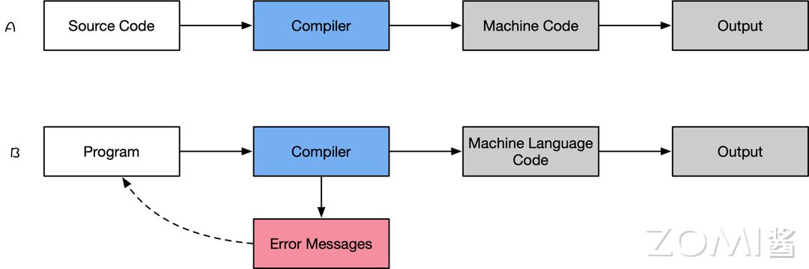

下面来打开看看编译器的几个重要的特点：

1. 编译器读取源程序代码，输出可执行机器码，即把开发者编写的代码转换成 CPU 等硬件能理解的格式
2. 将输入源程序转换为机器语言或低级语言，并在执行前并报告程序中出现的错误
3. 编译的过程比较复杂，会消耗比较多的时间分析和处理开发者编写的程序代码
4. 可执行结果，属于某种形式的特定于机器的二进制代码

目前主流如 LLVM 和 GCC 等经典的开源编译器的类型分为前端编译器、中间层编译器、后端编译器。

1. 编译器的分析阶段也称为前端编译器，将程序划分为基本的组成部分，检查代码的语法、语义和语法，然后生成中间代码。
2. 中间层主要是对源程序代码进行优化和分析，分析阶段包括词法分析、语义分析和语法分析；优化主要是优化中间代码，去掉冗余代码、子表达式消除等工作。
3. 编译器的合成阶段也称为后端，针对具体的硬件生成目标代码，合成阶段包括代码优化器和代码生成器。

### 解释器 Interpreter

解释器能够直接执行程序或脚本语言中编写的指令，而不需要预先将这些程序或脚本语言转换成目标代码或者机器码。典型的解释型语言有 Python、PHP 和 Matlab。

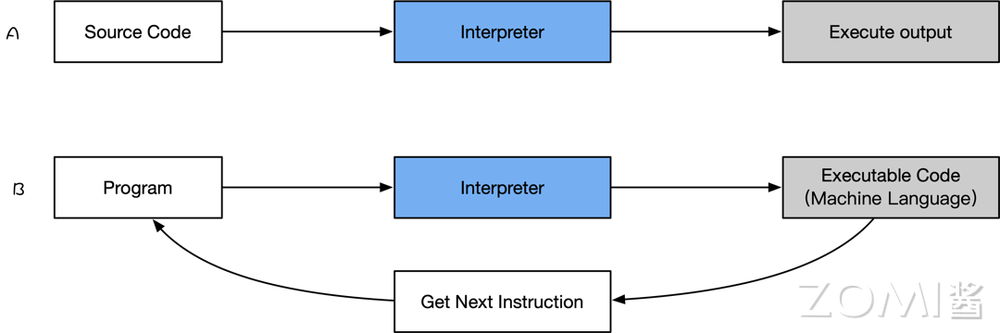

下面来打开看看解释器的几个重要的特点：

1. 将一个用高级语言编写的程序代码翻译成机器级语言
2. 解释器在运行时，逐行转换源代码为机器码
3. 解释器允许在程序执行时，求值和修改程序
4. 用于分析和处理程序的时间相对较少
5. 与编译器相比，程序执行相对缓慢

两者最大的差别在于编译器将一个程序作为一个整体进行翻译，而解释器则一条一条地翻译一个程序。编译器的情况下生成中间代码或目标代码，而解释器不创建中间代码。在执行效率上，编译器比解释器要快得多，因为编译器一次完成整个程序，而解释器则是依次编译每一行代码，非常的耗时。从资源占用方面来看，由于要生成目标代码，编译器比解释器需要更多的内存。

实际上编程的体验差异也非常大，编译器同时显示所有错误，很难检测错误，而解释器则逐个显示每条语句的错误，更容易检测错误。具体的，在编译器中，当程序中出现错误时，它会停止翻译，并在删除错误后重新翻译整个程序。相反，当解释器中发生错误时，它会阻止其翻译，在删除错误后，翻译才继续执行。

## JIT 和 AOT 编译方式

目前，程序主要有两种运行方式：**静态编译**和**动态解释**。

- **静态编译**的代码程序在执行前全部被翻译为机器码，通常将这种类型称为 AOT（Ahead of time），即“提前编译”；
- **动态解释**的程序则是对代码程序边翻译边运行，通常将这种类型称为 JIT（Just in time），即“即时编译”。

AOT 程序的典型代表是用 C/C++ 开发的应用，其必须在执行前编译成机器码，然后再交给操作系统具体执行；而 JIT 的代表非常多，如 JavaScript、Python 等动态解释的程序。

事实上，所有脚本语言都支持 JIT 模式。但需要注意的是 JIT 和 AOT 指的是**程序运行方式**，和编程语言本身并非强关联的，有的语言既可以以 JIT 方式运行也可以以 AOT 方式运行，如 Java 和 Python。它们可以在第一次执行时编译成中间字节码，之后就可以直接执行字节码。

也许有人会说，中间字节码并非机器码，在程序执行时仍然需要动态将字节码转为机器码。理论上讲这没有错，不过通常区分是否为 AOT 的标准就是看代码在执行之前是否需要编译，只要需要编译，无论其编译产物是字节码还是机器码，都属于 AOT 的方式。

### 优缺点对比

下面是 JIT 和 AOT 两种编译方式的优点对比。在 JIT 中其优点为：

1. 可以根据当前硬件情况实时编译生成最优机器指令
2. 可以根据当前程序的运行情况生成最优的机器指令序列
3. 当程序需要支持动态链接时，只能使用 JIT 的编译方式
4. 可以根据进程中内存的实际情况调整代码，使内存能够更充分的利用

但是 JIT 缺点也非常明显：

1. 编译需要占用运行时 Runtime 的资源，会导致进程执行时候卡顿
2. 编译占用运行时间，对某些代码编译优化不能完全支持，需在流畅和时间权衡
3. 在编译准备和识别频繁使用的方法需要占用时间，初始编译不能达到最高性能

相对而言，JIT 的缺点也是 AOT 的优点所在：

1. 在程序运行前编译，可以避免在运行时的编译性能消耗和内存消耗
2. 可以在程序运行初期就达到最高性能
3. 可以显著的加快程序的执行效率

其 AOT 的优点之下，也会带来一些问题：

1. 在程序运行前编译会使程序安装的时间增加
2. 将提前编译的内容保存起来，会占用更多的内存
3. 牺牲高级语言的一致性问题

### 在 AI 框架中区别

目前主流的 AI 框架，都会带有前端的表达层，再加上 AI 编译器对硬件使能，因此 AI 框架跟 AI 编译器之间关系非常紧密，部分如 MindSpore、TensorFlow 等 AI 框架中默认包含了自己的 AI 编译器。目前 PyTorch2.X 版本升级后，也默认自带 Inductor 功能特性，可以对接多个不同的 AI 编译器。

如**静态编译**的代码程序在执行前全部被翻译为机器码，这种 AOT（Ahead of time），即提前编译的方式，AOT 更适合移动、嵌入式深度学习应用。在 MLIR + TensorFlow 框架中目前支持 AOT 和 JIT 的编译方式，不过在 AI 领域，目前 AOT 的典型代表有：

1. 推理引擎，在训练的之后 AI 编译器把网络模型提前固化下来，然后在推理场景直接使用提前编译好的模型结构，进行推理部署；
2. 静态图生成，通过 AI 编译器对神经网络模型表示称为统一的 IR 描述，接着在真正运行时执行编译后的内容。

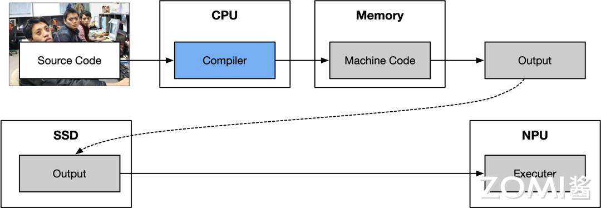

另一方面，**动态解释**的程序则是对代码程序边翻译边运行，称为 JIT（Just in time），即即时编译。典型的代表有：

1. PyTorch 框架中的 JIT 特性，可以将 Python 代码实时编译成本地机器代码，实现对神经网络模型的优化和加速。
2. 清华发布的计图（Jittor），完全基于动态编译 JIT，内部使用创新的元算子和统一计算图的 AI 框架，元算子和 Numpy 一样易于使用，并且超越 Numpy 能够实现更复杂更高效的操作。基于元算子开发的神经网络模型，可以被计图实时的自动优化并且运行在指定的硬件上。

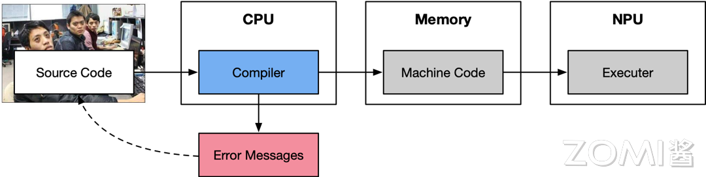

## Pass 和中间表示 IR

编译器是提高开发效率的工具链中不可或缺的部分。但是编译器被很多程序员和开发者视为黑箱，输入高层次的源程序程序，产生语义不变的低层次机器码。此时，编译器的内部结构中，Pass 作为编译优化中间层的一个遍历程序或者模块，中间表示 (intermediate representation，IR) 负责串联起编译器内各层级和模块。

### Pass 定义和原理

**Pass 主要是对源程序语言的一次完整扫描或处理**。在编译器中，Pass 指所采用的一种结构化技术，用于完成编译对象（IR）的分析、优化或转换等功能。Pass 的执行就是编译器对编译单元进行分析和优化的过程，Pass 构建了这些过程所需要的分析结果。

一个 Pass 通常会完成一项较为独立的功能，例如 LoopUnroll Pass 会进行循环展开的操作。但 Pass 与 Pass 之间可能会存在一些依赖，部分 Pass 的执行会依赖于其它一些 Pass 的分析或者转换结果。

如图所示，现代编译器中，一般会采用分层、分段的结构模式，不管是在中间层还是后端，都存在若干条优化的 Pipeline，而这些 Pipeline，则是由一个个 Pass 组成的，对于这些 Pass 的管理，则是由 PassManager 完成的。

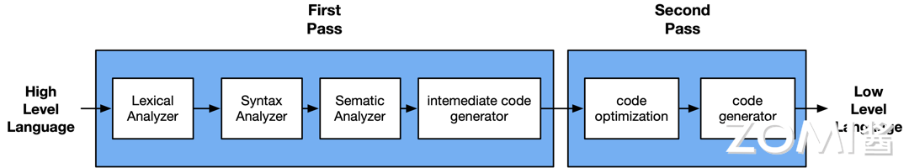

在编译器 LLVM 中提供的 Pass 分为三类：Analysis pass、Transform pass 和 Utility pass。

- **Analysis Pass**：计算相关 IR 单元的高层信息，但不对其进行修改。这些信息可以被其他 Pass 使用，或用于调试和程序可视化。换言之，Analysis Pass 会从对应的 IR 单元中挖掘出需要的信息，然后进行存储，并提供查询的接口，让其它 Pass 去访问其所存储的信息。同时，Analysis Pass 也会提供 invalidate 接口，因为当其它 Pass 修改了 IR 单元的内容后，可能会造成已获取的分析信息失效，此时需调用 invalidate 接口来告知编译器此 Analysis Pass 原先所存储的信息已失效。常见的 Analysis Pass 有 Basic Alias Analysis、Scalar Evolution Analysis 等。
- **Transform Pass**：可以使用 Analysis Pass 的分析结果，然后以某种方式改变和优化 IR。此类 Pass 是会改变 IR 的内容的，可能会改变 IR 中的指令，也可能会改变 IR 中的控制流。例如 Inline Pass 会将一些函数进行 inline 的操作，从而减少函数调用，同时在 inline 后可能会暴露更多的优化机会。
- **Utility Pass**：是一些功能性的实用程序，既不属于 Analysis Pass，也不属于 Transform Pass。例如，extract-blocks Pass 将 basic block 从模块中提取出来供 bug point 使用，它仅完成这项工作。

### IR 中间表示

- **什么是 IR**

IR（Intermediate Representation）中间表示，是编译器中很重要的一种数据结构。编译器在完成前端工作以后，首先生成其自定义的 IR，并在此基础上执行各种优化算法，最后再生成目标代码。

从广义上看，编译器的运行过程中，中间节点的表示，都可以统称为 IR。从狭义上讲编译器的 IR，是指该编译器明确定义的一种具体的数据结构，这个数据结构通常还伴随着一种语言来表达程序，这个语言程序用来实现这个明确定义的 IR。大部分时间，不太严格区分这个明确定义的 IR 以及其伴随的语言程序，将其统称为 IR。

如图所示，在编译原理中，通常将编译器分为前端和后端。其中，前端会对所输入的程序进行词法分析、语法分析、语义分析，然后生成中间表达形式 IR。后端会对 IR 进行优化，然后生成目标代码。

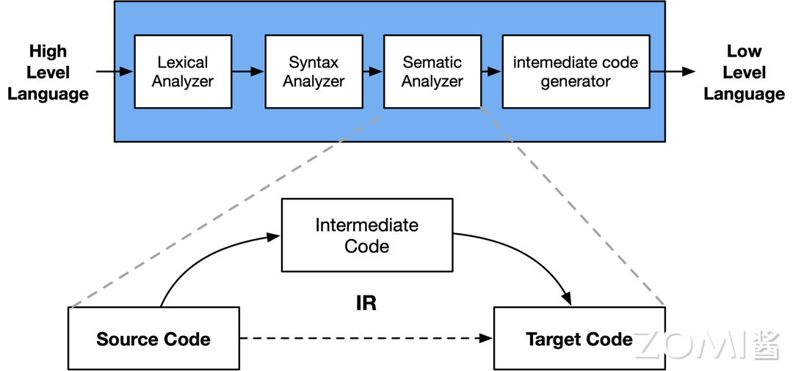

例如：LLVM 把前端和后端给拆分出来，在中间层明确定义一种抽象的语言，这个语言就叫做 IR。定义了 IR 以后，前端的任务就是负责最终生成 IR，优化器则是负责优化生成的 IR，而后端的任务就是把 IR 给转化成目标平台的语言。LLVM 的 IR 使用 LLVM assembly language 或称为 LLVM language 来实现 LLVM IR 的类型系统，就指的是 LLVM assembly language 中的类型系统。

因此，编译器的前端，优化器，后端之间，唯一交换的数据结构类型就是 IR，通过 IR 来实现不同模块的解耦。有些 IR 还会为其专门起一个名字，比如：Open64 的 IR 通常叫做 WHIRL IR，方舟编译器的 IR 叫做 MAPLE IR，LLVM 则通常就称为 LLVM IR。

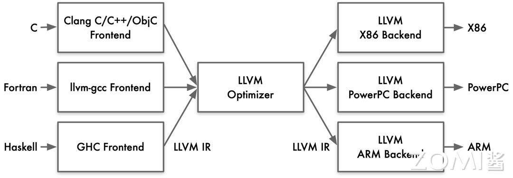

- **IR 的定义**

IR 在通常情况下有两种用途，1）一种是用来做分析和变换，2）一种是直接用于解释执行。

编译器中，基于 IR 的分析和处理工作，前期阶段可以基于一些抽象层次比较高的语义，此时所需的 IR 更接近源代码。而在编译器后期阶段，则会使用低层次的、更加接近目标代码的语义。基于上述从高到低的层次抽象，IR 可以归结为三层：高层 HIR、中间层 MIR 和底层 LIR。

1. **HIR**

HIR（High IR）高层 IR，其主要负责基于源程序语言执行代码的分析和变换。假设要开发一款 IDE，主要功能包括：发现语法错误、分析符号之间的依赖关系（以便进行跳转、判断方法的重载等）、根据需要自动生成或修改一些代码（提供重构能力）。此时对 IR 的需求是能够准确表达源程序语言的语义即可。

其实，AST 和符号表就可以满足上述需求。也就是说，AST 也可以算作一种特殊的 IR。如果要开发 IDE、代码翻译工具（从一门语言翻译到另一门语言）、代码生成工具、代码统计工具等，使用 AST（加上符号表）即可。基于 HIR，可以执行高层次的代码优化，比如常数折叠、内联关联等。在 Java 和 Go 的编译器中，有不少基于 AST 执行的优化工作。

1. **MIR**

MIR（Middle IR），独立于源程序语言和硬件架构执行代码分析和具体优化。大量的优化算法是通用的，没有必要依赖源程序语言的语法和语义，也没有必要依赖具体的硬件架构。这些优化包括部分算术优化、常量和变量传播、死代码删除等，实现分析和优化功能。

因为 MIR 跟源程序代码和目标程序代码都无关，所以在编译优化算法（Pass）过程中，通常是基于 MIR，比如三地址代码（Three Address Code，TAC）。

> 三地址代码 TAC 的特点：最多有三个地址（也就是变量），其中赋值符号的左边是用来写入，右边最多可以有两个地址和一个操作符，用于读取数据并计算。

1. **LIR**

LIR（Low IR），依赖于底层具体硬件架构做优化和代码生成。其指令通常可以与机器指令一一对应，比较容易翻译成机器指令或汇编代码。因为 LIR 体现了具体硬件（如 CPU）架构的底层特征，因此可以执行与具体 CPU 架构相关的优化。

多层 IR 和单层 IR 比较起来，具有较为明显的优点：

1. 可以提供更多的源程序语言的信息
2. IR 表达上更加地灵活，更加方便优化
3. 使得优化算法和优化 Pass 执行更加高效

如在 LLVM 编译器里，会根据抽象层次从高到低，采用了前后端分离的三段结构，这样在为编译器添加新的语言支持或者新的目标平台支持的时候，就十分方便，大大减小了工程开销。而 LLVM IR 在这种前后端分离的三段结构之中，主要分开了三层 IR，IR 在整个编译器中则起着重要的承上启下作用。从便于开发者编写程序代码的理解到便于硬件机器的理解。


# LLVM

## LLVM 架构特点

LLVM 架构具有独立的组件和库化的特点，使得前端和后端工程师能够相对独立地进行工作，从而提高了开发效率和代码维护性。其核心在于中间表示（IR），通过统一且灵活的 IR 实现了对不同编程语言和目标平台的支持。优化器能够将 IR 转换为高效的形式，再由后端生成目标平台的机器码。这种设计使得 LLVM 具有适应不同编程需求和硬件架构的灵活性和高性能，为软件开发提供了强大的支持。

### LLVM 组件独立性

LLVM 具有一个显著的特点，即其组件的独立性和库化架构。在使用 LLVM 时，前端工程师只需实现相应的前端，而无需修改后端部分，从而使得添加新的编程语言变得更加简便。这是因为后端只需要将中间表示（IR）翻译成目标平台的机器码即可。

对于后端工程师而言，他们只需将目标硬件的特性如寄存器、硬件调度以及指令调度与 IR 进行对接，而无需干涉前端部分。这种灵活的架构使得编译器的前端和后端工程师能够相对独立地进行工作，从而极大地提高了开发效率和维护性。

在 LLVM 中，IR 扮演着至关重要的角色。它是一种类似汇编语言的底层语言，但具有强类型和精简指令集的特点（RISC），并对目标指令集进行了抽象。例如，在 IR 中，目标指令集的函数调用惯例会被抽象为 call 和 ret 指令，并使用明确的参数。

LLVM 支持三种不同的 IR 表达形式：人类可读的汇编形式、在 C++ 中的对象形式以及序列化后的 bitcode 形式。这种多样化的表达形式使得开发人员更好地理解和处理 IR，从而实现更加灵活和高效的编译工作。通过 IR 的抽象和统一，LLVM 极大地推动了编译体系的创新，为编程语言的快速开发和跨平台支持提供了强大的基础。

### LLVM 中间表达

LLVM 提供了一套适用于编译器系统的中间语言（Intermediate Representation，IR），并围绕这个中间语言进行了大量的变换和优化。经过这些变换和优化，IR 可以被转换为目标平台相关的汇编语言代码。

与传统 GCC 的前端直接对应于后端不同，LLVM 的 IR 是统一的，可以适用于多种平台，进行优化和代码生成。

> 根据 2011 年的测试结果，LLVM 的性能在运行时平均比 GCC 低 10%。2013 年的测试显示，LLVM 能够编译出与 GCC 性能相近的执行代码。

GCC：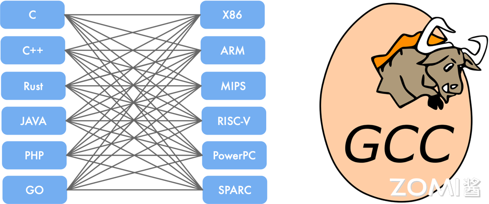

LLVM：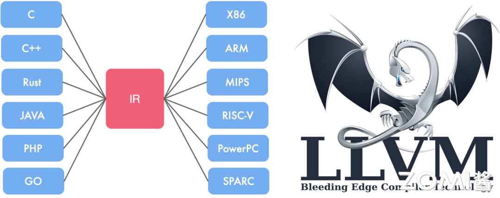

LLVM IR 的优点包括：

1. 更独立：LLVM IR 设计为可在编译器之外的任意工具中重用，使得轻松集成其他类型的工具，如静态分析器和插桩器成为可能。
2. 更正式：拥有明确定义和规范化的 C++ API，使得处理、转换和分析变得更加便捷。
3. 更接近硬件：LLVM IR 提供了类似 RISCV 的模拟指令集和强类型系统，实现了其“通用表示”的目标。具有足够底层指令和细粒度类型的特性使得上层语言和 IR 的隔离变得简单，同时 IR 的行为更接近硬件，为进一步在 LLVM IR 上进行分析提供了可能性。

## LLVM 整体架构

LLVM 是一个模块化和可重用的编译器和工具链技术库。它的整体架构包含从前端语言处理到最终生成目标机器码的完整优化流程。对于用户而言，通常会使用 Clang 作为前端，而 LLVM 的优化器和后端处理则是透明的。


- 前端（Front-End）：负责处理高级语言（如 C/C++/Obj-C）的编译，生成中间表示（IR）。
- 优化器（Optimizer）：对中间表示进行各种优化，提高代码执行效率。
- 后端（Back-End）：将优化后的中间表示转换为目标平台的机器码。

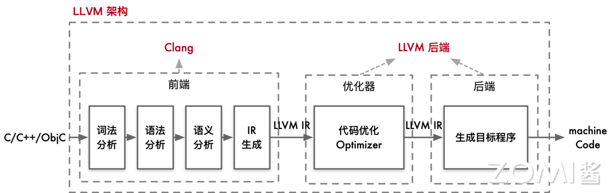

当用户编写的 C/C++/Obj-C 代码输入到 Clang 前端时，Clang 会执行以下步骤：

- 词法分析（Lexical Analysis）：将源代码转换为标记（tokens）。
- 语法分析（Syntax Analysis）：将标记转换为抽象语法树（AST）。
- 语义分析（Semantic Analysis）：检查语义正确性，生成中间表示（IR）。

生成的抽象语法树（AST）通过进一步处理，转换为 LLVM 的中间表示（IR）。这个中间表示是一种平台无关的低级编程语言，用于连接前端和后端。

在详细的架构图中，我们可以看到 LLVM 的前端、优化器、后端等各个组件的交互。在前端，Clang 会将高级语言代码转换为为 LLVM 的中间表示（IR）。

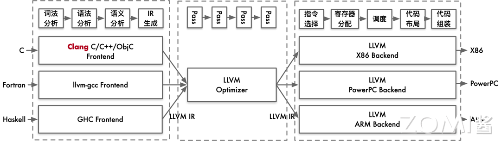

LLVM 的优化器通过多个优化 pass 来提升中间表示（IR）的性能。每个 pass 都对 IR 进行特定的优化操作，例如：

- 常量折叠（Constant Folding）：将编译时已知的常量表达式直接计算并替换。
- 循环优化（Loop Optimizations）：如循环展开、循环交换等，以提高循环执行效率。
- 死代码消除（Dead Code Elimination）：移除不必要的代码，提高执行效率。经过优化后的 IR 是一个更高效的中间表示，准备好进行后续的代码生成。

LLVM 的后端负责将优化后的中间表示转换为目标平台的机器码。这包含以下步骤：

- 指令选择（Instruction Selection）：将 IR 转换为目标架构的汇编指令。
- 寄存器分配（Register Allocation）：为指令分配合适的寄存器。
- 指令调度（Instruction Scheduling）：优化指令执行顺序，以提高指令流水线的效率。
- 代码布局（Code Layout）：调整代码的排列顺序，以适应目标硬件的执行特性。
- 代码生成（Code Generation）：生成目标平台的汇编代码和最终的机器码。最终，LLVM 后端输出目标平台的可执行文件。

LLVM 的整体架构清晰地分为前端、优化器和后端三个部分。用户与 Clang 前端直接交互，输入高级语言代码，而 Clang 将其转换为中间表示。之后，LLVM 的优化器和后端在后台处理，进行复杂的优化和代码生成步骤，最终输出高效的目标机器码。

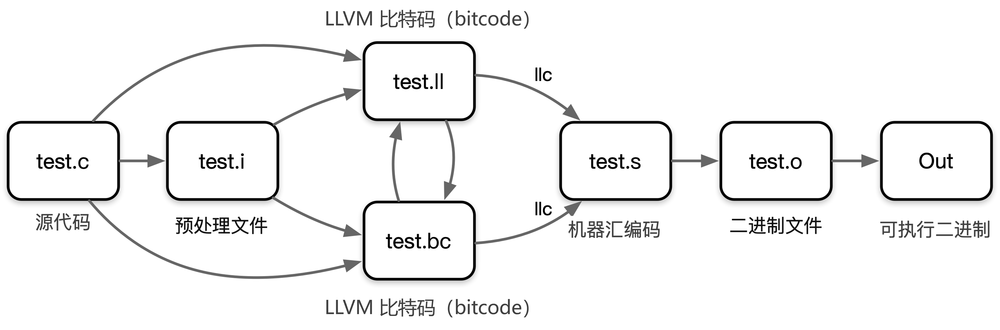

在使用 LLVM 时，我们会从原始的 C 代码开始。这个 C 代码会经过一系列的预处理步骤，最终被转换为 LLVM 的中间表示文件（.ll 文件）或者 LLVM 比特码文件（.bc 文件）。

接下来使用 LLVM 的前端工具将中间表示文件编译成 IR。IR 的表示有两种方式，一种是 LLVM 汇编语言（.ll 文件），另一种是 LLVM 比特码（.bc 文件）。LLVM 汇编语言更为易读，方便人类阅读和理解。

IR 经过 LLVM 的后端编译器工具 llc 将 IR 转换为汇编代码（assembly code）。这个汇编代码是目标机器特定机器码指令的文本表示。

最后的两个步骤是将汇编代码汇编（assemble）成机器码文件，然后链接（link）生成可执行二进制文件，使其可以在特定平台上运行。

## Clang + LLVM 案例实践

以下是对 Clang 编译过程中各个步骤的说明，其中 hello.c 是我们需要编译的 c 文件。

### 生成 . I 文件

```shell
clang -E -c .\hello.c -o .\hello.i
```

这一步使用 Clang 的预处理器将 hello.c 文件中的所有预处理指令展开，生成预处理后的文件 hello.i。这包括展开宏定义、处理 #include 头文件等，生成一个纯 C 代码文件。

- **作用**：仅执行预处理，生成预处理后的 C 代码（`.i` 文件）
- **关键参数**：
    - `-E`：只运行预处理器，不进行编译
    - `-c`：不执行链接操作
    - `-o .\hello.i`：输出到指定文件
- **预处理操作**：
    - 展开 `#include` 头文件
    - 替换 `#define` 宏定义
    - 处理条件编译指令（`#ifdef` 等）

### 将预处理过后的 . I 文件转化为. Bc 文件

```shell
clang -emit-llvm .\hello.i -c -o .\hello.bc
```

这一步将预处理后的 hello. i 文件编译为 LLVM 位代码（bitcode）文件 hello. bc。LLVM 位代码是中间表示形式，可供进一步优化和转换。

- **作用**：将预处理后的 C 代码（`.i`）编译为 LLVM Bitcode（`.bc`）
- **关键参数**：
    - `-emit-llvm`：生成 LLVM 中间表示
    - `-c`：不执行链接
    - `-o .\hello.bc`：输出为二进制 Bitcode
- **LLVM Bitcode**：
    - 二进制格式，类似于 Java 字节码
    - 平台无关，可进一步优化或转换
    - 适合作为编译中间格式（如跨语言优化）

```shell
clang -emit-llvm .\hello.c -S -o .\hello.ll
```

这一步将 hello.c 文件直接编译成 LLVM 中间表示的汇编代码文件 hello.ll，这是一种人类可读的中间表示形式，适用于进一步的分析和优化。

- - **作用**：直接从 C 源码生成可读的 LLVM IR（`.ll`）
    - **关键参数**：
        - `-emit-llvm`：生成 LLVM 中间表示
        - `-S`：生成文本形式的汇编代码（而非二进制）
        - `-o .\hello.ll`：输出为文本文件
    - **LLVM IR 特点**：
        - 静态单赋值（SSA）形式，便于分析优化
        - 包含类型信息、控制流图等

### Llc

在前面两个步骤中，我们生成了 .i 文件和 LLVM 位代码文件 .bc 或中间表示文件 .ll。接下来，我们可以使用 llc 工具将这些中间表示文件转换为目标平台的汇编代码。

```shell
llc .\hello.ll -o .\hello.s
llc .\hello.bc -o .\hello2.s
```

通过以上命令，我们分别将 hello. ll 文件和 hello. bc 文件编译为汇编代码文件 hello. s 和 hello2. s。由于 hello. ll 和 hello. bc 表示相同的代码逻辑，所以生成的汇编代码文件 hello. s 和 hello2. s 是相同的。

- **作用**：将 LLVM IR（`.ll`）或 Bitcode（`.bc`）转换为目标平台汇编（`.s`）
- **关键工具**：
    - `llc`：LLVM 静态编译器（Low Level Compiler）
    - 支持多种后端（x86、ARM、RISC-V 等）

### 转变为可执行的二进制文件

```
clang .\hello.s -o hello
```

### 查看编译过程

```
clang -ccc-print-phases .\hello.c
```

```shell
                +- 0: input, ".\hello.c", c
            +- 1: preprocessor, {0}, cpp-output
        +- 2: compiler, {1}, ir
    +- 3: backend, {2}, assembler
    +- 4: assembler, {3}, object
  +-5: linker, {4}, image
6: bind-arch,"x86_64", {5}, image
```

其中 0 是输入，1 是预处理，2 是编译，3 是后端优化，4 是产生汇编指令，5 是库链接，6 是生成可执行的 x86_64 二进制文件。

## 小结与思考

- LLVM 把编译器移植到新语言只需要实现编译前端，复用已有的优化和后端；
- LLVM 实现不同组件隔离为单独程序库，易于在整个编译流水线中集成转换和优化 Pass；
- LLVM 作为实现各种静态和运行时编译语言的通用基础结构。

# LLVM IR

LLVM IR（Intermediate Representation）是 LLVM 编译器框架的核心中间表示，处于源代码（如 C/C++、Rust 等）和目标机器代码（如 x86、ARM、GPU 指令）之间。它是一种**与语言无关、与平台无关**的中间代码，设计目标是便于分析、优化和跨平台代码生成。

### 一、LLVM IR 的定位与作用

在编译流程中，LLVM IR 是 “承上启下” 的关键环节：

- **上层**：接收来自各种前端（如 Clang 处理 C/C++、rustc 处理 Rust）生成的 IR；
- **中层**：通过 LLVM 优化器（Optimizer）进行统一优化（如常量折叠、循环展开、死代码消除等）；
- **下层**：通过 LLVM 后端（Backend）转换为特定平台的机器码（如 x86 汇编、CUDA PTX 指令）。

这种 “单中间表示 + 多前端 / 后端” 的设计，让 LLVM 能支持多种语言和硬件，且优化逻辑可复用。

### 二、LLVM IR 的两种形式

LLVM IR 有两种等价表示，可互相转换：

1. **文本形式（.ll 文件）**：人类可读，用于调试和手动编写 IR；
2. **二进制形式（.bc 文件）**：紧凑高效，用于存储和传输（通过 `llvm-as`/`llvm-dis` 工具转换）。

例如，一段简单的 C 函数：

```c
int add(int a, int b) {
    return a + b;
}
```

对应的文本 IR（.ll）如下：

```llvm
; ModuleID = 'add.c'
source_filename = "add.c"
define dso_local i32 @add(i32 %a, i32 %b) #0 {
entry:
  %add = add nsw i32 %a, %b
  ret i32 %add
}
```

### 三、LLVM IR 的核心特性

#### 1. 静态单赋值（SSA：Static Single Assignment）

SSA 是 LLVM IR 最核心的特性，指**每个变量仅被赋值一次**，且使用前必须定义。这一特性让代码分析和优化（如常量传播、死代码消除）变得极其简单。

- 例：C 代码中的变量重赋值，在 IR 中会拆分为多个 “版本”：

    ```c
    int foo(int x) {
        x = x + 1;
        x = x * 2;
        return x;
    }
    ```

    对应的 IR（SSA 形式）：

    ```llvm
    define i32 @foo(i32 %x) {
    entry:
      %x1 = add i32 %x, 1    ; 第一次赋值：x的新版本x1
      %x2 = mul i32 %x1, 2   ; 第二次赋值：x的新版本x2
      ret i32 %x2            ; 最终返回x2
    }
    ```

- 分支场景的处理：若变量在不同分支有不同赋值，需用**φ 函数（phi node）** 合并版本：

    ```c
    int bar(int a, int b) {
        int c;
        if (a > b) {
            c = a + 1;
        } else {
            c = b - 1;
        }
        return c;
    }
    ```

    对应的 IR（含 φ 函数）：

    ```llvm
    define i32 @bar(i32 %a, i32 %b) {
    entry:
      %cmp = icmp sgt i32 %a, %b  ; 比较a > b
      br i1 %cmp, label %if.then, label %if.else  ; 分支跳转
    
    if.then:                  ; 分支1：a > b
      %add = add nsw i32 %a, 1
      br label %if.end        ; 跳转到合并点
    
    if.else:                  ; 分支2：a <= b
      %sub = sub nsw i32 %b, 1
      br label %if.end        ; 跳转到合并点
    
    if.end:                   ; 合并点
      ; φ函数：根据来源分支选择c的版本
      %c = phi i32 [ %add, %if.then ], [ %sub, %if.else ]
      ret i32 %c
    }
    ```

#### 2. 强类型系统

LLVM IR 是**强类型**的，所有指令和操作数必须显式指定类型，不允许隐式类型转换。这确保了编译期类型安全，也为优化器提供了明确的类型信息。

- 基本类型：

    - 整数：`i1`（布尔）、`i8`（字节）、`i32`（32 位整数）、`i64` 等；
    - 浮点数：`float`（32 位）、`double`（64 位）、`fp128`（128 位）等；
    - 指针：`i32*`（指向 32 位整数的指针）、`float**`（指向浮点指针的指针）等；
    - 向量：`<4 x i32>`（4 个 32 位整数组成的向量，用于 SIMD 优化）。
- 复合类型：

    - 结构体：`%struct.Point = type { i32, i32 }`（含两个 i32 的结构体）；
    - 数组：`[10 x i32]`（10 个 i32 组成的数组）；
    - 函数：`i32 (i32, i32)`（输入两个 i32，返回 i32 的函数类型）。

#### 3. 模块（Module）作为基本单位

LLVM IR 的最小独立单元是**模块（Module）**，一个模块对应一个编译单元（如一个 `.c` 文件），包含：

- 函数（`function`）：程序执行的基本单元，如 `@add`、`@main`；
- 全局变量（`global`）：模块级别的变量，如 `@global_var = global i32 0`；
- 元数据（`metadata`）：辅助信息（如调试信息、源码位置），不影响执行逻辑；
- 外部声明：引用其他模块的函数 / 变量（如 `declare i32 @printf(i8*, …)`）。

模块是跨平台的，同一模块可被不同后端（如 x86、ARM）处理为对应平台的机器码。

#### 4. 显式的内存模型

LLVM IR 不依赖特定语言的内存语义，而是通过显式指令操作内存：

- `alloca`：在栈上分配内存（如 `%ptr = alloca i32`）；
- `load`：从内存读取数据（如 `%val = load i32, i32* %ptr`）；
- `store`：向内存写入数据（如 `store i32 42, i32* %ptr`）；
- `getelementptr`（GEP）：计算复合类型的指针（如结构体成员、数组元素的地址），是 IR 中最复杂的指令之一。

例如，访问结构体成员的 IR：

```llvm
%struct.Point = type { i32, i32 }  ; 定义结构体：x, y
%p = alloca %struct.Point, align 4  ; 栈上分配结构体
store i32 10, %struct.Point* %p, i32 0  ; 写入x（第0个成员）
store i32 20, %struct.Point* %p, i32 1  ; 写入y（第1个成员）

; 用GEP获取y的地址
%y_ptr = getelementptr inbounds %struct.Point, %struct.Point* %p, i32 0, i32 1
%y_val = load i32, i32* %y_ptr  ; 读取y的值（20）
```

### 四、LLVM IR 的指令类型

LLVM IR 的指令可分为几大类：

1. **算术与逻辑指令**：`add`（加）、`sub`（减）、`mul`（乘）、`sdiv`（有符号除）、`and`（与）、`or`（或）等，需匹配操作数类型（如 `add i32 %a, %b`）。

2. **控制流指令**：

    - `br`：无条件跳转（`br label %bb1`）或条件跳转（`br i1 %cond, label %bb1, label %bb2`）；
    - `ret`：函数返回（`ret i32 0` 返回整数，`ret void` 无返回值）；
    - `call`：调用函数（`%res = call i32 @add(i32 1, i32 2)`）。
3. **内存操作指令**：如 `alloca`、`load`、`store`、`getelementptr`（见上文）。

4. **类型转换指令**：`zext`（零扩展，如 `i8`→`i32`）、`sext`（符号扩展）、`fptosi`（浮点转有符号整数）等，显式转换类型。


### 五、LLVM IR 的意义

1. **统一优化基础**：无论前端语言（C、C++、Rust）如何，只要转换为 LLVM IR，就能复用 LLVM 的优化 passes（如循环优化、内联、常量传播），无需为每种语言单独实现优化。
2. **跨平台与多后端支持**：同一 IR 可通过不同后端生成 x86、ARM、RISC-V、GPU（如 NVIDIA PTX）等平台的代码，降低跨平台开发成本。
3. **可编程性**：可通过 LLVM 提供的 C++ API 或 MLIR（更高层的中间表示）手动构建、修改 IR，实现自定义优化或代码生成（如深度学习框架的算子优化、专用加速器代码生成）。
4. **调试友好**：文本形式的.ll 文件可读，便于开发者理解编译过程，定位优化或代码生成问题。

### 总结

LLVM IR 是 LLVM 框架的 “通用语言”，通过**SSA 形式、强类型、模块化结构**，实现了 “一次编写，多平台优化与生成” 的目标。理解 LLVM IR 是掌握现代编译器原理、进行性能优化或开发专用代码生成工具的基础，尤其对涉及 CUDA/LLVM 编译器的岗位（如 GPU 驱动开发、异构计算框架开发）至关重要。
