> 原文：`https://newsletter.maartengrootendorst.com/p/a-visual-guide-to-mixture-of-experts`
> 作者：`Maarten Grootendorst`
> 更多关于 Gen AI https://github.com/HandsOnLLM/Hands-On-Large-Language-Models

# 概述《A Visual Guide to Mixture of Experts (MoE)》

## 什么是混合专家模型（MoE）

- 是一种利用多个不同子模型（即 “专家”）来提高大型语言模型（LLMs）质量的技术。
- 主要由两个部分构成：
    - **专家（Experts）**：每个前馈神经网络（FFNN）层都有一组可选择的 “专家”，这些 “专家” 本身通常就是 FFNN。它们并非专注于特定领域，而是在特定语境下处理特定标记，更多学习的是词级别的句法信息。
    - **路由器（Router）或门控网络（gate network）**：用于确定哪些标记被发送到哪些专家，它也是一个 FFNN，会输出概率以选择最匹配的专家。

## 专家（Experts）相关内容

- **与密集层的关系**：MoE 旨在替代 LLMs 中的密集层。传统 Transformer 中的 FFNN 是密集模型，所有参数都会被激活；而稀疏模型只激活部分参数，MoE 与之相关，可看作是将密集模型分割成多个 “专家”，训练时每个专家学习不同信息，推理时仅使用与特定任务相关的部分专家。
- **专家的架构**：专家通常是完整的 FFNN。由于大多数 LLMs 有多个解码器块，一段文本在生成前会经过多个专家，且不同标记可能选择不同专家，形成不同 “路径”，解码器块因此包含多个可在推理时使用的 FFNN（每个都是一个 “专家”）。

## 路由机制（The Routing Mechanism）

- **路由器功能**：在专家之前添加，用于为特定标记选择合适的专家，与专家共同构成 MoE 层。
- **MoE 层类型**：分为稀疏混合专家（Sparse MoE）和密集混合专家（Dense MoE）。前者只选择少数专家，后者选择所有专家但分布可能不同，当前 LLMs 中常见的是稀疏 MoE，因其计算成本更低。
- **专家选择过程**：门控网络通过将输入与路由器权重矩阵相乘，再应用 SoftMax 得到每个专家的概率分布，最终选择专家，将所选专家的输出乘以门控值（选择概率）后返回结果。
- **路由的复杂性**：简单的路由功能可能导致路由器总是选择相同的专家，造成专家选择分布不均，部分专家训练不足，因此需要负载均衡。

## 负载均衡（Load Balancing）

- **KeepTopK 策略**：通过引入可训练的（高斯）噪声防止相同专家被频繁选择，将除前 k 个要激活的专家外的其他专家权重设为 -∞，使其在 SoftMax 后的概率为 0。该策略包括 Token Choice，可将标记发送到一个（top-1 路由）或多个（top-k 路由）专家，能权衡和整合专家的贡献，许多 LLMs 仍在使用，且可不用额外噪声。
- **辅助损失（Auxiliary Loss）**：也称为负载均衡损失，添加到网络的常规损失中，强制专家具有同等重要性。通过计算每个专家在整个批次上的路由器值总和得到重要性分数，再计算系数变异（CV），更新辅助损失以降低 CV，使专家重要性更均衡。
- **专家容量（Expert Capacity）**：为解决标记分布不均导致的训练不足问题，限制每个专家可处理的标记数量。当专家达到容量时，标记会被发送到下一个专家，若所有专家都达到容量，标记将不被任何专家处理而直接发送到下一层，即 “标记溢出”。

## Switch Transformer 对 MoE 的简化

- **切换层（Switching Layer）**：是一种稀疏 MoE 层，替换传统 FFNN 层，为每个标记选择单个专家（top-1 路由），其路由器选择专家的方式相对简单。
- **容量因子（Capacity Factor）**：决定专家可处理的标记数量，增大会使专家处理更多标记，但过大浪费资源，过小会因标记溢出降低模型性能。
- **辅助损失**：采用简化版本，权衡每个专家的标记分配比例和路由器概率比例，目标是使标记在 N 个专家中均匀路由，通过超参数 α 调整该损失在训练中的重要性。

## 视觉模型中的混合专家（MoE）

- **Vision-MoE（V-MoE）**：是较早在图像模型中实现 MoE 的模型，基于视觉 Transformer（ViT），将编码器中的密集 FFNN 替换为稀疏 MoE，使通常比语言模型小的 ViT 能通过添加专家大规模扩展。为减少硬件限制，每个专家使用预定义的小容量，采用批量优先级路由（Batch Priority Routing），为标记分配重要性分数，优先处理重要标记，以在低容量下减少重要标记的溢出。
- **从稀疏到软混合专家（From Sparse to Soft MoE）**：Soft-MoE 旨在通过混合标记实现从离散到软标记分配。先将输入标记嵌入与可学习矩阵相乘得到路由信息，对路由信息矩阵列应用 softmax 更新标记嵌入（本质是所有标记嵌入的加权平均），再将其发送给每个专家，输出后再次与路由器矩阵相乘，得到 “软” 标记进行处理，避免未处理标记的信息丢失。

## Mixtral 8x7B 中的活跃参数与稀疏参数

- **稀疏参数**：指模型加载时需要加载的所有参数（包括所有专家），Mixtral 8x7B 中每个专家大小为 5.6B，共需加载 8×5.6B（46.7B）参数及所有共享参数，需要更多显存。
- **活跃参数**：指推理时使用的部分参数，Mixtral 8x7B 推理时仅使用 2×5.6B（12.8B）参数，因此推理速度更快。

## 结论

混合专家（MoE）是一种重要的技术，在众多模型中都有其变体，具有提升模型性能等潜力。文中还提供了相关资源，如相关论文和博客文章，供读者深入了解。

# 正文

在查看大语言模型（LLM）的最新发布时，你常常会在标题中看到“MoE”。这个“MoE”代表什么，为什么这么多大语言模型都在使用它呢？在本可视化指南中，我们将花时间通过 50 多个可视化图表来探索这一重要组件——专家混合（**Mixture of Experts** MoE）！

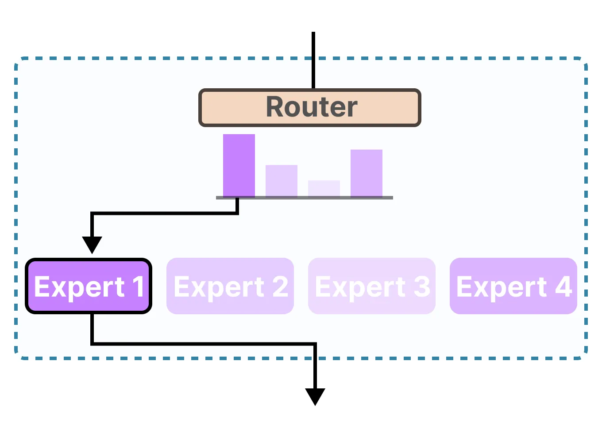

在本可视化指南中，我们将详细介绍 MoE 的两个主要组件，即在典型的基于大语言模型（LLM）的架构中应用的专家和路由器。

# What is Mixture of Experts?

MoE 是一种利用许多不同的子模型（或 “专家”）来提高大语言模型质量的技术。定义 MoE 的两个主要组件为：

- **Experts 专家** - 现在每个前馈神经网络（FFNN）层都有一组 “专家”，可以从中选择一个子集。这些 “专家” 本身通常就是前馈神经网络。
- **Router or gate network 路由器或门控网络** - 确定哪些标记被发送到哪些专家。

在具有 MoE 的大语言模型的每一层中，我们会找到（某种程度上专门化的）专家：

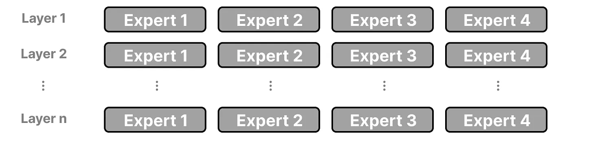

要知道，“专家”并不专门针对诸如“心理学”或“生物学”这样的特定领域。相反，它最多只是在单词层面学习句法信息：

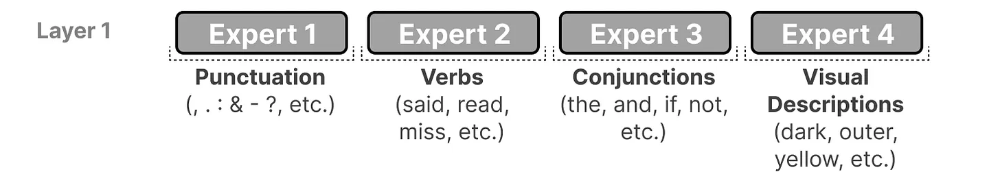

更具体地说，他们的专长在于在特定语境中处理特定的词元。**路由器**（门控网络）会为给定输入选择最适合的专家：

每个专家并非完整的 LLM，而是 LLM 架构中的一个子模型部分。

# The Experts

为了探究专家代表什么以及它们如何工作，让我们首先研究一下混合专家（MoE）应该取代什么；即**全连接层 the ense layers**。

## Dense Layers

混合专家（MoE）都始于大语言模型（LLM）相对基础的功能，即前馈神经网络（_Feedforward Neural Network_ FFNN）。请记住，标准的仅解码器 Transformer 架构在层归一化之后应用 FFNN：

前馈神经网络（FFNN）使模型能够利用注意力机制生成的上下文信息，并对其进一步转换，以捕捉数据中更复杂的关系。然而，前馈神经网络的规模增长很快。为了学习这些复杂的关系，它通常会对接收到的输入进行扩展：

## Sparse Layers

传统 Transformer 中的前馈神经网络（FFNN）被称为全连接 dense 模型，因为所有参数（权重和偏差）都会被激活。没有任何参数被遗漏，所有参数都用于计算输出。如果我们仔细观察全连接模型，就会注意到输入是如何在一定程度上激活所有参数的：

相比之下，稀疏 sparse 模型只激活其全部参数的一部分，并且与专家混合模型密切相关。为了说明这一点，我们可以将密集模型分割成若干部分（即所谓的专家模型），重新训练，并且在给定时间只激活一部分专家模型：

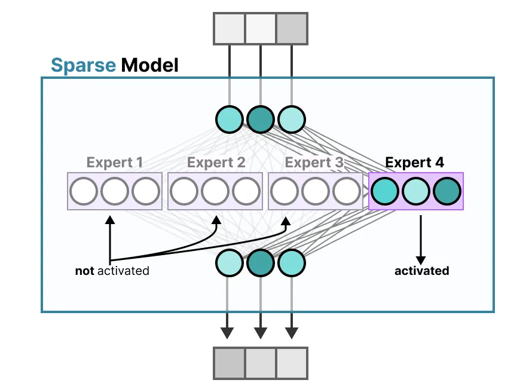

其基本思想是，每个专家在训练过程中学习不同的信息。然后，在进行推理时，仅使用特定的专家，因为它们与给定任务最为相关。当被问到一个问题时，我们可以选择最适合给定任务的专家：

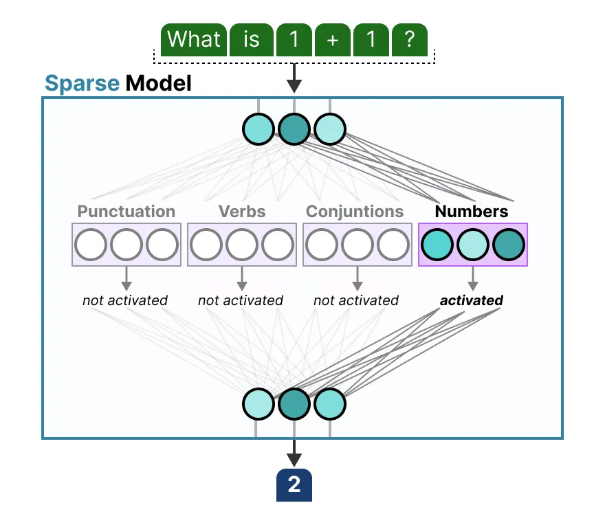

## What Does an Expert Learn?

正如我们之前所见，专家学到的细粒度信息比整个领域学到的更多 [1]。因此，有时将它们称为 “专家” 会被认为具有误导性。

Expert specialization of an encoder model in the ST-MoE paper.

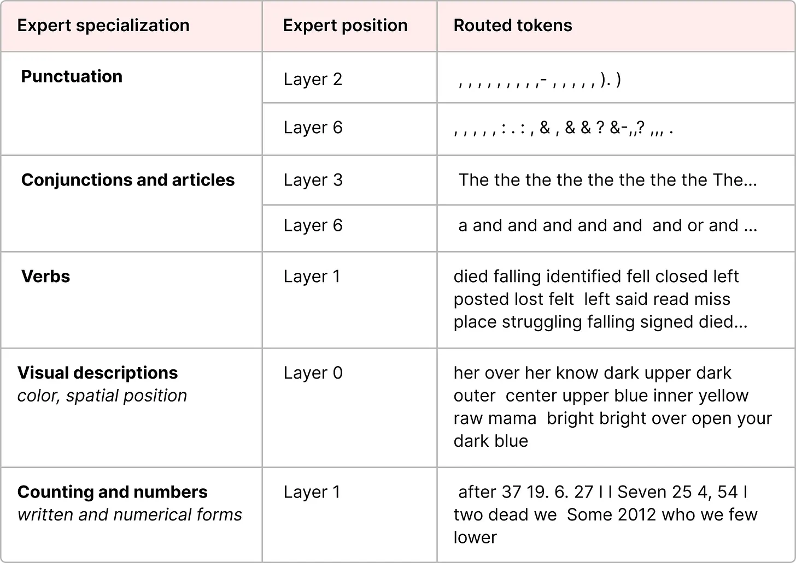

然而，解码器模型中的专家似乎并没有相同类型的专业化。但这并不意味着所有专家都是一样的。在《Mixtral 8x7B 论文》[8] 中可以找到一个很好的例子，其中每个词元都用首选专家选择进行了标记。

这一可视化结果还表明，专家倾向于关注语法而非特定领域。因此，尽管解码器专家似乎没有特定专长，但他们似乎始终被用于处理某些类型的词元。

## The Architecture of Experts

虽然将专家（模块）想象成一个被分割成若干部分的密集模型的隐藏层很有趣，但实际上它们通常本身就是完整的前馈神经网络（FFNN）：

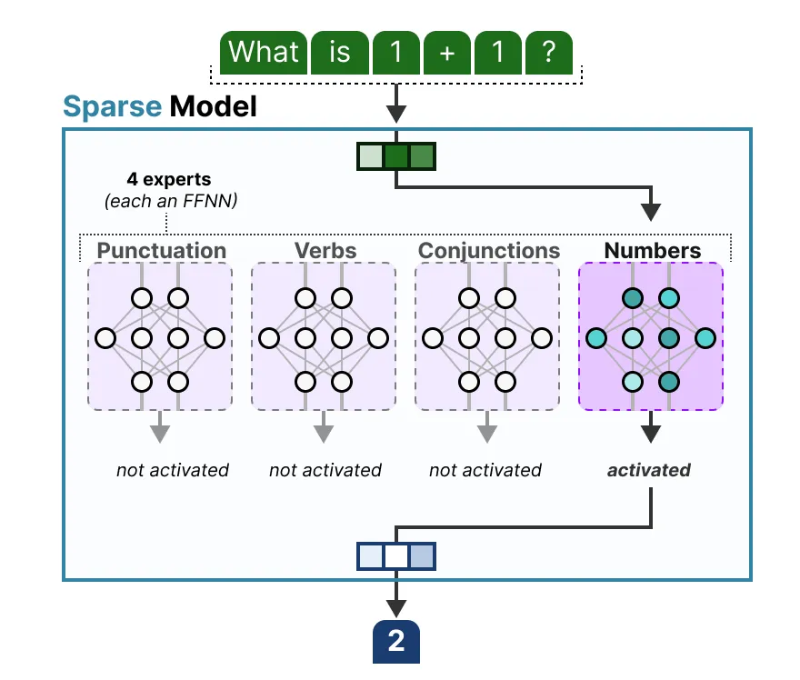

由于大多数 LLMs 都有几个解码器模块，在生成文本之前，给定的文本将经过多个专家处理：

所选的专家可能因词元而异，这会导致采用不同的 “路径”：

如果我们更新解码器模块的可视化，它现在将包含更多的前馈神经网络（每个专家对应一个），情况如下：

解码器模块现在有多个前馈神经网络（每个都是一个“专家”），它可以在推理过程中使用。

# **The Routing Mechanism**

既然我们有了一组专家，那么模型如何知道该使用哪些专家呢？就在专家层之前，增加了一个路由器 router（也称为门控网络 gate network），它经过训练，能够针对给定的词元选择合适的专家。

## The Router

路由器（或门控网络）也是一个前馈神经网络（FFNN），用于根据特定输入选择专家。它输出概率，以此来选择最匹配的专家：

专家层返回所选专家的输出乘以门控值（选择概率）。路由器与专家（其中仅选择少数几个）共同构成了混合专家（MoE）层：

给定的 MoE 层有两种规模，即稀疏混合专家或密集混合专家。两者都使用路由器来选择专家，但稀疏混合专家（Sparse MoE）只选择少数几个，而密集混合专家（Dense MoE）则选择所有专家，但可能采用不同的分布方式。

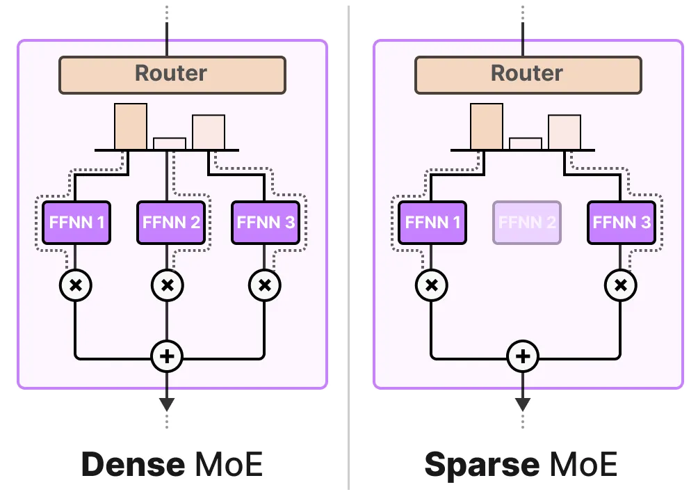

例如，给定一组词元，一个密集 MoE 会将这些词元分配给所有专家，而稀疏 Sparse MoE 只会选择少数专家。在当前大语言模型（LLM）的发展状况下，当你看到“MoE”时，它通常指的是**稀疏混合专家**模型，因为它允许你使用部分专家。这在计算成本上更低，这对大语言模型来说是一个重要特性。

## Selection of Experts

门控网络可以说是任何混合专家（MoE）模型中最重要的组件，因为它不仅决定了推理过程中选择哪些专家，还决定了训练过程中选择哪些专家。其最基本的形式是，我们将输入（$x$）与路由器权重矩阵（$W$）相乘：

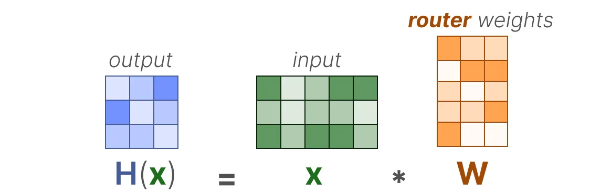

然后，我们对输出应用**SoftMax**，为每个专家创建一个概率分布 $G (x)$：

路由器使用这种概率分布为给定输入选择最匹配的专家。最后，我们将每个路由器的输出与每个选定的专家输出相乘，并对结果求和。

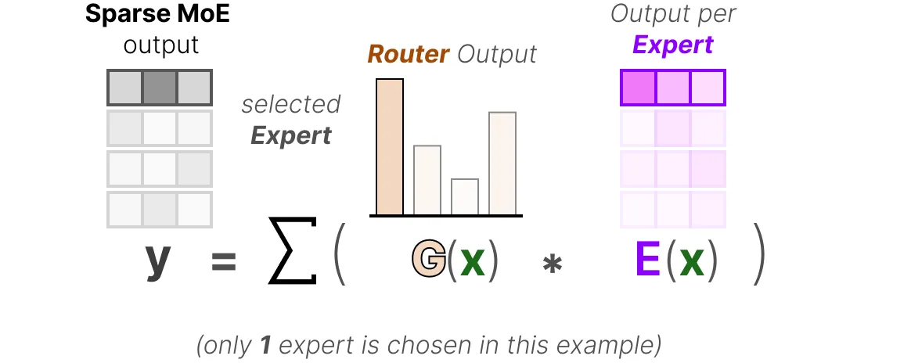

让我们把所有内容整合起来，探究输入是如何流经路由器和专家模型的：

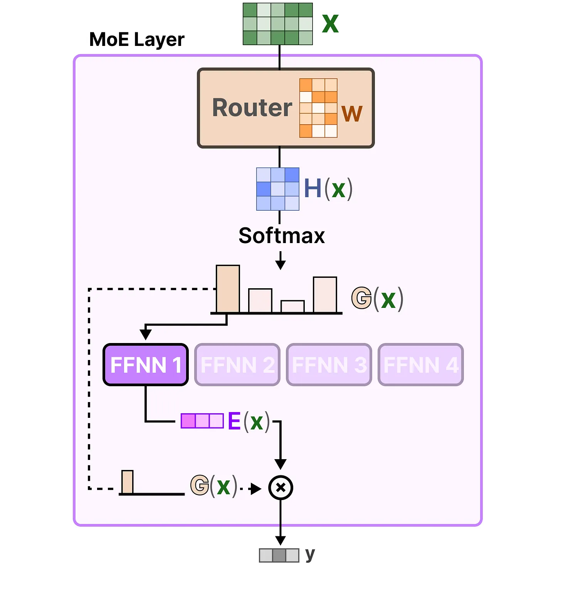

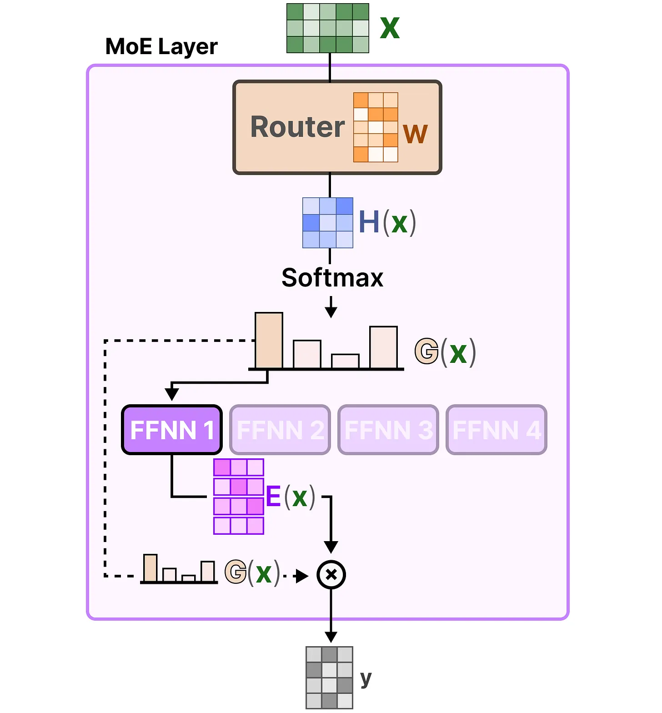

## The Complexity of Routing

然而，这个简单的函数常常导致路由器选择同一个专家，因为某些专家可能比其他专家学习得更快：

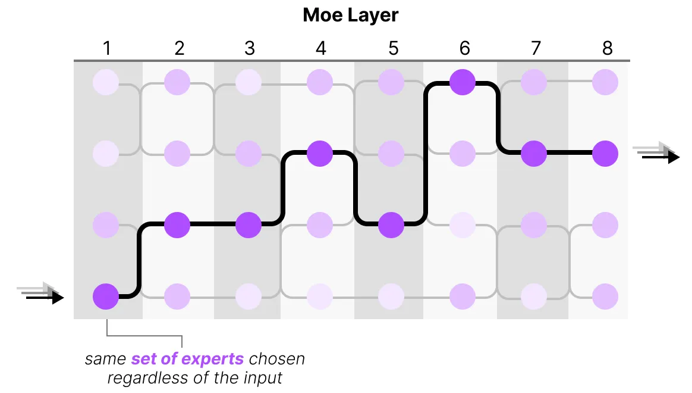

不仅所选专家的分布会不均衡，而且一些专家几乎得不到任何训练。这会在训练和推理过程中引发问题。相反，我们希望在训练和推理过程中，各位专家具有同等的重要性，我们将此称为**负载均衡 load balance**。从某种程度上说，这是为了防止对相同的专家出现过拟合。

## KeepTopK

对路由器进行负载均衡的一种方法是通过一个名为KeepTopK2 [2]的简单扩展。通过引入可训练的（高斯）噪声，我们可以避免总是选择相同的专家：

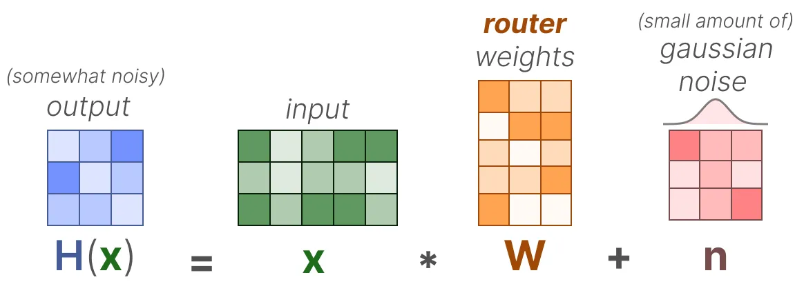

然后，除了你想要激活的前 k 个（例如 2 个）专家之外，其他所有专家的权重都将被设置为负无穷： 通过将这些权重设置为负无穷，

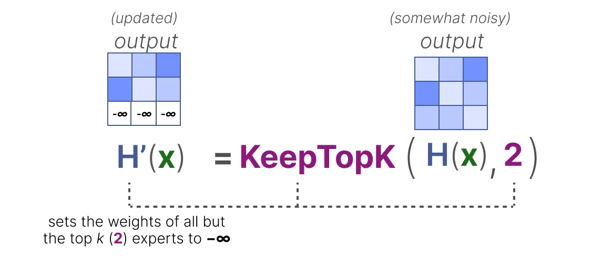

对这些权重进行 SoftMax 运算的输出将得到概率为0：

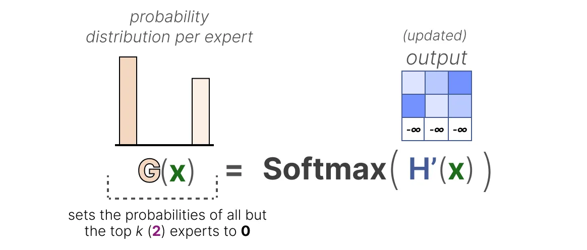

尽管存在许多很有前景的替代策略，但许多 LLMs 仍在使用“保留前K个”（KeepTopK）策略。请注意，“保留前K个”策略也可以在不添加额外噪声的情况下使用。

### Token Choice

KeepTopK策略将每个令牌路由到几个选定的专家。这种方法被称为令牌选择 Token Choice[3] ，并允许将给定的令牌发送到一个专家（ Top-1路由 ）：

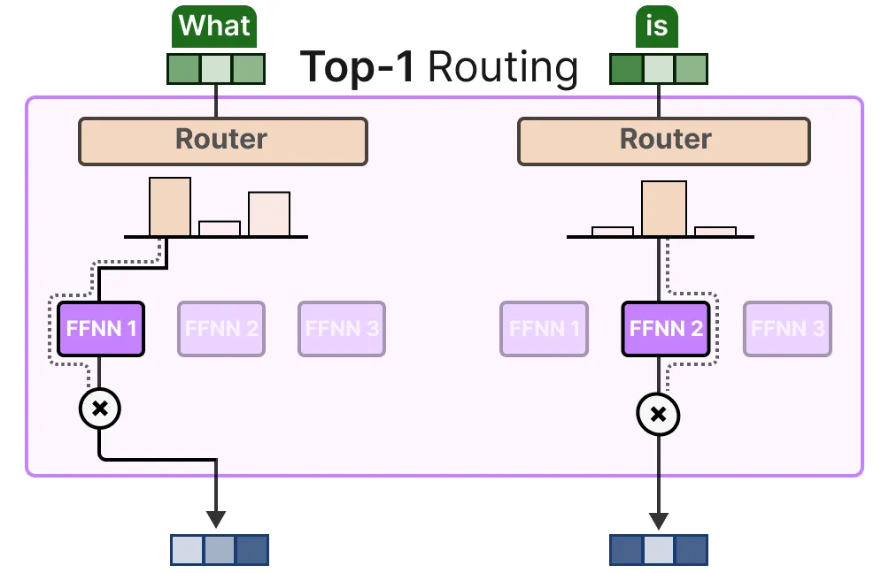

或者不止一个专家（Top-k 路由）：

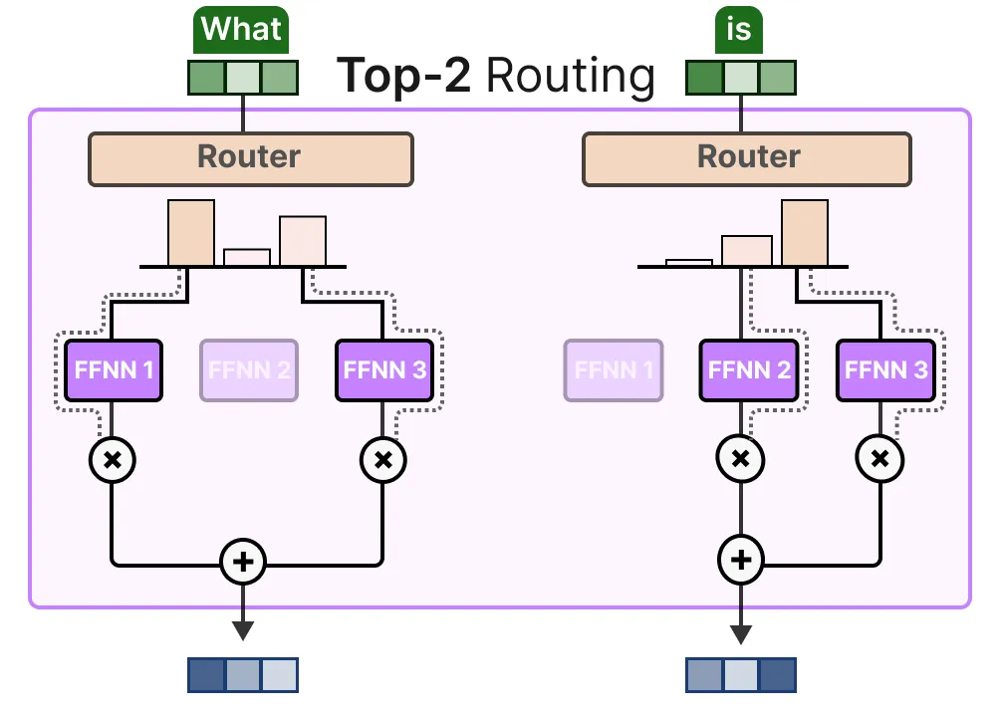

一个主要优点是，它能够对专家各自的贡献进行权衡并整合。

### Auxiliary Loss

为了在训练过程中使专家的分布更加均匀，**辅助损失auxiliary loss**（也称为负载均衡损失 _load balancing loss_）被添加到网络的常规损失中。它增加了一个约束条件，强制使各位专家具有同等的重要性。这种辅助损失的第一个组成部分是对整个批次中每个专家的路由器值进行求和：

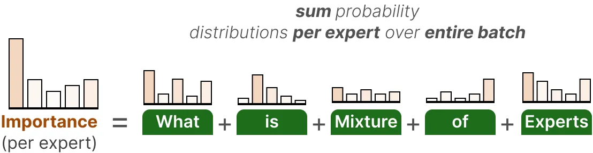

这为我们提供了每位专家的重要性得分 _importance scores_，它表示在不考虑输入的情况下，某一特定专家被选中的可能性。我们可以利用这个来计算变异系数 _coefficient variation_（CV），它能告诉我们不同专家之间的重要性得分差异有多大。

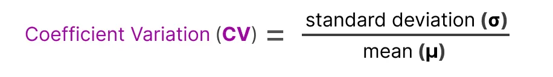

例如，如果重要性得分存在很大差异，CV就会很高： 

相反，如果所有专家的重要性得分相似，CV 就会很低（这正是我们所追求的）： 
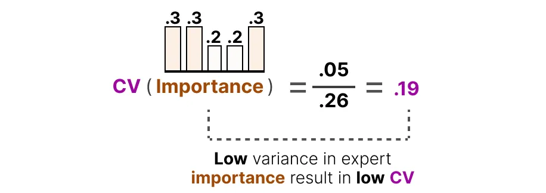

利用这个 CV 得分，我们可以在训练期间更新辅助损失，使其尽可能降低 CV得分（从而对每个专家赋予同等重要性）：

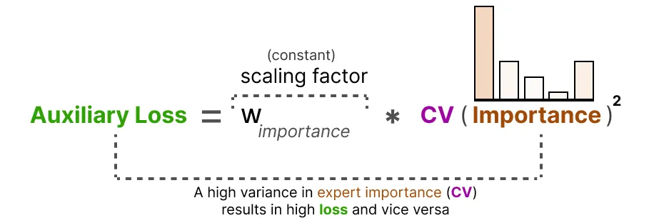

最后，辅助损失作为一个单独的损失添加到训练过程中进行优化。

## Expert Capacity

不均衡不仅存在于所选择的专家中，还存在于发送给专家的令牌分布中。例如，如果输入令牌不成比例地发送给一位专家而不是另一位专家，那么这也可能导致训练不足：

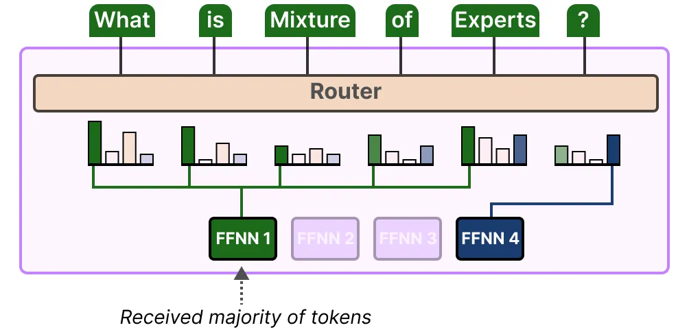

在这里，问题不仅在于使用哪些专家，还在于使用多少专家。解决这个问题的一个方法是限制特定专家能够处理的令牌数量，即专家容量  _Expert Capacity_ [3]。当一位专家达到容量时，生成的令牌将被发送给下一位专家：

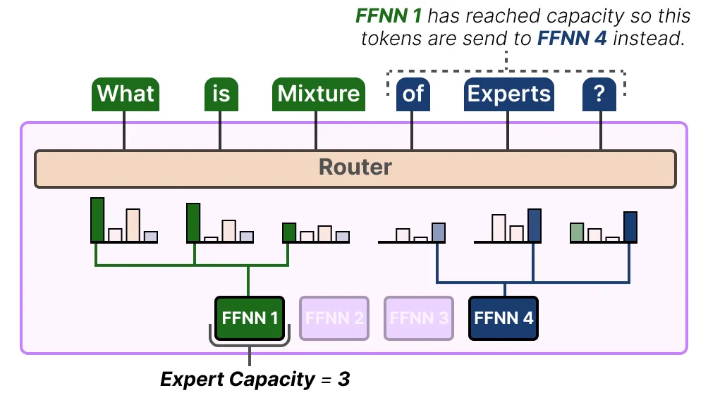

如果两位专家都已达到处理能力上限，令牌将不会由任何专家处理，而是被发送到下一层。这被称为令牌溢出 _token overflow_。

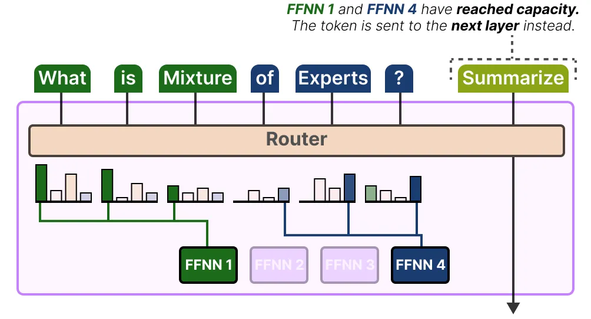

## Simplifying MoE with the Switch Transformer

# **Conclusion**

至此，我们关于混合专家模型（Mixture of Experts）的旅程就结束了！希望这篇文章能让你更好地理解这项有趣技术的潜力。既然几乎所有模型组中都至少有一个混合专家模型的变体，感觉它会一直存在下去。 

# Resources

Hopefully, this was an accessible introduction to Mixture of Experts. If you want to go deeper, I would suggest the following resources:

- [This](https://arxiv.org/pdf/2209.01667) and [this](https://arxiv.org/pdf/2407.06204) paper are great overviews of the latest MoE innovations.
- The paper on [expert choice routing](https://arxiv.org/pdf/2202.09368) that has gained some traction.
- A [great blog post](https://cameronrwolfe.substack.com/p/conditional-computation-the-birth) going through some of the major papers (and their findings).
- A similar [blog post](https://brunomaga.github.io/Mixture-of-Experts) that goes through the timeline of MoE.

1. Zoph, Barret, et al. "St-moe: Designing stable and transferable sparse expert models. arXiv 2022." _arXiv preprint arXiv: 2202.08906_.
2. Shazeer, Noam, et al. "Outrageously large neural networks: The sparsely-gated mixture-of-experts layer." _arXiv preprint arXiv: 1701.06538_ (2017).
3. Lepikhin, Dmitry, et al. "Gshard: Scaling giant models with conditional computation and automatic sharding." _arXiv preprint arXiv: 2006.16668_ (2020).
4. Fedus, William, Barret Zoph, and Noam Shazeer. "Switch transformers: Scaling to trillion parameter models with simple and efficient sparsity." _Journal of Machine Learning Research_ 23.120 (2022): 1-39.
5. Dosovitskiy, Alexey. "An image is worth 16x16 words: Transformers for image recognition at scale." _arXiv preprint arXiv: 2010.11929_ (2020).
6. Riquelme, Carlos, et al. "Scaling vision with sparse mixture of experts." _Advances in Neural Information Processing Systems_ 34 (2021): 8583-8595.
7. Puigcerver, Joan, et al. "From sparse to soft mixtures of experts." _arXiv preprint arXiv: 2308.00951_ (2023).
8. Jiang, Albert Q., et al. "Mixtral of experts." _arXiv preprint arXiv:2401.04088_ (2024).
