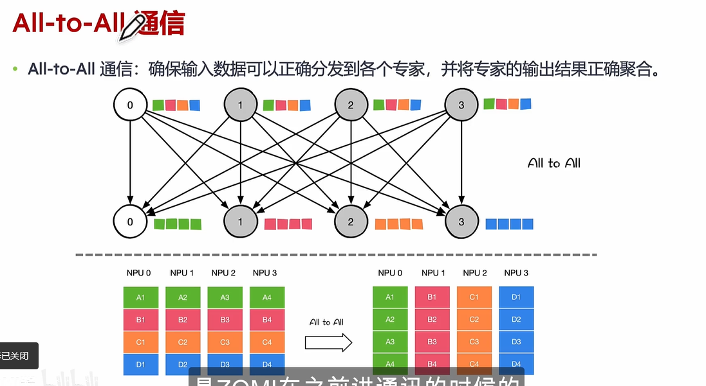
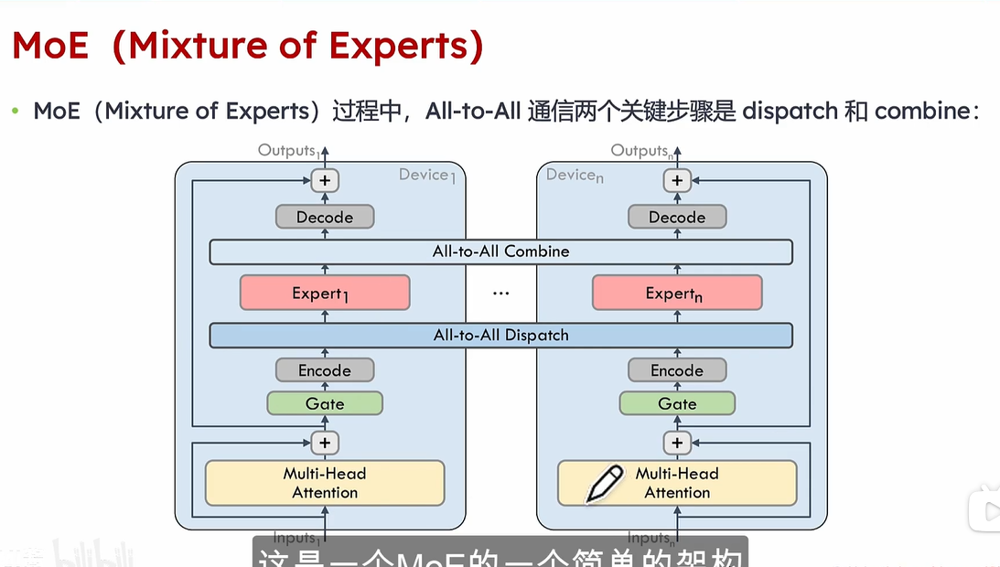
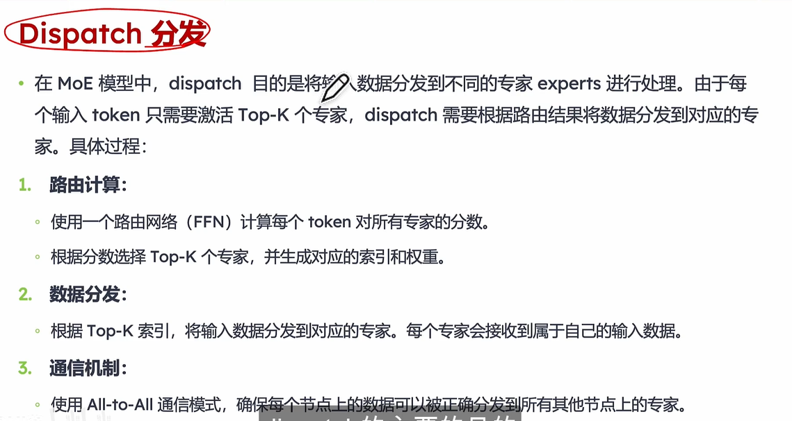
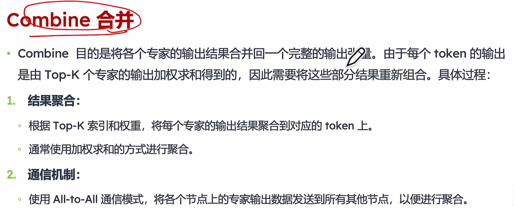
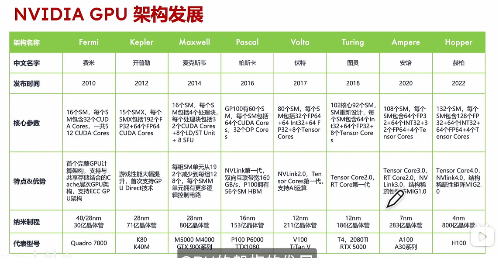

https://www.bilibili.com/video/BV1bN9PYeEak/?spm_id_from=333.1387.collection.video_card.click&vd_source=bc07d988d4ccb4ab77470cec6bb87b69

## DeepSeek开源DeepEP 介绍

DeepEP提供高吞吐量和低延迟的all-to-all  Hopper架构GPUKernel, 包括MoE dispatch and combine。支持FP8低精度运算, 特别适用于DeepSeek系列模型
特点：
1.高效优化的All-to-All 通信
2.支持NVLink和RDMA的节点内/跨节点通信
3.训练Training及推理预填充Prefill阶段的高吞吐量计算核心ن
4.推理解码Decoder阶段的低延迟计算核心
5.原生支持FP8数据分发
6.灵活控制GPU资源,实现计算与通信的高效重叠

## 大纲
上：
1. DeepSeek MoE: MoE 架构通信
2. MoE Demo:原理与实现
3. DeepEP使用核心工具 (Hopper&NVSCHMEM)
4. DeepEP之前是怎么用的?

下：
1. DeepEP之前是怎么用的?
2. 项目基本介绍
3. DeepEP: 代码注释与解读
4. 思考与小结

## MoE 通信原理

MHA Decode 共享，expert 并行

## MoE Demoe 实践

# Hopper NVSHVMEM
