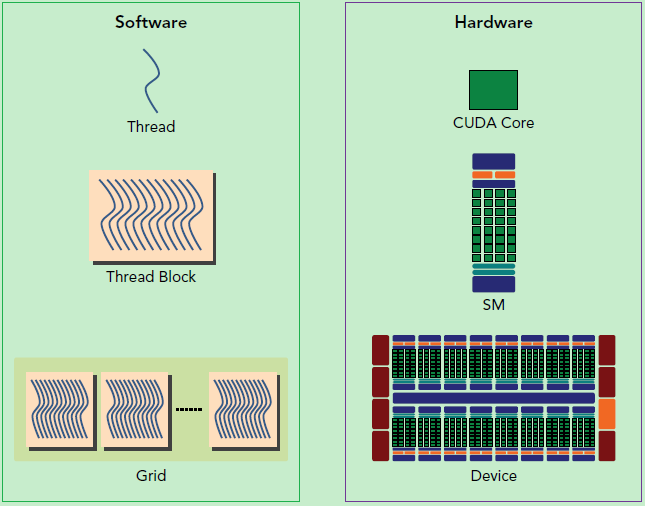
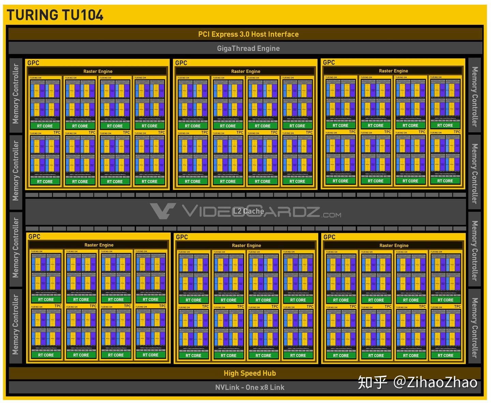
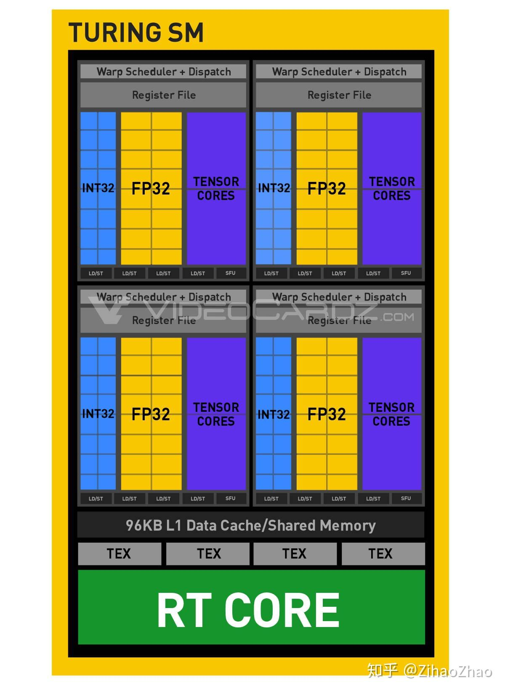
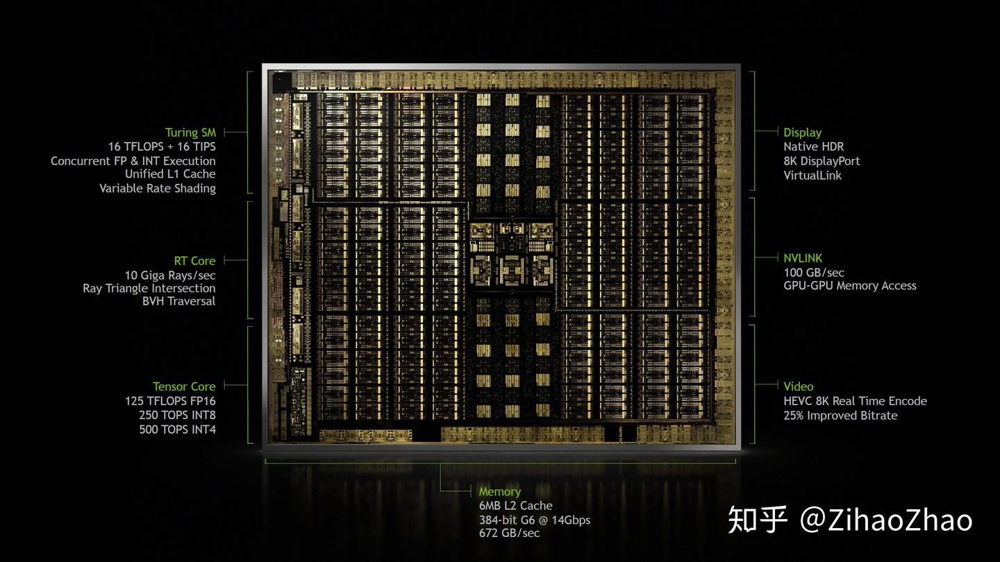

对应 [https://docs.nvidia.com/cuda/cuda-c-programming-guide/index.html](https://link.zhihu.com/?target=https%3A//docs.nvidia.com/cuda/cuda-c-programming-guide/index.html) 第 7、9 章

# 第四章 硬件实现

NVIDIA GPU 架构围绕着可扩展的多线程流式多处理器 _Streaming Multiprocessors_ (_SMs_) 阵列构建。当主机 CPU 上的 CUDA 程序调用内核网格时，网格的块会被枚举并分配给具有可用执行能力的多处理器。线程块中的线程在一个多处理器上并发执行，并且多个线程块可以在一个多处理器上并发执行。随着线程块执行结束，新的块会在空闲的多处理器上启动。

多处理器旨在同时执行数百个线程。为了管理如此大量的线程，它采用了一种名为单指令多线程 _SIMT_ (_Single-Instruction, Multiple-Thread_) 的独特架构，该架构在单指令多线程架构 [SIMT Architecture](https://docs.nvidia.com/cuda/cuda-c-programming-guide/index.html#simt-architecture) 中有描述。指令采用流水线方式执行，利用单个线程内的指令级并行性，以及通过硬件多线程 [Hardware Multithreading](https://docs.nvidia.com/cuda/cuda-c-programming-guide/index.html#hardware-multithreading) 中详述的同步硬件多线程实现广泛的线程级并行性。与 CPU 内核不同，这些指令按顺序发出，不存在分支预测或推测执行。

[SIMT Architecture](https://docs.nvidia.com/cuda/cuda-c-programming-guide/index.html#simt-architecture) 和 [Hardware Multithreading](https://docs.nvidia.com/cuda/cuda-c-programming-guide/index.html#hardware-multithreading) 描述了所有设备通用的流式多处理器的架构特性。 [Compute Capability 5.x](https://docs.nvidia.com/cuda/cuda-c-programming-guide/index.html#compute-capability-5-x)、 [Compute Capability 6.x](https://docs.nvidia.com/cuda/cuda-c-programming-guide/index.html#compute-capability-6-x) 和 [Compute Capability 7.x](https://docs.nvidia.com/cuda/cuda-c-programming-guide/index.html#compute-capability-7-x) 分别提供了计算能力为 5. x、6. x 和 7. x 的设备的详细信息。

NVIDIA GPU 架构使用小端模式。

## SIMT 架构

多处理器以 32 个并行线程为一组创建、管理、调度和执行线程，这些线程组称为线程束 _warps_。组成一个线程束的各个线程从相同的程序地址一起启动，但它们有自己的指令地址计数器和寄存器状态，因此可以自由分支并独立执行。术语线程束源于最早的并行线程技术——编织。半线程束是指一个线程束的前半部分或后半部分。四分之一线程束是指一个线程束的前四分之一、第二个四分之一、第三个四分之一或第四个四分之一。

当一个多处理器被分配一个或多个线程块来执行时，它会将这些线程块划分成线程束，每个线程束由一个线程束调度器调度执行。将线程块划分为线程束的方式始终相同；每个线程束包含连续递增的线程 ID 的线程，第一个线程束包含线程 0。[Thread Hierarchy](https://docs.nvidia.com/cuda/cuda-c-programming-guide/index.html#thread-hierarchy) 描述了线程 ID 与线程块中的线程索引之间的关系。

**一个线程束每次执行一条公共指令**，因此当一个线程束的所有 32 个线程在执行路径上达成一致时，就能实现最高效率。如果一个线程束的线程通过数据相关的条件分支发生分歧，该线程束会执行所采用的每个分支路径，并禁用不在该路径上的线程。分支分歧仅发生在一个线程束内；不同的线程束独立执行，无论它们执行的是相同还是不同的代码路径。

单指令多线程（SIMT）架构与单指令多数据（SIMD）向量组织类似，即 _一条指令控制多个处理单元_。一个关键区别在于，SIMD 向量组织会向软件公开 SIMD 宽度，而 SIMT 指令指定单个线程的执行和分支行为。与 SIMD 向量机相比，SIMT 使程序员能够为独立的标量线程编写线程级并行代码，以及为协同线程编写数据并行代码。为确保正确性，程序员基本上可以忽略 SIMT 行为；然而，如果注意使代码很少要求线程束中的线程发生分歧，就可以实现显著的性能提升。在实践中，这类似于传统代码中缓存行的作用：为确保正确性进行设计时，可以安全地忽略缓存行大小，但为实现最佳性能进行代码结构设计时，必须考虑缓存行大小。另一方面，向量架构要求软件将加载操作合并为向量，并手动管理分歧。

在英伟达 Volta 架构之前，线程束使用一个在该线程束所有 32 个线程间共享的程序计数器，以及一个指定该线程束活跃线程的活跃掩码。因此，处于分歧区域或不同执行状态的同一线程束中的线程无法相互发信号或交换数据，并且，根据竞争线程所属的线程束不同，需要由锁或互斥锁保护的细粒度数据共享的算法很容易导致死锁。

从英伟达 Volta 架构开始，独立线程调度  _Independent Thread Scheduling_ 允许线程之间实现完全并发，无论线程束如何。借助独立线程调度，GPU 维护每个线程的执行状态，包括程序计数器和调用堆栈，并且可以以每个线程为粒度让出执行权，这既可以更好地利用执行资源，也可以让一个线程等待另一个线程生成的数据。调度优化器决定如何将来自同一线程束的活动线程组合成单指令多线程（SIMT）单元。这保留了与英伟达之前的 GPU 中 SIMT 执行相同的高吞吐量，但具有更大的灵活性：线程现在可以在小于线程束的粒度上出现分支和重新聚合。

如果开发人员对之前硬件架构的线程束同步性做出了假设，那么独立线程调度可能会导致参与执行代码的线程集与预期大不相同。特别是，任何线程束同步代码 [2](https://docs.nvidia.com/cuda/cuda-c-programming-guide/index.html#id125)（例如无同步的线程束内规约）都应重新审视，以确保与英伟达 Volta 及更高版本兼容。有关更多详细信息，请参阅 [Compute Capability 7.x](https://docs.nvidia.com/cuda/cuda-c-programming-guide/index.html#compute-capability-7-x)。

参与当前指令的线程束中的线程称为活动 _active_ 线程，而不参与当前指令的线程则为非活动 _inactive_（禁用）线程。线程处于非活动状态可能有多种原因，包括比其所在线程束中的其他线程更早退出、采取了与线程束当前执行的分支路径不同的分支路径，或者是线程数量不是线程束大小倍数的线程块中的最后几个线程。

如果一个线程束执行的非原子指令，使该线程束中的多个线程写入全局或共享内存中的同一位置，则写入该位置的串行写入次数会因设备的计算能力而异（请参阅计算能力 5. x、计算能力 6. x 和计算能力 7. x），且最终执行写入操作的是哪个线程是不确定的。

执行当前指令的 Warp 中的线程称为活动线程，而未执行当前指令的线程是非活动的（禁用）。线程可能由于多种原因而处于非活动状态，包括比 warp 中的其他线程更早退出、执行与 warp 不同的分支路径、或线程数不是 Warp 大小的倍数的块中的最后一些线程。

如果 Warp 执行了一个非原子指令，该指令是让 Warp 中的多个线程写入全局或共享内存中的同一位置，则该位置发生的序列化写入次数取决于设备的计算能力（参见 [Compute Capability 3.x、Compute Capability 5.x、Compute Capability 6.x 和 Compute Capability 7.x](https://docs.nvidia.com/cuda/cuda-c-programming-guide/index.html#compute-capability-3-0)），哪个线程会最后写入是不确定的。

如果一个线程束执行的原子指令针 [atomic](https://docs.nvidia.com/cuda/cuda-c-programming-guide/index.html#atomic-functions) 对线程束中多个线程对全局内存中的同一位置进行读取、修改和写入操作，对该位置的每次读取/修改/写入操作都会发生，且这些操作都会被序列化，但操作发生的顺序是未定义的。

[2](https://docs.nvidia.com/cuda/cuda-c-programming-guide/index.html#id125): 术语线程束同步 _warp-synchronous_ 是指隐式假定同一线程束中的线程在每条指令处都同步的代码。

## 硬件多线程

每个由多处理器处理的线程束的执行上下文（程序计数器、寄存器等）在该线程束的整个生命周期内都在芯片上维护。因此，从一个执行上下文切换到另一个执行上下文没有开销，并且在每次指令发布时，线程束调度器会选择一个有线程准备好执行其下一条指令的线程束（该线程束的活动线程 [active threads](https://docs.nvidia.com/cuda/cuda-c-programming-guide/index.html#simt-architecture-notes)），并将该指令发布给这些线程。

具体来说，每个多处理器都有一组 32 位寄存器，这些寄存器在不同线程束之间进行划分，还有一个并行数据缓存 _parallel data cache_ 或共享内存 _shared memory_，它们在线程块之间进行划分。

对于给定的内核，在多处理器上能够同时驻留并处理的线程块和线程束数量，取决于内核使用的寄存器和共享内存数量，以及多处理器上可用的寄存器和共享内存数量。每个多处理器也有常驻线程块的最大数量和常驻线程束的最大数量。这些限制以及多处理器上可用的寄存器和共享内存数量，是设备计算能力的函数，并在 [Compute Capabilities](https://docs.nvidia.com/cuda/cuda-c-programming-guide/index.html#compute-capabilities) 中有说明。如果每个多处理器上没有足够的寄存器或共享内存来处理至少一个线程块，内核将无法启动。

一个线程块中的线程束总数如下：

$$
\text{ceil}\left ( \frac{T}{W_{size}}, 1 \right)
$$

- T 是每个线程块的线程数
- Wsize 是线程束大小，等于 32
- ceil(x, y) 表示将 x 向上舍入到最接近的 y 的倍数。

为一个线程块分配的寄存器总数和共享内存总量，记录在 CUDA 工具包提供的 CUDA 占用率计算器中。

## # CUDA-Enabled GPUs[]( https://docs.nvidia.com/cuda/cuda-c-programming-guide/index.html#cuda-enabled-gpus "Permalink to this headline")

https://developer.nvidia.com/cuda-gpus 列出了所有支持 CUDA 的设备及其计算能力。可以使 用运行时查询计算能力、多处理器数量、时钟频率、设备内存总量和其他属性（见参考手册）。

# Summary

### . Hardware Implementation (Key Points)

- **Core Architecture**: NVIDIA GPUs consist of scalable Streaming Multiprocessors (SMs). Thread blocks of a kernel grid are distributed to SMs with available capacity; threads in a block run concurrently on one SM, and multiple blocks can execute on an SM.
- **7.1. SIMT Architecture**:
    - Threads are grouped into 32-thread units called _warps_. Warps execute a single instruction at a time, with threads having independent registers and program counters.
    - Divergent branches within a warp cause it to execute all paths, disabling non-participating threads.
    - _Independent Thread Scheduling_ (Volta+): Threads maintain individual execution states (PC, call stacks), enabling flexible divergence/reconvergence and sub-warp granularity.
    - Memory behavior: Unsynchronized writes to the same location by a warp have undefined results. Atomic operations on shared locations are serialized but ordered unpredictably.
- **7.2. Hardware Multithreading**:
    - SMs manage warp execution contexts (registers, PC) on-chip, allowing zero-cost context switches. Warp schedulers select ready warps for instruction issuance.
    - Resident blocks/warps per SM depend on register/shared memory usage and hardware limits (compute capability-specific). Insufficient resources prevent kernel launch.
    - Warps per block: Calculated as `ceil(threads_per_block / 32)`.
- **Other**: GPUs use little-endian format. Active threads in a warp execute the current instruction; inactive threads are disabled (e.g., due to divergence).

# 硬件架构总结

CUDA 的硬件架构与软件编程模型之间的映射关系是理解 GPU 并行计算的核心。这种映射通过多层次抽象实现：从物理硬件的**流多处理器（SM）**、**内存层次**，到软件层面的**线程网格（Grid）**、**线程块（Block）**，形成了一套完整的并行计算体系。以下从硬件到软件逐层解析：

当一个 kernel 被执行时，它的 grid 中的线程块被分配到 SM 上，一个线程块只能在一个 SM 上被调度。SM 一般可以调度多个线程块，这要看 SM 本身的能力。

那么有可能一个 kernel 的各个线程块被分配多个 SM，所以 grid 只是逻辑层，而 SM 才是执行的物理层。SM 采用的是 [SIMT](https://link.zhihu.com/?target=http%3A//docs.nvidia.com/cuda/cuda-c-programming-guide/index.html%23simt-architecture) (Single-Instruction, Multiple-Thread，单指令多线程) 架构，基本的执行单元是线程束（warps)，线程束包含 32 个线程，这些线程同时执行相同的指令，但是每个线程都包含自己的指令地址计数器和寄存器状态，也有自己独立的执行路径。

### **一、CUDA 硬件架构核心组件**

#### 1. 流多处理器（Streaming Multiprocessor, SM）

**GPU 实际上是一个 SM 的阵列，每个 SM 包含 N 个计算核**，现在我们的常用 GPU 中这个数量一般为 128 或 192。一个 GPU 设备中包含一个或多个 SM，这是处理器具有可扩展性的关键因素。如果向设备中增加更多的 SM，GPU 就可以在同一时刻处理更多的任务，或者对于同一任务，如果有足够的并行性的话，GPU 可以更快完成它。

具体而言，以 Fermi 架构的 GPU 为例，其结构如下图。


左边是 GPU 的整体结构，其主要是由大量的 SM（Streaming-Multiprocessor）和 DRAM 存储等构成的。右图是对单个 SM 进行放大，可以看到 SM 由大量计算核（有时也称 SP 或 CUDA 核）、LDU（Load-Store Units）、SFU（Special-Function Units）、寄存器、共享内存等构成。这种结构正是 GPU 具有高并行度计算能力的基础。**通过一定的层级结构组织大量计算核，并给各级都配有相应的内存系统**，GPU 获得了出色的计算能力。

其中流式多处理器（SM）是 GPU 架构的核心，类似于 CPU 中的核，但设计更专注于并行计算。GPU 中的每一个 SM 都能支持数百个线程并发执行，每个 GPU 通常有多个 SM，所以在一个 GPU 上并发执行数千个线程是有可能的。当启动一个内核网络时，它的线程块会被分布在可用的 SM 上来执行。当线程块一旦被调度到一个 SM 上，其中的线程只会在那个指定的 SM 上并发执行。多个线程块可能会被分配到同一个 SM 上，而且是根据 SM 资源的可用性进行调度的。

每个 SM 包含：

- **计算核心**：
    - **CUDA Core**：执行通用浮点和整数运算（FP32/FP64/INT32）。
    - **Tensor Core**：专用矩阵运算单元，支持 FP16/BF16/INT8 等低精度计算，大幅提升 AI 任务效率（如 A100 的 Tensor Core 峰值性能达 312 TFLOPS）。
- **内存层次**：
    - **寄存器（Registers）**：线程私有，访问速度最快（约 1 周期延迟）。
    - **共享内存（Shared Memory）**：线程块内共享，速度接近寄存器（约 10 周期延迟），容量有限（如 A100 每个 SM 有 192KB）。
- **调度单元**：
    - **Warp 调度器**：以 32 个线程为一组（Warp）调度执行，同一 Warp 内线程执行相同指令（SIMT 架构）。

线程束调度器（Warp Scheduler）顾名思义是进行线程束的调度，负责将软件线程分配到计算核上；LDU（Load-Store Units）负责将值加载到内存或从内存中加载值；SFU（Special-Function Units）用来处理 sin、cos、求倒数、开平方特殊函数。

上面说到了 kernel 的线程组织层次，那么一个 kernel 实际上会启动很多线程，这些线程是逻辑上并行的，但是在物理层却并不一定。这其实和 CPU 的多线程有类似之处，多线程如果没有多核支持，在物理层也是无法实现并行的。但是好在 GPU 存在很多 CUDA 核心，充分利用 CUDA 核心可以充分发挥 GPU 的并行计算能力。

#### 2. 线程调度机制

- **Warp（线程束）**：32 个线程组成一个 Warp，是硬件调度的基本单位。
- **SIMT（单指令多线程）执行**：同一 Warp 内所有线程执行相同指令，但操作不同数据。
- **Warp 调度过程**：
    1. SM 将 Block 拆分为多个 Warp。
    2. Warp 调度器选择就绪 Warp（无数据依赖），发射指令到计算核心。
    3. 若 Warp 遇到内存访问等长延迟操作，调度器切换到其他 Warp 执行（隐藏延迟）。

#### 3. 内存系统

GPU 内存分为多级层次，越靠近计算核心速度越快但容量越小：

|内存类型|访问范围|容量（典型值）|访问延迟|用途|
|---|---|---|---|---|
|寄存器|线程私有|数万 / 线程|~1 周期|存储线程局部变量|
|共享内存|线程块内共享|64KB~192KB/SM|~10 周期|线程间数据交换、数据缓存|
|L1/L2 缓存|SM 私有 / 全局|16KB~64KB/SM|~30 周期|缓存全局内存数据|
|全局内存|整个 GPU|8GB~80GB|~400 周期|存储大规模数据（需与主机内存交换）|

### **二、软件编程模型与硬件的映射**

#### **1. 线程组织层次**

CUDA 软件通过三级层次组织线程，与硬件形成对应关系：

- **线程（Thread）**：执行最小单元，映射到硬件中的计算核心（CUDA Core/Tensor Core）。
- **线程块（Block）**：由多个线程组成（如 128~1024 线程），映射到单个 SM 上执行。块内线程通过共享内存通信，并可通过 `__syncthreads()` 同步。
- **线程网格（Grid）**：由多个 Block 组成，可分布在多个 SM 上并行执行。

#### **2. 关键映射关系**

|软件概念|硬件对应|约束条件|
|---|---|---|
|线程（Thread）|CUDA Core/Tensor Core|每个线程由一个计算核心执行|
|线程块（Block）|单个 SM|一个 Block 必须在同一个 SM 上执行|
|Warp（32 线程）|硬件调度单元|同一 Warp 内线程必须执行相同指令|
|共享内存|SM 内的共享内存单元|容量限制（如 A100 每个 SM 192KB）|
|全局内存|设备 DRAM|高延迟，需优化访问模式|

CUDA 采用**单指令多线程（SIMT）架构**来管理和执行线程，每**32 个线程为一组，被称为线程束（Warp）**。线程束中所有线程同时执行相同的指令。每个线程都有自己的指令地址计数器和寄存器状态，利用自身的数据执行当前的指令。每个 SM 都将分配给它的线程块划分到包含 32 个线程的线程束中，然后在可用的硬件资源上调度执行。

SIMT 架构和 CPU 编程中常见的**SIMD（单指令多数据）架构**相似。两者都是将相同的指令广播给多个执行单元来实现并行。一个关键的区别就是 SIMD 要求同一个向量中的所有元素要在一个统一的同步组中一起执行，而 SIMT 允许同一线程束的多个线程独立执行。尽管一个线程数中的所有线程在相同的程序地址上同时开始执行，但是单独的线程仍有可能有不同的行为。

下面这幅图分别从逻辑视图和硬件视图描述了 CUDA 编程对应的组件。



左侧是逻辑视图，自上而下，从线程构成线程块再构成线程网络。对应右侧的硬件就是 CUDA core、SM、GPU。

一个线程块只能在一个 SM 上被调度，而且一旦线程块在一个 SM 上被调度，就会保存在该 SM 上直到执行完成。需要注意的是，这两种层级并不是完全一一对应的，比如在同一时间，一个 SM 可以容纳多个线程块。

在 SM 中，共享内存和寄存器是非常重要的资源。共享内存被分配在 SM 上的常驻线程块中，寄存器在线程中被分配。线程块中的线程通过这些资源可以进行相互的合作和通信。尽管线程块里的所有线程都可以逻辑地并行运行，但并不是所有线程都可以同时在物理层面执行。因此线程块里的不同线程可能会以不同速度前进。我们可以使用 CUDA 语句在需要的时候进行线程的同步。

尽管线程块里的线程束可以任意顺序调度，但活跃的线程束数量还是会由 SM 的资源所限制。当线程数由于任何理由闲置的时候（比如等待从设备内存中读取数值）这时 SM 可以从同一 SM 上的常驻线程块中调度其他可用的线程束。在并发的线程束间切换并没有额外开销，因为硬件资源已经被分配到了 SM 上的所有线程和线程块中。这种策略有效地帮助 GPU 隐藏了访存的延时，因为随时有大量线程束可供调度，理想状态下计算核将一直处于忙碌状态，从而可以获得很高的吞吐量。

总结一下，SM 是 GPU 架构的核心，而寄存器和共享内存是 SM 中的稀缺资源。CUDA 将这些资源分配到 SM 中的所有常驻线程里。因此，这些有限的资源限制了在 SM 上活跃的线程束数量，而活跃的线程束数量对应于 SM 上的并行量。

### **三、内存访问模式与硬件的交互**

#### **1. 全局内存访问优化**

- **合并访问（Coalesced Access）**：
    - 硬件要求：Warp 内连续线程访问连续的内存地址（如 `d_data[tid]`）。
    - 原因：GPU 以 128 字节为单位批量读取全局内存（如 A100），若满足合并条件，一个内存事务可服务整个 Warp（32×4 字节）。
    - 反例：`d_data[tid*4]` 可能导致每个线程触发独立内存事务，效率降低 4 倍。

#### **2. 共享内存的 Bank 冲突**

- **Bank 机制**：共享内存被分为 32 个 Bank（每个 Bank 带宽 32 位 / 周期）。
- **冲突场景**：若同一 Warp 的多个线程访问同一 Bank 的不同地址，会导致串行访问。

    ```cuda
    __shared__ float data[256];
    float val = data[threadIdx.x + offset];  // 若offset=0，线程0和32会访问同一Bank
    ```

- **优化方法**：通过填充数组避免地址冲突。

    ```cuda
    __shared__ float data[256 + 32];  // 填充32个元素，错开地址
    ```

### **四、计算资源的分配与利用**

#### **1. SM 资源限制**

每个 SM 有固定资源，决定了可同时运行的 Block 数量：

- **寄存器限制**：每个 Block 使用的寄存器总数不能超过 SM 的寄存器容量（如 A100 每个 SM 有 65536 个 32 位寄存器）。
- **共享内存限制**：每个 Block 使用的共享内存不能超过 SM 的共享内存容量。
- **线程限制**：每个 SM 最多可同时运行的线程数（如 A100 为 2048 线程）。

#### **2. Occupancy（占用率）计算**

- **定义**：实际活跃 Warp 数与最大可能 Warp 数的比值。
- **计算公式**：

    ```plaintext
    每个SM的最大Warp数 = min(最大线程数/SM ÷ 32, 最大寄存器数/SM ÷ 每个线程的寄存器数, 最大共享内存/SM ÷ 每个Block的共享内存)
    Occupancy = 实际活跃Warp数 ÷ 每个SM的最大Warp数
    ```

- **优化目标**：通过调整 Block 大小和资源使用，使 Occupancy 接近 100%，充分利用 SM 资源。

### **五、性能优化的映射实践**

#### **1. 矩阵乘法优化示例**

1. **朴素实现**：
    - 每个线程直接从全局内存读取矩阵元素，导致大量重复访问。
    - 映射问题：全局内存访问延迟高，计算单元利用率低。
2. **共享内存优化**：
    - 将矩阵分块（Tiling）加载到共享内存，每个线程块负责计算一个子矩阵。
    - 映射改进：减少全局内存访问，利用共享内存的高速特性。
3. **Tensor Core 优化**：
    - 使用 WMMA 库将数据组织为 16×16 矩阵块，调用 Tensor Core 执行矩阵乘。
    - 映射改进：充分利用 Tensor Core 的高吞吐量（每个周期可执行 64 次 FP16 乘法累加）。

### **六、工具链与硬件洞察**

#### **1. 硬件属性查询**

通过 CUDA API 查询硬件特性，指导编程决策：

```cuda
cudaDeviceProp prop;
cudaGetDeviceProperties(&prop, 0);  // 查询设备0属性
printf("CUDA Capability: %d.%d\n", prop.major, prop.minor);
printf("Max Threads per Block: %d\n", prop.maxThreadsPerBlock);
printf("Shared Memory per Block: %zu bytes\n", prop.sharedMemPerBlock);
printf("Registers per Block: %d\n", prop.regsPerBlock);
```

#### **2. 性能分析工具**

- **Nsight Compute**：分析内核执行时的硬件指标（如 SM 利用率、内存事务数）。
- **nvprof**：统计 GPU 活动（如全局内存带宽、Tensor Core 使用率）。
- **Occupancy Calculator**：预测不同 Block 配置下的理论 Occupancy。

### **七、总结**

CUDA 的软硬件映射通过多层次抽象实现：

1. **线程组织**：Thread → Block → Grid 对应 计算核心 → SM → 多 SM 集群。
2. **内存层次**：寄存器 / 共享内存 → L1/L2 缓存 → 全局内存 对应 高速私有 / 共享存储 → 中速缓存 → 低速 DRAM。
3. **调度机制**：Warp 调度器将软件线程映射到硬件计算单元，通过隐藏内存延迟保持高利用率。

理解这种映射关系是编写高效 CUDA 程序的关键：通过优化线程组织、内存访问模式和资源分配，使软件行为与硬件特性匹配，从而充分发挥 GPU 的并行计算能力。

# GPU 架构进展
### Turing 架构

最新的 NVIDIA GPU 为 Turing 架构，继上一代的 Pascal 架构有了不小的改变。以 Turing 架构中我们最常见的 RTX 2080 为例，RTX 2080 采用的是 TU 104 核心，其架构如下图。与上文介绍的略有不同，我们能看到一个叫 GPC（Graphics Processing Cluster）的层次，TU 104 共有 6 个 GPC，其中每个 GPC 包括 4 个 TPC（Texture Processing Cluster），每个 TPC 包含 2 个 SM，总计有 48 个 SM 可供使用。而每个 SM 包含 64 个 CUDA 核（一般指 FP 32 的数量），总计有 3072 个 CUDA 核可供使用。（感谢评论区幽玄大佬指正错误！）

  

再具体看其中每个 SM 的结构，如下图。Turing 架构在 SM 中增加了新的处理单元，INT 32。这让 Turing 架构的 GPU 有能力并行处理浮点数和非浮点数。官方宣称，理论上这将提高 GPU 在浮点操作时 36% 的吞吐量。还有每个 SM 上的 L 1 缓存/共享内存也增加到了 96 KB。



最后来欣赏一下芯片内部结构，12 nmFFN 工艺制造的。官方渲染图也搞得十分精致，黑金范。


