General-Purpose Graphics Processor Architecture 书翻译 https://zhuanlan.zhihu.com/p/510690054

青花瓷计算平台：https://gpgpuarch.org/

# 问题整理

ch 目录

- [一、Workload描述]([https://conf01.birentech.com/display/BIL/Gemm+kernel+in+cutlass--%282%29+Hopper#Gemmkernelincutlass\(2\)Hopper-%E4%B8%80%E3%80%81Workload%E6%8F%8F%E8%BF%B0](https://conf01.birentech.com/display/BIL/Gemm+kernel+in+cutlass--%282%29+Hopper#Gemmkernelincutlass%5C\(2%5C\)Hopper-%E4%B8%80%E3%80%81Workload%E6%8F%8F%E8%BF%B0))
- [0. Hopper架构]([https://conf01.birentech.com/display/BIL/Gemm+kernel+in+cutlass--%282%29+Hopper#Gemmkernelincutlass\(2\)Hopper-0.Hopper%E6%9E%B6%E6%9E%84](https://conf01.birentech.com/display/BIL/Gemm+kernel+in+cutlass--%282%29+Hopper#Gemmkernelincutlass%5C\(2%5C\)Hopper-0.Hopper%E6%9E%B6%E6%9E%84))
- [1. 输入]([https://conf01.birentech.com/display/BIL/Gemm+kernel+in+cutlass--%282%29+Hopper#Gemmkernelincutlass\(2\)Hopper-1.%E8%BE%93%E5%85%A5](https://conf01.birentech.com/display/BIL/Gemm+kernel+in+cutlass--%282%29+Hopper#Gemmkernelincutlass%5C\(2%5C\)Hopper-1.%E8%BE%93%E5%85%A5))
- [2. Tile]([https://conf01.birentech.com/display/BIL/Gemm+kernel+in+cutlass--%282%29+Hopper#Gemmkernelincutlass\(2\)Hopper-2.Tile](https://conf01.birentech.com/display/BIL/Gemm+kernel+in+cutlass--%282%29+Hopper#Gemmkernelincutlass%5C\(2%5C\)Hopper-2.Tile))
- [3. UT interface]([https://conf01.birentech.com/display/BIL/Gemm+kernel+in+cutlass--%282%29+Hopper#Gemmkernelincutlass\(2\)Hopper-3.UTinterface](https://conf01.birentech.com/display/BIL/Gemm+kernel+in+cutlass--%282%29+Hopper#Gemmkernelincutlass%5C\(2%5C\)Hopper-3.UTinterface))
- [4. cutlass3.0 hierarchy]([https://conf01.birentech.com/display/BIL/Gemm+kernel+in+cutlass--%282%29+Hopper#Gemmkernelincutlass\(2\)Hopper-4.cutlass3.0hierarchy](https://conf01.birentech.com/display/BIL/Gemm+kernel+in+cutlass--%282%29+Hopper#Gemmkernelincutlass%5C\(2%5C\)Hopper-4.cutlass3.0hierarchy))
- [二、kernel schedule]([https://conf01.birentech.com/display/BIL/Gemm+kernel+in+cutlass--%282%29+Hopper#Gemmkernelincutlass\(2\)Hopper-%E4%BA%8C%E3%80%81kernelschedule](https://conf01.birentech.com/display/BIL/Gemm+kernel+in+cutlass--%282%29+Hopper#Gemmkernelincutlass%5C\(2%5C\)Hopper-%E4%BA%8C%E3%80%81kernelschedule))
- [0. TiledMma - 公共]([https://conf01.birentech.com/display/BIL/Gemm+kernel+in+cutlass--%282%29+Hopper#Gemmkernelincutlass\(2\)Hopper-0.TiledMma-%E5%85%AC%E5%85%B1](https://conf01.birentech.com/display/BIL/Gemm+kernel+in+cutlass--%282%29+Hopper#Gemmkernelincutlass%5C\(2%5C\)Hopper-0.TiledMma-%E5%85%AC%E5%85%B1))
- [1. KernelTma]([https://conf01.birentech.com/display/BIL/Gemm+kernel+in+cutlass--%282%29+Hopper#Gemmkernelincutlass\(2\)Hopper-1.KernelTma](https://conf01.birentech.com/display/BIL/Gemm+kernel+in+cutlass--%282%29+Hopper#Gemmkernelincutlass%5C\(2%5C\)Hopper-1.KernelTma))
- [2. KernelTmaWarpSpecialized]([https://conf01.birentech.com/display/BIL/Gemm+kernel+in+cutlass--%282%29+Hopper#Gemmkernelincutlass\(2\)Hopper-2.KernelTmaWarpSpecialized](https://conf01.birentech.com/display/BIL/Gemm+kernel+in+cutlass--%282%29+Hopper#Gemmkernelincutlass%5C\(2%5C\)Hopper-2.KernelTmaWarpSpecialized))
- [3. KernelTmaWarpSpecializedPingpong]([https://conf01.birentech.com/display/BIL/Gemm+kernel+in+cutlass--%282%29+Hopper#Gemmkernelincutlass\(2\)Hopper-3.KernelTmaWarpSpecializedPingpong](https://conf01.birentech.com/display/BIL/Gemm+kernel+in+cutlass--%282%29+Hopper#Gemmkernelincutlass%5C\(2%5C\)Hopper-3.KernelTmaWarpSpecializedPingpong))
- [4.KernelTmaWarpSpecializedCooperative]([https://conf01.birentech.com/display/BIL/Gemm+kernel+in+cutlass--%282%29+Hopper#Gemmkernelincutlass\(2\)Hopper-4.KernelTmaWarpSpecializedCooperative](https://conf01.birentech.com/display/BIL/Gemm+kernel+in+cutlass--%282%29+Hopper#Gemmkernelincutlass%5C\(2%5C\)Hopper-4.KernelTmaWarpSpecializedCooperative))
- [三、TileSchedule]([https://conf01.birentech.com/display/BIL/Gemm+kernel+in+cutlass--%282%29+Hopper#Gemmkernelincutlass\(2\)Hopper-%E4%B8%89%E3%80%81TileSchedule](https://conf01.birentech.com/display/BIL/Gemm+kernel+in+cutlass--%282%29+Hopper#Gemmkernelincutlass%5C\(2%5C\)Hopper-%E4%B8%89%E3%80%81TileSchedule))
- [1. PersistentTileSchedulerSm90]([https://conf01.birentech.com/display/BIL/Gemm+kernel+in+cutlass--%282%29+Hopper#Gemmkernelincutlass\(2\)Hopper-1.PersistentTileSchedulerSm90](https://conf01.birentech.com/display/BIL/Gemm+kernel+in+cutlass--%282%29+Hopper#Gemmkernelincutlass%5C\(2%5C\)Hopper-1.PersistentTileSchedulerSm90))
- [(1) underlying_arguments() – before launch kernel]([https://conf01.birentech.com/display/BIL/Gemm+kernel+in+cutlass--%282%29+Hopper#Gemmkernelincutlass\(2\)Hopper-\(1\)underlying_arguments\(\)%E2%80%93beforelaunchkernel](https://conf01.birentech.com/display/BIL/Gemm+kernel+in+cutlass--%282%29+Hopper#Gemmkernelincutlass%5C\(2%5C\)Hopper-%5C\(1%5C\)underlying_arguments%5C\(%5C\)%E2%80%93beforelaunchkernel))
- [(2) Initial TileSchedule use params.schuedule]([https://conf01.birentech.com/display/BIL/Gemm+kernel+in+cutlass--%282%29+Hopper#Gemmkernelincutlass\(2\)Hopper-\(2\)InitialTileScheduleuseparams.schuedule](https://conf01.birentech.com/display/BIL/Gemm+kernel+in+cutlass--%282%29+Hopper#Gemmkernelincutlass%5C\(2%5C\)Hopper-%5C\(2%5C\)InitialTileScheduleuseparams.schuedule))
- [(3) advance_to_next_work()]([https://conf01.birentech.com/display/BIL/Gemm+kernel+in+cutlass--%282%29+Hopper#Gemmkernelincutlass\(2\)Hopper-\(3\)advance_to_next_work\(\)](https://conf01.birentech.com/display/BIL/Gemm+kernel+in+cutlass--%282%29+Hopper#Gemmkernelincutlass%5C\(2%5C\)Hopper-%5C\(3%5C\)advance_to_next_work%5C\(%5C\)))
- [2. PersistentTileSchedulerSm90StreamK]([https://conf01.birentech.com/display/BIL/Gemm+kernel+in+cutlass--%282%29+Hopper#Gemmkernelincutlass\(2\)Hopper-2.PersistentTileSchedulerSm90StreamK](https://conf01.birentech.com/display/BIL/Gemm+kernel+in+cutlass--%282%29+Hopper#Gemmkernelincutlass%5C\(2%5C\)Hopper-2.PersistentTileSchedulerSm90StreamK))
- [(1) underlying_arguments()]([https://conf01.birentech.com/display/BIL/Gemm+kernel+in+cutlass--%282%29+Hopper#Gemmkernelincutlass\(2\)Hopper-\(1\)underlying_arguments\(\)](https://conf01.birentech.com/display/BIL/Gemm+kernel+in+cutlass--%282%29+Hopper#Gemmkernelincutlass%5C\(2%5C\)Hopper-%5C\(1%5C\)underlying_arguments%5C\(%5C\)))
- [四、Pipeline in KernelSchedule (Kernel)]([https://conf01.birentech.com/display/BIL/Gemm+kernel+in+cutlass--%282%29+Hopper#Gemmkernelincutlass\(2\)Hopper-%E5%9B%9B%E3%80%81PipelineinKernelSchedule\(Kernel\)](https://conf01.birentech.com/display/BIL/Gemm+kernel+in+cutlass--%282%29+Hopper#Gemmkernelincutlass%5C\(2%5C\)Hopper-%E5%9B%9B%E3%80%81PipelineinKernelSchedule%5C\(Kernel%5C\)))
- [1. KernelTmaWarpSpecializedPingpong]([https://conf01.birentech.com/display/BIL/Gemm+kernel+in+cutlass--%282%29+Hopper#Gemmkernelincutlass\(2\)Hopper-1.KernelTmaWarpSpecializedPingpong](https://conf01.birentech.com/display/BIL/Gemm+kernel+in+cutlass--%282%29+Hopper#Gemmkernelincutlass%5C\(2%5C\)Hopper-1.KernelTmaWarpSpecializedPingpong))
- [五、pipeline in Collective]([https://conf01.birentech.com/display/BIL/Gemm+kernel+in+cutlass--%282%29+Hopper#Gemmkernelincutlass\(2\)Hopper-%E4%BA%94%E3%80%81pipelineinCollective](https://conf01.birentech.com/display/BIL/Gemm+kernel+in+cutlass--%282%29+Hopper#Gemmkernelincutlass%5C\(2%5C\)Hopper-%E4%BA%94%E3%80%81pipelineinCollective))
- [1. sm90_mma_tma_gmma_rs_warpspecialized]([https://conf01.birentech.com/display/BIL/Gemm+kernel+in+cutlass--%282%29+Hopper#Gemmkernelincutlass\(2\)Hopper-1.sm90_mma_tma_gmma_rs_warpspecialized](https://conf01.birentech.com/display/BIL/Gemm+kernel+in+cutlass--%282%29+Hopper#Gemmkernelincutlass%5C\(2%5C\)Hopper-1.sm90_mma_tma_gmma_rs_warpspecialized))

## 一、Workload 描述

cutlass/examples/49_hopper_gemm_with_collective_builder/49_collective_builder.cu

### 0. Hopper 架构

**(1) Cluster**

Grid/Cluster/CTA（cooperative thread arrays，软件概念）/Thread

**(2) TMA & mcast**

- TMA 全称 Tensor Memory Access，使用 Tensor 和 coord 实现加载
- mcast 是指 Cluster 中多个 CTA 部署在多个 SM(一个 GPC 内)，SM 间可以 multicast

**(3) Distribute shared memory**

Cluster 内 CTA 的 Smem 可以通过映射 互相访问

**(4) MBarrier**

位于 Shared memory 中的 Barrier，实现 CTA 或 Cluster 同步

struct {

pending_count = x

pending_transaction = x

phase = x

}

(5) wgmma (warpgroup mma)

A **warpgroup** is a set of **four contiguous warps** such that the warp-rank of the **first warp is a multiple of 4.**

wgmma: m64nNk16

- A: Rmem/Smem
- B: Smem
- C: Rmem

### 1. 输入

|2048|2048|2048|1|

### 2. Tile

- TileShape_MNK=<128, 128, 64>
- ClusterShape_MNK=<2, 1, 1>

ElementA/B/C/D = fp16, accumulator=FP32

### 3. UT Interface

**cutlass3 gemm interface** 展开源码

### 4. Cutlass3.0 Hierarchy

[cutlass/media/docs/gemm_api_3x.md at main · NVIDIA/cutlass · GitHub]([https://github.com/NVIDIA/cutlass/blob/main/media/docs/gemm_api_3x.md](https://github.com/NVIDIA/cutlass/blob/main/media/docs/gemm_api_3x.md))

)

)

各个 level 重要的设计

- Kernel: **kernel schedules**:
- copyAsync
- tma
- tma_ws
- tma_ws_pinpong
- tma_ws_cooperative
- Collective: dispatch for gpu arch
- e.g. **sm90_mma_tma_gmma_rs_warpspecialize** / sm90_mma_tma_gmma_ss_warpspecialized / …
- 处理大小一般为 CTA_tile * k_loop: (128, 128, 64) * k_loop
- TiledMMA/TiledCopy: CTA_Tile mma, 基于 cute 实现
- Atom: instruction mma, 基于 cute 实现

辅助部分：**TileSchedule**计算各 CTA/Cluster 起始偏移

## 二、kernel Schedule

**cutlass/include/cutlass/gemm/dispatch_policy.hpp**

| |


|---|

|`//`<br><br>`// Kernel schedule policies (the base class tags, one for each kernel layer file)`<br><br>`//`<br><br>`struct` `KernelMultistage { };`<br><br>`struct` `KernelCpAsyncWarpSpecialized { };`<br><br>`struct` `KernelCpAsyncWarpSpecializedPingpong { };`<br><br>`struct` `KernelCpAsyncWarpSpecializedCooperative { };`<br><br>`struct` `KernelTma { };`<br><br>`struct` `KernelTmaWarpSpecialized { };`<br><br>`struct` `KernelTmaWarpSpecializedPingpong { };`<br><br>`struct` `KernelTmaWarpSpecializedCooperative { };`|

### 0. TiledMma - 公共

这里体现**hopper wgmma 的指令粒度选择与参数**

- wgmma 执行单位是 warpgroup=128 threads(contiguous)

**sm90_gmma_builder.inl**

| | |

|---|---|

|1<br><br>2<br><br>3<br><br>4<br><br>5<br><br>6<br><br>7<br><br>8|`// GMMA_TMA_WS_RS`<br><br>`…`<br><br> `// 判断是否是warp cooperative，决定TileMMA = Mma_Atom * AtomlayoutMNK`<br><br> `using` `AtomLayoutMNK = cute::conditional_t<cute::is_same_v<KernelScheduleType, KernelTmaWarpSpecializedCooperative>,`<br><br> `Layout<Shape<_2,_1,_1>>, Layout<Shape<_1,_1,_1>>>;`<br><br> `using` `TiledMma = decltype(cute::make_tiled_mma(cute::GMMA::rs_op_selector<`<br><br> `MmaElementA, MmaElementB, ElementAccumulator, TileShape_MNK, GMMA::Major::K, GMMA::Major::K>(), AtomLayoutMNK{}));`|

**cutlass/include/cute/atom/mma_atom.hpp** 展开源码

关于 Thread/Threadblock(CTA)/cluster/grid: PTX 2.2.1 节

- 代码: cutlass/include/cute/arch/cluster_sm90.hpp

### 1. KernelTma

(1) cluster/block 划分

**gemm/kernel/sm90_gemm_tma.hpp**

| | |

|---|---|

|124<br><br>125<br><br>126<br><br>127<br><br>128<br><br>129<br><br>130<br><br>131<br><br>132<br><br>133<br><br>134<br><br>135<br><br>136<br><br>137<br><br>138<br><br>139<br><br>140|`static` `constexpr uint32_t MaxThreadsPerBlock = size(TiledMma{});`<br><br> `static` `constexpr uint32_t MinBlocksPerMultiprocessor = 1;`<br><br> `static` `dim3`<br><br> `get_block_shape() {`<br><br> `return` `dim3(MaxThreadsPerBlock, 1, 1);`<br><br> `}`<br><br> `static` `dim3`<br><br> `get_grid_shape(Params` `const``& params) {`<br><br> `auto cluster_shape = ClusterShape{};`<br><br> `auto tile_shape = TileShape{};`<br><br> `auto problem_shape_MNKL = append<4>(params.problem_shape, Int<1>{});`<br><br> `return` `TileScheduler::get_tiled_cta_shape_mnl(`<br><br> `problem_shape_MNKL, tile_shape, cluster_shape);`<br><br> `}`<br><br>`// E.g (16, 16, 1)`|

(2) mcast in cluster

**gemm/collective/sm90_mma_tma_gmma_ss.hpp** 展开源码

(3) cluster / block 示意图

(4) 特点

- warpgroup 即做 load，也做 mma，采用 multistage 策略。不做 warp specialize
- cluster 内 block TMA 可以 mcast

### 2. KernelTmaWarpSpecialized

(1) cluster/block 划分

**gemm/kernel/sm90_gemm_tma_warpspecialized.hpp**

| | |

|---|---|

|124<br><br>125<br><br>126<br><br>127<br><br>128<br><br>129<br><br>130<br><br>131<br><br>132<br><br>133<br><br>134<br><br>135<br><br>136<br><br>137<br><br>138<br><br>139<br><br>140<br><br>141<br><br>142<br><br>143<br><br>144<br><br>145<br><br>146<br><br>147<br><br>148<br><br>149<br><br>150<br><br>151|`static` `constexpr uint32_t NumLoadWarpGroups = 1;`<br><br> `static` `constexpr uint32_t NumMmaWarpGroups = 1;`<br><br> `static` `constexpr uint32_t MaxThreadsPerBlock = size(TiledMma{}) + (NumLoadWarpGroups * NumThreadsPerWarpGroup);`<br><br> `static` `constexpr uint32_t MinBlocksPerMultiprocessor = 1;`<br><br> `static` `dim3`<br><br> `get_grid_shape(Params` `const``& params) {`<br><br> `auto cluster_shape = ClusterShape{};`<br><br> `auto tile_shape = TileShape{};`<br><br> `auto problem_shape_MNKL = append<4>(params.problem_shape, Int<1>{});`<br><br> `return` `TileScheduler::get_tiled_cta_shape_mnl(`<br><br> `problem_shape_MNKL, tile_shape, cluster_shape);`<br><br> `}`<br><br> `// E.g (16, 16, 1)`<br><br> `// 此函数处理block_id_in_cluster, block中warpgroup role …etc`<br><br> `void` `operator() (…) {`<br><br> `enum` `class` `WarpGroupRole {`<br><br> `Producer = 0,`<br><br> `Consumer = 1,`<br><br> `};`<br><br> `enum` `class` `ProducerWarpRole {`<br><br> `MainloopEpilogue = 0,`<br><br> `Warp1 = 1,`<br><br> `Warp2 = 2,`<br><br> `Warp3 = 3`<br><br> `};`<br><br>`}`|

(2) mcast in cluster

same with 2.1.

(3) cluster / block 示意图

(4) get grid_shape

| |


|---|

||

(4) 特点

- block 内 2 个 warp，1 for TMA load, 1 for mma consumer. That is, warp specialize
- cluster 内 TMA mcast

### 3. KernelTmaWarpSpecializedPingpong

(1) cluster/block 划分

**/gemm/kernel/sm90_gemm_tma_warpspecialized_pingpong.hpp**

| | |

|---|---|

|108<br><br>109<br><br>110<br><br>111<br><br>112<br><br>113<br><br>114<br><br>115<br><br>116<br><br>117<br><br>118<br><br>119<br><br>120<br><br>121<br><br>122<br><br>123<br><br>124<br><br>125<br><br>126<br><br>127<br><br>128<br><br>129<br><br>130<br><br>131<br><br>132<br><br>133<br><br>134<br><br>135<br><br>136|`static` `constexpr uint32_t NumLoadWarpGroups = 1;`<br><br> `static` `constexpr uint32_t NumMmaWarpGroups = 2;`<br><br> `static` `constexpr uint32_t MaxThreadsPerBlock = size(TiledMma{}) + (NumMmaWarpGroups * NumThreadsPerWarpGroup);`<br><br> `static` `constexpr uint32_t MinBlocksPerMultiprocessor = 1;`<br><br>`static` `dim3`<br><br> `get_grid_shape(Params` `const``& params) {`<br><br> `…`<br><br> `return` `TileScheduler::get_grid_shape(params.problem_shape, TileShape{}, ClusterShape{}, params.hw_info, args);`<br><br>`}`<br><br>`// E.g (2, 66, 1)`<br><br> `/// Register requirement for Load and Math WGs`<br><br> `static` `constexpr uint32_t LoadRegisterRequirement = 40;`<br><br> `static` `constexpr uint32_t MmaRegisterRequirement = 232;`<br><br> `void` `operator() (…) {`<br><br> `enum` `class` `WarpGroupRole {`<br><br> `Producer = 0,`<br><br> `Consumer0 = 1,`<br><br> `Consumer1 = 2`<br><br> `};`<br><br> `enum` `class` `ProducerWarpRole {`<br><br> `Mainloop = 0,`<br><br> `Warp1 = 1,`<br><br> `Epilogue = 2,`<br><br> `Warp3 = 3`<br><br> `};`<br><br>`}`|

(2) mcast in cluster

same with 2.1.

(3) cluster / block 示意图

SM/CTA parallelization

- Output-oriented: Data parallel decomposition (one CTA per output tile)
- 1 CTA: 1 x LoadWG, 2 x MmaWG
- WG2 should advance_to_next_work() to ping-pong with WG1 at kernel prologue
- While loop for WG1/WG2 if work_tile is valid
- Example: 20 CTA problem_blocks are scheduled in 4 SMs. Every loop iterator, 4 SMs perform 4 CTA (8 problem blocks); and iterator++ for next loop

(4) TileSchedulerType

cutlass/include/cutlass/gemm/kernel/sm90_gemm_tma_warpspecialized_pingpong.hpp:101 "Ping-pong kernel does not currently support stream-K scheduler."

此处以默认**PersistentScheduler**为例 (cutlass/include/cutlass/gemm/kernel/sm90_tile_scheduler.hpp)

Details in 3.1

(5) 特点

### 4.KernelTmaWarpSpecializedCooperative

(1) cluster/block 划分

**gemm/kernel/sm90_gemm_tma_warpspecialized_cooperative.hpp**

| | |

|---|---|

|107<br><br>108<br><br>109<br><br>110<br><br>111<br><br>112<br><br>113<br><br>114<br><br>115<br><br>116<br><br>117<br><br>118<br><br>119<br><br>120<br><br>121<br><br>122<br><br>123<br><br>124<br><br>125<br><br>126<br><br>127<br><br>128<br><br>129<br><br>130<br><br>131<br><br>132<br><br>133<br><br>134<br><br>135<br><br>136|`static` `constexpr uint32_t NumLoadWarpGroups = 1;`<br><br> `static` `constexpr uint32_t NumMmaWarpGroups = size(TiledMma{}) / NumThreadsPerWarpGroup;`<br><br> `static` `constexpr uint32_t MaxThreadsPerBlock = size(TiledMma{}) + (NumLoadWarpGroups * NumThreadsPerWarpGroup);`<br><br> `static` `constexpr uint32_t MinBlocksPerMultiprocessor = 1;`<br><br>`static` `dim3`<br><br> `get_grid_shape(Params` `const``& params) {`<br><br> `…`<br><br> `return` `TileScheduler::get_grid_shape(params.problem_shape, TileShape{}, ClusterShape{}, params.hw_info, args);`<br><br>`}`<br><br>`// E.g (2, 66, 1)`<br><br> `/// Register requirement for Load and Math WGs`<br><br> `static` `constexpr uint32_t LoadRegisterRequirement = 40;`<br><br> `static` `constexpr uint32_t MmaRegisterRequirement = 232;`<br><br> `void` `operator()(…) {`<br><br> `/* In the Cooperative kernel, Consumer0 and Consumer1 collaborate on the same tile */`<br><br> `enum` `class` `WarpGroupRole {`<br><br> `Producer = 0,`<br><br> `Consumer0 = 1,`<br><br> `Consumer1 = 2`<br><br> `};`<br><br> `enum` `class` `ProducerWarpRole {`<br><br> `Mainloop = 0,`<br><br> `Warp1 = 1,`<br><br> `Epilogue = 2,`<br><br> `Warp3 = 3`<br><br> `};`<br><br> `}`|

(2) mcast in cluster

same with 2.1.

(3) cluster / block 示意图

(4) 特点

## 三、TileSchedule

### 1. PersistentTileSchedulerSm90

代码路径: cutlass/include/cutlass/gemm/kernel/sm90_tile_scheduler.hpp

#### (1) underlying_arguments() – Before Launch Kernel

在 examples 中，执行分两步:

- gemm_op.initialize(arguments, workspace.get()) // initial workspace; calculate launch params
- gemm_op.run();

进一步地，会调用 GemmKernel(device_level, e.g GemmUniversal)::to_underlying_arguments → Mainloop/Epilogue/**TileSchedule** ::to_underlying_arguments(), 会调到此处。

设入参: **problem_shape_mnkl=(2048, 2048, 2048, 1), tile_shape=(128, 128, 64), cluster_shape=(2, 1, 1)**

| |


|---|

|`// TileSchedule::to_underlying_arguments`<br><br>`to_underlying_arguments (){`<br><br> `dim3 problem_blocks = get_tiled_cta_shape_mnl(problem_shape_mnkl, tile_shape, cluster_shape);`<br><br> `Params params;`<br><br> `params.initialize(`<br><br> `problem_blocks,`<br><br> `to_gemm_coord(cluster_shape),`<br><br> `hw_info,`<br><br> `arguments.max_swizzle_size,`<br><br> `arguments.raster_order`<br><br> `);`<br><br>`}`|

第一步计算 problem_blocks = (16, 16, 1)

**01_calc_problem_block** 展开源码

第二步，initialize param

**02_initialize_param** 展开源码

**result of initial**

| | |

|---|---|

|1<br><br>2<br><br>3<br><br>4<br><br>5|`blocks_per_problem_ = 256`<br><br>`log_swizzle_size_ = 0`<br><br>`raster_order_ = AlongN`<br><br>`divmod_batch_ = {divisor = 256, multiplier = 0, shift_right = 8, round_up = 0}`<br><br>`…`|

get_grid_shape, 以 example_49::"Ping-pong warp-specialized TMA schedule with automatically-selected stage count" 为例 debug，M2048xN2048xK2048xL1

**get_grid_shape** 展开源码

#### (2) Initial TileSchedule Use params.schuedule

**TileSchedule constructor** 展开源码

#### (3) advance_to_next_work()

Q: Why `work_id+=total_grid_size*count` ? It will be overflow blockIdx(invalid)!

A: If use TileSchedule::get_grid_shape() and problem_blocks > sm_count, cutlass will launch grid_size=sm_count. So total_grid_size may less equal than problem_blocks.

(4) siwzzle

TODO [Heng Liu]([https://conf01.birentech.com/display/~E01031](https://conf01.birentech.com/display/~E01031))

### 2. PersistentTileSchedulerSm90StreamK

PersistentTileScheduleSm90StreamK+ struct WorkTileInfo{};+ struct Argument{};+ Params schedule_params;+ to_underlying_arguments() {};+ can_implement() {};+ get_current_work() {};+ advance_to_next_work();+ get_grid_shape();+ fixup() {};WorkTileInfo+ int32_t M_idx;+ int32_t N_idx;+ int32_t K_idx;+ int32_t L_idx; + uint32_t k_tile_count;+ uint32_t k_tile_remaining;+ bool is_sep_reduction;+ is_valid() {}+ is_reduction_unit() {};+ …Arguments+ int splits;+ int max_swizzle_size;+ RasterOrder raster_order;+ DecompostionMode d_mode;StreamKParams+ FastDivmodU64 xxx;+ uint32_t splits;+ uint32_t sk_tiles_;+ …;

#### (1) underlying_arguments()

**tile_schedule_streamk.hpp** 展开源码

params.initialize() 比较复杂，主要逻辑是: (可以举例画图说明每一步的拆分计算)

[draw.io](http://draw.io/) …

**StreamKParams init summary**

| |


|---|

|`void` `initialize() {`<br><br> `// step1: init undelying params: 初始化和basic tile_schedule_params相同参数`<br><br> `underlying_params.initialize();`<br><br> `unit32_t output_tiles = problem_block_m * problem_blocks_n * problem_blocks_l;`<br><br> `// step2: 分各种情况初始化参数`<br><br> `// 2.1 policy == SplitK && splits > 1`<br><br> `if` `((decompostion_mode == SplitK \| decompostion_mode == Heuristic) && (splits > 1)) {` <br><br> `set_params_basic();`<br><br> `return``;`<br><br> `}`<br><br> `// calc params for next step`<br><br> `uint32_t ctas_per_wave = grid.x * grid.y;`<br><br> `uint32_t sk_tiles = get_num_sk_tiles(output_tiles, ctas_per_wave, cluster_size, k_tiles_per_output_tile, decompostion_mode);`<br><br> `uint32_t dp_tiles = output_tiles - sk_tiles;`<br><br> `uint64_t dp_units = dp_tiles;`<br><br> `uint64_t ctas_per_sk_wave = ctas_per_wave;`<br><br> `uint64_t sk_units = get_num_sk_units(cluster_shape, ctas_per_sk_wave, sk_tiles, k_tiles_per_output_tile);`<br><br> `// 2.2 short circuit to data_parallel`<br><br> `if` `(decomposition_mode == DecompositionMode::DataParallel \|`<br><br> `(decomposition_mode == DecompositionMode::Heuristic && sk_tiles == 0) \| sk_units == 0) {`<br><br> `// Short circuit to basic data-parallel decomposition`<br><br> `set_params_basic(`<br><br> `underlying_params,`<br><br> `problem_blocks_m,`<br><br> `problem_blocks_n,`<br><br> `problem_blocks_l,`<br><br> `/* splits = */` `1,`<br><br> `k_tiles_per_output_tile,`<br><br> `reduction_workspace,`<br><br> `reduction_mode`<br><br> `);`<br><br> `return``;`<br><br> `}`<br><br> `// TODO: calc sk_groups`<br><br> `…`<br><br>`}`|

**get_num_sk_tiles/get)num_sk_units()** 展开源码

**streamKparams.hpp 完整版** 展开源码

(2)

(3)

## 四、Pipeline In KernelSchedule (Kernel)

### 1. KernelTmaWarpSpecializedPingpong

以 TMA_WS_Pingpong 为例，分析 producer/consumer 多 warp 的 pipeline 机制

From: cutlass/include/cutlass/gemm/kernel/sm90_gemm_tma_warpspecialized_pingpong.hpp

(1) Barrier 资源

| |


|---|

|`// 1 stage ordered sequence between mainloop and epilogue producer load threads`<br><br>`using` `LoadWarpOrderBarrier = cutlass::OrderedSequenceBarrier<1,2>;`<br><br>`// Order Sequence barrier with two stages: one for Mainloop and one for Epilogue`<br><br>`static` `constexpr uint32_t StagesPerMathWarpGroup = 2;`<br><br>`using` `MathWarpGroupOrderBarrier = cutlass::OrderedSequenceBarrier<`<br><br> `StagesPerMathWarpGroup, NumMmaWarpGroups>;`<br><br>`// producer and consumer wg`<br><br>`using` `MainloopPipeline = cutlass::PipelineTmaAsync<`<br><br> `DispatchPolicy::Stages,`<br><br> `typename` `DispatchPolicy::ClusterShape>;`|

(2) MathWarpGroup pipeline

This OrderedSequenceBarrier is used to Order two Math WG's MMA one after the other, helps hide Epilogue

- Order_barrier.arrive(): (group) signal to (group + 1), so mmawarp0.arrive() to start mmawarp1 (2 warpgroup sync)
- Order_barrier.arrive(): it will pipelineState++, stage goto stage + 1, and epilogue will start. (2 stage for main/epi)

(3) LoadWarpGroup pipeline

From NV

)

## 五、pipeline In Collective

### 1. sm90_mma_tma_gmma_rs_warpspecialized

# Am

- [一、Workload描述]([https://conf01.birentech.com/display/BIL/Gemm+kernel+in+cutlass--%281%29+Ampere#Gemmkernelincutlass\(1\)Ampere-%E4%B8%80%E3%80%81Workload%E6%8F%8F%E8%BF%B0](https://conf01.birentech.com/display/BIL/Gemm+kernel+in+cutlass--%281%29+Ampere#Gemmkernelincutlass%5C\(1%5C\)Ampere-%E4%B8%80%E3%80%81Workload%E6%8F%8F%E8%BF%B0))
- [1. 输入]([https://conf01.birentech.com/display/BIL/Gemm+kernel+in+cutlass--%281%29+Ampere#Gemmkernelincutlass\(1\)Ampere-1.%E8%BE%93%E5%85%A5](https://conf01.birentech.com/display/BIL/Gemm+kernel+in+cutlass--%281%29+Ampere#Gemmkernelincutlass%5C\(1%5C\)Ampere-1.%E8%BE%93%E5%85%A5))
- [2. TileShape]([https://conf01.birentech.com/display/BIL/Gemm+kernel+in+cutlass--%281%29+Ampere#Gemmkernelincutlass\(1\)Ampere-2.TileShape](https://conf01.birentech.com/display/BIL/Gemm+kernel+in+cutlass--%281%29+Ampere#Gemmkernelincutlass%5C\(1%5C\)Ampere-2.TileShape))
- [二、整体框架]([https://conf01.birentech.com/display/BIL/Gemm+kernel+in+cutlass--%281%29+Ampere#Gemmkernelincutlass\(1\)Ampere-%E4%BA%8C%E3%80%81%E6%95%B4%E4%BD%93%E6%A1%86%E6%9E%B6](https://conf01.birentech.com/display/BIL/Gemm+kernel+in+cutlass--%281%29+Ampere#Gemmkernelincutlass%5C\(1%5C\)Ampere-%E4%BA%8C%E3%80%81%E6%95%B4%E4%BD%93%E6%A1%86%E6%9E%B6))
- [1. 组织形式 - Hierarchy]([https://conf01.birentech.com/display/BIL/Gemm+kernel+in+cutlass--%281%29+Ampere#Gemmkernelincutlass\(1\)Ampere-1.%E7%BB%84%E7%BB%87%E5%BD%A2%E5%BC%8F-Hierarchy](https://conf01.birentech.com/display/BIL/Gemm+kernel+in+cutlass--%281%29+Ampere#Gemmkernelincutlass%5C\(1%5C\)Ampere-1.%E7%BB%84%E7%BB%87%E5%BD%A2%E5%BC%8F-Hierarchy))
- [2. 任务划分]([https://conf01.birentech.com/display/BIL/Gemm+kernel+in+cutlass--%281%29+Ampere#Gemmkernelincutlass\(1\)Ampere-2.%E4%BB%BB%E5%8A%A1%E5%88%92%E5%88%86](https://conf01.birentech.com/display/BIL/Gemm+kernel+in+cutlass--%281%29+Ampere#Gemmkernelincutlass%5C\(1%5C\)Ampere-2.%E4%BB%BB%E5%8A%A1%E5%88%92%E5%88%86))
- [三、Threadblock analysis]([https://conf01.birentech.com/display/BIL/Gemm+kernel+in+cutlass--%281%29+Ampere#Gemmkernelincutlass\(1\)Ampere-%E4%B8%89%E3%80%81Threadblockanalysis](https://conf01.birentech.com/display/BIL/Gemm+kernel+in+cutlass--%281%29+Ampere#Gemmkernelincutlass%5C\(1%5C\)Ampere-%E4%B8%89%E3%80%81Threadblockanalysis))
- [1. Mmapipelined]([https://conf01.birentech.com/display/BIL/Gemm+kernel+in+cutlass--%281%29+Ampere#Gemmkernelincutlass\(1\)Ampere-1.Mmapipelined](https://conf01.birentech.com/display/BIL/Gemm+kernel+in+cutlass--%281%29+Ampere#Gemmkernelincutlass%5C\(1%5C\)Ampere-1.Mmapipelined))
- [2. MmaMultistage]([https://conf01.birentech.com/display/BIL/Gemm+kernel+in+cutlass--%281%29+Ampere#Gemmkernelincutlass\(1\)Ampere-2.MmaMultistage](https://conf01.birentech.com/display/BIL/Gemm+kernel+in+cutlass--%281%29+Ampere#Gemmkernelincutlass%5C\(1%5C\)Ampere-2.MmaMultistage))
- [3. TBD]([https://conf01.birentech.com/display/BIL/Gemm+kernel+in+cutlass--%281%29+Ampere#Gemmkernelincutlass\(1\)Ampere-3.TBD](https://conf01.birentech.com/display/BIL/Gemm+kernel+in+cutlass--%281%29+Ampere#Gemmkernelincutlass%5C\(1%5C\)Ampere-3.TBD))

## 一、Workload 描述

examples/14_ampere_tf32_tensorop_gemm/ampere_tf32_tensorop_gemm.cu

### 1. 输入

|1024|512|1024|

### 2. TileShape

ThreadBlockTile: <128, 128, 16>

WarpTile: <64, 64, 16>

MmaTile: <16, 8, 8> (TF32)

## 二、整体框架

### 1. 组织形式 - Hierarchy

device/kernel/threadblock/warp

- 在 gemm::device::Gemm<>中，通过 operator() 重载 launch cuda kernel

| | |

|---|---|

|1|`cutlass::Kernel<GemmKernel><<<grid, block, smem_size, stream>>>(params_);`|

- 在 gemm::kernel::Gemm<>中，通过 operator() 重载，进入 kernel 内部。执行 Mma 和 Epilogue 部分

| | |

|---|---|

|1<br><br>2<br><br>3<br><br>4<br><br>5<br><br>6|`{`<br><br> `// main loop`<br><br> `mma(gemm_k_iterations, accumulators, iterator_A, iterator_B, accumulators);`<br><br> `// epilogue`<br><br> `epilogue(output_op, iterator_D, accumulators, iterator_C);`<br><br>`}`|

- 在 gemm::threadblock::**MmaPipelined**<> / **MmaMultistage**<>中，完成 Mma 计算

**mma_pipelined / multistage**

| | |

|---|---|

|1<br><br>2<br><br>3<br><br>4<br><br>5<br><br>6|`// details in chapter 3.1 / 3.2`<br><br>`void` `operator()(args..) {`<br><br> `prologue();`<br><br> `gemm_wait();` `// __syncthreads()`<br><br> `gemm_iters();`<br><br>`}`|

- 在 gemm::warp::MmaTensorOp<>中，完成 warp 级别 mma PTX 生成，计算粒度为:
- kM = warp_shape::kM
- kN = warp_shape::kN
- kK = mma_shape::kK

**gemm/warp/mma_tensor_op.h** 折叠源码

| | |

|---|---|

|1<br><br>2<br><br>3<br><br>4<br><br>5<br><br>6<br><br>7<br><br>8<br><br>9<br><br>10<br><br>11<br><br>12<br><br>13<br><br>14<br><br>15<br><br>16<br><br>17<br><br>18<br><br>19<br><br>20<br><br>21|`void` `operator()(FragmentC &D, TransformedFragmentA` `const` `&A, TransformedFragmentB` `const` `&B, FragmentC &C){`<br><br> `// loop order: {kVerticalVisit, kHorizontal}`<br><br> `for``(``int` `n=``0``; n < MmaIterations::kColumn; ++n) {`<br><br> `for` `(``int` `m=``0``; n < MmaIterations::kRow; ++m) {`<br><br> `int` `m_serpentine = ((n %` `2``) ? (MmaIterations::kRow -` `1` `- m) : m);`<br><br> `if` `(AccumulatorsInRowMajor) {` `// matrix B is reordered`<br><br> `mma(`<br><br> `ptr_D[n + m_serpentine * MmaIterations::kColumn],`<br><br> `ptr_A[m_serpentine],`<br><br> `ptr_B[n],`<br><br> `ptr_D[n + m_serpentine * MmaIterations::kColumn]);`<br><br> `}` `else` `{`<br><br> `mma(`<br><br> `ptr_D[m_serpentine + n * MmaIterations::kRow],`<br><br> `ptr_A[m_serpentine],`<br><br> `ptr_B[n],`<br><br> `ptr_D[m_serpentine + n * MmaIterations::kRow]);`<br><br> `}`<br><br> `}`<br><br> `}`<br><br>`}`|

### 2. 任务划分

(1) grid.size & block.size

**gemm/device/gemm.h**

| | |

|---|---|

|472<br><br>473<br><br>474<br><br>475<br><br>476<br><br>477|`Status run() {`<br><br> `dim3 grid = threadblock_swizzle.get_grid_shape(params_.grid_tiled_shape);`<br><br> `dim3 block(GemmKernel::kThreadCount, 1, 1);`<br><br> `//…`<br><br> `cutlass::Kernel<GemmKernel><<<grid, block, smem_size, stream>>>(params_);`<br><br>`}`|

其中，grid.size 计算如下：即

> grid.x = problem_size.M / ThreadblockTile::kM

>

> grid.y = problem_size.N / ThreadblockTile::kN

>

> grid.z = split_k_slices

**calc_grid_size** 折叠源码

| | |

|---|---|

|1<br><br>2<br><br>3<br><br>4<br><br>5<br><br>6<br><br>7<br><br>8<br><br>9<br><br>10<br><br>11<br><br>12<br><br>13<br><br>14<br><br>15<br><br>16<br><br>17|`// ./gemm/threadblock/threadblock_swizzle.h`<br><br>`static` `GemmCoord get_tiled_shape(`<br><br> `GemmCoord problem_size,`<br><br> `GemmCoord tile_size,`<br><br> `int` `split_k_slices) {`<br><br> `return` `GemmCoord(`<br><br> `(problem_size.m() + tile_size.m() - 1) / tile_size.m(),`<br><br> `(problem_size.n() + tile_size.n() - 1) / tile_size.n(),`<br><br> `split_k_slices);`<br><br> `}`<br><br>`// ./gemm/device/gemm.h`<br><br>`cutlass::gemm::GemmCoord grid_shape = threadblock_swizzle.get_tiled_shape(`<br><br> `args.problem_size,`<br><br> `{ThreadblockShape::kM, ThreadblockShape::kN, ThreadblockShape::kK},`<br><br> `args.split_k_slices);`|

其中，block.size 计算如下, 即

> block.x = Threadblock::kM / warp::kM

>

> block.y = Threadblock::kN / warp::kN

>

> block.z = Threadblock::kK / warp::kK

**calc_block_size** 折叠源码

| | |

|---|---|

|1<br><br>2<br><br>3<br><br>4<br><br>5<br><br>6<br><br>7<br><br>8|`// ./gemm/threadblock/mma_base.h`<br><br>`// using Shape = ThreadblockShape`<br><br>`// using WarpGemm = WarpShape`<br><br>`using` `WarpCount = GemmShape<Shape::kM / WarpGemm::kM,`<br><br> `Shape::kN / WarpGemm::kN,`<br><br> `Shape::kK / WarpGemm::kK>;`<br><br>`// ./gemm/device/gemm.h`<br><br>`static` `int` `const` `kThreadCount = 32 * WarpCount::kCount;`|

因此 example14 --m=1024 --n=512 --k=1024

Grid size=(8, 4, 1)

Block size = (128, 1, 1)

)

(2) ThreadBlock

ThreadBlock 在 C 做切分，处理大小<ThreadBlock::kM, ThreadBlock::kN>, 在 K 维度做多次迭代 (iterator++) (本例无 split-K)

## 三、Threadblock Analysis

### 1. Mmapipelined

when **kStages == 2**, specialize to use MmaPipelined<>

**mma_pipelined()** 折叠源码

| | |

|---|---|

|1<br><br>2<br><br>3<br><br>4<br><br>5<br><br>6<br><br>7<br><br>8<br><br>9<br><br>10<br><br>11<br><br>12<br><br>13<br><br>14<br><br>15<br><br>16<br><br>17<br><br>18<br><br>19<br><br>20<br><br>21<br><br>22<br><br>23<br><br>24<br><br>25<br><br>26<br><br>27<br><br>28<br><br>29<br><br>30<br><br>31<br><br>32<br><br>33<br><br>34<br><br>35<br><br>36<br><br>37<br><br>38<br><br>39<br><br>40<br><br>41<br><br>42<br><br>43<br><br>44|`void` `prologue(&iterator_A, &iterator_B, &gemm_k_iterations){`<br><br> `iterator_A.load(tb_frag_A);`<br><br> `++iterator_A;`<br><br> `iterator_B.load(tb_frag_B);`<br><br> `++iterator_B;`<br><br> `smem_iter_A.store(transform_A_(tb_frag_A));`<br><br> `smem_iter_B.store(transform_B_(tb_frag_B));`<br><br> `advance_smem_write_stage();`<br><br>`}`<br><br>`void` `gemm_iters(gemm_k_iterations, &accum, &iterator_A, &iterator_B) {`<br><br> `// load warp fragment from share memory`<br><br> `warp_tile_iter_A.load(warp_frag_A[``0``]);`<br><br> `++warp_tile_iter_A;`<br><br> `warp_tile_iter_B.load(warp_frag_B[``0``]);`<br><br> `++warp_tile_iter_A;`<br><br> `// main loop`<br><br> `// kWarpGemmIterations = warp::kK / Mma::kK`<br><br> `for``(; gemm_k_iterations>``0``; --gemm_k_iterations) {`<br><br> `for``(warp_mma_k=``0``; warp_mma_k<kWarpGemmIterations; ++warp_mma_k) {`<br><br> `if` `(warp_mma_k == kWarpGemmIterations-``1``) {`<br><br> `smem_iter_A.store(transform_A_(tb_frag_A));`<br><br> `smem_iter_B.store(transform_B_(tb_frag_B));`<br><br> `advance_smem_stages();`<br><br> `}`<br><br> `warp_tile_iter_A.load(warp_frag_A[(warp_mma_k +` `1``) %` `2``]);`<br><br> `warp_tile_iter_B.load(warp_frag_B[(warp_mma_k +` `1``) %` `2``]);`<br><br> `++warp_tile_iter_A; ++warp_tile_iter_B;`<br><br> `if` `(mma_warp_k ==` `0``) {`<br><br> `iterator_A.load(tb_frag_A);`<br><br> `++;`<br><br> `iterator_B.load(tb_frag_B);`<br><br> `++;`<br><br> `}`<br><br> `warp_mma(accum, warp_frag_A[warp_mma_k %` `2``], warp_frag_B[warp_mma_k %` `2``], accum);`<br><br> `}`<br><br> `}`<br><br>`}`<br><br>`void` `operator()(args..) {`<br><br> `prologue();`<br><br> `gemm_wait();` `// __syncthreads()`<br><br> `gemm_iters();`<br><br>`}`|

数据搬运与 warp 任务分配

**set index: iterator_A/B** 折叠源码

| | |

|---|---|

|241<br><br>242<br><br>243<br><br>244<br><br>245<br><br>246<br><br>247<br><br>248<br><br>249<br><br>250<br><br>251<br><br>252<br><br>253<br><br>254<br><br>255|`typename` `Mma::IteratorA iterator_A(`<br><br> `params.params_A,`<br><br> `params.ref_A.data(),`<br><br> `{params.problem_size.m(), problem_size_k},`<br><br> `thread_idx,`<br><br> `tb_offset_A,`<br><br> `params.gather_A_indices);`<br><br>`typename` `Mma::IteratorB iterator_B(`<br><br> `params.params_B,`<br><br> `params.ref_B.data(),`<br><br> `{problem_size_k, params.problem_size.n()},`<br><br> `thread_idx,`<br><br> `tb_offset_B,`<br><br> `params.gather_B_indices);`|

**set warp index: warp_tile_iterator** 折叠源码

| | |

|---|---|

|189<br><br>190<br><br>191<br><br>192<br><br>193<br><br>194<br><br>195<br><br>196<br><br>197|`int` `warp_idx_mn = warp_idx % (Base::WarpCount::kM * Base::WarpCount::kN);`<br><br>`int` `warp_idx_k = warp_idx / (Base::WarpCount::kM * Base::WarpCount::kN);`<br><br>`int` `warp_idx_m = warp_idx_mn % Base::WarpCount::kM;`<br><br>`int` `warp_idx_n = warp_idx_mn / Base::WarpCount::kM;`<br><br>`// Add per-warp offsets in units of warp-level tiles`<br><br>`this``->warp_tile_iterator_A_.add_tile_offset({warp_idx_m, Base::kWarpGemmIterations * warp_idx_k});`<br><br>`this``->warp_tile_iterator_B_.add_tile_offset({Base::kWarpGemmIterations * warp_idx_k, warp_idx_n});`|

根据 MmaPipeline::gemm_iter() 描述，可得流水排布如下图：

)

### 2. MmaMultistage

**变量含义**

首先，tiling shape 如下

- ThreadBlockTile: <128, 128, 16>
- WarpTile: <64, 64, 16>
- MmaTile: <16, 8, 8> (TF32)

因此部分变量含义如下：

- **kGemmWarpIterations**: 单次 warp_mma() 计算粒度 (warp::kM, warp::kN, mma::kK), 因此该变量 = warp_shape::kK / mma_shape::kK。
- **AsyncCopyIterationsPerStageA**：number of cp.async to load one stage A (warp_shape::kM * warp_shape::kN)
- **kAccessesPerGroupA**: number of cp.async to load on group of stage A (AsyncCopyIterationsPerStageA / kGemmWarpIterations)

**MmaMultistage** 折叠源码

| | |

|---|---|

|1<br><br>2<br><br>3<br><br>4<br><br>5<br><br>6<br><br>7<br><br>8<br><br>9<br><br>10<br><br>11<br><br>12<br><br>13<br><br>14<br><br>15<br><br>16<br><br>17<br><br>18<br><br>19<br><br>20<br><br>21<br><br>22<br><br>23<br><br>24<br><br>25<br><br>26<br><br>27<br><br>28<br><br>29<br><br>30<br><br>31<br><br>32<br><br>33<br><br>34<br><br>35<br><br>36<br><br>37<br><br>38<br><br>39<br><br>40<br><br>41<br><br>42<br><br>43<br><br>44<br><br>45<br><br>46<br><br>47<br><br>48<br><br>49<br><br>50<br><br>51<br><br>52<br><br>53<br><br>54<br><br>55<br><br>56<br><br>57<br><br>58<br><br>59<br><br>60<br><br>61<br><br>62<br><br>63<br><br>64<br><br>65<br><br>66<br><br>67<br><br>68<br><br>69<br><br>70<br><br>71<br><br>72<br><br>73<br><br>74<br><br>75<br><br>76<br><br>77<br><br>78<br><br>79<br><br>80<br><br>81<br><br>82<br><br>83<br><br>84<br><br>85<br><br>86<br><br>87|`void` `prologue(&iterator_A, &iterator_B, &gemm_k_iterations) {`<br><br> `for``(``int` `stage=0; stage < kStages - 1; ++stage, --gemm_k_iterations) {`<br><br> `// Async Copy for operand A`<br><br> `for` `(``int` `j=0, j < AsyncCopyIterationsPerStageA; ++j) {`<br><br> `cp_async_zfill();`<br><br> `}`<br><br> `// Async Copy for operand B`<br><br> `…`<br><br> `advance_smem_write_stage();`<br><br> `cp_async_fence();` `// cp.async.commit_group`<br><br> `}`<br><br> `// optional clear remaing stages of smem.`<br><br>`}`<br><br>`void` `gemm_wait() {`<br><br> `cp_async_wait<Base::kStages - 2>();`<br><br> `__syncthreads();`<br><br>`}`<br><br>`void` `mac_loop_iter(&pipe_state, &accum, &iterator_A, &iterator_B, &gemm_k_iterations) {`<br><br> `for``(``int` `warp_mma_k=0; warp_mma_k < kWarpGemmIterations; ++warp_mma_k) {`<br><br> `warp_tile_iter_A.load(warp_frag_A[(warp_mma_k + 1) % 2]);`<br><br> `++warp_tile_iter_A;`<br><br> `warp_tile_iter_B.load(warp_frag_B[(warp_mma_k + 1) % 2]);`<br><br> `++warp_tile_iter_B;` <br><br> `// transform, except first warp-tile`<br><br> `…`<br><br> `warp_mma(accum, warp_transformed_frag_A[warp_mma_k % 2], warp_transformed_frag_B[warp_mma_k % 2], accum);`<br><br> `// Except last warp-tile, cp.async: kAccessPerGroup`<br><br> `if``(warp_mma_k < kWarpGemmIterations - 1) {`<br><br> `int` `group_start_iteration_A = warp_mma_k * kAccessPerGroupA;`<br><br> `int` `group_start_iteration_B = warp_mma_k * kAccessPerGroupB;`<br><br> `copy_tiles_and_advance(iterator_A, iterator_B, group_start_iteration_A, group_start_iteration_B);`<br><br> `}`<br><br> `// The second-to-last warp-tile also cp.async per group, async.wait_group, and move next global fetch stage`<br><br> `if``(warp_mma_k + 2 == kWarpGemmIteration) {`<br><br> `int` `group_start_iteration_A = (warp_mma_k + 1) * kAccessPerGroupA;`<br><br> `int` `group_start_iteration_B = (warp_mma_k + 1) * kAccessPerGroupB;`<br><br> `copy_tiles_and_advance(iterator_A, iterator_B, group_start_iteration_A, group_start_iteration_B);`<br><br> `cp_async_fence();` `//cp.async.commit_group`<br><br> `gemm_wait();` `// cp.async.wait_group 2; __syncthreads();`<br><br> `advance_smem_write_stage();`<br><br> `advance_smem_read_stage();`<br><br> `// disable global fetch when load_iterations done`<br><br> `--gemm_k_iterations;`<br><br> `iteration_A.clear_mask(gemm_k_iterations==0);`<br><br> `iteration_B.clear_mask(gemm_k_iterations==0);`<br><br> `}`<br><br> `// last warp-tile transform for next iterations's first-tile`<br><br> `…`<br><br> `}`<br><br>`}`<br><br>`void` `gemm_iters(gemm_k_iterations, &accum, &iterator_A, &iterator_B) {`<br><br> `// load warp fragment from share memory`<br><br> `warp_tile_iter_A.load(warp_frag_A[0]);`<br><br> `++warp_tile_iter_A;`<br><br> `warp_tile_iter_B.load(warp_frag_B[0]);`<br><br> `++warp_tile_iter_A;`<br><br> `// Transform, if necessary`<br><br> `warp_mma.transform(`<br><br> `pipe_state.warp_transformed_frag_A_[0],`<br><br> `pipe_state.warp_transformed_frag_B_[0],`<br><br> `pipe_state.warp_loaded_frag_A_[0],`<br><br> `pipe_state.warp_loaded_frag_B_[0]);`<br><br> `// Main loop`<br><br> `for``(; gemm_k_iterations > (-Base::kStages + 1);) {`<br><br> `mac_loop_iter(pipe_state, accum, iterator_A, iterator_B, gemm_k_iterations);`<br><br> `}`<br><br> `// if staged accumulation`<br><br> `…`<br><br> `cp_async_fence();`<br><br> `cp_async_wait<0>();`<br><br> `__syncthreads();`<br><br>`}`<br><br>`void` `operator()(args..) {`<br><br> `prologue();`<br><br> `gemm_wait();` `// cp.async.wait_group 2; __syncthreads()`<br><br> `gemm_iters();`<br><br>`}`|

kStages = 4 时的流水排布图

==================================12.15 分割线==================================

### 3. TBD

Maybe smem bank-conflict-free, output transpose?

# GPGPU

参考整理：https://blog.csdn.net/qq_57502075/article/details/140309512

## 介绍

GPGPU（General Purpose Graphics Processing Unit，通用图形处理器）脱胎于 GPU (Graphics Processing Unit，图形处理器）。GPGPU 由于其强大的运算能力和高度灵活的可编程性，已经成为深度学习训练和推理任务最重要的计算平台。这主要得益于 GPGPU 的体系结构很好地适应了当今并行计算的需求。

传统的 GPU 处理图像的步骤如所示。

（1）顶点处理（Vertex Processor），图像是由很多几何图元组成的，例如众多顶点、线、三角形、四边形等，这些几何图元归根结底也是由若干顶点组成的。GPU 拿到顶点信息后，顶点着色器（Vertex Shader）对每个顶点数据进行一系列的变换，包括几何变换、视图变换、投影变换等，实现顶点的三维坐标向屏幕二维坐标的转化。

（2）几何处理（Geometry Processor），几何着色器（Geometry Shader）对由多个顶点组成的几何图元进行操作，实现逐图元着色或产生额外的图元。各个图元的处理也是相互独立的。

（3）光栅化阶段（Rasterizer）。光栅化（rasterization）的过程，实际上就是通过采样和插值确定帧缓存上的像素该取什么样的值，最终建立由几何图元覆盖的片段。转换后所得到的模型投影平面是一个帧缓存，它是一个由像素定义的光栅化平面。

（4）像素处理。这些像素或由像素连成的片段还要通过像素着色器（pixel shader）或片段着色器添加纹理、颜色和参数等信息。

（5）输出合并。最后阶段执行 Z-buffer 深度测试和模板测试，丢弃隐藏片段或用段深度取代像素深度，并将段颜色和像素颜色进行合成，将合成后的颜色写入像素点。

> 有人提出：**用图形语言描述通用计算问题**或**把数据映射到 vertex 或者 fragment 处理器**就可以将通用计算问题转换为图形问题用 [GPU](https://so.csdn.net/so/search?q=GPU&spm=1001.2101.3001.7020) 进行处理。根据这一思想，就逐渐演变出了面向通用计算的图形处理器，也即 GPGPU 这一全新形态。

并行计算机是一些处理单元的集合，它们通过通信和协作快速解决一个大的问题。

一个处理单元可以是一个算术逻辑功能单元，也可以是一个处理器核心或整个计算节点。

- “通信”是指处理单元彼此之间的数据交互。通信的机制则明确了两类重要的并行体系结构，即共享存储结构和消息传递结构。
- “协作”是指并行任务在执行过程中相对于其他任务的同步关系，约束了并行计算机进行多任务处理的顺序，保障其正确性。
- 指令流是由单个程序计数器产生的指令序列；数据流是指令所需数据及其访问地址的序列。
根据**指令流**和**数据流**可以将并行计算机定义为以下四类：
1. 单指令流单数据流（Single Instruction Stream &. Single Data Stream，SISD）。SISD 并不是并行体系结构。传统的单核 CPU 就是 SISD 的代表，它在程序计数器的控制下完成指令的顺序执行，处理一个数据。
2. 单指令流多数据流（Single Instruction Stream &. Multiple Data Stream，SIMD）。SIMD 是一种典型的并行体系结构，采用一条指令对多个数据进行操作，向量处理器就是 SIMD 的典型代表。
3. 多指令流单数据流（Multiple Instruction Stream &. Single Data Stream，MISD）。MISD 是指采用多条指令（处理单元）来处理单条数据流，数据可以从一个处理单元传递到其他处理单元实现并行处理。通常认为脉动阵列（Systolic Array）结构是 MISD 的一种实例。
4. 多指令流多数据流（Multiple Instruction Stream &.Multiple Data Stream，MIMD）。MIMD 是最为通用的并行体系结构模型。它对指令流和数据流之间的关系没有限制，通常包含多个控制单元和多个处理单元。各个处理单元既可以执行同一程序，也可以执行不同的程序。目前大多数多核处理器就属于 MIMD 的范畴。

现代微处理器中每个核心都会综合运用流水化、超标量、超长指令字、分支预测、乱序执行等技术来充分挖掘指令级并行。相对来讲，MIMD 的并行层次更高，会更多地利用多个处理单元、多个处理核心和多个处理器或更多的节点来实现。和 4 核、8 核 CPU 相比，GPU 则由数以千计的更小、更高效的核心组成。这些核心专为同时处理多任务而设计，因此 GPU 也属于通常所说的众核处理器。

## **编程模型**

NVIDIA 公司于 2007 年发布了 CUDA（Compute Unified Device Architecture，计算统一设备体系结构），支持编程人员利用更为通用的方式对 GPU 进行编程，更好地发挥底层硬件强大的计算能力，从而高效地解决各领域中的计算问题和任务。随后，苹果、AMD 和 IBM 等公司也推出了 OpenCL（Open Computing Language，开放运算语言）标准。该标准成为第一个面向异构系统通用并行编程的免费标准，适用于多核 CPU、GPGPU 等多种异构并行系统。

### GPGPU 计算模型

本主要以**CUDA 并行编程**中的一些架构概念来展示 GPGPU 的计算和存储模型。作为首个 GPGPU 编程模型，CUDA 定义了以主从方式结合单指令多线程（Single Instruction Multiple Threads，SIMT）硬件的多线程计算方式。

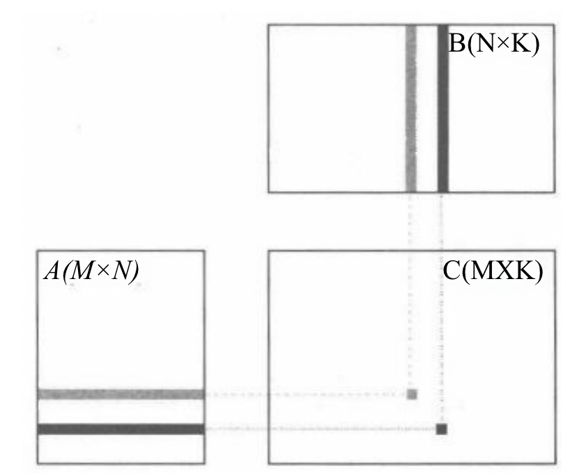

以上图的矩阵乘法为例，矩阵 C 中每个元素都可以由一个输入矩阵 A 的行向量和另一个输入矩阵 B 的列向量进行点积运算得到。C 中每个元素的计算过程都可以独立进行，不存在依赖关系，因此具有良好的数据并行性。

在 GPGPU 中，承担并行计算中每个计算任务的计算单元称为线程（Thread），每个线程在一次计算任务过程中会执行相同的指令。在上例矩阵乘法中，每个线程会从矩阵 A 和 B 读取对应的行或列构成向量 a 和 b, 然后执行向量点积运算，最后将结果 c 存到结果矩阵 C 的对应位置。

虽然每个线程输入数据不同，输出的结果也不同，但是每个线程需要执行的指令完全相同。**也就是说，** **一条指令被多个线程同时执行**，这就是 GPGPU 中的单指令多线程（Single Instruction Multiple Threads，SIMT）计算模型。

为了针对复杂的大规模通用计算场景将不方便处理，CUDA 引入了线程网格（thread grid）、线程块（thread block）、线程（thread）。Thread Block 由多个 Thread 组成，而 Grid 又由多个 Thread Block 组成。因此，它们的关系就是 Grid > Block > Thread。在 CUDA 编程模型中，通常将代码划分为主机端（host）代码和设备端（device）代码，分别运行在 CPU 和 GPGPU 上。CPU 硬件执行主机端代码，GPGPU 硬件将根据编程人员给定的线程网格组织方式将设备端代码分发到线程中。

主机端代码通常分为三个步骤。

1. 数据复制：CPU 将主存中的数据复制到 GPGPU 中。
2. GPGPU 启动：CPU 唤醒 GPGPU 线程进行运算。
3. 数据写回：GPGPU 运算完毕将计算结果写回主机端存储器中。

设备端代码常常由多个函数组成，这些函数被称为内核函数（kernel）。内核函数会被分配到每个 GPGPU 的线程中执行，而线程层次则由编程人员根据算法和数据的维度显式指定，如下图所示。

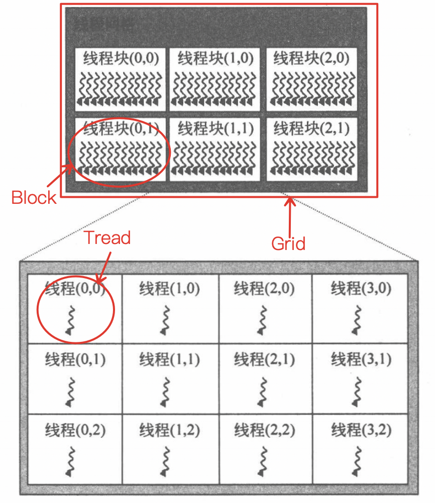

基于上面的线程层次，编程人员需要知道线程在网格中的具体位置，才能读取合适的数据执行相应的计算。因此，CUDA 引入了为每个线程指明其在线程网格中哪个线程块的 blockIdx（线程块索引号）和线程块中哪个位置的 threadIdx（线程索引号）。blockIdx 有三个属性，x、y、z 描述了该线程块所处线程网格结构中的位置。threadIdx 也有三个属性，x、y、z 描述了每个线程所处线程块中的位置。在一个 Grid 中：根据 blockIdx 和 threadIdx，我们就能唯一锁定到某个线程，进而编程让其做具体计算。例如下面这段代码，调用线程进行了矩阵加法。

```c
// Kernel定义
__global__ void MatAdd(float A[N][N], float B[N][N], float C[N][N]) 
{ 
    int i = blockIdx.x * blockDim.x + threadIdx.x; 
    int j = blockIdx.y * blockDim.y + threadIdx.y; 
    if (i < N && j < N) 
        C[i][j] = A[i][j] + B[i][j]; 
}
```

 矩阵加法计算时，数据之间没有依赖性，每个线程都是并行独立地操作数据。

首先，共享存储器的访问比全局存储器更快，共享存储器作用于一个线程块（thread block）内部，可以为同一个线程块内部的线程提供更快的数据访问。因此，通过合理划分块（block）的大小，可以充分利用数据的局部性原理减少对设备端全局存储器的访问，从而提高运算性能。此外，线程之间由于应用的特点可能不能完全独立。比如归约（reduction）操作需要邻近的线程之间频繁地交互数据，以协作的方式产生最终的结果，多个线程之间还可能需要相互同步，block 的存在提高了线程之间的协作能力。

### 自线程到硬件结构

为了实现对大量线程的分配，GPGPU 对硬件功能单元进行了层次化的组织，如图所示。

它主要由流多处理器（Streaming MultiProcessor，SM）阵列和存储系统组成，两者由片上网络连接到 L2 高速缓存和设备端存储器上。每个流多处理器内部有多个流处理器（Streaming Processor，SP）单元，构成一套完整的指令流水线，包含取指、译码、寄存器文件及数据加载/存储（load/store）单元等，并以 SIMT 架构的方式进行组织。GPGPU 的整体结构、SM 硬件和 SP 硬件对应了线程网格、线程块和线程的概念，实现了线程到硬件的对应分配规则。

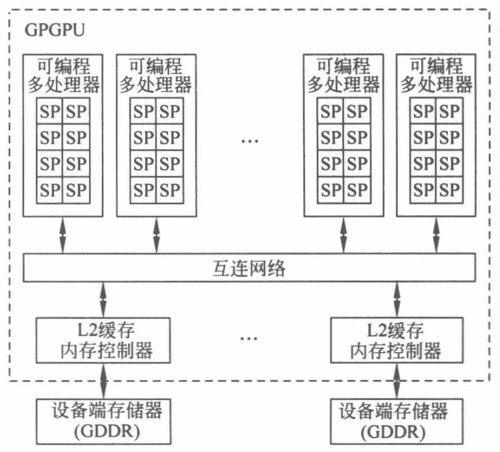

### 存储模型

GPGPU 利用大量的线程来提高运算的并行度，这些线程需要到全局存储器中索引相应的数据。为了减少对全局存储器的访问，GPGPU 架构提供了多种存储器类型和多样的存储层次关系来提高 kernel 函数的执行效率，如下表所示。

<table>
  <thead>
    <tr>
      <th>Memory Description</th>
      <th>CUDA Memory Name</th>
    </tr>
  </thead>
  <tbody>
    <tr>
      <td>所有的线程(或所有work-items)均可访问</td>
      <td>global memory</td>
    </tr>
    <tr>
      <td>只读存储器</td>
      <td>constant memory</td>
    </tr>
    <tr>
      <td>线程块(或work-group)内部线程访问</td>
      <td>shared memory</td>
    </tr>
    <tr>
      <td>单个线程(或work-item)可以访问</td>
      <td>local memory</td>
    </tr>
  </tbody>
</table>

CUDA 支持多种存储器类型，线程代码可以从不同的存储空间访问数据，提高内核函数的执行性能。每个线程都拥有自己独立的存储空间，包括寄存器文件（Register File）和局部存储器（Local Memory），这些存储空间只有本线程才能访问。每个线程块允许内部线程访问共享存储器（Shared Memory），在块内进行线程间通信。线程网格内部的所有线程都能访问全局存储器（Global Memory），也可以访问纹理存储器（Texture Memory）和常量存储器（Constant Memory）中的数据。

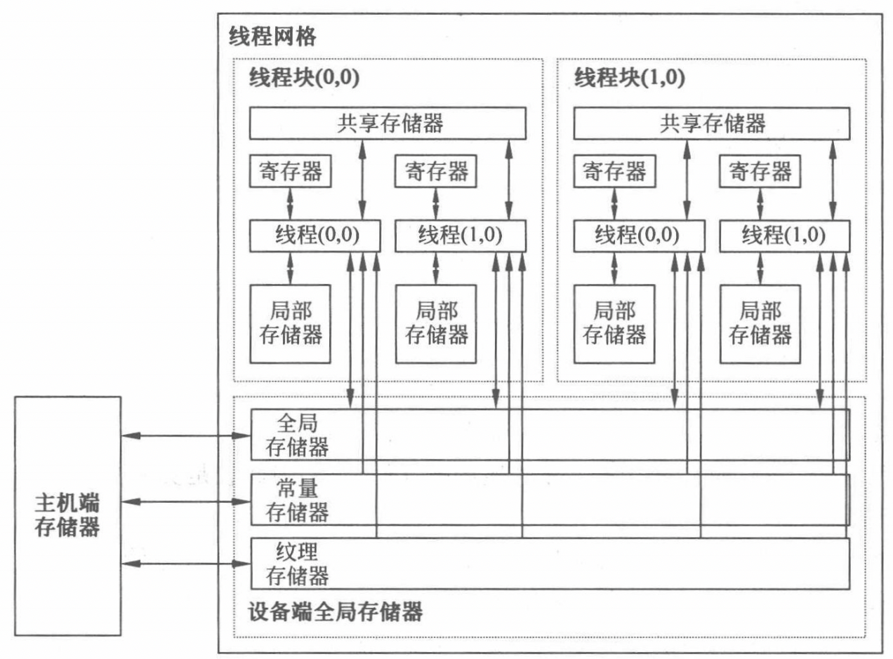

1. 寄存器文件（Register File）是 SM 片上存储器中最为重要的一个部分，它提供了与计算内核相匹配的数据访问速度。大容量的寄存器文件能够让更多的线程同时保持在活跃状态。这样当流水线遇到一些长延时的操作时，GPGPU 可以在多个线程束之间快速地切换来保持流水线始终处于工作状态。这种特性在 GPGPU 中被称为零开销线程束切换（zero-cost warp switching），可以有效地掩藏长延时操作，避免流水线的停顿。
2. 局部存储器（Local Memory）是每个线程自己独立的存储空间，局部存储器是私有的，只有本线程才能进行读写。
3. 共享存储器（Shared Memory）也是 SM 片内的高速存储资源，它由一个线程块内部的所有线程共享。相比于全局存储器，共享存储器能够以类似于寄存器的访问速度读写其中的内容。
4. 全局存储器（Global Memory）位于设备端。GPGPU 内核函数的所有线程都可对其进行访问，但其访存时间开销较大。
5. 常量存储器（Constant Memory）位于设备端存储器中，其中的数据还可以缓存在 SM 内部的常量缓存（Constant Cache）中，所以从常量存储器读取相同的数据可以节约带宽，对相同地址的连续读操作将不会产生额外的存储器通信开销。
6. 纹理存储器（Texture Memory）位于设备端存储器上，其读出的数据可以由纹理缓存（Texture Cache）进行缓存，也属于只读存储器。

### 同步机制

在 SIMT 计算模型中，每个线程的执行都是相互独立的。然而在实际的应用和算法中，除向量加这种可完全并行的计算之外，并行的线程之间或多或少都需要某种方式进行协同和通信，例如：

1. 某个任务依赖于另一个任务产生的结果，例如生产者 - 消费者关系；
2. 若干任务的中间结果需要汇集后再进行处理，例如归约操作。

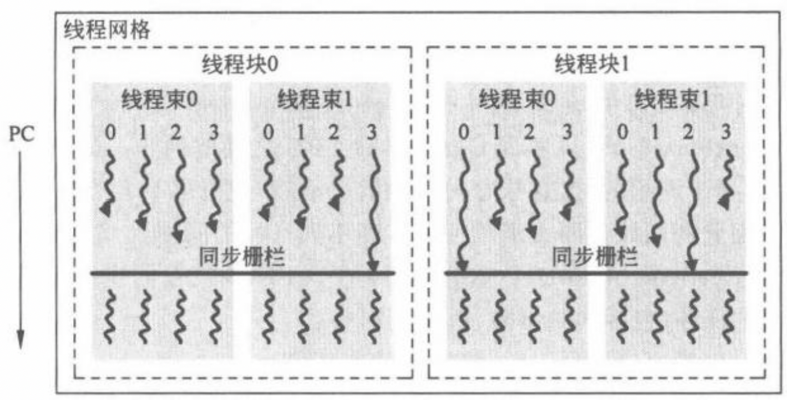

 这就需要引入某种形式的同步操作，以 Thread Block 中的线程同步为例。在 CUDA 编程模型中，`__syncthreads ()` 可用于同一线程块内线程的同步操作，它对应的 PTX 指令为 bar 指令。该指令会在其所在程序计数器（Programe Counter，PC）位置产生一个同步栅栏（barrier），并要求线程块内所有的线程都到达这一栅栏位置才能继续执行，这可以通过监控线程的 PC 来实现。在线程同步的要求下，即便有些线程运行比较快而先到达 bar 指令处也要暂停，直到整个线程块的所有线程都达到 bar 指令才能整体继续执行。

## 架构

### CPU-GPGPU 异构计算系统

一个由 CPU 和 GPGPU 构成的异构计算平台如下图所示，GPGPU 通过 PCI-E（Peripheral Component Interconnect Express）接口连接到 CPU 上。CPU 作为控制主体统筹整个系统的运行。

一次 kernel 函数的实现步骤如下：

1. CPU 通过 PCI-E 与 GPGPU 进行通信，将程序中的 kernel 函数加载到 GPGPU 中的 SP 和 SM 上执行；
2. 在驱动 kernel 函数的进行计算前，需要先将代码、配置和运行数据从硬盘加载到主机端存储器中；
3. 接着，由一系列运行和驱动 API 将数据传送到 GPGPU 的设备端存储器中；
4. 然后，GPGPU 启动 kernel 函数，通过大算力完成计算。
5. 最后，CPU 将结果由设备端存储器传送回主机端存储器，等待下一次调用。

以上是一种 CPU-GPGPU 的异构计算架构。还有一种架构是 CPU 和 GPGPU 两者公用主机端存储器，例如 AMD 的异构系统架构（Heterogeneous System Architecture，Has），它采用硬件支持的统一寻址，使得 CPU 和 GPGPU 能够直接访问主机端存储器，借助 CPU 与 GPGPU 之间的内部总线作为传输通道，通过动态分配系统的物理存储器资源保证了两者的一致性，提高了两者之间数据通信的效率。

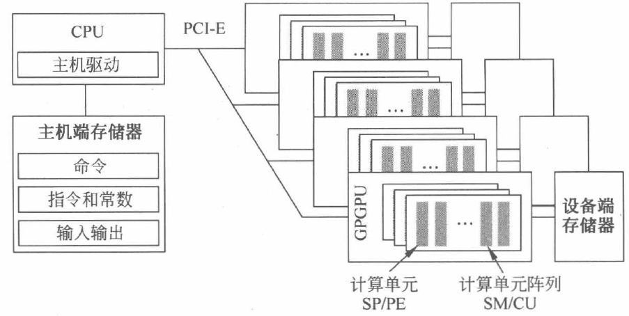

另有一种高性能变种是使用多个 GPGPU 并行工作。这种形式需要借助特定的互连结构和协议将多个 GPGPU 有效地组织起来。例如 NVIDIA 的 DGX 系统。它通过 NVIDIA 开发的一种总线及通信协议 NVLink，采用点对点结构、串列传输等技术，实现多 GPGPU 之间的高速互连。

### GPGPU 架构

不同型号的 GPGPU 产品虽有所差异，但其核心的整体架构存在一定的共性。下图为一个典型的 GPGPU 架构，其核心部分包含了众多可编程多处理器，NVIDIA 称之为流多处理器（Streaming Multiprocesosr，SM），AMD 称之为计算单元（Compute Unit，CU）。每个 SM 又包含了多个流处理器（Streaming Processor，SP），NVIDIA 称之为 CUDA 核心，AMD 称之为 PE（Processin Element），支持整型、浮点和矩阵运算等多种不同类型的计算。

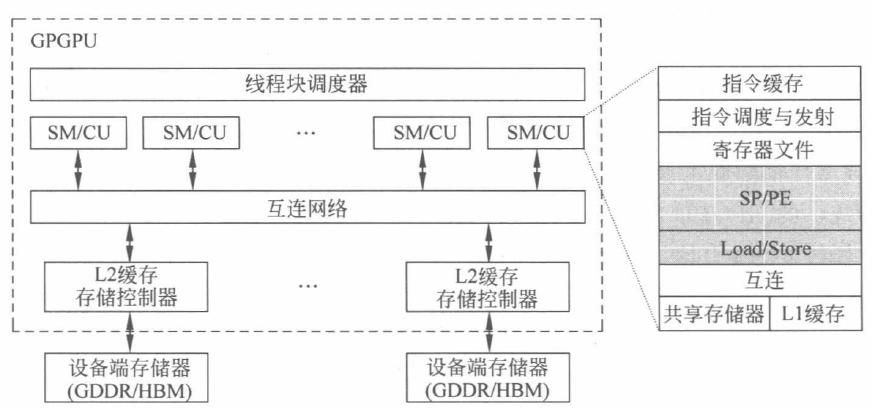

SM 构成了 GPGPU 核心架构的主体。它们从主机接口的命令队列接收 CPU 发送来的任务，并通过一个全局调度器分派到各个可编程多处理器上执行。SM 通过片上的互连结构与多个存储分区相连实现更高并行度的高带宽访存操作。每个存储分区包含了第二级缓存（L2 cache）和对应的 DRAM 分区。此外，SM 中包含了大量的 SP，如上图右侧所示，SP 由指令驱动，以流水化的方式执行指令，提高指令级并行度。

面对数以万计的线程，硬件资源仍然有限，因此硬件会对海量的线程进行分批次的处理。GPGPU 中往往采用线程束（NVIDIA 称为 warp，AMD 称为 wavefront）的方式创建、管理、调度和执行一个批次的多个线程。当前，一种典型的配置是一个 warp 包含 32 个线程，一个 wavefront 包括 64 个线程。当这些线程具有相同的指令路径时，GPGPU 就可以获得最高的效率和性能。

### GPGPU 指令流水线

流水线技术是利用**指令级并行**，提高处理器 **IPC（Instruction Per Cycle）** 的重要技术之一。不同功能的电路单元组成一条指令处理流水线，利用各个单元同时处理不同指令的不同阶段，可使得多条指令同时在处理器内核中运行，从而提高各单元的利用率和指令的平均执行速度。在大多数 GPGPU 架构中，虽然指令的执行粒度变为包含多个线程的线程束，但为了提高指令级并行，仍然会采用流水线的方式提高线程束指令的并行度。

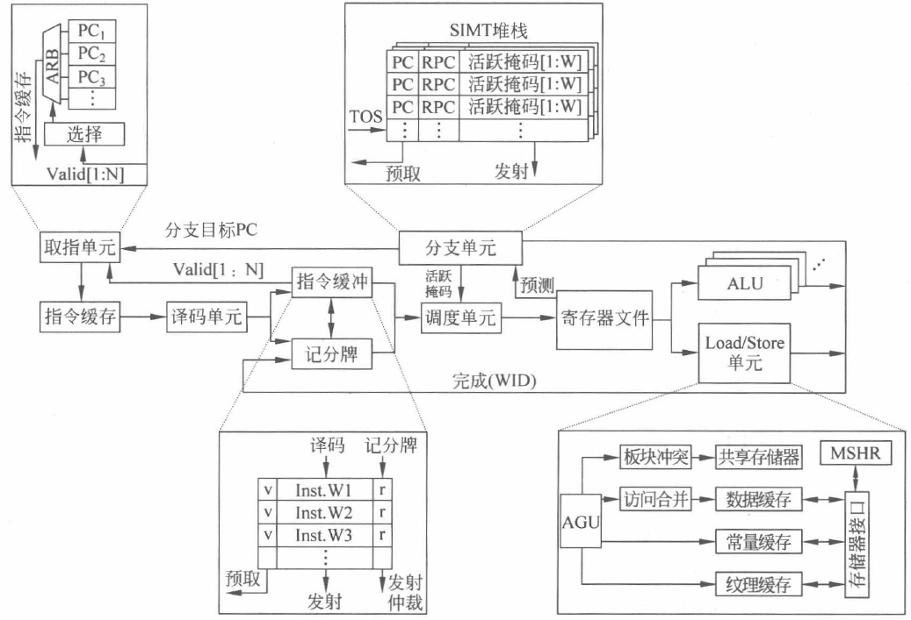

上图显示了一种典型的 GPGPU 架构流水线设计。可以看到，每个线程束按照流水方式执行指令的读取（fetch）、解码（decode）、发射（issue）、执行（execute）及写回（writeback）过程。这一过程与标量流水线非常类似，但不同之处在于 GPGPU 的流水线以线程束为粒度执行，各个线程束相互独立。

#### 前段：取指与译码
1. 取指单元

取指单元是根据程序计数器（Program Counter，PC）的值，从指令缓存中取出要执行指令的硬件单元。取出来的指令经过译码后会保存在指令缓冲中，等待指令后续的调度、发射和执行。

在标量流水线中，一般只需要一个 PC 来记录下一条指令的地址。但由于 GPGPU 中同时存在多个线程束且每个线程束执行的进度可能并不一致，取指单元中就需要保留多个 PC 值，用于记录每个线程束各自的执行进度和需要读取的下一条指令位置。这个数目应该与可编程多处理器中允许的最大线程束数量相同。

1. 指令缓存

指令缓存接收到取指单元的 PC, 读取缓存中的指令并发送给译码单元进行解码。指令高速缓存（I-Cache）可以减少直接从设备端存储器中读取指令的次数。本质上指令缓存也是缓存，可以采用传统的组相联结构及 FIFO 或 LRU（Least Recently Used）等替换策略来进行设计。取指单元对指令缓存的访问也可能会发生不同的情况：如果命中（cache hit），指令会被传送至译码单元；如果缺失（cache miss），会向下一层存储请求缺失的块，等到缺失块回填指令缓存后（refill），访问缺失的线程束指令会再次访问指令缓存。

1. 译码单元

译码单元对指令缓存中取出的指令进行解码，并且将解码后的指令放入指令缓冲中对应的空余位置上。根据 SASS 指令集的定义和二进制编码规则，译码单元会判断指令的功能、指令所需的源寄存器、目的寄存器和相应类型的执行单元或存储单元等信息，进而给出控制信号，控制 整个线程束流水线的运行。

1. 指令缓冲

指令缓冲用于暂存解码后的指令，等待发射。考虑到每个 SM 中会有许多线程束在执行，指令缓冲可以采用静态划分的方式来为每个线程束提供专门的指令条目，保留已解码待发射的指令。每个指令条目（entry）一般包含一条解码后的指令和两个标记位，即一个有效位（valid）和一个就绪位（ready）。有效位表示该条指令是有效的已解码未发射指令，而就绪位表示该指令已经就绪可以发射。就绪的指令往往需要通过诸如记分牌（scoreboard）的相关性检查等一系列条件，并且需要有空闲的硬件资源才能得以发射。

指令缓冲中的有效位还会反馈给取指单元，表明指令缓冲中是否有空余的指定条目用于取指新的线程束指令。如果有空余条目，应尽快利用取指单元从指令缓存中获得该线程束的后续指令；如果没有空余条目，则需要等待指令缓冲中该线程束的指令被发射出去后，条目被清空才能进行指令读取。

#### 中段：调度与发射

指令的调度与发射作为指令流水的中段，连接了前段取指和后段执行部分，对流水线的执行效率有着重要的影响。

1. 调度单元

调度单元通过线程束调度器（warp scheduler）选择指令缓冲中某个线程束的就绪指令发射执行。发射会从寄存器文件中读取源寄存器（source register）传送给执行单元。调度器则很大程度上决定了流水线的执行效率。为了确保指令可以执行，调度单元需要通过各种检查以确保指令就绪并且有空闲执行单元才能发射。这些检查包括没有线程在等待同步栅栏及没有数据相关导致的竞争和冒险等。

1. 记分牌

记分牌单元（scoreboard）主要是检查指令之间可能存在的相关性依赖，如写后写（Write-After-Write，WAW）和写后读（Read-After-Write，RAW），以确保流水化的指令仍然可以正确执行。记分牌算法通过标记目标寄存器的写回状态为“未写回”,确保后续读取该寄存器的指令或再次写入该寄存器的指令不会被发射出来。直到前序指令对该目的寄存器的写回操作完成，该目的寄存器才会被允许读取或写入新的数据。

1. 分支单元和 SIMT 堆栈

对于指令中存在条件分支的情况，例如 if…else…语句，它们会破坏 SIMT 的执行方式。条件分支会根据线程束内每个线程运行时得到的判断结果，对各个线程的执行进行单独控制，这就需要借助分支单元，主要是活跃掩码（active mask）和 SIMT 堆栈进行管理，解决一个线程束内线程执行不同指令的问题。

1. 寄存器文件和操作数收集

指令执行之前会访问寄存器文件（register file）获取源操作数。指令执行完成后还需要写回寄存器文件完成目的寄存器的更新。寄存器文件作为每个可编程多处理器中离执行单元最近的存储层次，需要为该可编程多处理器上所有线程束的线程提供寄存器数值。

出于电路性能、面积和功耗的考虑，寄存器文件会分 Bank 设计，且每个 Bank 只有少量访问端口（如单端口）的设计方式。对不同 bank 的数据同时读取可以在同周期完成，但是不同请求如果在同一 Bank，就会出现 Bank Conflict 而影响流水线性能。

#### 后段：执行与写回

作为指令执行的后段，计算单元是对指令执行具体操作的实现，存储访问单元则完成数据加载及存储操作。

1. 计算单元

GPGPU 需要为每个可编程多处理器配备许多相同的流处理器单元来完成一个线程束中多个线程的计算需求，同时还配备了多种不同类型的计算单元，用来支持不同的指令类型，如整型、浮点、特殊函数、矩阵运算等。不同类型的指令从寄存器文件中获得源操作数，并将各自的结果写回到寄存器文件中。

作为基本的算术需求，GPGPU 中提供了较为完整的算术逻辑类指令，支持通用处理程序的执行。在 NVIDIA 的 GPGPU 架构中，流处理器单元体现为 CUDA 核心，它提供了整型运算能力和单精度浮点运算能力。不同的架构会配备不同数量的双精度浮点硬件单元，以不同的方式对双精度浮点操作进行支持，以满足高性能科学计算的需求。

1. 存储访问单元

存储访问单元负责通用处理程序中 load 和 store 等指令的处理。由于配备了具有字节寻址能力的 load 和 store 等指令，GPGPU 可以执行通用处理程序。

GPGPU 一般会包含多种类型的片上存储空间，如共享存储器、L1 数据缓存、常量缓存和纹理缓存等。存储访问单元实现了对这些存储空间的统一管理，进而实现对全局存储器的访问。同时针对 GPGPU 的大规模 SIMT 架构特点，存储访问单元还配备了地址生成单元（Address Generation Unit，AGU）、冲突处理（bank conflict）、地址合并、MSHR（Miss Status Handling Registers）等单元来提高存储器访问的带宽并减小开销。当需要访问共享存储器中的数据时，冲突处理单元会处理可能存在的 Bank conflict，并允许在多周期完成数据的读取。对于全局存储器和局部存储器中的数据，load/store 指令会将同一线程束中多个线程产生的请求合并成一个或多个存储块的请求。面对 GPGPU 巨大的线程数量，存储访问单元通过合并单元将零散的请求合并成大块的请求，利用 MSHR 单元支持众多未完成的请求，有效地掩盖了对外部存储器的访问延时，提升了访问的效率。

### 线程分支

在 warp 执行阶段，如果遇到了 if…else…等条件分支指令，GPGPU 往往会利用**谓词寄存器**和**SIMT 堆栈**相结合的方式对发生了条件分支的指令流进行管理。

## 调度

https://blog.csdn.net/qq_57502075/article/details/140468518

## 存储

https://blog.csdn.net/qq_57502075/article/details/140501142

现代处理器的存储系统大多采用层次化的结构，本文将从 CPU 存储层次入手，通过对比介绍 GPGPU 存储层次的特点。

### CPU 的层次化存储

在精简指令集计算机（Reduced Instruction Set Computer，RISC）中，运算器所需的操作数都需要从寄存器文件（Register File，RF）中获得。但寄存器的硬件开销很高，一个寄存器文件只能配备几十到数百个寄存器，所以运行时需要在寄存器文件和主存储器之间反复地进行操作数的加载（load）和存储（store）操作，保证运算所需要的操作数都能在寄存器中。但主存的访问速度很慢，会极大程度的影响处理器性能。

为此，CPU 引入了高速缓存（cache）结构，将主存储器中经常被访问的数据保留在片上供快速访问。由于数据具有时间和空间局部性，把常用的数据合理地保留在高速缓存中，就可以提高数据访问的速度，并减少对主存储器访问的次数。由于高速缓存往往采用读写速度更快的静态随机访问存储器（Static Random Access Memory，SRAM）来实现。然而，SRAM 集成密度低，其功耗较主存储器却大得多，使得高速缓存的容量仍远低于主存储器。依据高速缓存与运算器之间的距离，还可以将高速缓存细分为 L1 Cache、L2 Cache 等。一般而言，层次越低的缓存容量越大，但访问时间和性能代价也更高。

CPU 存储系统中的层次化存储结构如下图所示：

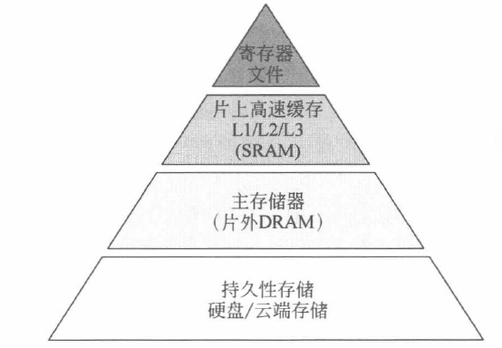

该结构为典型的 “正三角” 金字塔、结构。不同存储介质有着不同的存储特性：顶部的存储介质离运算器近、速度快，但电路开销大，所以数量少，容量小；而底部的存储介质离运算器远，速度慢，但电路开销低，所以具有更大的容量。

现代 CPU 处理器普遍将运算器、控制器、寄存器文件、缓存等部件集成封装在一块芯片内。其中寄存器和多级高速缓存构成了片上存储系统，而以 DRAM 为主要介质的主存储器放置在芯片外部，构成了外部存储系统。它们往往通过高速芯片组和总线与处理器相连，与片上存储进行数据交互。

### GPGPU 的存储层次

与 CPU 存储系统结构类似，GPGPU 的存储系统也采用了层次化的结构设计，通过充分利用数据的局部性来降低片外存储器的访问开销。但为了满足 GPGPU 核心的 SIMT 大规模线程并行，GPGPU 遵循吞吐率优先的原则，因此其存储系统也与 CPU 有着明显区别。二者的差异主要体现在存储器容量、结构组成和访问管理上。

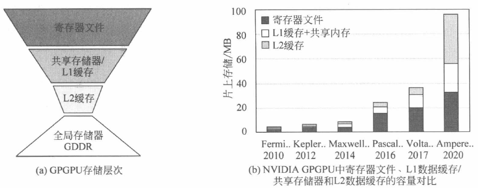

从上图 (a) 中可以看到，GPGPU 每个可编程多处理器中寄存器文件的容量显著高于 L1 缓存和共享存储器，呈现出与 CPU 截然相反的“倒三角”结构。GPGPU 的寄存器文件采用如此大容量的设计，主要是为了满足线程束的零开销切换。

GPGPU 的访存行为还体现出更为精细的片上存储管理特点。GPGPU 可以选择共享存储器、L1 数据缓存、纹理缓存、常量缓存等不同的存储空间来存储数据，还可以在保证总容量不变的情况下灵活地调节共享存储器和 L1 数据缓存的大小。

### 寄存器

为了获取更高的寄存器存储密度，大容量的 GPGPU 寄存器文件多采用 SRAM 实现。除了容量的需求，GPGPU 的寄存器文件还需要高并行度和高访问带宽以满足线程束对操作数并行访问的需求。GPGPU 的寄存器文件采用包含有多个板块（bank）的单端口 SRAM 来模拟多端口的访问。

### 并行多板块结构

下图展示了一个多板块组织的寄存器文件基本结构，其中数据存储部分由 4 个单端口的逻辑板块组成。由于寄存器操作数访问具有较高的随机性，这些逻辑板块采用一个对等的交叉开关（crossbar）与 RR/EX（register read/execution）流水线寄存器相连，将读出的源操作数传递给 SIMT 执行单元。

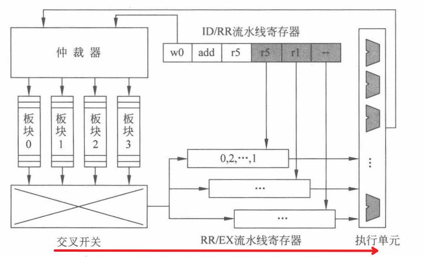

执行单元的计算结果将被写回到其中的一个板块。板块前端的**访问仲裁器**控制如何对各个板块进行访问及交叉开关如何将结果路由到合适的 RR/EX 流水线寄存器中。实际上，由于寄存器文件的总容量非常大，每个逻辑板块会被进一步拆分成更小的物理板块，以满足硬件电路对时序和功耗的约束。

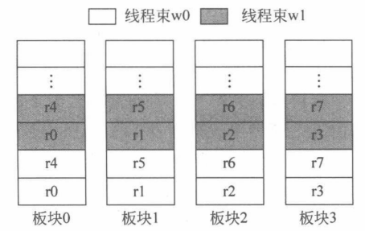

在没有线程分支的情况下，寄存器文件将 32 个线程的标量寄存器打包成线程束寄存器（warped register）进行统一读取和写入，假设每个线程束最多配备 8 个线程束寄存器一种直接的分配方法就是将这 8 个寄存器依次分布到不同的逻辑板块中不同的线程束采用相同的方式分配各自的寄存器，如上图所示。

#### 操作数收集器

 针对板块冲突导致的寄存器文件访问效率降低的问题，可以通过允许尽可能多的指令同时访问操作数，利用多板块的并行性提高来访问效率。这样即使板块冲突仍然存在，受益于寄存器访问的随机性，也可以重叠多条指令的访问时间，提高寄存器文件的吞吐量。

以下是一个包含操作数收集器的寄存器文件结构：

	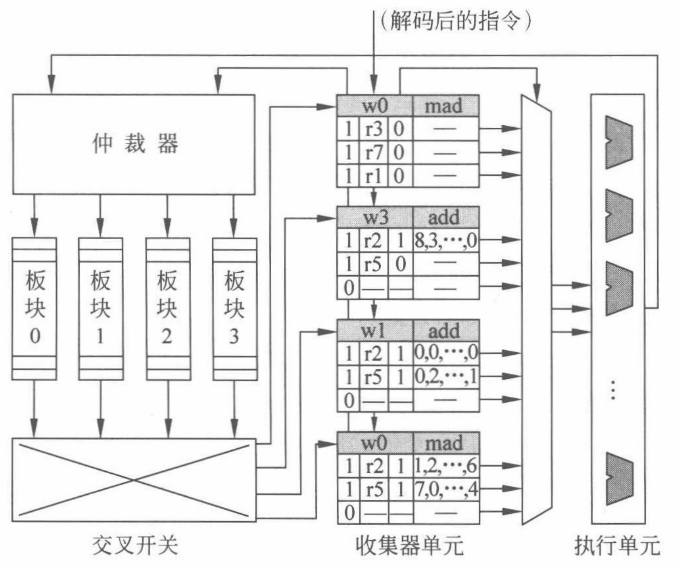

每条指令进入寄存器读取阶段后都会被分配一个操作数收集单元。操作数收集器中包含多个收集单元，允许多条指令同时访问寄存器文件。

操作数收集器往往包含多个收集单元，以便提高寄存器并行访问的可能性。每个收集 单元包含一条线程束指令所需的所有源操作数的缓冲空间。因为每条指令至多可以包含 3 个源操作数寄存器，所以每个单元设置有 3 个条目，每个操作数条目又包含以下几个字段。

（1）1 个有效位，表示指令中是否包含该操作数的请求。

（2）1 个寄存器 RID，代表该源操作数所在的寄存器编号。

（3）1 个就绪位，表明寄存器是否已经被读取，即后续操作数数据字段是否有效。

（4）操作数数据字段，每个操作数数据字段可以保存一个线程束所需的寄存器，即 32 比特× 32 个线程=1024 比特=128 字节的数据。

（5）1 个线程束 WID，用于指示该指令属于哪个线程束，与 RID 一起产生板块的访问地址。

当接收到一条解码指令并且有空闲的收集单元可用时，会将该收集单元分配给当前指令，并且设置好 WID、RID 和有效位。与此同时，源操作数寄存器读请求在仲裁器中排队等待。仲裁器包含了每个板块的读请求队列，队列中的请求保留到访问数据返回为止。寄存器文件中有 4 个单端口逻辑板块，允许仲裁器同时将至多 4 个非冲突的访问发送到各个板块中。当寄存器文件完成对操作数的读取时，修改就绪位为 1。最后，当一个收集单元中所有的操作数都准备就绪后，通知调度器将指令和数据发送给 SIMT 执行单元并释放其占用的收集器资源。

风险：操作数收集器目前只考虑了数据访问的并行性，虽然不同指令会按顺序进入操作数收集器，但对寄存器的访问和指令的执行没有任何顺序的约束，因此可能违背相关性导致流水线冒险。

针对操作数并行访问时产生的 WAR 冒险，可以要求每个线程束每次最多执行一条指令，只有在当前指令完成写回后才能发射下一条指令。或者让每个线程束每次仅允许一条指令在操作数收集器中收集数据。

寄存器的板块交错分布

将不同线程束同一编号的寄存器交错分布在各个板块中。如线程束 w0 的寄存器 r0 被分配在板块 0 中，而 w1 的寄存器 r0 分配在板块 1 中，这样如果 w0 和 w1 相继发射，它们仍然可以并行地从板块 0 和板块 1 中读取 各自的寄存器 r0，消除了在访问相同编号寄存器时存在的板块冲突问题。

#### 寄存器文件的优化设计

增加前置寄存器文件缓存

有些数据的生命期很短且复用次数很低，将它们写入大容量的寄存器文件中再读取出来会浪费较高的能量。利用数据的局部性原理，通过增加一个小容量的寄存器文件缓存（Register File Cache，RFC）来捕捉这些短生命周期的数据，从而过滤掉大部分对原有的主寄存器文件（Main Register File，MRF）的访问，进而降低功耗。

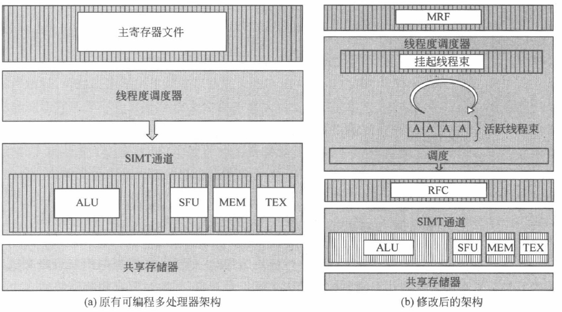

RFC 的工作原理如下：待写回的目的寄存器首先会被写入 RFC 中，等待后续寄存器的读取操作。图像计算中，大部分目的寄存器会在较短的时间内仅有 1 次后续的读操作，因此可以通过 RFC 满足这部分读操作请求。

给予嵌入式动态存储器的寄存器文件

传统的寄存器文件是基于 SRAM 设计的。在 GPGPU 架构中，大容量的 SRAM 寄存器文件使得面积成本和能耗成为瓶颈。嵌入式动态随机访问存储器（embedded-DRAM，eDRAM）提供了更高的存储密度和更低的静态功耗。

利用数据压缩的寄存器文件

（a）GPGPU 程序中许多局部变量都是通过线程 ID 生成的，而一个线程束中连续线程的线程 ID 仅相差 1，因此用于存放数组访问地址的寄存器具有很强的值相似性。

（b）运行时输入数据的动态范围可能很小，会带来值相似性。

利用这样的相似性来对寄存器中存储的值进行压缩。

编译信息辅助的小型化寄存器文件

核心思想是根据编译器生成的提示信息和分段算法，帮助硬件对寄存器完成实际的复用与管理。

### SM 内的存储系统

数据通路概述

虽然 GPGPU 的每个 SM 中都配备了大量寄存器文件，但其仍需要借助高速缓存来进一步降低访存延时，减少对外部存储器的访问次数。GPGPU 架构的特点使得高速缓存的设计不同于传统 CPU。在 GPGPU 中，缓存根据其所处的层次分为 SM 内局部的数据缓存，如 L 1 数据缓存和可编程多处理器外共享的数据缓存，如 L 2 缓存。

L1 数据缓存的一个显著特点是它可以与共享存储器（Shared memory）共享一块存储区域。

下图是 NVIDIA GPGPU 中 L1 数据缓存/共享存储器统一的结构和数据通路。其中⑤为二者共用的 SRAM 阵列，根据控制逻辑进行配置，可以实现一部分是数据缓存，另一部分是共享存储器的访问方式。

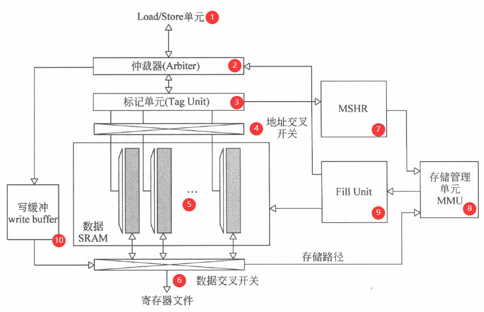

#### 共享存储器访问

共享存储器中的数据是依次存储在各个 bank 中的，同一行内相邻 bank 间的地址是连续的，符合共享存储器的设计初衷。以 "LDS Rdst，[addr]”指令为例，该指令中每个线程的 [addr] 都是独立计算的，那么 32 个线程在访问 32 个板块时就会产生 32 个地址，有以下两种可能：

（1）32 个线程的地址可能分散在 32 个 bank 上，也可能指向同一个 bank 的相同位置。

（2）32 个线程的地址分别指向同一个 bank 的不同位置。

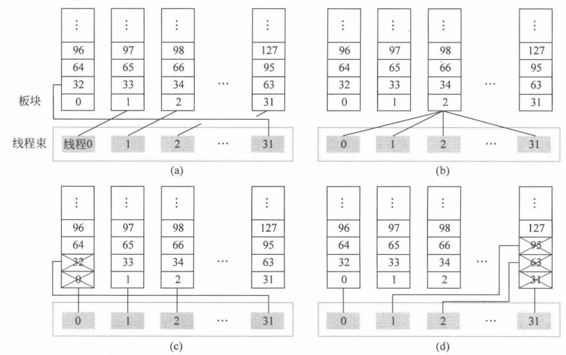

图 (a) 线程束中 32 线程依次访问 32 个不同的 bank；图 (b) 线程束中 32 个线程访问同一个 bank 的同一行；图 (c) 和 (d) 线程束中 32 个线程访问的目的地址中，有若干线程访问了相同板块的不同行。(a) 和 (b) 因为没有 bank 冲突，所以可以一次完成所有线程的访问。

无 bank 冲突时，共享存储器指令从 LSU（load/Store Unit）开始执行，根据指令类型识别出它是共享存储器的访问请求后，LSU 会判断独立的线程地址之间是否会引起共享存储器的 Bank 冲突。如果不会引起板块冲突，那么仲裁器会接受并处理这部分访存请求，并控制地址交叉开关的打开与关闭。

这里关键要讲一下出现 Bank 冲突时的处理方案：如果发生了 Bank 冲突，GPGPU 为此设计了 replay（重播）机制，针对一个 Warp 中访问同一个 Bank 的不同寄存器的线程来说，需要将各个线程“串行化”，通过对该条指令的反复 replay 来完成 Bank 冲突的线程对 Bank 的访问。不冲突的那些线程仍然可以一周期内访问 Shared memory 一次拿走数据。

#### L1 高速缓存

L1 数据缓存可以用来缓存全局存储器和局部存储器中可读可写的数据，但不同架构的写策略也有所不同。由于 GPGPU 中 L1 数据缓存一般不支持一致性，所以在写操作上会有一些特殊的设计。针对写命中而言，根据被缓存数据属于哪个存储空间会采用不同的写策略。例如，对于局部存储器的数据，可能是溢出的寄存器，也可能是线程的数组。由于都是线程私有的数据，写操作一般不会引起一致性问题，因此可以采用写回（write back）策略，充分利用程序中的局部性减少对全局存储器的访问。对于全局存储器的数据，L1 数据缓存可以采用写逐出（write evict）策略，将更新的数据写入共享 L2 缓存的同时将 L1 数据缓存中相应的缓存行置为无效（invalidation）。由于很多 GPGPU 程序采用了流处理的方式来计算，全局存储器的数据可能本身也不具备良好的局部性可以利用，所以这种写逐出的策略保证了数据一致性，让更新的数据在全局存储空间可见。
