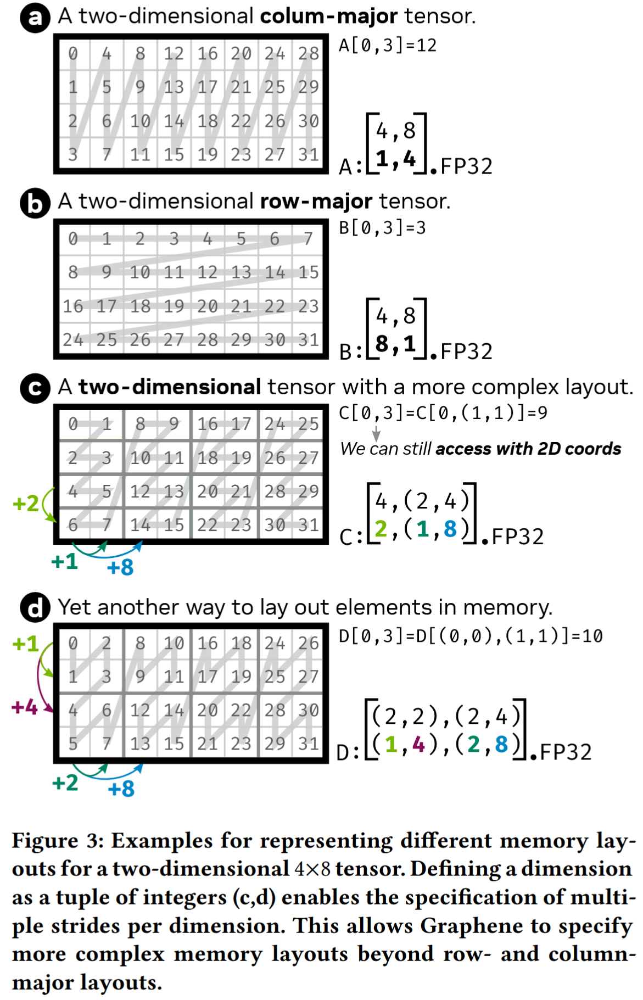

参考：https://zhuanlan.zhihu.com/p/661182311

代数几何解释：https://zhuanlan.zhihu.com/p/662089556

# 向量表示概述
### 高维计算空间与一维内存映射的发展解读与总结

#### 核心问题

计算机内存是一维线性地址空间，而实际计算（如 GEMM 的二维矩阵运算、深度学习的三维及以上张量运算）常涉及高维空间。因此，**如何高效表达高维计算空间并将其映射到一维内存**，成为提升计算效率的关键问题。

#### 历史发展三阶段

对高维到一维映射的探索可分为三个阶段，逐步优化对复杂高维结构的描述能力：

1. **第一阶段：BLAS 的 row/col-major + leading dimension**
    二十世纪七八十年代的 BLAS 库主要处理二维矩阵问题，通过**行优先 / 列优先**规则定义一维存储与二维逻辑结构的映射关系（如行优先按行连续存储，列优先按列连续存储）。为解决维度对齐、填充（padding）等问题，引入**leading dimension**（主导维度），用于描述第二维度的数据连续性，支撑基础线性代数运算。

2. **第二阶段：Tensor 的 shape + stride**
    二十一世纪初深度学习兴起后，批处理（batch）等需求推动高维数据（如含 batch、height、width、channel 等维度的张量）的广泛应用。在 BLAS 的 leading dimension 基础上，扩展出**shape（形状）+ stride（步长）** 体系：

    - `shape` 描述高维逻辑结构的各维度大小（如三维张量的 [batch, height, width]）；
    - `stride` 定义每个维度上相邻元素在一维内存中的地址间隔，通过逻辑坐标与 stride 的点积可快速完成高维到一维的映射。
        该体系支持部分操作仅修改 shape 和 stride 而无需移动数据，但要求维度轴单调、数据连续性严格，灵活性有限。
3. **第三阶段：Hierarchy Tensor（层级张量）**
    2023 年提出的层级张量描述体系，在 shape + stride 基础上增加**轴的层级描述**（如 [Graphene Tensor IR](https://dl.acm.org/doi/abs/10.1145/3582016.3582018)），允许在具体维度轴上表达更丰富的结构。其优势在于：

    - 支持复杂的张量分块和映射关系，适配现代 GPU 计算体系；
    - 通过 “描述 + 代数” 方式推导复杂逻辑空间与硬件存储排列的映射，为高维计算与硬件高效结合提供新途径。

### Tensor 层次化描述体系与 Layout 解读总结

#### 背景与应用场景

Tensor 的层次化描述体系在 Graphene Tensor IR 中被详细阐述，且在具体实现中，NVidia 开源的 cutlass 模板也采用了相同思路进行 Tensor 描述与计算。为提升抽象能力和编译时优化，cutlass 利用 C++17 实现了 cute 库 —— 其定义了层次化 Tensor 体系及基于此的代数计算，并基于该体系实现了最新 Hopper 架构上的矩阵运算。

#### Layout 的核心定义与组成

- **Layout 的作用**：作为数据排列的描述体系，核心功能是实现**逻辑坐标到索引坐标（以 offset 表示）的映射**，是连接计算空间与一维地址空间的关键映射结构。
- **组成部分**：Layout 包含 Shape 和 Stride 两部分，且两者均为**层级嵌套结构**（需保持相同的层次关系）：
    - **Shape**：描述数据排列的分块层次和结构，可嵌套包含 Int 数据和 Shape（即支持层级嵌套）；
    - **Stride**：描述块内或块间的数据排列连续性，同样为层级嵌套表示。

#### 本文组织结构

- 先以示例形式介绍一维向量、二维矩阵的表示；
- 再介绍层次化的 Tensor 表示；
- 随后介绍 cute 中常用的编译时和运行时形状描述；
- 最后总结 Layout 的功能。

# 回顾无层次的 Layout 描述 —— 即通过 Shape 和 Stride 描述的高维 Tensor

## 一维向量的表示

Shape: (8), Stride: (1) 表示该排列包含 8 个逻辑位置，在逻辑位置和物理（数据）做映射的时候每一个元素之间的差为 1，如图 1 所示其描述了 0-7 总计 8 个数字，其计算逻辑为 index_physical = index_logical * stride;


Figure 1. shape = 8, stride = 1 的逻辑空间和物理空间映射关系

Shape: (8), Stride: (2) 表示该排列包含 8 个逻辑位置，每一个位置的坐标为自然序列 0-7，如图 2 所示，其对应物理位置映射时的公式为 index_physical = index_logical * stride; 这时候我们发现逻辑空间和物理空间的大小是不一样的，在 cute 体系下，逻辑空间可以被称作 domain，而代表存储的物理空间称作 codomain，也就是 size(tensor) = 8, cosize(tensor) = 15.


Figure 2. shape = 8，stride = 2 的逻辑空间和物理空间的映射关系

Shape: (8), Stride: (0) 表示逻辑上我们需要的 8 个数据都来自于同一个存储位置 0，如图 3 所示，所有的元素都指向同一个物理位置，通过图示也可以看到该 layout 的 cosize 为 1。


Figure 3. shape = 8, stride =0 的逻辑空间和物理空间的映射关系

Shape: (8), Stride: (-1) 通过 Stride 设置为 -1 可以实现对数据的前向访问，并且顺序是 reverse 的，这种 case 很少用到。


Figure 4. shape = 8, stride = -1 的逻辑空间和物理空间的映射关系

以上一维空间的示例，呈现了 Tensor 在其 shape 不变的情况下，通过 stride 的改变可以描述 tensor 中的各个元素在物理空间中的位置。我们在使用 Tensor 时候，关注的是其逻辑的大小，而通过 stride 则将这个逻辑空间和实际存储的物理空间进行了关联。并且在计算层面，我们可以看到其始终满足 index = coordinate * stride；

## 二维矩阵的表示

Shape: (3, 4), Stride: (1, 3)，和一维向量比较类似，此次的二维空间指的是 Tensor 的逻辑空间，其存储结构依然可以是一维的，二维空间的列优先描述可以表达为 shape(3, 4), stride(1, 3), 如图 5，shape 中的 3，4 分别表示矩阵的行数和列数，stride 中的 1，3 分别表示元素沿着行增加 1 则物理存储相对的加 1，而其中的 3 则表示如果元素沿着列增加 1 则其在存储空间的位置需要增加 3。


Figure 5. shape = (3,4) stride = (1, 3) 的逻辑空间和物理空间的映射关系

Shape: (3, 4), Stride: (4, 1)，和上面类似，Shape 不变，而 stride 由 (1，3) 变为 (4, 1) 则存储结构变为行优先，即在物理存储数据的时候先存储每一行，行内元素存储的优先级高。


Figure 6. shape = (3, 4) stride = (4, 1) 的逻辑空间和物理空间的映射关系

二维矩阵的描述和一维类似，shape 表示其逻辑形状，stride 表示具体的某个元素和物理空间的映射时的间隔量。逻辑空间到物理空间的映射通过点积来完成。从二维空间我们可以很容易的扩展到高维空间，如深度学习常用的（N，H，W，C），其映射关系依然利用点积公式：

$$
index_{physical}=coordinate*stride=\sum_icoordinate_i\cdot stride_i
$$

# 有层次的 Layout（Heriarchy Layout）

### 单调 Tensor 描述与层次化 Tensor 描述（Heriarchy Layout）解读总结

#### 单调 Tensor 描述的特点与限制

- **应用广泛**：一维向量、二维矩阵的无层次描述（即通过 shape 和 stride 描述）被深度学习框架（如 PyTorch）广泛采用，可通过 `shape` 属性和 `stride()` 方法获取对应信息。
- **核心限制**：这种描述中，Tensor 的每一个轴只能对应一个 stride 值，意味着某一维度上的数据连续性关系不可变更 —— 即 Tensor 无法分块，因此被称为 “单调 Tensor 描述”。

#### 层次化 Tensor 描述（Heriarchy Layout）的引入与核心概念

- **引入原因**：单调 Tensor 描述无法满足复杂计算场景的需求，尤其是在处理 NVidia 硬件的指令计算等场景时，其 “不可分块” 的限制导致描述能力不足，因此需要层次化描述。
- **核心逻辑**：层次化 Tensor（或 Heriarchy Layout）以原有的单调 Tensor 描述的 “小块” 为基础单元，将这些小块组合成更大的 Tensor，形成 “Tensor 套 Tensor” 的层级结构。
- **Layout 的层次性**：由于 Tensor 本身具有层级，描述其坐标到物理位置映射关系的 Layout 也相应具有层次性，以适配这种嵌套结构。

### 层次化 Tensor 的 Shape 与 Stride 描述示例解读总结



#### 传统 Layout 与层次化 Layout 的区别

- 传统的列优先、行优先 Layout 属于**单层 Tensor 描述**（如图 7-a/b），适用于轴连续性固定（单调）的简单场景；
- 对于存在 “不单调轴” 的复杂情况（如图 7-c/d），传统的 shape+stride 描述无法表示，需引入**层次化 Tensor 描述**（多层嵌套结构）。

#### 层次化 Tensor 的示例解析（以图 7-c 为例）

- **层级划分**：整体可拆分为 “内层 Tensor” 和 “外层 Tensor” 的嵌套结构：
    - **内层 Tensor**（红框标注部分）：作为基础单元，其 shape 为 `(4, 2)`（4 行 2 列），stride 为 `(2, 1)`（行方向间隔 2，列方向间隔 1）。
    - **外层 Tensor**：以 “内层 Tensor” 为元素，其 Layout 的 shape 为 `(1, 4)`，stride 为 `(4, 1)`（表示在列方向上有 4 个内层 Tensor 单元）。
- **整体结构与层级 shape**：
	- 合并后整体为 4 行 8 列（列方向由 “内层 2 列 × 外层 4 个单元” 组成，即 8=2×4），因此层级 shape 需体现这种嵌套关系，表述为 `(4, (2, 4))`：
    - 第一个元素 `4` 表示整体的行数；
    - 嵌套部分 `(2, 4)` 表示列方向的层次：`2` 为内层 Tensor 的列数，`4` 为外层 Tensor 包含的内层单元数量。
- **层级 stride 的确定**：
	- 层级 stride 需与 shape 的层次结构一致，形式为 `(x, (y, z))`：
    - `x` 对应行方向的间隔（内层 Tensor 行之间的距离），值为 2；
    - `y` 对应内层 Tensor 列方向的间隔，值为 1；
    - `z` 对应外层 Tensor 中相邻内层单元的横向间隔（通过第一个红框左上角元素 0 与第二个红框左上角元素 8 的差值计算），值为 8。
        因此，层级 stride 为 `(2, (1, 8))`。


与上面类似，图 7-d 的 Tensor 采用两层嵌套结构，具体划分如下：

- **层级划分**：整体可拆分为 “内层 Tensor” 和 “外层 Tensor” 的嵌套结构：
	- **内层 Tensor**（红框标注）：作为基础单元，其 shape 为 `(2, 2)`（2 行 2 列），stride 为 `(1, 2)`（行方向间隔 1，列方向间隔 2）。
	- **外层 Tensor**（绿线标注）：以 “内层 Tensor” 为元素，其 shape 为 `(2, 4)`（2 行 4 列，即外层在行列方向上分别包含 2 个和 4 个内层单元），stride 为 `(1, 2)`。
- 合并后的层次化 shape 描述
	- 整体 shape 为嵌套结构 `((2, 2), (2, 4))`，各数字含义对应：
	- 内层 Tensor 的行数（2）、外层 Tensor 的行数（2）；
	- 内层 Tensor 的列数（2）、外层 Tensor 的列数（4）。
- 层次化 Stride 描述
	- stride 需与 shape 的层次结构保持一致，为 `((1, 4), (2, 8))`，具体含义：
	- 内层 stride `(1, 4)`：对应内层 Tensor 的行间隔（1）和列间隔（4）；
	- 外层 stride `(2, 8)`：对应外层 Tensor 中相邻内层单元的行间隔（2）和列间隔（8）。

### 层次化 Tensor 的坐标映射与 Cute 中的 Shape 实现解读总结

#### 层次化 Tensor 的坐标映射规则

层次化 Tensor 的逻辑空间到物理空间的映射，核心规则与传统 Tensor 一致：**通过逻辑坐标（coordinate）与 stride 的点积计算物理位置（offset）**。区别在于，层次化 Tensor 的坐标也采用层级化表达，与层级化的 stride 结构对应，确保复杂分块场景下映射的准确性。

#### 层次化 Tensor 的核心优势

通过层级化的 shape 和 stride 分解与组合，突破了传统 Tensor “单轴单 stride” 的限制，能够表达更丰富的 Tensor 结构（如有分块、不单调轴的复杂数据排布），适配更灵活的计算需求。

#### Cute 中 Shape 的实现：常量 Shape 与变量 Shape

cute 库通过 `make_shape` 和 `make_stride` 接口构建层次化的 shape 和 stride，且支持嵌套（`make_shape` 的参数可包含 `make_shape` 的结果）。为提升效率，shape 被区分为**常量 Shape（编译时 Shape）** 和**变量 Shape（运行时 Shape）**：

1. **常量 Shape（编译时 Shape）**

    - **特点**：在编译时确定维度信息，可提前完成坐标映射或推导，减少运行时计算量。
    - **适用场景**：需编译时决策的场景（如依赖寄存器空间申请的矩阵分块大小）。
    - **实现形式**：用 `Int<K>{}` 表示（`Int` 为编译时常量类型，`K` 为具体数值，`{}` 用于构造常量对象）。
    - **示例**：

```cpp
auto shape = make_shape(Int<2>{}, Int<3>{});  // 二维编译时shape：(2, 3)
auto shape1 = make_shape(shape, Int<3>{});   // 嵌套构造：((2, 3), 3)
```

1. **变量 Shape（运行时 Shape）**

    - **特点**：维度信息在运行时确定，无需编译时决策，适用于动态维度场景（如 vector 长度）。
    - **约定**：即使传入字面量（如 2、3），在 cute 中也表示变量 Shape。
    - **示例**：

```cpp
auto shape = make_shape(2, 3);  // 二维运行时shape：(2, 3)
auto shape = make_shape(m, n);  // 用变量m、n定义运行时shape
```

#### 总结

层次化 Tensor 通过层级化坐标与 stride 的点积实现映射，突破了传统 Tensor 的表达限制；cute 库则通过区分常量 Shape（编译时优化）和变量 Shape（运行时灵活性），为层次化 Tensor 的构建与高效计算提供了实用工具，兼顾了复杂数据结构的描述需求与硬件级的计算效率。Layout 的本质是函数，其可以实现由一种坐标系统变换到一个表示偏移量的标量，超参为 Tensor 的逻辑 shape 和 stride，即

$$
offset=Layout_{stride}^{shape}(coordinate)
$$
