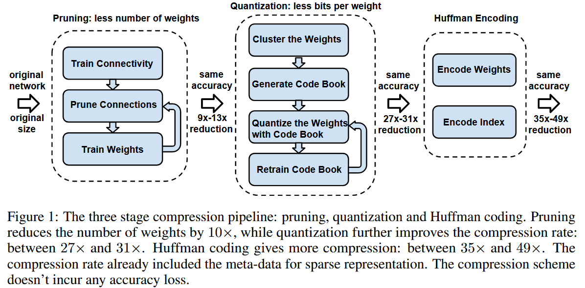
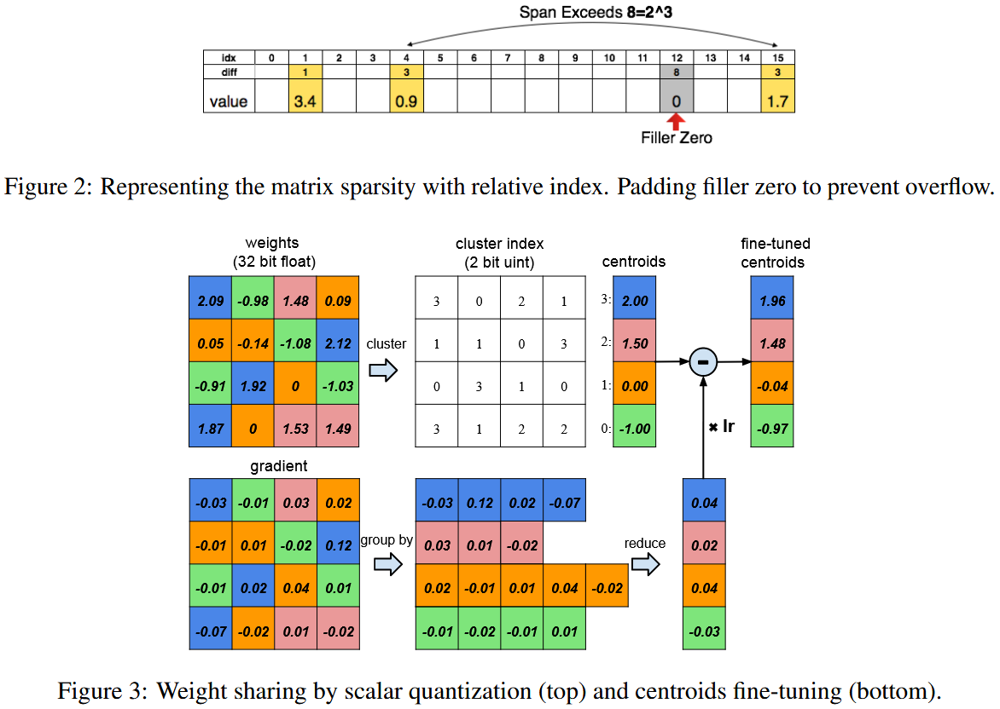

# Hardware Acceleration of Sparse and Irregular Tensor Computations of ML Models: A Survey and Insights

> This article surveys the efficient execution of sparse and irregular tensor computations of machine learning models on hardware accelerators.

- Motivation: For efficiently processing computationaland memory-intensive ML applications, tensors of these overparameterized models are compressed by leveraging **sparsity, size reduction, and quantization of tensors**. **Unstructured sparsity and tensors** with varying dimensions yield irregular computation, communication, and memory access patterns.
- Contribution: This article provides a comprehensive survey on the efficient execution of sparse and irregular tensor computations of ML models on hardware accelerators, discusses enhancement modules in the architecture design and the software support.
- Takeaway:
1. the key challenges in accelerating sparse, irregular shaped, and quantized tensors
2. enhancements in accelerator systems
3. tradeoffs in opting for a specific design choice for encoding, storing, extracting, communicating, computing, and load-balancing the nonzeros
4. how structured sparsity can improve storage efficiency and balance computations
5. how to compile and map models with sparse tensors on the accelerators
6. recent design trends and further opportunities

## Intro

Recent techniques for efficient learning and inference have proposed compressing tensors of ML models by inducing and leveraging:

1. sparsity (zero values in tensors)
2. size reduction (tensor decomposition, dimension reduction, and shape reduction)
3. quantization (precision lowering and leveraging value similarity)

In particular, coarse-grain spatial architectures are a common choice for hardware accelerator designs. While hardware accelerators for ML can process low-precision tensors, they inherently cannot benefit from sparsity. So, leveraging sparsity necessitates **additional mechanisms to store, extract, communicate, compute, and load-balance the NZs and the corresponding hardware or software support**.

Furthermore, it requires **new representations and enables new opportunities** for hardware/software/model codesigns. Tensor decomposition and dimension reduction yield tensors of various sizes and **asymmetric** shapes . Dataflow mechanisms for executing layers of the models are typically optimized well for some commonly used layers (symmetric dimensions).

So, we describe how configurable designs and flexible dataflows can help to achieve efficient execution. Sparse tensors quantized with value sharing require additional support to index a dictionary for obtaining shared values. The survey also discusses how accelerators leverage value similarity across inputs, weights, or outputs and support variable bit-widths of sparse tensors.

## B A C K G R O U N D : N E E D F O R EFFICIENT EXECUTION OF ML MODELS ON HARDWARE A C C E L E R AT O R S
### ML-models

CNNs/Sequence-to-sequence models/Models for semantic segmentation and language translation/GAN/GNN/Recommendation system models

### Hardware Accelerators for Machine Learning

spatial-architecture-based hardware accelerators yield very high throughput and low latency for processing ML models.

1. Performancecritical tensor computations of ML models are relatively simple operations, so they can be processed efficiently with structured computations on the **PE-array**. **Private and shared memories** of PEs enable high temporal reuse of the data. **Interconnects**, such as mesh or multicast, enable data communication among PEs and spatial reuse of the data, lowering the access to off-chip memory.

### Further Efficient Execution

With recent advances in the development of ML models, their computational and memory requirements have increased drastically.

## A C C E L E R A T I O N O P P O R T U N I T I E S DU E T O C OMPA CT MODE L S AND TH E NEED FOR SPECIAL SUPPORT
### A. Opportunities Due to Sparse Tensors

- Sparsity Structure

Inherent sparsity is usually unstructured, where NZ elements are randomly scattered. For improving execution efficiency, pruning techniques or model operators induce structured sparsity.

- Sources of Sparsity: RELU/dropout/pruing/input data/…

To sum up, compressed tensors lead to sparse and irregular computations. Their efficient accelerations require special support.

## A C C E L E R A T O R D E S I G N F O R E FFI C I EN T S PA R S E A N D IR R EG UL A R T E N S O R C O M P U TAT I O N S

# DEEP COMPRESSION: COMPRESSING DEEP NEURAL NETWORKS WITH PRUNING, TRAINED QUANTIZATION AND HUFFMAN CODING

- “deep compression”, a three stage pipeline: pruning, trained quantization and Huffman coding. First prune the network. Next quantize the weights. Finally apply Huffman coding.
- reduce storage by 35 x to 49 x

## STAGE 1 NETWORK PRUNING

## STAGE 2 TRAINED QUANTIZATION AND WEIGHT SHARING

Use K-means clustering to identify the shared weights for each layer of a trained network.

INITIALIZATION OF SHARED WEIGHTS: Forgy(random), density-based, and linear initialization
## STAGE 3 HUFFMAN CODING