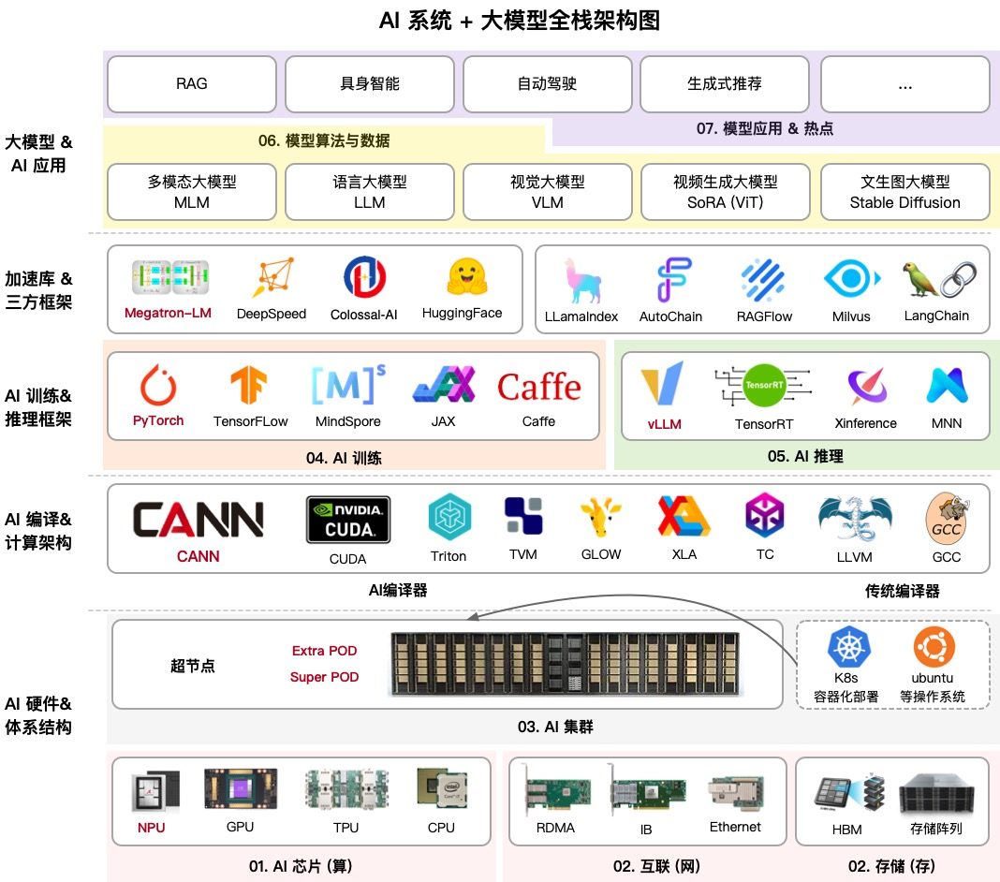
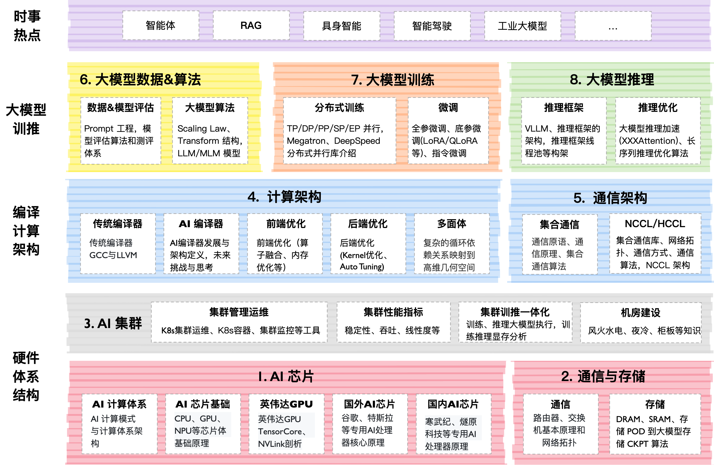

ZOMI 整理

# LLM Infra

这个开源项目英文名字叫做 **AIInfra**，中文名字叫做 **AI 基础设施**。大模型是基于 AI 集群的全栈软硬件性能优化，通过最小的每一块 AI 芯片组成的 AI 集群，编译器使能到上层的 AI 框架，训练过程需要分布式并行、集群通信等算法支持，而且在大模型领域最近持续演进如智能体等新技术。

本开源课程主要是跟大家一起探讨和学习人工智能、深度学习的系统设计，而整个系统是围绕着 ZOMI 在工作当中所积累、梳理、构建 AI 大模型系统的基础软硬件栈，因此成为 AI 基础设施。希望跟所有关注 AI 开源课程的好朋友一起探讨研究，共同促进学习讨论。

与 **AISystem**[[https://github.com/Infrasys-AI/AISystem](https://github.com/Infrasys-AI/AISystem)] 项目最大的区别就是 **AIInfra** 项目主要针对大模型，特别是大模型在分布式集群、分布式架构、分布式训练、大模型算法等相关领域进行深度展开。

## 课程内容大纲

课程主要包括以下模块，内容陆续更新中，欢迎贡献：

| 序列  | 教程内容                                                                                                                                               | 简介                                                                                                                              | 地址                                                                       |
| --- | -------------------------------------------------------------------------------------------------------------------------------------------------- | ------------------------------------------------------------------------------------------------------------------------------- | ------------------------------------------------------------------------ |
| 00  | [大模型系统概述](https://github.com/Infrasys-AI/AIInfra/blob/main/README.md#00-%E5%A4%A7%E6%A8%A1%E5%9E%8B%E7%B3%BB%E7%BB%9F%E6%A6%82%E8%BF%B0)           | 系统梳理了大模型关键技术点，涵盖 Scaling Law 的多场景应用、训练与推理全流程技术栈、AI 系统与大模型系统的差异，以及未来趋势如智能体、多模态、轻量化架构和算力升级。| [Slides](https://github.com/Infrasys-AI/AIInfra/blob/main/00Summary)     |
| 01  | [AI 计算集群](https://github.com/Infrasys-AI/AIInfra/blob/main/README.md#01-ai-%E8%AE%A1%E7%AE%97%E9%9B%86%E7%BE%A4)                                   | 大模型虽然已经慢慢在端测设备开始落地，但是总体对云端的依赖仍然很重很重，AI 集群会介绍集群运维管理、集群性能、训练推理一体化拓扑流程等内容。| [Slides](https://github.com/Infrasys-AI/AIInfra/blob/main/01AICluster)   |
| 02  | [通信与存储](https://github.com/Infrasys-AI/AIInfra/blob/main/README.md#02-%E9%80%9A%E4%BF%A1%E4%B8%8E%E5%AD%98%E5%82%A8)                               | 大模型训练和推理的过程中都严重依赖于网络通信，因此会重点介绍通信原理、网络拓扑、组网方案、高速互联通信的内容。存储则是会从节点内的存储到存储 POD 进行介绍。| [Slides](https://github.com/Infrasys-AI/AIInfra/blob/main/02StorComm)    |
| 03  | [集群容器与云原生](https://github.com/Infrasys-AI/AIInfra/blob/main/README.md#03-%E9%9B%86%E7%BE%A4%E5%AE%B9%E5%99%A8%E4%B8%8E%E4%BA%91%E5%8E%9F%E7%94%9F) | 讲解容器与 K8S 技术原理及 AI 模型部署实践，涵盖容器基础、Docker 与 K8S 核心概念、集群搭建、AI 应用部署、任务调度、资源管理、可观测性、高可靠设计等云原生与大模型结合的关键技术点。| [Slides](https://github.com/Infrasys-AI/AIInfra/blob/main/03DockCloud)   |
| 04  | [分布式训练](https://github.com/Infrasys-AI/AIInfra/blob/main/README.md#04-%E5%A4%A7%E6%A8%A1%E5%9E%8B%E8%AE%AD%E7%BB%83)                               | 大模型训练是通过大量数据和计算资源，利用 Transformer 架构优化模型参数，使其能够理解和生成自然语言、图像等内容，广泛应用于对话系统、文本生成、图像识别等领域。| [Slides](https://github.com/Infrasys-AI/AIInfra/blob/main/04Train)       |
| 05  | [分布式推理](https://github.com/Infrasys-AI/AIInfra/blob/main/README.md#05-%E5%A4%A7%E6%A8%A1%E5%9E%8B%E6%8E%A8%E7%90%86)                               | 大模型推理核心工作是优化模型推理，实现推理加速，其中模型推理最核心的部分是 Transformer Block。本节会重点探讨大模型推理的算法、调度策略和输出采样等相关算法。| [Slides](https://github.com/Infrasys-AI/AIInfra/blob/main/05Infer)       |
| 06  | [大模型算法与数据](https://github.com/Infrasys-AI/AIInfra/blob/main/README.md#06-%E5%A4%A7%E6%A8%A1%E5%9E%8B%E7%AE%97%E6%B3%95%E4%B8%8E%E6%95%B0%E6%8D%AE) | Transformer 起源于 NLP 领域，近期统治了 CV/NLP/多模态的大模型，我们将深入地探讨 Scaling Law 背后的原理。在大模型算法背后数据和算法的评估也是核心的内容之一，如何实现 Prompt 和通过 Prompt 提升模型效果。| [Slides](https://github.com/Infrasys-AI/AIInfra/blob/main/06AlgoData)    |
| 07  | [大模型应用](https://github.com/Infrasys-AI/AIInfra/blob/main/README.md#07-%E5%A4%A7%E6%A8%A1%E5%9E%8B%E5%BA%94%E7%94%A8)                               | 当前大模型技术已进入快速迭代期。这一时期的显著特点就是技术的更新换代速度极快，新算法、新模型层出不穷。因此本节内容将会紧跟大模型的时事内容，进行深度技术分析。| [Slides](https://github.com/Infrasys-AI/AIInfra/blob/main/07Application) |

