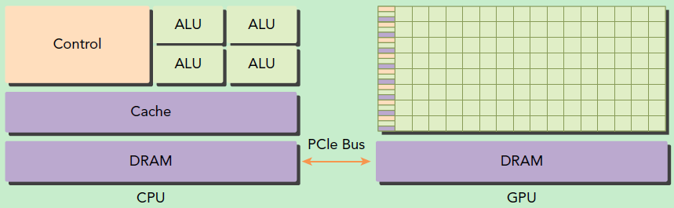
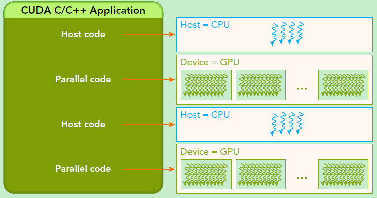

对应 [https://docs.nvidia.com/cuda/cuda-c-programming-guide/index.html](https://link.zhihu.com/?target=https%3A//docs.nvidia.com/cuda/cuda-c-programming-guide/index.html) 第 1-4 章

# 1. CUDA 简介

## 为什么要使用 GPU

GPU（Graphics Processing Unit）在相同的价格和功率范围内，比 CPU 提供更高的指令吞吐量和内存带宽。许多应用程序利用这些更高的能力，使得自己在 GPU 上比在 CPU 上运行得更快。其他计算设备，如 FPGA，也非常节能，但提供的编程灵活性要比 GPU 少得多。

GPU 和 CPU 之间的主要区别在于设计思想的不同。CPU 的设计初衷是为了实现在执行一系列操作（称之为一个 thread）时达到尽可能高的性能，同时可能只能实现其中数十个线程的并行化，GPU 的设计初衷是为了实现在在并行执行数千个线程时达到尽可能高的性能（通过分摊较慢的单线程程序以实现更高的吞吐量）。

为了能够实现更高强度的并行计算，GPU 将更多的晶体管用于数据计算而不是数据缓存或控制流。下图显示了 CPU 与 GPU 的芯片资源分布示例。


一般来说，应用程序有并行和串行部分，所以系统可以利用 GPU 和 CPU 的混搭来获得更高的整体性能。对于并行度高的程序也可以利用 GPU 的大规模并行特性来实现比 CPU 更高的性能。

## CUDA：通用并行计算平台和程序模型

CUDA（Compute Unified Device Architecture）是 NVIDIA 推出的通用并行计算平台和程序模型，它利用 NVIDIA GPU 中的并行计算引擎以比 CPU 更有效的方式加速计算密集型任务（如图形处理、深度学习、科学计算）。

CUDA 可以直接链接到 GPU 的虚拟指令集和并行计算单元，从而在 GPU 中完成内核函数的计算。CUDA 提供 C/C++/Fortran 接口，也有许多高性能计算或深度学习库提供包装后的 Python 接口。如下图所示，支持其他语言、应用程序编程接口或基于指令的方法，例如 FORTRAN、DirectCompute、OpenACC。


- **核心优势**：
    - 利用 GPU 数千个核心实现并行计算，速度比 CPU 快数十倍甚至百倍。
    - 支持 C/C++、Python（通过 PyCUDA、Numba）等编程语言，兼容主流深度学习框架（TensorFlow、PyTorch）。

## A Scalable Programming Model

多核 CPU 和超多核 (manycore) GPU 的出现，意味着主流处理器进入并行时代。当下开发应用程序的挑战在于能够利用不断增加的处理器核数实现对于程序并行性透明地扩展，例如 3D 图像应用可以透明地拓展其并行性来适应内核数量不同的 GPUs 硬件。

CUDA 并行程序模型主要为克服这一挑战而设计，其对于程序员具有较小的学习难度，因为其使用了标准编程语言如 C。其核心是三个关键抽象——**线程组的层次结构、共享内存和屏障同步**——它们只是作为最小的语言扩展集向程序员公开。

这些抽象提供了细粒度的**数据并行性和线程并行性**，并将嵌套在粗粒度的**数据并行和任务并行**中。它们指导程序员将主问题拆解为可以线程块独立并行解决的粗粒度子问题，同时每个子问题可以被进一步细分为更小的组成部分，其可以被每个线程块中的线程通过并行合作的方式解决。

这种分解通过允许线程在求解每个子问题时进行协作，保留了语言的表达能力，同时实现了自动可扩展性。实际上，每个线程块可被调度到 GPU 内任何可用的多处理器上，调度顺序、方式（并发或串行）均不受限制。因此，如图 3 所示，已编译的 CUDA 程序能够在任意数量的多处理器上执行，且仅需运行时系统知晓物理多处理器的数量。

这种可扩展的编程模型使得 GPU 架构能够通过简单调整多处理器和内存分区的数量来覆盖广泛的市场范围。


> [!note] SM
> 注意：GPU 是围绕一系列流式多处理器 (SM: Streaming Multiprocessors) 构建的（有关详细信息，请参 [阅硬件实现](https://docs.nvidia.com/cuda/cuda-c-programming-guide/index.html#hardware-implementation)）。多线程程序被划分为彼此独立执行的线程块，因此具有更多多处理器的 GPU 将比具有更少多处理器的 GPU 在更短的时间内完成程序执行。

## GPU 架构

GPU 并不是一个独立运行的计算平台，而需要与 CPU 协同工作，可以看成是 CPU 的协处理器，因此当我们在说 GPU 并行计算时，其实是指的基于 CPU+GPU 的异构计算架构。在异构计算架构中，GPU 与 CPU 通过 [PCIe总线](https://zhida.zhihu.com/search?content_id=6024941&content_type=Article&match_order=1&q=PCIe%E6%80%BB%E7%BA%BF&zhida_source=entity) 连接在一起来协同工作，CPU 所在位置称为为主机端（host），而 GPU 所在位置称为设备端（device），如下图所示。CPU 起控制作用，一般称为主机 host，GPU 看作 CPU 协处理器，一般称为设备 device，主机和设备之间内存访问一般通过 PCIe 总线链接。



基于 CPU+GPU 的异构计算. 来源：Preofessional CUDA® C Programming

可以看到 GPU 包括更多的运算核心，其特别适合数据并行的计算密集型任务，如大型矩阵运算，而 CPU 的运算核心较少，但是其可以实现复杂的逻辑运算，因此其适合控制密集型任务。另外，CPU 上的线程是重量级的，上下文切换开销大，但是 GPU 由于存在很多核心，其线程是轻量级的。因此，基于 CPU+GPU 的异构计算平台可以优势互补，CPU 负责处理逻辑复杂的串行程序，而 GPU 重点处理数据密集型的并行计算程序，从而发挥最大功效。



基于 CPU+GPU 的异构计算应用执行逻辑. 来源：Preofessional CUDA® C Programming

CUDA 是 NVIDIA 公司所开发的 GPU 编程模型，它提供了 GPU 编程的简易接口，基于 CUDA 编程可以构建基于 GPU 计算的应用程序。CUDA 提供了对其它编程语言的支持，如 C/C++，Python，Fortran 等语言

# Summary
### **1. CUDA Overview**

CUDA, developed by NVIDIA, is a parallel computing platform and programming model that harnesses GPU power to accelerate compute-intensive applications written in C, C++, or Fortran. Widely used in deep learning, scientific computing, and HPC, it bridges the gap between CPU sequential processing and GPU parallel throughput.

### **2. Key Components & Benefits**

- **GPU Architecture**: Optimized for parallelism, GPUs allocate more transistors to data processing than CPUs, enabling thousands of concurrent threads.
- **CUDA Programming Model**: Uses abstractions like thread blocks, shared memory, and synchronization to partition problems into parallel sub-tasks. This design ensures scalability across GPUs with varying core counts.
- **Software Ecosystem**: Supports multiple languages (e.g., FORTRAN, OpenACC) and scales from high-end to mainstream GPUs, making it accessible for diverse applications.

### **3. Scalability & Market Impact**

CUDA’s programming model enables automatic scalability: compiled programs run efficiently on any GPU by dynamically scheduling thread blocks across available multiprocessors. This flexibility allows NVIDIA to target a broad market, from enthusiast-grade GeForce GPUs to professional Quadro/Tesla products, by simply adjusting hardware components like multiprocessor counts.

# 安装

## Driver Toolkit

https://developer.nvidia.com/cuda-downloads?target_os=Linux&target_arch=x86_64&Distribution=WSL-Ubuntu&target_version=2.0&target_type=runfile_local

可以在路径

```text
/usr/local/cuda-10.1/extras/demo_suite
```

路径下找到一些样例程序。deviceQuery 将输出 CUDA 的相关信息。CUDA 的各种特性：纹理内存 (texture memory)、常量内存 (constant memory)、共享内存 (shared memory)、块 (block)、线程 (thread)、统一寻址 (unified addressing) 都包含在以上信息中。了解这些特性是进行 CUDA C/C++ 编程的基础。

# GPU 性能指标

1. 核心数
2. GPU 显存容量
3. GPU 计算峰值
4. 显存带宽

A 100 架构解析：https://zhuanlan.zhihu.com/p/1908285912053453831

### **GPU 代际新特性**

#### **NVIDIA 主流架构演进**

| 架构     | 代号    | 关键新特性                          | 发布时间 |
| ------ | ----- | ------------------------------ | ---- |
| Kepler | GK110 | 动态并行、Maxwell 双精度提升             | 2012 |
| Pascal | GP100 | Tensor Core（FP16）、HBM2 内存      | 2016 |
| Volta  | GV100 | Tensor Core（FP16/INT8）、混合精度    | 2017 |
| Turing | TU102 | RT Core（光线追踪）、DLSS             | 2018 |
| Ampere | GA100 | Tensor Core（BF16/FP64）、多实例 GPU | 2020 |
| Ada    | AD102 | FP8 Tensor Core、第四代张量核心        | 2022 |
| Hopper | H100  | FP8/TF32 Tensor Core、内存压缩      | 2023 |
