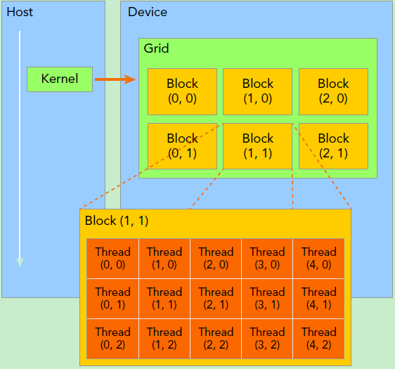
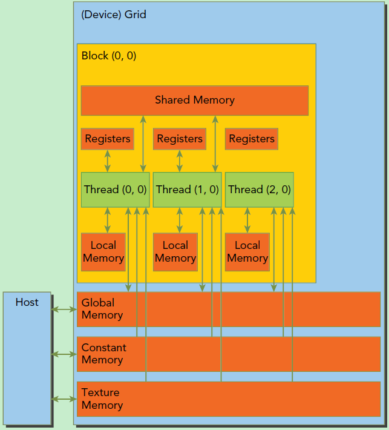

# CUDA 编程核心

CUDA 编程核心围绕**内存管理**、**线程同步**和**流并行**三大机制展开，它们是构建高效 GPU 程序的基础。以下从原理到实践详细解析：


- **线程组织策略**：
    - 合理设计 Block 和 Grid 维度，例如处理二维矩阵时使用二维线程块 `dim3 block(16, 16)`。
- **内存优化**：
    - 使用 Shared Memory 减少 Global Memory 访问（如矩阵乘法中的分块算法）。
    - 合并 Global Memory 访问，利用 GPU 的内存事务机制提高带宽利用率。
- **同步与原子操作**：
    - 使用 `__syncthreads()` 实现 Block 内线程同步。
    - 原子操作（如 `atomicAdd()`）用于处理线程间竞争。

### **一、内存管理（Memory Management）**

CUDA 内存管理的核心是**协调主机（CPU）与设备（GPU）间的数据流动**，并优化不同层级内存的使用。

#### **1. 内存分配与释放**

- **设备内存分配**

```cuda
float* d_data;  // 设备端指针
cudaMalloc((void**)&d_data, size * sizeof(float));  // 分配设备内存
cudaFree(d_data);  // 释放设备内存
```

- 需显式管理内存，类似 C 语言的 `malloc/free`。
- **统一内存（Unified Memory）**

```cuda
float* u_data;
cudaMallocManaged((void**)&u_data, size * sizeof(float));  // 分配统一内存
```

- 系统自动管理主机与设备间的数据迁移，简化编程（但可能牺牲性能，需谨慎使用）。

#### **2. 数据传输**

- **同步传输**

```cuda
cudaMemcpy(d_data, h_data, size * sizeof(float), cudaMemcpyHostToDevice);  // 主机→设备
cudaMemcpy(h_result, d_result, size * sizeof(float), cudaMemcpyDeviceToHost);  // 设备→主机
```

- 阻塞主机线程，直到传输完成。
- **异步传输**

```cuda
cudaMemcpyAsync(d_data, h_data, size * sizeof(float), cudaMemcpyHostToDevice, stream);  // 异步传输
 ```

主机线程并行执行，需配合 CUDA 流（Stream）使用。

#### **3. 内存类型优化**

- **共享内存（Shared Memory）**

```cuda
__global__ void kernel(float* d_input, float* d_output) {
__shared__ float s_data[256];  // 声明共享内存
s_data[threadIdx.x] = d_input[blockIdx.x * blockDim.x + threadIdx.x];
__syncthreads();  // 同步，确保所有线程已写入共享内存
// 使用共享内存数据进行计算…
}
```

速度接近寄存器（约 10 周期延迟），用于线程间数据共享。

需注意**Bank 冲突**：若多个线程访问同一内存 Bank，会导致串行化（例如，同时访问 `s_data[0]` 和 `s_data[32]`）。

- **常量内存（Constant Memory）**

```cuda
__constant__ float c_params[1024];  // 声明常量内存
cudaMemcpyToSymbol(c_params, h_params, sizeof(float) * 1024);  // 初始化常量内存
```

 适合存储频繁使用的只读数据（如神经网络权重），通过硬件缓存加速。

### **二、线程同步（Thread Synchronization）**

CUDA 通过多种机制实现线程间协作，避免数据竞争和不一致。

#### **1. 块内同步（Block-Level Synchronization）**

- **`__syncthreads()`**

    ```cuda
    __global__ void reduce_kernel(float* d_input, float* d_output) {
        __shared__ float s_data[256];
        s_data[threadIdx.x] = d_input[blockIdx.x * blockDim.x + threadIdx.x];
        
        __syncthreads();  // 确保所有线程已完成数据加载
        
        // 并行归约（Reduction）
        for (int s = 1; s < blockDim.x; s *= 2) {
            if (threadIdx.x % (2 * s) == 0) {
                s_data[threadIdx.x] += s_data[threadIdx.x + s];
            }
            __syncthreads();  // 每轮迭代后同步
        }
        
        if (threadIdx.x == 0) {
            d_output[blockIdx.x] = s_data[0];
        }
    }
    ```

    - 强制块内所有线程等待，直到全部到达同步点。
    - 仅在块内有效，不同块间无法直接同步。

#### **2. 原子操作（Atomic Operations）**

- **原子加法**

    ```cuda
    atomicAdd(&d_counter, 1);  // 原子递增操作，等价于d_counter++
    ```

    - 确保多线程对同一内存地址的操作互斥执行，避免数据竞争。
    - 支持 `atomicAdd`、`atomicMax`、`atomicCAS`（比较并交换）等。

#### **3. 全局同步（Host-Device Synchronization）**

- **主机与设备同步**

    ```cuda
    cudaDeviceSynchronize();  // 阻塞主机，直到所有设备任务完成
    ```

    - 慎用，可能导致性能瓶颈（如频繁同步会破坏计算与传输的重叠）。

### **三、CUDA 流（CUDA Streams）**

流是 CUDA 异步执行的核心机制，允许任务在 GPU 上并行执行。

#### **1. 流的基本概念**

- **流（Stream）**：GPU 上的独立任务队列，支持任务按顺序执行，但不同流间的任务可并行。
- **异步特性**：主机提交任务后无需等待，可继续执行后续代码。

#### **2. 创建与使用流**

```cuda
cudaStream_t stream1, stream2;
cudaStreamCreate(&stream1);  // 创建流
cudaStreamCreate(&stream2);

// 流1：传输数据 → 执行内核 → 传输结果
cudaMemcpyAsync(d_data1, h_data1, size, cudaMemcpyHostToDevice, stream1);
kernel<<<grid, block, 0, stream1>>>(d_data1, d_result1);
cudaMemcpyAsync(h_result1, d_result1, size, cudaMemcpyDeviceToHost, stream1);

// 流2：与流1并行执行
cudaMemcpyAsync(d_data2, h_data2, size, cudaMemcpyHostToDevice, stream2);
kernel<<<grid, block, 0, stream2>>>(d_data2, d_result2);
cudaMemcpyAsync(h_result2, d_result2, size, cudaMemcpyDeviceToHost, stream2);

cudaStreamSynchronize(stream1);  // 等待流1完成
cudaStreamSynchronize(stream2);  // 等待流2完成

cudaStreamDestroy(stream1);  // 销毁流
cudaStreamDestroy(stream2);
```

#### **3. 流的核心优势**

- **计算与传输重叠**
    通过 `cudaMemcpyAsync` 和流，可实现：

    1. 主机向 GPU 传输数据 A（流 1）
    2. 同时 GPU 执行内核处理数据 B（流 2）
    3. 同时主机接收 GPU 处理完的数据 C（流 3）
- **事件（Event）同步**

    ```cuda
    cudaEvent_t start, stop;
    cudaEventCreate(&start);
    cudaEventCreate(&stop);
    
    cudaEventRecord(start, stream);  // 记录事件
    kernel<<<grid, block, 0, stream>>>(d_data, d_result);
    cudaEventRecord(stop, stream);
    
    cudaEventSynchronize(stop);  // 等待事件完成
    float milliseconds = 0;
    cudaEventElapsedTime(&milliseconds, start, stop);  // 计算耗时
    ```

### **四、实战优化建议**

1. **内存优化**
    - 优先使用 `float4` 等向量类型提高内存带宽利用率（如 `__global__ void kernel(float4* d_input)`）。
    - 对大矩阵操作采用**共享内存 tiling**（如矩阵乘法分块）。
2. **线程优化**
    - 块大小设为 32 的倍数（匹配 Warp 大小），避免 Warp 分裂。
    - 减少分支发散，确保同一 Warp 内线程执行相同代码路径。
3. **流优化**
    - 使用 `cudaMemGetInfo()` 监控设备内存使用，避免过度分配。
    - 通过 `cudaDeviceGetAttribute()` 查询设备属性（如最大线程块大小）。

### **五、常见错误与调试**

1. **内存错误**
    - 未初始化指针、内存越界访问 → 使用 `cuda-memcheck` 检测。
    - 同步错误（如忘记 `__syncthreads()`）→ 导致数据不一致。
2. **性能瓶颈**
    - 内存带宽不足 → 使用 Nsight Compute 分析内存事务效率。
    - 计算利用率低 → 检查 Warp 调度和分支发散情况。

### **六、参考资源**

- [CUDA C++ Programming Guide](https://docs.nvidia.com/cuda/cuda-c-programming-guide/)
- [CUDA Best Practices Guide](https://docs.nvidia.com/cuda/cuda-c-best-practices-guide/)
- NVIDIA Developer YouTube 频道：[CUDA Programming](https://www.youtube.com/watch?v=Qr5i7S66v4A)

通过掌握内存管理、线程同步和流并行，你能构建高效的 CUDA 程序，充分发挥 GPU 的并行计算能力。建议结合具体案例（如矩阵乘法、前缀和计算）实践这些概念。

# 2.编程模型

本章通过概述 CUDA 编程模型是如何在 c 中展现的，来介绍 CUDA 的主要概念。[编程接口](https://docs.nvidia.com/cuda/cuda-c-programming-guide/index.html#programming-interface) 中给出了对 CUDA C++ 的广泛描述。本章和下一章中使用的向量加法示例的完整代码可以在 vectorAdd [CUDA示例](https://docs.nvidia.com/cuda/cuda-samples/index.html#vector-addition) 中找到。

## 特点

CUDA 编程模型有两个特色功能，一是通过一种**层次结构来组织线程**，二是通过**层次结构来组织内存**的访问。这两点和我们平时 CPU 编程是有较大区别的。

第一点是线程层次，一般 CPU 一个核只支持一到两个硬件线程，而 GPU 往往在硬件层面上就支持同时成百上千个并发线程。不过这也要求我们在 GPU 编程中更加高效地管理这些线程，以达到更高的运行效率。在 CUDA 编程中，线程是通过**线程网格（Grid）、线程块（Block）、线程束（Warp）、线程（Thread）**。

第二点是内存模型。与 CPU 编程不同，GPU 中的各级缓存以及各种内存是可以软件控制的，在编程时我们可以手动指定变量存储的位置。**具体而言，这些内存包括寄存器、共享内存、常量内存、全局内存等**。这就造成了 CUDA 编程中有很多内存使用的小技巧，比如我们要尽量使用寄存器，尽量将数据声明为局部变量。而当存在着数据的重复利用时，可以把数据存放在共享内存里。而对于全局内存，我们需要注意用一种合理的方式来进行数据的合并访问，以尽量减少设备对内存子系统再次发出访问操作的次数。

- **CUDA 编程模型**：
    - **Host**（CPU）：负责控制流、内存管理
    - **Device**（GPU）：负责并行计算
    - **Kernel**：GPU 上执行的并行函数（用 `__global__` 修饰）
- **线程层次**：
    - **Thread**：最小执行单元，通过 `threadIdx` 索引。
    - **Block**：线程组（共享内存，同步屏障），通过 `blockIdx` 索引，共享本地内存（Shared Memory）。
    - **Grid**：多个 Block 组成，通过 `gridDim` 指定维度。
- **内存模型**：
    - 全局内存（Global Memory）：GPU 显存，所有线程可访问（读写慢）
    - 共享内存（Shared Memory）：Block 内线程共享（读写快）
    - 寄存器（Register）：线程私有（访问最快）。

## 异构编程模型

CUDA 编程模型是一个异构模型，需要 CPU 和 GPU 协同工作。在 CUDA 中，**host**和**device**是两个重要的概念，我们用 host 指代 CPU 及其内存，而用 device 指代 GPU 及其内存。CUDA 程序中既包含 host 程序，又包含 device 程序，它们分别在 CPU 和 GPU 上运行。同时，host 与 device 之间可以进行通信，这样它们之间可以进行数据拷贝。典型的 CUDA 程序的执行流程如下：

1. 分配 host 内存，并进行数据初始化；
2. 分配 device 内存，并从 host 将数据拷贝到 device 上；
3. 调用 CUDA 的核函数在 device 上完成指定的运算；
4. 将 device 上的运算结果拷贝到 host 上；
5. 释放 device 和 host 上分配的内存。

如下图所示，CUDA 编程模型假定 CUDA 线程在物理独立的设备 `(device)` 上执行，该设备作为运行 C++ 程序的主机 `(host)` 的协处理器运行。例如，当内核在 GPU 上执行而 C++ 程序的其余部分在 CPU 上执行时，就是这种情况。


CUDA 编程模型还假设主机 (`host`) 和设备 (`device`) 都在 DRAM 中维护自己独立的内存空间，分别称为主机内存 `(host memory)` 和设备内存 `(device memory)`。因此，需要程序通过调用 CUDA 运行时（在 [编程接口](https://docs.nvidia.com/cuda/cuda-c-programming-guide/index.html#programming-interface) 中描述）来管理内核可见的全局、常量和纹理内存空间。这包括设备内存分配和释放以及主机和设备内存之间的数据传输。

统一内存提供托管内存 `(managed memory)` 来桥接主机和设备内存空间。托管内存可以被系统中的所有 CPU 和 GPU 访问，作为具有公共地址空间，构建一个单一的、连贯的内存映像。此功能可实现对设备内存的超额订阅 `(oversubscription)`，并且无需在主机和设备上显式镜像数据，从而大大简化了移植应用程序的任务。有关统一内存的介绍，请参阅统一 [内存编程](https://docs.nvidia.com/cuda/cuda-c-programming-guide/index.html#um-unified-memory-programming-hd)。

> 注: 串行代码在主机 (`host`) 上执行，并行代码在设备 (`device`) 上执行

## 内核

CUDA C++ 通过允许程序员定义称为 kernel 的 C++ 函数来扩展 C++，当调用内核时，由 N 个不同的 CUDA 线程并行执行 N 次，而不是像常规 C++ 函数那样只执行一次。kernel 是 CUDA 中一个重要的概念，kernel 是在 device 上线程中并行执行的函数。

使用 `__global__` 声明说明符定义内核，并使用新的 `<<<grid, block>>>` 执行配置（execution configuration）语法指定内核调用时的 CUDA 线程数（请参阅 [C++ 语言扩展](https://docs.nvidia.com/cuda/cuda-c-programming-guide/index.html#c-language-extensions)）。每个执行内核的线程都有一个唯一的线程 ID 即 thread ID，可以通过内置变量 `threadIdx` 在内核中访问。

作为说明，以下示例代码使用内置变量 `threadIdx` 将两个大小为 N 的向量 A 和 B 相加，并将结果存储到向量 C 中：

```C++
// Kernel definition
__global__ void VecAdd(float* A, float* B, float* C)
{
    int i = threadIdx.x;
    C[i] = A[i] + B[i];
}

int main()
{
    ...
    // Kernel invocation with N threads
    VecAdd<<<1, N>>>(A, B, C);
    ...
}
```

这里，执行 VecAdd() 的 N 个线程中的每一个线程都会执行一个加法。

由于 GPU 实际上是异构模型，所以需要区分 host 和 device 上的代码，在 CUDA 中是通过函数类型限定词开区别 host 和 device 上的函数，主要的三个函数类型限定词如下：

在 C 语言函数前没有的限定符**global** ,CUDA C 中还有一些其他我们在 C 中没有的限定符，如下：

| 限定符        | 执行        | 调用                                                                             | 备注                                  |
| ---------- | --------- | ------------------------------------------------------------------------------ | ----------------------------------- |
| **global** | device 执行 | 可以从 host 调用也可以从计算能力 3 以上的设备调用                                                  | 返回类型必须是 `void`，不支持可变参数参数，不能成为类成员函数。|
| **device** | device 执行 | 单仅可以从 device 中调用，不可以和 `__global__` 同时用。|                                     |
| **host**   | host 执行   | 仅可以从 host 上调用，不可以和 `__global__` 同时用，但可和 `__device__`，此时函数会在 device 和 host 都编译。| 一般省略不写                              |
|            |           |                                                                                |                                     |

注意用 `__global__` 定义的 kernel 是异步的，这意味着 host 不会等待 kernel 执行完就执行下一步。

而且这里有个特殊的情况就是有些函数可以同时定义为 **device** 和 **host** ，这种函数可以同时被设备和主机端的代码调用，主机端代码调用函数很正常，设备端调用函数与 C 语言一致，但是要声明成设备端代码，告诉 nvcc 编译成设备机器码，同时声明主机端设备端函数，那么就要告诉编译器，生成两份不同设备的机器码。

Kernel 核函数编写有以下限制

1. 只能访问设备内存
2. 必须有 void 返回类型
3. 不支持可变数量的参数
4. 不支持静态变量
5. 显示异步行为

并行程序中经常的一种现象：把串行代码并行化时对串行代码块 for 的操作，也就是把 for 并行化。

## 线程层次

每个块的线程数量是有限制的，因为一个块中的所有线程都应当驻留在同一个处理器核心上，并且共享了该核心有限的内存资源。在当前的 GPU 中，一个线程块可能包含多达 1024 个线程。

但是，一个内核可以由多个形状相同的线程块执行，因此线程的总数等于每个块的线程数乘以块数。

块被组织成一维、二维或三维的线程块网格 (`grid`)，如下图所示。网格中的线程块数量通常由正在处理的数据的大小决定，通常会超过系统中的处理器数量。


```<<<…>>> ``` 语法中所指定的每个块的线程数和每个网格的块数的类型为 ```int``` 或 `dim3` 类型。如上例所示，可以指定二维块或网格。

网格中的每个块都可以由一个具有一维、二维或三维的唯一索引进行识别，该索引可以通过内置的 `blockIdx` 变量在内核中访问。线程块的维度可以通过内置的 `blockDim` 变量在内核中访问。

GPU 上有很多并行化的轻量级线程。kernel 在 device 上执行时实际上是启动很多线程，**由一个内核启动所产生的所有线程统称一个网格（Grid），同一网格中的所有线程共享相同的全局内存空间**。grid 是线程结构的第一层次，而网格又可以分为很多**线程块 block**，一个线程块里面包含很多**线程 Thread**，这是第二个层次。**线程网格和线程块从逻辑上代表了一个核函数的线程层次结构，这种组织方式可以帮助我们有效地利用资源，优化性能**。

线程两层组织结构如下图所示，这是一个 gird 和 block 均为 2-dim 的线程组织。grid 和 block 都是定义为 `dim3` 类型的变量，`dim3` 可以看成是包含三个无符号整数（x，y，z）成员的结构体变量，在定义时，缺省值初始化为 1。因此 grid 和 block 可以灵活地定义为 1-dim，2-dim 以及 3-dim 结构，对于图中结构（主要水平方向为 x 轴），定义的 grid 和 block 如下所示。

```c
dim3 grid(3, 2);
dim3 block(5, 3);
kernel_fun<<< grid, block >>>(prams…);
```



Kernel 上的两层线程组织结构（2-dim）

- **`grid_dim`**：网格维度，指定整个网格的大小（车间数量）
- **`block_dim`**：线程块维度，指定每个块的大小（每个车间的工人数）

这两个参数可以是：

1. **一维结构**：`<<<100, 256>>>` → 100 个块，每块 256 个线程
2. **二维结构**：`<<<dim3(10, 5), dim3(16, 16)>>>` → 网格 10×5=50 个块，每块 16×16=256 个线程
3. **三维结构**：常用于图像处理（如 3 D 体积数据）

## 线程索引

- blockIdx（线程块在线程网格内的位置索引）
- threadIdx（线程在线程块内的位置索引）

一个线程需要两个内置的坐标变量（blockIdx，threadIdx）来唯一标识，它们都是 `dim3` 类型变量，其中 blockIdx 指明线程所在 grid 中的位置，而 threaIdx 指明线程所在 block 中的位置，如图中的 Thread (1,1) 满足：

```text
threadIdx.x = 1
threadIdx.y = 1
blockIdx.x = 1
blockIdx.y = 1
```

为方便起见，`thread Idx` 是一个 3 分量 ` (3-component) ` 向量，因此可以使用一个一维、二维或三维的线程索引 ` (thread index) ` 来识别线程，形成一个具有一个维度、两个维度或三个维度的、由线程组成的块，我们称之为线程块 ` (thread block) `。这提供了一种自然的方法来对某一范围（例如向量、矩阵或空间）内的元素进行访问并调用计算。

一个线程块上的线程是放在同一个流式多处理器（SM) 上的，但是单个 SM 的资源有限，这导致线程块中的线程数是有限制的，现代 GPUs 的线程块可支持的线程数可达 1024 个。有时候，我们要知道一个线程在 block 中的全局 ID，此时就必须还要知道 block 的组织结构，这是通过线程的内置变量 blockDim 来获得。它获取线程块各个维度的大小。

线程的索引和它的线程 ID 以一种直接的方式相互关联

1. 对于 1-dim 块，它们是相同的。
2. 对于一个 2-dim 的 block $(D_x, D_y)$，线程 $(x,y)$ 的 ID 值为 $(x+y* D_x)$。
3. 如果是 3-dim 的 block $(D_x, D_y, D_z)$，线程 $(x,y,z)$ 的 ID 值为 $(x+y* D_x+z*D_x*D_y)$。另外线程还有内置变量 gridDim，用于获得网格块各个维度的大小。

每个线程在网格中有唯一的全局 ID，通过以下内置变量计算：

#### 一维结构

```cpp
__global__ void kernel_1d(int* data, int n) {
    int idx = threadIdx.x + blockIdx.x * blockDim.x;
    if (idx < n) {
        data[idx] *= 2;  // 处理第idx个数据
    }
}

// 调用示例
kernel_1d<<<100, 256>>>(data, 10000);
// 总线程数 = 100 × 256 = 25,600
```

#### 二维结构

常用于矩阵计算：

```cpp
__global__ void kernel_2d(float* matrix, int rows, int cols) {
    int row = blockIdx.y * blockDim.y + threadIdx.y;
    int col = blockIdx.x * blockDim.x + threadIdx.x;
    if (row < rows && col < cols) {
        int idx = row * cols + col;
        matrix[idx] = row + col;  // 赋值为行列索引之和
    }
}

// 调用示例
dim3 grid(10, 5);      // 10×5=50个块
dim3 block(16, 16);    // 每块16×16=256个线程
kernel_2d<<<grid, block>>>(matrix, 100, 100);
// 总线程数 = 50 × 256 = 12,800
```

# 内存管理

内存管理在传统串行程序是非常常见的，寄存器空间，栈空间内的内存由机器自己管理，堆空间由用户控制分配和释放，CUDA 程序同样，只是 CUDA 提供的 API 可以分配管理设备上的内存，当然也可以用 CDUA 管理主机上的内存，主机上的传统标准库也能完成主机内存管理。

下面表格有一些主机 API 和 CUDA C 的 API 的对比：

| 标准 C 函数  | CUDA C 函数  | 说明   |
| ------ | ---------- | ---- |
| malloc | cudaMalloc | 内存分配 |
| memcpy | cudaMemcpy | 内存复制 |
| memset | cudaMemset | 内存设置 |
| free   | cudaFree   | 释放内存 |

首先是在 device 上分配内存的 cudaMalloc 函数：

```c
cudaError_t cudaMalloc(void** devPtr, size_t size);
```

这个函数和 C 语言中的 malloc 类似，但是在 device 上申请一定字节大小的显存，其中 devPtr 是指向所分配内存的指针。同时要释放分配的内存使用 cudaFree 函数，这和 C 语言中的 free 函数对应。另外一个重要的函数是负责 host 和 device 之间数据通信的 cudaMemcpy 函数：

```c
cudaError_t cudaMemcpy(void* dst, const void* src, size_t count, cudaMemcpyKind kind)
```

其中 src 指向数据源，而 dst 是目标区域，count 是复制的字节数，其中 kind 控制复制的方向：`cudaMemcpyHostToHost, cudaMemcpyHostToDevice, cudaMemcpyDeviceToHost及cudaMemcpyDeviceToDevice`，如 `cudaMemcpyHostToDevice` 将 host 上数据拷贝到 device 上。

## 实例
### 向量加法

知道了 CUDA 编程基础，我们就来个简单的实战，利用 CUDA 编程实现两个向量的加法，在实现之前，先简单介绍一下 CUDA 编程中内存管理 API。

现在我们来实现一个向量加法的实例，这里 grid 和 block 都设计为 1-dim，首先定义 kernel 如下：

```c
// 两个向量加法kernel，grid和block均为一维
__global__ void add(float* x, float * y, float* z, int n)
{
    // 获取全局索引
    int index = threadIdx.x + blockIdx.x * blockDim.x;
    // 步长
    int stride = blockDim.x * gridDim.x;
    for (int i = index; i < n; i += stride)
    {
        z[i] = x[i] + y[i];
    }
}
```

其中 stride 是整个 grid 的线程数，有时候向量的元素数很多，这时候可以将在每个线程实现多个元素（元素总数/线程总数）的加法，相当于使用了多个 grid 来处理，这是一种 [grid-stride loop](https://link.zhihu.com/?target=https%3A//devblogs.nvidia.com/cuda-pro-tip-write-flexible-kernels-grid-stride-loops/) 方式，不过下面的例子一个线程只处理一个元素，所以 kernel 里面的循环是不执行的。下面我们具体实现向量加法：

### 矩阵乘法实例

### 矩阵实例

例如，下面的代码将两个大小为 NxN 的矩阵 A 和 B 相加，并将结果存储到矩阵 C 中:

```C++
// Kernel definition
__global__ void MatAdd(float A[N][N], float B[N][N],
                       float C[N][N])
{
    int i = threadIdx.x;
    int j = threadIdx.y;
    C[i][j] = A[i][j] + B[i][j];
}

int main()
{
    …
    // Kernel invocation with one block of N * N * 1 threads
    int numBlocks = 1;
    dim3 threadsPerBlock(N, N);
    MatAdd<<<numBlocks, threadsPerBlock>>>(A, B, C);
    …
}
```

扩展前面的 `MatAdd()` 示例对多个块进行处理，代码如下所示。

```C++
// Kernel definition
__global__ void MatAdd(float A[N][N], float B[N][N],
float C[N][N])
{
    int i = blockIdx.x * blockDim.x + threadIdx.x;
    int j = blockIdx.y * blockDim.y + threadIdx.y;
    if (i < N && j < N)
        C[i][j] = A[i][j] + B[i][j];
}

int main()
{
    ...
    // Kernel invocation
    dim3 threadsPerBlock(16, 16);
    dim3 numBlocks(N / threadsPerBlock.x, N / threadsPerBlock.y);
    MatAdd<<<numBlocks, threadsPerBlock>>>(A, B, C);
    ...
}
```

线程块大小为 16x16(256 个线程)，尽管在本例中是任意更改的，但这是一种常见的选择。与前文一样，网格中可以创建足够多的块，这样使得矩阵中的每个元素都由一个线程进行处理。为简单起见，本例假设在每个维度中，一个网格所具有的线程数可以被该维度中一个块所具有的线程数所整除，尽管事实并非如此。

线程块需要具备独立执行的能力：必须可以以任何顺序执行它们，同时无论并行或串行均可以。这种独立性的要求让线程块可以在任意数量的内核之间，以任意顺序来调度，如下图所示，这使程序员能够编写支持处理器核心数量扩展的代码。


一个块内的线程可以进行协作，协作通过使用一些共享内存 `(shared memory)` 来共享数据或通过同步彼此执行来协调内存访问实现。更准确地说，可以通过调用 `__syncthreads()` 内部函数来指定内核中的同步点；`__syncthreads()` 充当屏障，块中的所有线程必须等待同步，然后才能继续运行。[Shared Memory](https://docs.nvidia.com/cuda/cuda-c-programming-guide/index.html#shared-memory) 给出了一个使用共享内存的例子。除了 ` __syncthreads()` 之外，[Cooperative Groups API](https://docs.nvidia.com/cuda/cuda-c-programming-guide/index.html#cooperative-groups) 还提供了一组丰富的线程同步示例。

为了高效协作，共享内存是每个处理器核心附近的低延迟内存（很像 L1 缓存），并且 `__syncthreads()` 是轻量级的。

## 存储体系结构

### **CUDA 存储体系结构**

|存储类型|容量|延迟|带宽|访问权限|适用场景|
|---|---|---|---|---|---|
|**寄存器**|每个线程 KB 级|~1 周期|无限|线程私有|高频临时变量|
|**共享内存**|每个 SM 96KB|~10 周期|~1TB/s|块内共享|数据重用（如矩阵乘 tiling）|
|**常量内存**|64KB|~20 周期|~800GB/s|全局只读|频繁访问的常量数据|
|**全局内存**|GB 级|~400 周期|~1TB/s|全局读写|大数据存储|
|**纹理内存**|GB 级|~320 周期|~800GB/s|只读，优化 2D 访问|图像 / 视频处理|

#### **合理使用原则**

1. **寄存器**：优先存放循环变量、计算中间值
→ 避免寄存器溢出（通过 `nvcc --ptxas-options=-v` 查看）
2. **共享内存**：手动管理数据缓存

```cuda
__shared__ float tile[32][32];  // 矩阵乘分块
```

1. **全局内存**：确保合并访问（Warp 内连续线程访问连续地址）
→ 例如：`float4` 类型访问比 `float` 效率高 4 倍

CUDA 线程在执行期间可以从多种内存空间中访问数据，可以看到，每个线程有自己的**寄存器（Registers）、私有本地内存（Local Memory）**，而每个线程块有包含**共享内存（Shared Memory）**, 该共享内存内存对该块中的所有线程可见，并且具有与该块相同的生命周期。所有线程都可以访问相同的**全局内存（Global Memory）**。


还有两个额外的只读内存空间可供所有线程访问：**常量内存（Constant Memory）和纹理内存（Texture Memory）**。全局、常量和纹理内存空间针对不同的内存使用进行了优化（请参阅 [设备内存访问](https://docs.nvidia.com/cuda/cuda-c-programming-guide/index.html#device-memory-accesses)）。纹理内存还为某些特定数据格式提供了不同的寻址模式以及数据过滤方法（请参阅 [纹理和表面内存](https://docs.nvidia.com/cuda/cuda-c-programming-guide/index.html#texture-and-surface-memory)）。全局、常量和纹理内存空间在同一应用程序的内核启动过程中是持久存在的。

CUDA 内存模型

其中**寄存器是 GPU 上运行速度最快的内存空间**，通常其带宽为 8TB/s 左右，延迟为 1 个时钟周期。核函数中声明的一个没有其他修饰符的自变量，通常就存储在寄存器中。最快速也最受偏爱的存储器就是设备中的寄存器，属于具有重要价值有极度缺乏的资源。

接下来是共享内存，**共享内存是 GPU 上可受用户控制的一级缓存**。共享内存类似于 CPU 的缓存，不过与 CPU 的缓存不同，GPU 的共享内存可以有 CUDA 内核直接编程控制。由于共享内存是片上内存，所以与全局内存相比，它具有更高的带宽与更低的延迟，通常其带宽为 1.5TB/s 左右，延迟为 1～32 个时钟周期。对于共享内存的使用，主要考虑数据的重用性。**当存在着数据的重复利用时，使用共享内存是比较合适的**。如果数据不被重用，则直接将数据从全局内存或常量内存读入寄存器即可。

**全局内存是 GPU 中最大、延迟最高并且最常使用的内存**。全局内存类似于 CPU 的系统内存。在编程中对全局内存访问的优化以最大化程度提高全局内存的数据吞吐量是十分重要的。

## 异步 SIMT 编程模型

在 CUDA 编程模型中，线程是进行计算或内存操作的最低级别的抽象。从基于 NVIDIA Ampere GPU 架构的设备开始，CUDA 编程模型通过异步编程模型为访存操作提供加速。异步编程模型定义了与 CUDA 线程相关的异步操作的行为。

异步编程模型为 CUDA 线程之间的同步定义了 [异步屏障](https://docs.nvidia.com/cuda/cuda-c-programming-guide/index.html#aw-barrier) 的行为。该模型还解释并定义了如何使用 cuda::memcpy_async 在 GPU 计算时从全局内存中异步移动数据。

### 异步操作

异步操作定义为一种由 CUDA 线程发起的操作，并且与其他线程一样异步执行。在结构良好的程序中，一个或多个 CUDA 线程可与异步操作同步。发起异步操作的 CUDA 线程不需要在同步线程中。

这样的异步线程（as-if 线程）总是与发起异步操作的 CUDA 线程相关联。异步操作使用同步对象来同步操作的完成。这样的同步对象可以由用户显式管理（例如，`cuda::memcpy_async`）或在库中隐式管理（例如，`cooperative_groups::memcpy_async`）。

同步对象可以是 `cuda::barrier` 或 `cuda::pipeline`。这些对象在 [Asynchronous Barrier](https://docs.nvidia.com/cuda/cuda-c-programming-guide/index.html#aw-barrier) 和 [Asynchronous Data Copies using cuda::pipeline](https://docs.nvidia.com/cuda/cuda-c-programming-guide/index.html#memcpy_async_pipeline) 中进行了详细说明。这些同步对象可以在不同的线程范围内使用。作用域定义了一组线程，这些线程可以使用同步对象与异步操作进行同步。下表定义了 CUDA C++ 中可用的线程作用域，以及可以与每个线程同步的线程。

| Thread Scope                            | Description                                                                                 |
| --------------------------------------- | ------------------------------------------------------------------------------------------- |
| cuda::thread_scope::thread_scope_thread | Only the CUDA thread which initiated asynchronous operations synchronizes.                  |
| cuda::thread_scope::thread_scope_block  | All or any CUDA threads within the same thread block as the initiating thread synchronizes. |
| cuda::thread_scope::thread_scope_device | All or any CUDA threads in the same GPU device as the initiating thread synchronizes.       |
| cuda::thread_scope::thread_scope_system | All or any CUDA or CPU threads in the same system as the initiating thread synchronizes.    |

这些线程作用域是在 [CUDA 标准 C++库](https://nvidia.github.io/libcudacxx/extended_api/thread_scopes.html) 中作为标准 C++ 的扩展来实现的。

## Compute Capability

设备的 `Compute Capability` 由版本号表示，有时也称其“ SM 版本”。该版本号标识 GPU 硬件支持的特性，并由应用程序在运行时使用，以确定当前 GPU 上可用的硬件特性和指令。

`Compute Capability` 包括一个主要版本号 X 和一个次要版本号 Y，用 X.Y 表示

主版本号相同的设备具有相同的核心架构。若设备的主要修订号是 8，则说明设备基于 `NVIDIA Ampere GPU` 的体系结构,7 为设备基于 `Volta` 设备架构,6 为设备基于 `Pascal` 架构,5 为设备基于 `Maxwell` 架构,3 为设备基于 `Kepler` 架构的设备,2 为设备基于 `Fermi` 架构,1 为设备基于 `Tesla` 架构的设备。

次要修订号对应于对核心架构的增量改进，可能包括新特性。

`Turing` 是计算能力 7.5 的设备架构，是基于 Volta 架构的增量更新。

[CUDA-Enabled GPUs](https://docs.nvidia.com/cuda/cuda-c-programming-guide/index.html#cuda-enabled-gpus) 列出了所有支持 CUDA 的设备及其 `Compute Capability`。[Compute Capabilities](https://docs.nvidia.com/cuda/cuda-c-programming-guide/index.html#compute-capabilities) 给出了每个计算能力的技术规格。

> 注意：特定 GPU 的 Compute Capability 版本不应与 CUDA 版本 (如 CUDA 7.5、CUDA 8、CUDA 9) 混淆，CUDA 版本指的是 CUDA 软件平台的版本。CUDA 平台被应用开发人员用来创建那些可以运行在许多代 GPU 架构上的应用程序，包括未来尚未发明的 GPU 架构。尽管 CUDA 平台的新版本通常会通过支持新 GPU 架构的 Compute Capability 版本来增加对于该架构的本地支持，但 CUDA 平台的新版本通常也会包含软件功能，而这些是与硬件独立的

从 CUDA 7.0 和 CUDA 9.0 开始，不再支持 `Tesla` 和 `Fermi` 架构。
