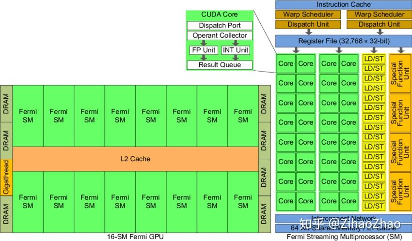
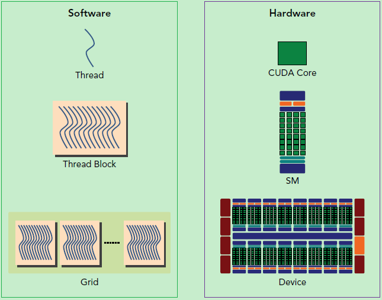
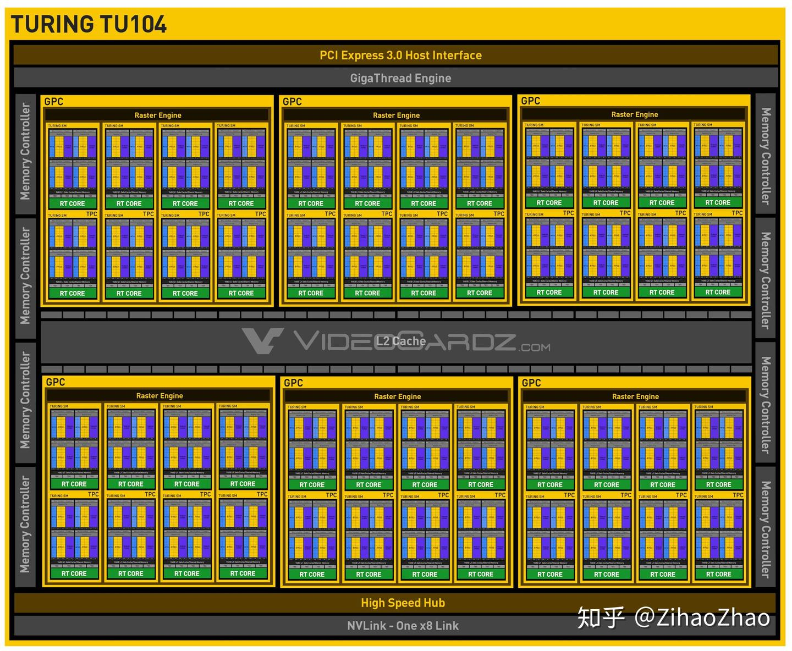
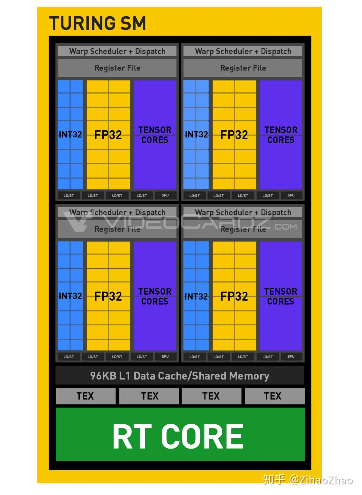
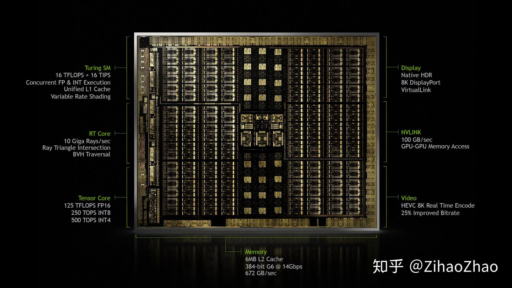

# 第四章 硬件实现

NVIDIA GPU 架构通过**多线程流式多处理器 (SM: Streaming Multiprocessors)** 可扩展阵列构建。当主机 CPU 上的 CUDA 程序调用内核网格时，网格的块被枚举并分发到具有可用执行能力的多处理器。一个线程块的线程在一个 SM 上同时执行，同时多个线程块也可以在一个 SM 上同时执行。当线程块终止时，新块在空出的 SM 上启动。

SM 旨在同时执行数百个线程。为了管理如此大量的线程，SM 采用了一种称为 SIMT（Single-Instruction, Multiple-Thread: 单指令多线程）的独特架构，在 [SIMT 架构](https://docs.nvidia.com/cuda/cuda-c-programming-guide/index.html#simt-architecture) 中进行了描述。这些指令流水线运行，并利用了单个线程内的指令级并行性，以及通过并行硬件多线程实现的广泛的线程级并行，如 [硬件多线程](https://docs.nvidia.com/cuda/cuda-c-programming-guide/index.html#hardware-multithreading) 中详述。与 CPU 内核不同，SM 按顺序发射，没有分支预测或推测执行。

[SIMT 架构](https://docs.nvidia.com/cuda/cuda-c-programming-guide/index.html#simt-architecture) 和 [硬件多线程](https://docs.nvidia.com/cuda/cuda-c-programming-guide/index.html#hardware-multithreading) 描述了所有设备通用的流式多处理器的架构特性。[Compute Capability 3.x]()、[Compute Capability 5.x]()、[Compute Capability 6.x]() 和 [Compute Capability 7.x](https://docs.nvidia.com/cuda/cuda-c-programming-guide/index.html#compute-capability-3-0) 分别提供了计算能力 3.x、5.x、6.x 和 7.x 的设备的详细信息。

NVIDIA GPU 架构使用小端模式。

## 硬件架构

CUDA 的硬件架构与软件编程模型之间的映射关系是理解 GPU 并行计算的核心。这种映射通过多层次抽象实现：从物理硬件的**流多处理器（SM）**、**内存层次**，到软件层面的**线程网格（Grid）**、**线程块（Block）**，形成了一套完整的并行计算体系。以下从硬件到软件逐层解析：

### **一、CUDA 硬件架构核心组件**

#### 1. 流多处理器（Streaming Multiprocessor, SM）

**GPU 实际上是一个 SM 的阵列，每个 SM 包含 N 个计算核**，现在我们的常用 GPU 中这个数量一般为 128 或 192。一个 GPU 设备中包含一个或多个 SM，这是处理器具有可扩展性的关键因素。如果向设备中增加更多的 SM，GPU 就可以在同一时刻处理更多的任务，或者对于同一任务，如果有足够的并行性的话，GPU 可以更快完成它。

具体而言，以 Fermi 架构的 GPU 为例，其结构如下图。



左边是 GPU 的整体结构，其主要是由大量的 SM（Streaming-Multiprocessor）和 DRAM 存储等构成的。右图是对单个 SM 进行放大，可以看到 SM 由大量计算核（有时也称 SP 或 CUDA 核）、LDU（Load-Store Units）、SFU（Special-Function Units）、寄存器、共享内存等构成。这种结构正是 GPU 具有高并行度计算能力的基础。**通过一定的层级结构组织大量计算核，并给各级都配有相应的内存系统**，GPU 获得了出色的计算能力。

其中流式多处理器（SM）是 GPU 架构的核心，类似于 CPU 中的核，但设计更专注于并行计算。GPU 中的每一个 SM 都能支持数百个线程并发执行，每个 GPU 通常有多个 SM，所以在一个 GPU 上并发执行数千个线程是有可能的。当启动一个内核网络时，它的线程块会被分布在可用的 SM 上来执行。当线程块一旦被调度到一个 SM 上，其中的线程只会在那个指定的 SM 上并发执行。多个线程块可能会被分配到同一个 SM 上，而且是根据 SM 资源的可用性进行调度的。

每个 SM 包含：

- **计算核心**：
    - **CUDA Core**：执行通用浮点和整数运算（FP32/FP64/INT32）。
    - **Tensor Core**：专用矩阵运算单元，支持 FP16/BF16/INT8 等低精度计算，大幅提升 AI 任务效率（如 A100 的 Tensor Core 峰值性能达 312 TFLOPS）。
- **内存层次**：
    - **寄存器（Registers）**：线程私有，访问速度最快（约 1 周期延迟）。
    - **共享内存（Shared Memory）**：线程块内共享，速度接近寄存器（约 10 周期延迟），容量有限（如 A100 每个 SM 有 192KB）。
- **调度单元**：
    - **Warp 调度器**：以 32 个线程为一组（Warp）调度执行，同一 Warp 内线程执行相同指令（SIMT 架构）。

线程束调度器（Warp Scheduler）顾名思义是进行线程束的调度，负责将软件线程分配到计算核上；LDU（Load-Store Units）负责将值加载到内存或从内存中加载值；SFU（Special-Function Units）用来处理 sin、cos、求倒数、开平方特殊函数。

上面说到了 kernel 的线程组织层次，那么一个 kernel 实际上会启动很多线程，这些线程是逻辑上并行的，但是在物理层却并不一定。这其实和 CPU 的多线程有类似之处，多线程如果没有多核支持，在物理层也是无法实现并行的。但是好在 GPU 存在很多 CUDA 核心，充分利用 CUDA 核心可以充分发挥 GPU 的并行计算能力。

#### 2. 线程调度机制

- **Warp（线程束）**：32 个线程组成一个 Warp，是硬件调度的基本单位。
- **SIMT（单指令多线程）执行**：同一 Warp 内所有线程执行相同指令，但操作不同数据。
- **Warp 调度过程**：
    1. SM 将 Block 拆分为多个 Warp。
    2. Warp 调度器选择就绪 Warp（无数据依赖），发射指令到计算核心。
    3. 若 Warp 遇到内存访问等长延迟操作，调度器切换到其他 Warp 执行（隐藏延迟）。

#### 3. 内存系统

GPU 内存分为多级层次，越靠近计算核心速度越快但容量越小：

|内存类型|访问范围|容量（典型值）|访问延迟|用途|
|---|---|---|---|---|
|寄存器|线程私有|数万 / 线程|~1 周期|存储线程局部变量|
|共享内存|线程块内共享|64KB~192KB/SM|~10 周期|线程间数据交换、数据缓存|
|L1/L2 缓存|SM 私有 / 全局|16KB~64KB/SM|~30 周期|缓存全局内存数据|
|全局内存|整个 GPU|8GB~80GB|~400 周期|存储大规模数据（需与主机内存交换）|

### **二、软件编程模型与硬件的映射**

#### **1. 线程组织层次**

CUDA 软件通过三级层次组织线程，与硬件形成对应关系：

- **线程（Thread）**：执行最小单元，映射到硬件中的计算核心（CUDA Core/Tensor Core）。
- **线程块（Block）**：由多个线程组成（如 128~1024 线程），映射到单个 SM 上执行。块内线程通过共享内存通信，并可通过 `__syncthreads()` 同步。
- **线程网格（Grid）**：由多个 Block 组成，可分布在多个 SM 上并行执行。

#### **2. 关键映射关系**

|软件概念|硬件对应|约束条件|
|---|---|---|
|线程（Thread）|CUDA Core/Tensor Core|每个线程由一个计算核心执行|
|线程块（Block）|单个 SM|一个 Block 必须在同一个 SM 上执行|
|Warp（32 线程）|硬件调度单元|同一 Warp 内线程必须执行相同指令|
|共享内存|SM 内的共享内存单元|容量限制（如 A100 每个 SM 192KB）|
|全局内存|设备 DRAM|高延迟，需优化访问模式|

CUDA 采用**单指令多线程（SIMT）架构**来管理和执行线程，每**32 个线程为一组，被称为线程束（Warp）**。线程束中所有线程同时执行相同的指令。每个线程都有自己的指令地址计数器和寄存器状态，利用自身的数据执行当前的指令。每个 SM 都将分配给它的线程块划分到包含 32 个线程的线程束中，然后在可用的硬件资源上调度执行。

SIMT 架构和 CPU 编程中常见的**SIMD（单指令多数据）架构**相似。两者都是将相同的指令广播给多个执行单元来实现并行。一个关键的区别就是 SIMD 要求同一个向量中的所有元素要在一个统一的同步组中一起执行，而 SIMT 允许同一线程束的多个线程独立执行。尽管一个线程数中的所有线程在相同的程序地址上同时开始执行，但是单独的线程仍有可能有不同的行为。

下面这幅图分别从逻辑视图和硬件视图描述了 CUDA 编程对应的组件。



左侧是逻辑视图，自上而下，从线程构成线程块再构成线程网络。对应右侧的硬件就是 CUDA core、SM、GPU。

一个线程块只能在一个 SM 上被调度，而且一旦线程块在一个 SM 上被调度，就会保存在该 SM 上直到执行完成。需要注意的是，这两种层级并不是完全一一对应的，比如在同一时间，一个 SM 可以容纳多个线程块。

在 SM 中，共享内存和寄存器是非常重要的资源。共享内存被分配在 SM 上的常驻线程块中，寄存器在线程中被分配。线程块中的线程通过这些资源可以进行相互的合作和通信。尽管线程块里的所有线程都可以逻辑地并行运行，但并不是所有线程都可以同时在物理层面执行。因此线程块里的不同线程可能会以不同速度前进。我们可以使用 CUDA 语句在需要的时候进行线程的同步。

尽管线程块里的线程束可以任意顺序调度，但活跃的线程束数量还是会由 SM 的资源所限制。当线程数由于任何理由闲置的时候（比如等待从设备内存中读取数值）这时 SM 可以从同一 SM 上的常驻线程块中调度其他可用的线程束。在并发的线程束间切换并没有额外开销，因为硬件资源已经被分配到了 SM 上的所有线程和线程块中。这种策略有效地帮助 GPU 隐藏了访存的延时，因为随时有大量线程束可供调度，理想状态下计算核将一直处于忙碌状态，从而可以获得很高的吞吐量。

总结一下，SM 是 GPU 架构的核心，而寄存器和共享内存是 SM 中的稀缺资源。CUDA 将这些资源分配到 SM 中的所有常驻线程里。因此，这些有限的资源限制了在 SM 上活跃的线程束数量，而活跃的线程束数量对应于 SM 上的并行量。

#### 3. SIMT 架构

当一个 kernel 被执行时，它的 grid 中的线程块被分配到 SM 上，一个线程块只能在一个 SM 上被调度。SM 一般可以调度多个线程块，这要看 SM 本身的能力。

那么有可能一个 kernel 的各个线程块被分配多个 SM，所以 grid 只是逻辑层，而 SM 才是执行的物理层。SM 采用的是 [SIMT](https://link.zhihu.com/?target=http%3A//docs.nvidia.com/cuda/cuda-c-programming-guide/index.html%23simt-architecture) (Single-Instruction, Multiple-Thread，单指令多线程) 架构，基本的执行单元是线程束（warps)，线程束包含 32 个线程，这些线程同时执行相同的指令，但是每个线程都包含自己的指令地址计数器和寄存器状态，也有自己独立的执行路径。

**SM 以 32 个并行线程组（称为 Warp）的形式来创建、管理、调度和执行线程**。组成 Warp 的每个线程从同一程序地址一起开始，但每个线程都有自己的指令地址计数器和寄存器状态，因此可以自由地分支并独立执行。Warp 一词源于 weaving，这是第一种线程并行技术。half-warp 表示前半部分或后半部分的 Warp。quarter-warp 表示第一、第二、第三或第四个四分之一 Warp。

当一个 SM 执行一个或多个线程块时，它将线程块拆分为 Warp，每个 Warp 都由 Warp 调度程序来调度执行。每个块被分割成 Warp 的方式是一样的；每个 warp 包含连续的线程，这些线程 ID 是不断增加的，第一个 Warp 包含线程 0。[线程层次结构](https://docs.nvidia.com/cuda/cuda-c-programming-guide/index.html#thread-hierarchy) 描述了线程 ID 如何对应到块中的线程索引。

一个 Warp 一次执行一条公共指令，因此当一个 Warp 中的 32 个线程都执行相同的执行路径时，Warp 效率才完全发挥出来。如果 Warp 中的线程由于数据依赖而发生条件分支发散，则 warp 会执行每个需要的分支路径，同时禁用不在该路径执行的线程。分支发散只发生在一个 Warp 内；不同 Warp 之间独立执行，无论是执行带有分叉的还是不带有分叉的代码路径。

所以尽管线程束中的线程同时从同一程序地址执行，但是可能具有不同的行为，比如遇到了分支结构，一些线程可能进入这个分支，但是另外一些有可能不执行，它们只能死等，因为 GPU 规定线程束中所有线程在同一周期执行相同的指令，线程束分化会导致性能下降。当线程块被划分到某个 SM 上时，它将进一步划分为多个线程束，因为这才是 SM 的基本执行单元，但是一个 SM 同时并发的线程束数是有限的。这是因为资源限制，SM 要为每个线程块分配共享内存，而也要为每个线程束中的线程分配独立的寄存器。所以 SM 的配置会影响其所支持的线程块和线程束并发数量。总之，就是网格和线程块只是逻辑划分，一个 kernel 的所有线程其实在物理层是不一定同时并发的。所以 kernel 的 grid 和 block 的配置不同，性能会出现差异，这点是要特别注意的。还有，由于 SM 的基本执行单元是包含 32 个线程的线程束，所以 block 大小一般要设置为 32 的倍数。

SIMT 体系结构类似于 SIMD（单指令多数据）向量组成 (Organization)，其中由单指令控制多个处理元素。一个关键区别是 SIMD 向量组成对软件公开了 SIMD 宽度，而 SIMT 指令则可以指定单个线程的执行和分支行为。与 SIMD 向量机相比，SIMT 使程序员能够为独立的标量线程编写线程级并行代码，以及为协调线程编写数据并行代码。为了正确起见，程序员基本上可以忽略 SIMT 行为；但是，通过减少 Warp 中的线程发散，可以显著提升性能。在实践中，这类似于传统代码中 Cache Line 的作用：对于程序正确性来说，可以安全地忽略 Cache Line 的大小，但在考虑峰值性能时，必须将其考虑到代码结构中。另一方面，向量架构需要软件将负载合并到向量中并手动管理分支发散。

在 Volta 之前，Warp 使用了一个在 Wrap 中 32 个线程之间共享的程序计数器，并使用可一个在 Warp 中指定活动线程的活动掩码。结果，来自不同区域或不同执行状态的 Warp 中的线程不能相互发送信号或交换数据，同时需要由锁或互斥锁保护的细粒度数据共享的算法很容易导致死锁，死锁取决于竞争线程来自哪个 Warp。

从 Volta 架构开始，独立线程调度 (Independent Thread Scheduling) 允许线程之间的完全并发，而不管 Warp。使用独立线程调度时，GPU 会维护每个线程的执行状态，包括程序计数器和调用堆栈，并可以在线程粒度上进行执行，从而更好地利用执行资源，或允许线程等待数据产生。由调度优化器决定如何将来自同一个 Warp 的活动线程组合成 SIMT 单元。这保留了与先前 NVIDIA GPU 一样的 SIMT 高吞吐量执行，同时提升了灵活性：线程现在可以在 sub-warp 的粒度上进行分散和重新聚合。

如果开发人员是基于先前硬件架构的 $warp-synchronicity^2$ 思路开发的代码，那么独立线程调度可能会导致参与代码执行的线程集合与预期集合完全不同的情况。特别地，开发人员应重新访问所有 warp-synchronous

代码（例如同步释放 (synchronization-free)、intra-warp reductions），以确保与 Volta 及以上版本的兼容性。有关详细信息，请参阅 [计算能力 7.x](https://docs.nvidia.com/cuda/cuda-c-programming-guide/index.html#compute-capability-7-x)。

执行当前指令的 Warp 中的线程称为活动线程，而未执行当前指令的线程是非活动的（禁用）。线程可能由于多种原因而处于非活动状态，包括比 warp 中的其他线程更早退出、执行与 warp 不同的分支路径、或线程数不是 Warp 大小的倍数的块中的最后一些线程。

如果 Warp 执行了一个非原子指令，该指令是让 Warp 中的多个线程写入全局或共享内存中的同一位置，则该位置发生的序列化写入次数取决于设备的计算能力（参见 [Compute Capability 3.x、Compute Capability 5.x、Compute Capability 6.x 和 Compute Capability 7.x](https://docs.nvidia.com/cuda/cuda-c-programming-guide/index.html#compute-capability-3-0)），哪个线程会最后写入是不确定的。

如果 Warp 执行了一个 [原子指令](https://docs.nvidia.com/cuda/cuda-c-programming-guide/index.html#atomic-functions)，该指令是让 Warp 中的多个线程读取、修改和写入全局内存中的同一位置，则对该位置的每次读取/修改/写入都会发生并且它们都被序列化，但是它们发生的顺序是不确定的。

#### 4 硬件多线程

SM 执行的每个 Warp 的执行上下文（程序计数器、寄存器等）在 Warp 的整个生命周期内都保存在芯片上。因此，从一个执行上下文切换到另一个执行上下文是没有切换成本的，并且在每个指令发出时，Warp 调度程序都会选择一个线程已经准备好执行下一条指令 (Warp 的 [活动线程](https://docs.nvidia.com/cuda/cuda-c-programming-guide/index.html#simt-architecture__notes)) 的 Warp，并将指令发射给 Warp 中的这些线程.

特别是，每个 SM 都有一组 32 位寄存器，这些寄存器被划分到不同的 Warp 之间，同时并行数据缓存 (parallel data cache) 和共享内存 (shared memory) 被划分到不同的线程块之间.

对于给定内核，可以在 SM 上驻留和处理的块和 Warp 的数量取决于内核使用的寄存器和共享内存的数量以及 SM 上可用的寄存器和共享内存的数量。每个 SM 也有驻留块的最大数量和驻留 Warp 的最大数量。这些限制以及 SM 上可用的寄存器数量和共享内存是设备计算能力的函数，在附录 [计算能力](https://docs.nvidia.com/cuda/cuda-c-programming-guide/index.html#compute-capabilities) 中给出。如果每个 SM 中的寄存器或共享内存数量无法支撑至少一个块的运行，则内核将无法启动。

一个块中的 warp 总数如下：

$$
ceil(\frac{T}{W_{size}},1)
$$

- T 是每个块中的线程数
- $W_{size}$ 是 Warp 的大小，默认为 32
- $ceil(x,y)$ 是 x 四舍五入到 y 的整数倍。

为每个块分配的寄存器总数以及共享内存总量记录在 CUDA 工具包提供的 CUDA Occupancy Calculator 中。

### **三、内存访问模式与硬件的交互**

#### **1. 全局内存访问优化**

- **合并访问（Coalesced Access）**：
    - 硬件要求：Warp 内连续线程访问连续的内存地址（如 `d_data[tid]`）。
    - 原因：GPU 以 128 字节为单位批量读取全局内存（如 A100），若满足合并条件，一个内存事务可服务整个 Warp（32×4 字节）。
    - 反例：`d_data[tid*4]` 可能导致每个线程触发独立内存事务，效率降低 4 倍。

#### **2. 共享内存的 Bank 冲突**

- **Bank 机制**：共享内存被分为 32 个 Bank（每个 Bank 带宽 32 位 / 周期）。
- **冲突场景**：若同一 Warp 的多个线程访问同一 Bank 的不同地址，会导致串行访问。

    ```cuda
    __shared__ float data[256];
    float val = data[threadIdx.x + offset];  // 若offset=0，线程0和32会访问同一Bank
    ```

- **优化方法**：通过填充数组避免地址冲突。

    ```cuda
    __shared__ float data[256 + 32];  // 填充32个元素，错开地址
    ```

### **四、计算资源的分配与利用**

#### **1. SM 资源限制**

每个 SM 有固定资源，决定了可同时运行的 Block 数量：

- **寄存器限制**：每个 Block 使用的寄存器总数不能超过 SM 的寄存器容量（如 A100 每个 SM 有 65536 个 32 位寄存器）。
- **共享内存限制**：每个 Block 使用的共享内存不能超过 SM 的共享内存容量。
- **线程限制**：每个 SM 最多可同时运行的线程数（如 A100 为 2048 线程）。

#### **2. Occupancy（占用率）计算**

- **定义**：实际活跃 Warp 数与最大可能 Warp 数的比值。
- **计算公式**：

    ```plaintext
    每个SM的最大Warp数 = min(最大线程数/SM ÷ 32, 最大寄存器数/SM ÷ 每个线程的寄存器数, 最大共享内存/SM ÷ 每个Block的共享内存)
    Occupancy = 实际活跃Warp数 ÷ 每个SM的最大Warp数
    ```

- **优化目标**：通过调整 Block 大小和资源使用，使 Occupancy 接近 100%，充分利用 SM 资源。

### **五、性能优化的映射实践**

#### **1. 矩阵乘法优化示例**

1. **朴素实现**：
    - 每个线程直接从全局内存读取矩阵元素，导致大量重复访问。
    - 映射问题：全局内存访问延迟高，计算单元利用率低。
2. **共享内存优化**：
    - 将矩阵分块（Tiling）加载到共享内存，每个线程块负责计算一个子矩阵。
    - 映射改进：减少全局内存访问，利用共享内存的高速特性。
3. **Tensor Core 优化**：
    - 使用 WMMA 库将数据组织为 16×16 矩阵块，调用 Tensor Core 执行矩阵乘。
    - 映射改进：充分利用 Tensor Core 的高吞吐量（每个周期可执行 64 次 FP16 乘法累加）。

### **六、工具链与硬件洞察**

#### **1. 硬件属性查询**

通过 CUDA API 查询硬件特性，指导编程决策：

```cuda
cudaDeviceProp prop;
cudaGetDeviceProperties(&prop, 0);  // 查询设备0属性
printf("CUDA Capability: %d.%d\n", prop.major, prop.minor);
printf("Max Threads per Block: %d\n", prop.maxThreadsPerBlock);
printf("Shared Memory per Block: %zu bytes\n", prop.sharedMemPerBlock);
printf("Registers per Block: %d\n", prop.regsPerBlock);
```

#### **2. 性能分析工具**

- **Nsight Compute**：分析内核执行时的硬件指标（如 SM 利用率、内存事务数）。
- **nvprof**：统计 GPU 活动（如全局内存带宽、Tensor Core 使用率）。
- **Occupancy Calculator**：预测不同 Block 配置下的理论 Occupancy。

### **七、总结**

CUDA 的软硬件映射通过多层次抽象实现：

1. **线程组织**：Thread → Block → Grid 对应 计算核心 → SM → 多 SM 集群。
2. **内存层次**：寄存器 / 共享内存 → L1/L2 缓存 → 全局内存 对应 高速私有 / 共享存储 → 中速缓存 → 低速 DRAM。
3. **调度机制**：Warp 调度器将软件线程映射到硬件计算单元，通过隐藏内存延迟保持高利用率。

理解这种映射关系是编写高效 CUDA 程序的关键：通过优化线程组织、内存访问模式和资源分配，使软件行为与硬件特性匹配，从而充分发挥 GPU 的并行计算能力。

# GPU 架构进展
### Turing 架构

最新的 NVIDIA GPU 为 Turing 架构，继上一代的 Pascal 架构有了不小的改变。以 Turing 架构中我们最常见的 RTX 2080 为例，RTX 2080 采用的是 TU 104 核心，其架构如下图。与上文介绍的略有不同，我们能看到一个叫 GPC（Graphics Processing Cluster）的层次，TU 104 共有 6 个 GPC，其中每个 GPC 包括 4 个 TPC（Texture Processing Cluster），每个 TPC 包含 2 个 SM，总计有 48 个 SM 可供使用。而每个 SM 包含 64 个 CUDA 核（一般指 FP 32 的数量），总计有 3072 个 CUDA 核可供使用。（感谢评论区幽玄大佬指正错误！）

  

再具体看其中每个 SM 的结构，如下图。Turing 架构在 SM 中增加了新的处理单元，INT 32。这让 Turing 架构的 GPU 有能力并行处理浮点数和非浮点数。官方宣称，理论上这将提高 GPU 在浮点操作时 36% 的吞吐量。还有每个 SM 上的 L 1 缓存/共享内存也增加到了 96 KB。



最后来欣赏一下芯片内部结构，12 nmFFN 工艺制造的。官方渲染图也搞得十分精致，黑金范。


