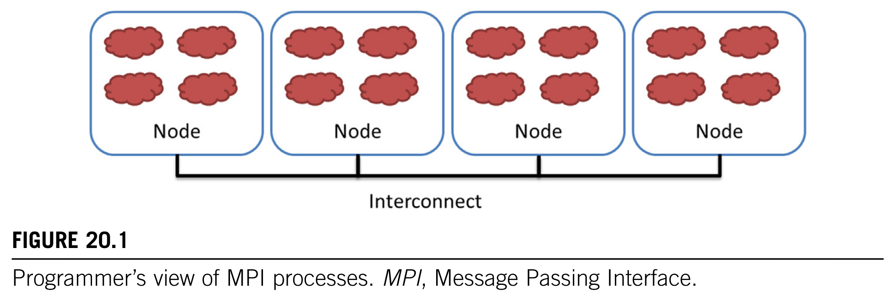
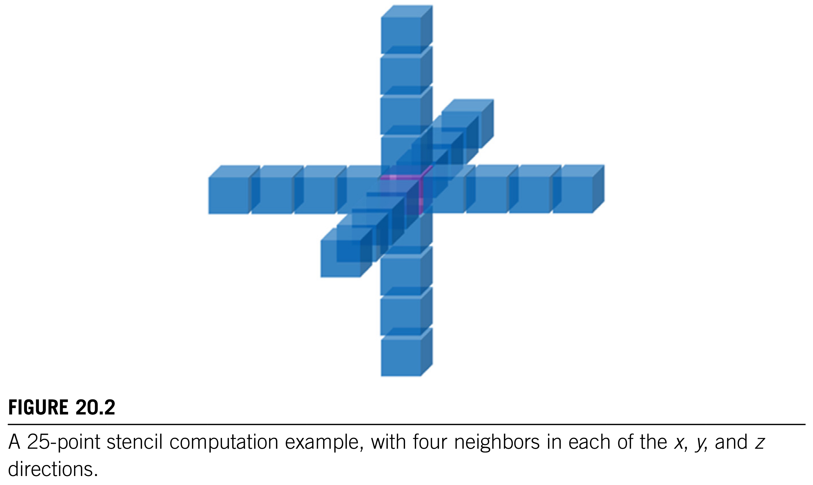
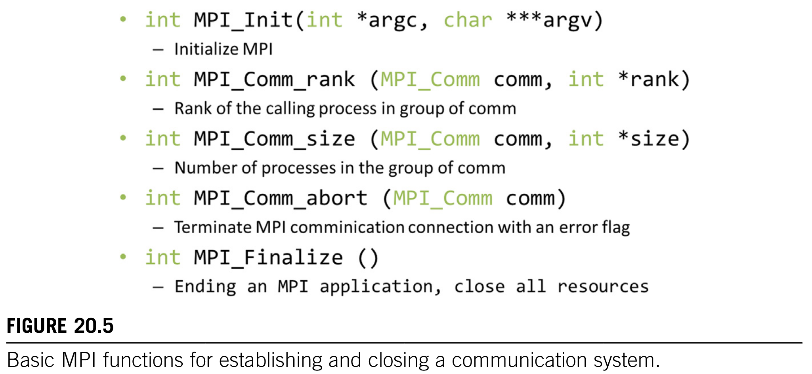

https://www.zhouxin.space/notes/note-on-programming-massively-parallel-processors-a-hands-on-approach-4th-edition-part-2/

伴随资料和 PPT：https://www.elsevier.com/zh-cn/books-and-journals/book-companion/9780323912310

# Ch 20 Programming a Heterogeneous Computing Cluster

An introduction to CUDA streams

到目前为止，我们一直专注于对具有**一个主机和一个设备**的异构计算系统进行编程。在高性能计算（HPC）中，应用程序需要计算**节点集群**的总计算能力。如今，许多 HPC 集群的每个节点中都有一个或多个主机以及一个或多个设备。从历史上看，这些集群主要是使用**消息传递接口（MPI）** 进行编程的。在本章中，我们将介绍 MPI/CUDA 联合编程。我们只会介绍程序员在集群环境中将异构应用程序扩展到多个节点时需要理解的 MPI 概念。具体而言，我们将重点关注在将 CUDA 内核扩展到多个节点的背景下的**域划分、点对点通信和集合通信**。

## 20.1 Background

尽管在 2009 年之前，几乎没有顶尖的超级计算机使用 GPU，但对更**高能源效率**的需求导致近年来 GPU 被迅速采用。许多如今，世界顶级的超级计算机在每个节点上都同时使用中央处理器（CPU）和图形处理器（GPU）。这种方法的有效性在 Green500 榜单的高排名中得到了验证，该榜单反映了它们的高能效。

如今，计算集群中占主导地位的编程接口是 MPI（Gropp et al., 1999），它是一组用于计算集群中运行的进程之间进行通信的 API 函数。MPI 采用**分布式内存模型**，进程之间通过相互**发送消息**来交换信息。当应用程序使用 API 通信函数时，无需处理互连网络的细节。MPI 的实现允许进程使用逻辑编号相互寻址，这与在电话系统中使用电话号码的方式非常相似：电话用户可以使用电话号码相互拨打电话，而无需确切知道被叫方的位置以及呼叫是如何路由的。

在典型的 MPI 应用程序中，数据和工作在各个进程之间进行划分。如图 20.1 所示，每个节点可以包含一个或多个进程，在节点内以云状表示。随着这些进程的推进，它们可能需要彼此的数据。这种需求通过发送和接收消息来满足。在某些情况下，当进程协作完成一项大型任务时，它们还需要相互同步并生成集体结果。这通过集合通信 API 函数来实现。

## 20.2 A Running Example (TODO)

作为一个持续使用的示例，我们将采用在第 8 章“模板”中介绍的三维（3D）模板计算。我们假设该计算基于有限差分法来计算热传递，以求解描述热传递物理定律的偏微分方程。具体而言，我们将使用雅可比迭代法，在每次迭代或时间步中，网格点的值计算为其邻居（北、东、南、西、上、下）以及上一时间步自身值的加权和。为了实现较高的数值稳定性，在计算网格点时还会使用每个方向上的多个间接邻居。这是一种高阶模板计算，正如我们在第 8 章“模板”中所讨论的。在本章中，我们假设在每个方向上使用四个点。

## 20.3 Message Passing Interface Basics

与 CUDA 类似，MPI 程序基于单程序多数据（SPMD）并行编程模型。所有 MPI 进程都执行相同的程序。MPI 系统提供了一组 API 函数来建立通信系统，使进程之间能够相互通信。图 20.5 展示了五个基本的 MPI 函数，用于为 MPI 应用程序设置和拆除通信系统。

我们将使用一个简单的 MPI 程序（如图 20.6 所示）来说明 API 函数的用法。要在集群中启动 MPI 应用程序，用户需要将程序的可执行文件提供给集群登录节点中的 `mpirun` 命令或 `mpiexec` 命令。每个进程通过调用 `MPI_Init ()`（第 5 行）来初始化 MPI 运行时，从而启动。这将为运行该应用程序的所有进程初始化通信系统。一旦 MPI 运行时初始化完成，每个进程会调用两个函数为通信做准备。第一个函数是 `MPI_Comm_rank ()`（第 6 行），它会为每个调用进程返回一个唯一的编号，这个编号被称为 MPI rank 或进程标识符 id。进程接收到的数字范围从 0 到进程数量减 1。进程的 MPI 等级类似于 CUDA 线程中的表达式 `blockIdx.x * blockDim.x + threadIdx.x`。它在通信中唯一标识该进程，这也等同于电话系统中的电话号码。主要区别在于 MPI rank 是一维的。

图20.6第6行中的 `MPI_Comm_rank ()` 函数有两个参数。第一个参数是MPI内置类型 `MPI_Comm`，它指定请求的作用域，即由 `MPI_Comm` 变量标识的进程组。`MPI_comm` 类型的每个变量通常称为通信器。`MPI_Comm` 和其他MPI内置类型在 `“mpi. h”` 头文件（第1行）中定义，所有使用MPI的C程序文件都应包含该头文件。一个MPI应用程序可以创建一个或多个**通信器 communicators**，每个通信器都是一组用于通信的MPI进程。` MPI_Comm_rank () ` 为通信器中的每个进程分配一个唯一的ID。在图20.6中，传递的参数值是 ` MPI_COMM_WORLD `，它用作默认值，意味着该通信器包括运行该应用程序的所有MPI进程。