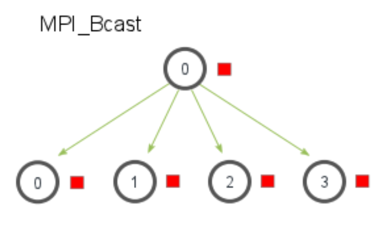

MPI：https://mpitutorial.com/tutorials/

https://mpitutorial.com/

# 介绍

**MPI**（**Message Passing Interface**，消息传递接口）为在分布式内存架构下的进程间通信提供了规范和库支持。在程序的角度，MPI 就是一系列函数接口，他们可以实现不同进程（不同内存区域）之间的消息传递

- 适用场景：分布式内存并行模型

## MPI 编程模型

- 分布式内存模型

在分布式内存模型中，各个处理节点可以独立运行自己的进程，使用自己的本地内存来存储和处理数据。每个进程的内存是私有的，其他进程无法直接访问它们。如果一个进程需要访问另一个进程的数据，就必须通过显式的消息传递机制将数据从一个进程发送到另一个进程。同一个节点（服务器）内部需要借助高速数据总线等硬件实现，而跨节点的通信通常由网络连接来实现，比如通过高速以太网、IB（InfiniBand）等。

- MPI 的核心概念
- **进程**: 在 MPI 中，每个计算任务由一个或多个进程执行。进程是独立的计算实体，有自己的内存空间。MPI 程序通常启动多个进程，这些进程在分布式内存系统中运行。
- **通信**: MPI 通过消息传递的方式进行进程间通信。主要有两种通信方式：
	- **点对点通信（Point-to-Point Communication）**: 两个进程之间直接传递消息。例如，进程 A 发送数据给进程 B。
	- **集体通信（Collective Communication）**: 多个进程之间进行数据传递或同步操作。例如，广播（broadcast）、归约（reduce）等操作。
- **通信协议**: MPI 提供了多种通信协议，如阻塞通信（Blocking）、非阻塞通信（Non-blocking）、同步通信（Synchronous）等。

# API

- 初始化与终止
    - `MPI_Init`：初始化 MPI 环境，必须在任何 MPI 调用之前调用。
        `MPI_Init(&argc, &argv);`
        在 MPI_Init 的过程中，所有 MPI 的全局变量或者内部变量都会被创建。一个通讯子（communicator）会根据所有可用的进程被创建出来，然后每个进程会被分配独一无二的秩（rank）
    - `MPI_Finalize`：结束 MPI 环境，释放 MPI 使用的资源。
        `MPI_Finalize();
- 获取进程信息
    - `MPI_Comm_size`：获取通信子（communicator）中进程的总数。
        `int world_size; MPI_Comm_size(MPI_COMM_WORLD, &world_size);
    - `MPI_Comm_rank`：获取当前进程在通信子中的编号（从 0 开始）。
        `int world_rank; MPI_Comm_rank(MPI_COMM_WORLD, &world_rank);`
- 点对点通信
    - `MPI_Send`：发送消息到指定的进程。
    - `MPI_Recv`：接收来自指定进程的消息。
- 集合通信
	- `MPI_Bcast`：将一条消息从一个进程广播到通信子中的所有进程。
	- `MPI_Scatter`：将根进程的数据分散（scatter）到所有进程中。每个进程接收根进程提供的数据的一部分。
	- `MPI_Reduce`：对来自所有进程的数据进行归约操作（如求和、求最小值），并将结果发送到根进程。
	- `MPI_Gather`：将各进程的数据收集到根进程中。
	- `MPI_Allgather`：将所有进程的部分数据汇总到所有进程。每个进程在所有进程中接收到所有其他进程的数据。

> [!note] MPI 中的同步与异步通信
> - 阻塞通信 vs. 非阻塞通信
> 	- **阻塞通信**是指在通信操作完成之前，调用该通信函数的进程会被阻塞（即等待）。这意味着在通信操作完成之前，进程无法继续执行后续的操作。这种通信方法实现较为简单，但是可能会导致进程等待，特别是在进行大量通信操作时影响性能。适用于简单的通信场景。
> 	- **非阻塞通信**允许进程在发送或接收数据的同时继续执行其他计算任务。通信操作的完成会在稍后的时间自动进行，可以与计算任务重叠，提高性能，但是编程复杂度较高，需要显式检查通信完成状态。

**阻塞通信：**
- `MPI_Send`
- `MPI_Recv`
**非阻塞通信：**
- `MPI_Isend` 非阻塞地发送数据。
- `MPI_Irecv` 非阻塞地接收数据。
- `MPI_Wait` 用于确保非阻塞操作完成之后再继续执行后续代码。
---
**MPI 中的数据类型与通讯域/通信子/通讯器：**
- `MPI_Datatype`：MPI 提供了内置和自定义数据类型，用于定义数据的格式和结构。自定义数据类型允许更复杂的数据组织和传输。
- `MPI_Comm`：MPI 中的通信域定义了进程的集合，这些进程可以在同一通信域内进行数据交换。MPI 提供了默认通信域和创建自定义通信域的功能，以支持不同的并行计算模式和需求。
