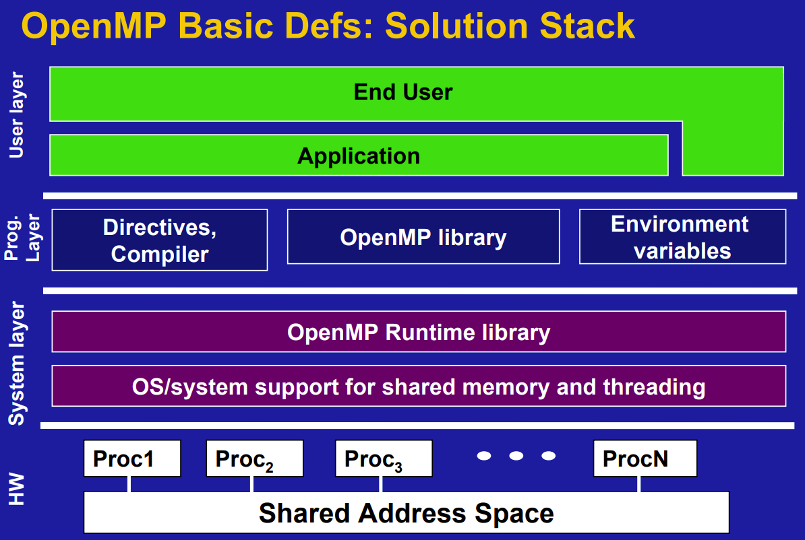
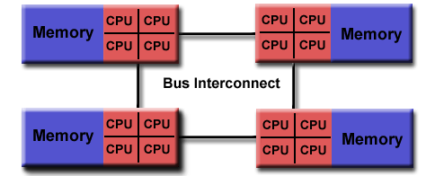
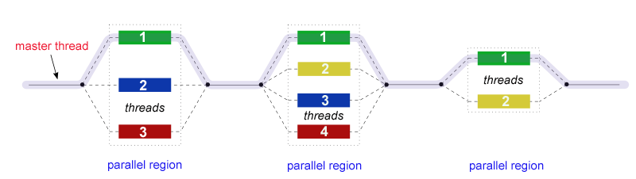

# OpenMP

## OpenMP 概述

- 什么是 OpenMP？

> OpenMP is an Application Program Interface (API), jointly defined by a group of major computer hardware and software vendors. OpenMP provides a portable, scalable model for developers of shared memory parallel applications.

OpenMP（Open Multi-Processing）是一种应用程序接口（API），用于在共享内存的多处理器系统上进行并行编程。它通过在代码中添加指令（pragmas）的方式，让程序员能够简单地将串行代码并行化，而不需要深入底层硬件或复杂的多线程管理。OpenMP 支持 C、C++ 和 Fortran 等语言。它通过**编译器指令**、**库函数**和**环境变量**三种方式，为程序员提供了一种简单易用的并行编程模型，尤其适合多核 CPU 上的数值计算、数据处理等任务。
OpenMP 是一种**简单易用**的共享内存并行编程模型，通过编译器指令和库函数，使程序员能快速将串行代码并行化。它特别适合多核 CPU 上的数据并行任务，尤其在科学计算、工程模拟等领域应用广泛。但需注意合理控制数据作用域和同步开销，以充分发挥并行性能。

### OpenMP is

- An Application Program Interface (API) that may be used to explicitly direct **_multi-threaded, shared memory parallelism_**
- Comprised of three primary API components:
    - Compiler Directives
    - Runtime Library Routines
    - Environment Variables
- An abbreviation for:
    - Short version: **Open Multi-Processing**
    - Long version: **Open** specifications for **Multi-Processing** via collaborative work between interested parties from the hardware and software industry, government and academia.

### OpenMP is not

- Necessarily implemented identically by all vendors
- Guaranteed to make the most efficient use of shared memory
- Required to check for data dependencies, data conflicts, race conditions, or deadlocks
- Required to check for code sequences that cause a program to be classified as non-conforming
- Designed to guarantee that input or output to the same file is synchronous when executed in parallel. The programmer is responsible for synchronizing input and output.

### Goals of OpenMP

- **Standardization**:
    - Provide a standard among a variety of shared memory architectures/platforms
    - Jointly defined and endorsed by a group of major computer hardware and software vendors
- **Lean and Mean**:
    - Establish a simple and limited set of directives for programming shared memory machines.
    - Significant parallelism can be implemented by using just 3 or 4 directives.
    - This goal is becoming less meaningful with each new release, apparently.
- **Ease of Use**:
    - Provide capability to incrementally parallelize a serial program, unlike message-passing libraries which typically require an all or nothing approach
    - Provide the capability to implement both coarse-grain and fine-grain parallelism
- **Portability**:
    - The API is specified for C/C++ and Fortran
    - Public forum for API and membership
    - Most major platforms have been implemented including Unix/Linux platforms and Windows

## OpenMP 编程模型

在项目程序已经完成好的情况下不需要大幅度的修改源代码，只需要加上专用的 pragma 来指明自己的意图，由此编译器可以自动将程序进行并行化，并在必要之处加入同步互斥以及通信。当选择忽略这些 pragma，或者编译器不支持 OpenMp 时，程序又可退化为通常的程序 (一般为串行)，代码仍然可以正常运作，只是不能利用多线程来加速程序执行。OpenMP 提供的这种对于并行描述的高层抽象降低了并行编程的难度和复杂度，这样程序员可以把更多的精力投入到并行算法本身，而非其具体实现细节。对基于数据分集的多线程程序设计，OpenMP 是一个很好的选择。

- 共享内存模型

**共享内存模型**指的是所有线程在同一个地址空间中共享数据。这意味着不同线程可以访问相同的内存位置，并且可以共享变量的值。

**共享变量**：在并行区域中，默认情况下，大多数变量是共享的，即所有线程都可以访问和修改这些变量的值。

**私有变量**：某些情况下，我们可能希望每个线程拥有变量的私有副本，这样不同线程之间不会相互干扰。OpenMP 通过 `private` 指令指定这些变量。

**数据竞争（Race Condition）**：由于多个线程同时访问和修改共享变量，可能会导致数据竞争问题。为了避免这种情况，OpenMP 提供了同步机制，如 `critical` 和 `atomic` 等。

- 并行区域（Parallel Region）

**并行区域**是 OpenMP 编程的核心概念。它是由编译器指令 `#pragma omp parallel` 指定的一段代码，告诉 OpenMP 在这段代码中创建多个线程并行执行。

### Shared Memory Model

OpenMP 假设所有线程可以直接访问同一内存空间，无需显式数据传输（与 MPI 的分布式内存模型不同）。

OpenMP is designed for multi-processor/core, shared memory machines. The underlying architecture can be shared memory UMA or NUMA.



### Openmp Execution Model

#### Thread Based Parallelism

- OpenMP 仅通过线程来完成并行

> OpenMP programs accomplish parallelism **exclusively through the use of threads**.

- 一个线程的运行是可由操作系统调用的最小处理单元

> A thread of execution is the smallest unit of processing that can be scheduled by an operating system.The idea of a subroutine that can be scheduled to run autonomously might help explain what a thread is.

- 线程们存在于单个进程的资源中，没有了这个进程，线程也不存在了

> Threads exist within the resources of a single process. Without the process, they cease to exist.

- 通常，线程数与机器的处理器/核数相匹配，然而，实际使用取决与应用程序

> Typically, the number of threads match the number of machine processors/cores. However, the actual use of threads is up to the application.

#### Explicit Parallelism

- OpenMP 是一种显式（非自动）编程模型，为程序员提供对并行化的完全控制

> OpenMP is an explicit (not automatic) programming model, offering the programmer full control over parallelization.

- 一方面，并行化可像执行串行程序和插入编译指令那样简单

> Parallelization can be as simple as taking a serial program and inserting compiler directives….

- 另一方面，像插入子程序来设置多级并行、锁、甚至嵌套锁一样复杂

> Or as complex as inserting subroutines to set multiple levels of parallelism, locks and even nested locks.

#### Fork - Join Model

OpenMP uses the fork-join model of parallel execution:



- 所有的 OpenML 程序都以一个单个进程——master thread 开始，master threads 按顺序执行直到遇到第一个并行区域

> All OpenMP programs begin as a single process: the **master thread**. The master thread executes sequentially until the first **parallel region** construct is encountered.

- Fork：主线程创造一个并行线程组

> **FORK**: the master thread then creates a team of parallel _threads_.The statements in the program that are enclosed by the parallel region construct are then executed in parallel among the various team threads.

- Join：当线程组完成并行区域的语句时，它们同步、终止，仅留下主线程

> **JOIN**: When the team threads complete the statements in the parallel region construct, they synchronize and terminate, leaving only the master thread.The number of parallel regions and the threads that comprise them are arbitrary.

- **Fork**：主线程创建多个并行线程。
- **Join**：所有并行线程完成后，合并结果并回归主线程。

```plaintext
主线程 ──→ Fork（创建并行线程） ──→ 并行区域 ──→ Join（线程汇合） ──→ 主线程
```

**数据范围**

- 由于 OpenMP 时是共享内存模型，默认情况下，在共享区域的大部分数据是被共享的
- 并行区域中的所有线程可以同时访问这个共享的数据
- 如果不需要默认的共享作用域，OpenMP 为程序员提供一种“显示”指定数据作用域的方法

#### Compiler Directive Based

Most OpenMP parallelism is specified through the use of compiler directives which are embedded in C/C++ or Fortran source code.

#### Nested Parallelism
- API 提供在其它并行区域放置并行区域，实际实现也可能不支持

> The API provides for the placement of parallel regions inside other parallel regions.
Implementations may or may not support this feature.

#### Dynamic Threads

- API 为运行环境提供动态的改变用于执行并行区域的线程数，实际实现也可能不支持

> The API provides for the runtime environment to dynamically alter the number of threads used to execute parallel regions. Intended to promote more efficient use of resources, if possible.
Implementations may or may not support this feature.

### I/O

OpenMP specifies nothing about parallel I/O. It is entirely up to the programmer to ensure that I/O is conducted correctly within the context of a multi-threaded program.

### Execution Model and Memory Model Interactions

Single-Program-Multiple-Data (SPMD) is underlying programming paradigm - all threads have potential to execute the same program code, however, each thread may access modify different data and traverse different execution paths.

OpenMP provides a “relaxed-consistency” and “temporary” view of thread memory - threads have equal access to shared memory where variables can be retrieved/stored. Each thread also has its own temporary copies of variables that may be modified independent from variables in memory.

When it is critical that all threads have a consistent view of a shared variable, the programmer (or compiler) is responsible for insuring that the variable is updated by all threads as needed, via an explicit action - ie., FLUSH, or implicitly (via compiler recognition of program flow leaving a parallel regions).

## 基本语法

#### 1. **并行区域（Parallel Region）**

使用 `#pragma omp parallel` 指令创建并行块：

**用途**: 定义一个并行区域，启动多个线程并行执行该区域中的代码。

```cpp
#include <omp.h>  // OpenMP头文件

int main() {
    #pragma omp parallel  // 并行区域开始
    {
        // 每个线程都会执行此代码块
        printf("Hello from thread %d of %d\n", 
               omp_get_thread_num(),  // 当前线程ID
               omp_get_num_threads()); // 总线程数
    }  // 并行区域结束，线程汇合
    return 0;
}
```

编译时需添加标志（如 `g++ -fopenmp your_file.cpp -o output`）。

- `#pragma omp single`

**用途**：指定代码块只由第一个到达线程执行，其他线程跳过该代码块。

#### 2. **工作分配**

- **`for` 循环并行化**：自动分配循环迭代给不同线程。
- `#pragma omp for`

**用途**: 将循环的迭代分配给多个线程并行执行。

```cpp
#pragma omp parallel for
for (int i = 0; i < 100; ++i) {
	// 每个线程处理部分迭代
}
```

- **`sections`**：手动划分代码块给不同线程。

    ```cpp
    #pragma omp parallel sections
    {
        #pragma omp section
        task1();  // 线程1执行
    
        #pragma omp section
        task2();  // 线程2执行
    }
    ```

## 数据作用域

OpenMP 通过子句控制变量在并行区域中的可见性：

- **`shared`**：所有线程共享同一变量实例。
- **`private`**：每个线程拥有独立的变量副本。
- **`firstprivate`**：继承主线程的初始值。
- **`lastprivate`**：将最后一个迭代的值赋给主线程变量。
- **`reduction`**：对变量执行归约操作（如 `+`、`*`、`min`）。
---
- `shared`：默认情况下，并行区域外申明的变量在并行区域中是共享的，可以使用 `shared` 子句显式指定变量为共享的。

```c
int a;
#pragma omp parallel for shared(a)
for (int i = 0; i < n; i++) {
    // a为公有变量
}
```

- `private`：每个线程在并行区域中有自己独立的变量副本，线程之间相互独立，互不干扰。并行区域内申明的变量默认为私有的，并行区域外申明的变量需要显式申明 private

```c
int a;
#pragma omp parallel for private(a)
for (int i = 0; i < n; i++) {
    int b;
    //a,b均为私有变量
}
```

- `reduction`：用于将每个线程的私有变量在并行区域结束时进行归约（如求和、求最大值等），最终将结果存储到共享变量中。

```c
int sum = 0;
#pragma omp parallel for reduction(+:sum)
for (int i = 0; i < 10; i++) {
    sum += i;
}
```

## 同步机制

#### 1. **临界区（Critical Section）**

- `#pragma omp critical`
**用途**: 定义一个临界区，保证代码块在同一时刻只被一个线程执行，以防止竞争条件。

```cpp
#pragma omp critical
{
    // 互斥执行的代码（如更新共享资源）
}
```

#### 2. **原子操作（Atomic）**

高效执行单指令操作，避免锁开销：

```cpp
#pragma omp atomic
count++;  // 原子递增
```

#### 3. **屏障（Barrier）**

- `#pragma omp barrier`
**用途**: 强制所有线程在此处同步，确保所有线程都执行到这一步后，才继续执行后续代码。

```cpp
#pragma omp barrier  // 所有线程在此同步
```

#### 4. **互斥锁（Lock）**

通过库函数实现更灵活的锁控制：

```cpp
omp_lock_t lock;
omp_init_lock(&lock);

#pragma omp parallel
{
    omp_set_lock(&lock);
    // 临界区
    omp_unset_lock(&lock);
}

omp_destroy_lock(&lock);
```

## 高级特性

#### 任务并行（Task Parallelism）

动态创建任务，适合不规则计算（如递归）：

```cpp
#pragma omp parallel
{
    #pragma omp single  // 仅一个线程创建任务
    {
        #pragma omp task
        process_data(data1);  // 异步任务1
        #pragma omp task
        process_data(data2);  // 异步任务2
    }
}
```

#### 嵌套并行

允许在并行区域内创建新的并行区域：

```cpp
#pragma omp parallel num_threads(2)
{
    #pragma omp parallel num_threads(3)  // 嵌套并行
    {
        // 最多6个线程同时执行
    }
}
```

## 线程调度

控制循环迭代如何分配给线程：

- `static`：静态调度将循环的迭代均匀分配给所有线程，并且相邻的迭代会被分配在同一个线程，分配方式在程序开始执行时就已经确定。

```c
#pragma omp parallel for schedule(static, 3) 
for (int i = 0; i < n; i++) 
{     // 每个线程执行3个连续的迭代 }
```

- `dynamic`：动态调度在执行时分配迭代，每当一个线程完成当前分配的迭代时，它会动态获取下一个块的迭代。
- `guided`：引导调度是一种动态调度的变体，但块大小（chunk size）随着任务的完成而逐渐减小。
- `auto`：自动调度将调度策略的选择权交给编译器或运行时库，由它们决定最佳的调度方式。
- `runtime`：运行时调度允许在程序运行时通过环境变量设置调度策略。

```cpp
#pragma omp parallel for schedule(static, 10)  // 静态分块，每块10次迭代
for (int i = 0; i < 1000; ++i) { … }

#pragma omp parallel for schedule(dynamic)  // 动态调度，按需分配
for (int i = 0; i < 1000; ++i) { … }
```

### 选择策略

#### **1. 静态调度（Static）**

```cpp
schedule(static[, chunk_size])
``` 

- **分配方式**：
    编译时将迭代块（大小为 `chunk_size`）静态分配给各线程，分配模式固定。
- **适用场景**：
    - 负载均衡的任务（每个迭代耗时相近）。
    - 数据局部性要求高的场景（如矩阵运算）。
- **优点**：
    无运行时调度开销，适合循环次数少但迭代耗时高的场景。
- **缺点**：
    负载不均衡时，部分线程可能提前完成，导致 CPU 空闲。

```cpp
#pragma omp parallel for schedule(static, 10)  // 每个线程分配10次迭代
for (int i = 0; i < 1000; ++i) { … }
```

#### **2. 动态调度（Dynamic）**

```cpp
schedule(dynamic[, chunk_size])
```

- **分配方式**：
    线程动态获取任务块（初始分配后，完成的线程从队列获取下一个块）。
- **适用场景**：
    - 负载高度不均衡的任务（如递归、IO 操作）。
    - 无法预知迭代耗时的场景。
- **优点**：
    动态负载均衡，避免线程空闲。
- **缺点**：
    调度开销较大（频繁队列操作），适合大块任务（`chunk_size` 较大）。

```cpp
#pragma omp parallel for schedule(dynamic, 100)  // 每个任务块100次迭代
for (int i = 0; i < 100000; ++i) { … }  // 适合大循环
```

#### **3. 引导调度（Guided）**

```cpp
schedule(guided[, chunk_size])
```

- **分配方式**：
    初始分配较大的块（与剩余迭代数 / 线程数成比例），随着任务推进，块大小逐渐减小至 `chunk_size`。
- **适用场景**：
    - 负载不均且前期迭代耗时高的场景（如科学计算）。
    - 任务数量大但无法提前预估耗时。
- **优点**：
    平衡调度开销与负载均衡，初期减少调度次数，后期细化分配。
- **缺点**：
    实现较复杂，可能不如动态调度灵活。

```cpp
#pragma omp parallel for schedule(guided, 10)  // 初始大块，逐渐减小至10
for (int i = 0; i < 1000000; ++i) { … }  // 适合超大规模循环
```

#### **4. 运行时调度（Runtime）**

```cpp
schedule(runtime)
```

- **分配方式**：
    在运行时通过环境变量 `OMP_SCHEDULE` 指定调度策略，格式为 `type[,chunk_size]`。
- **适用场景**：
    - 需动态调整策略的场景。
    - 同一个程序在不同硬件上运行。
- **优点**：
    无需修改代码即可切换调度策略。
- **缺点**：
    依赖环境变量，增加部署复杂度。

```bash
export OMP_SCHEDULE="dynamic,100"  # 运行前设置
./your_program
```

#### **5. 自动调度（Auto）**

```cpp
schedule(auto)
```  

- **分配方式**：
    由编译器或运行时系统自行选择调度策略，通常基于硬件和循环特性。
- **适用场景**：
    - 测试不同策略效果。
    - 对性能要求不敏感的场景。
- **优点**：
    无需手动选择，简化开发。
- **缺点**：
    可能不是最优策略，需谨慎使用。

### **三、如何选择调度策略**

1. **判断负载特性**：
    - **均衡负载** → `static`（无调度开销）。
    - **不均衡负载** → `dynamic` 或 `guided`（动态平衡）。
2. **考虑任务大小**：
    - **任务大且数量少** → `dynamic`（减少调度次数）。
    - **任务小且数量多** → `guided`（初期大块，后期细化）。
3. **优化数据局部性**：
    - 若需缓存友好，使用 `static` 并调整 `chunk_size` 为缓存行大小的倍数（如 64 字节）。
4. **动态调整**：
    - 使用 `runtime` 配合性能分析工具（如 Intel VTune）找到最优策略。
5. **特殊场景**：
    - **递归任务** → 使用 `#pragma omp task` 而非 `for` 循环，结合 `dynamic` 调度。
    - **IO 密集型** → `dynamic` 或 `guided`，避免线程因 IO 阻塞导致负载不均。

## 环境变量

通过设置环境变量调整 OpenMP 行为：

- `OMP_NUM_THREADS`：设置执行期间要使用的最大线程数。

    ```bash
    export OMP_NUM_THREADS=4  # 运行前设置
    ```

- `OMP_SCHEDULE`：指定默认调度策略。
- `OMP_PROC_BIND`：启用或禁用线程绑定到处理器。有效值为 TRUE 或 FALSE。
- `OMP_STACKSIZE `：控制创建（非主）线程的堆栈大小。

## 适用场景与限制

#### 1. **适合 OpenMP 的场景**

- 计算密集型任务（如矩阵乘法、蒙特卡洛模拟）。
- 数据并行（循环迭代间无依赖）。
- 无需复杂通信的共享内存系统。

#### 2. **不适合的场景**

- 分布式内存系统（需用 MPI）。
- 任务间依赖复杂（如流水线计算）。
- 对线程同步开销敏感的应用。
# 示例
## 并行矩阵乘法

```cpp
#include <omp.h>
#include <iostream>

const int N = 1000;
double A[N][N], B[N][N], C[N][N];

int main() {
    // 初始化矩阵…

    #pragma omp parallel for collapse(2)  // 并行两层循环
    for (int i = 0; i < N; ++i) {
        for (int j = 0; j < N; ++j) {
            C[i][j] = 0.0;
            for (int k = 0; k < N; ++k) {
                C[i][j] += A[i][k] * B[k][j];
            }
        }
    }

    return 0;
}
```

## 蒙特卡洛估算

对于蒙特卡洛估算 π 的算法，可以通过 OpenMP 从多个角度进行优化，包括并行化、随机数生成优化、减少同步开销等。以下是具体的优化方案：

### **一、基础并行化（Naive Approach）**

直接使用 `parallel for` 并行循环，但原子操作会成为瓶颈：

```cpp
#pragma omp parallel for
for (long i = 0; i < NUM_POINTS; i++) {
    double x = (double)rand() / RAND_MAX;
    double y = (double)rand() / RAND_MAX;
    if (x*x + y*y <= 1.0) {
        #pragma omp atomic  // 原子操作，避免竞态条件
        num_inside++;
    }
}
```

**缺点**：`atomic` 导致线程串行化，性能提升有限。

### **二、优化方案：局部累加 + 归约**

每个线程维护局部计数器，最后合并结果，减少原子操作：

```cpp
#include <omp.h>
#include <cstdlib>
#include <cmath>
#include <iostream>

int main() {
    const long NUM_POINTS = 100000000;
    long num_inside = 0;

    #pragma omp parallel
    {
        // 每个线程的局部计数器
        long local_count = 0;
        unsigned int seed = omp_get_thread_num();  // 为每个线程设置不同的随机数种子

        #pragma omp for
        for (long i = 0; i < NUM_POINTS; i++) {
            double x = (double)rand_r(&seed) / RAND_MAX;  // 线程安全的随机数生成
            double y = (double)rand_r(&seed) / RAND_MAX;
            if (x*x + y*y <= 1.0) {
                local_count++;
            }
        }

        // 归约操作，合并所有线程的局部计数器
        #pragma omp atomic
        num_inside += local_count;
    }

    double pi = 4.0 * num_inside / NUM_POINTS;
    std::cout << "估算的π值: " << pi << std::endl;
    return 0;
}
```

**关键点**：

1. **线程局部计数器**：减少原子操作次数，每个线程仅需一次原子写。
2. **线程安全随机数**：使用 `rand_r` 替代 `rand`，避免线程间共享状态。
3. **种子初始化**：基于线程 ID 设置种子，确保随机性。

### **三、进一步优化：SIMD 向量化**

利用 SIMD 指令同时处理多个随机点：

```cpp
#include <omp.h>
#include <cstdlib>
#include <cmath>
#include <iostream>
#include <immintrin.h>  // 引入SIMD指令集

int main() {
    const long NUM_POINTS = 100000000;
    long num_inside = 0;

    #pragma omp parallel
    {
        long local_count = 0;
        unsigned int seed = omp_get_thread_num();
        const __m256d one = _mm256_set1_pd(1.0);  // SIMD常量：1.0

        #pragma omp for
        for (long i = 0; i < NUM_POINTS; i += 4) {  // 每次处理4个点（AVX2）
            // 生成4个随机数
            __m256d x = _mm256_div_pd(
                _mm256_set_pd(
                    (double)rand_r(&seed) / RAND_MAX,
                    (double)rand_r(&seed) / RAND_MAX,
                    (double)rand_r(&seed) / RAND_MAX,
                    (double)rand_r(&seed) / RAND_MAX
                ),
                _mm256_set1_pd(RAND_MAX)
            );

            __m256d y = _mm256_div_pd(
                _mm256_set_pd(
                    (double)rand_r(&seed) / RAND_MAX,
                    (double)rand_r(&seed) / RAND_MAX,
                    (double)rand_r(&seed) / RAND_MAX,
                    (double)rand_r(&seed) / RAND_MAX
                ),
                _mm256_set1_pd(RAND_MAX)
            );

            // 计算x² + y²
            __m256d sum_sq = _mm256_add_pd(
                _mm256_mul_pd(x, x),
                _mm256_mul_pd(y, y)
            );

            // 统计<=1.0的点数量
            __m256d mask = _mm256_cmp_pd(sum_sq, one, _CMP_LE_OQ);
            local_count += _mm256_movemask_pd(mask);
        }

        #pragma omp atomic
        num_inside += local_count;
    }

    double pi = 4.0 * num_inside / NUM_POINTS;
    std::cout << "估算的π值: " << pi << std::endl;
    return 0;
}
```

**关键点**：

1. **AVX2 向量化**：使用 256 位寄存器同时处理 4 个双精度浮点数。
2. **批量随机数生成**：每次生成 4 个随机数，减少函数调用开销。
3. **掩码统计**：利用 `_mm256_movemask_pd` 快速统计满足条件的元素数量。

### **四、线程亲和性优化**

绑定线程到特定 CPU 核心，减少缓存失效：

```cpp
#pragma omp parallel
{
    // 绑定线程到特定CPU核心
    cpu_set_t cpuset;
    CPU_ZERO(&cpuset);
    CPU_SET(omp_get_thread_num(), &cpuset);
    pthread_setaffinity_np(pthread_self(), sizeof(cpu_set_t), &cpuset);

    // 原有并行逻辑…
}
```


# 原子操作


在并行编程中，**原子操作（Atomic Operation）** 是一种不可分割的操作，在执行过程中不会被其他线程中断。它是实现线程安全的重要手段，尤其适用于多线程共享资源的场景。

### **一、原子操作的本质**

原子操作的核心特性是**不可中断性**和**内存可见性**：

  

- **不可中断性**：操作一旦开始，就会完整执行，不会被其他线程干扰。
- **内存可见性**：操作完成后，结果会立即对所有线程可见。

  

在硬件层面，原子操作通常由 CPU 的特殊指令实现（如 x86 的`LOCK`前缀指令），确保操作在总线级别是原子的。

### **二、为什么基础并行需要原子操作？**

考虑蒙特卡洛估算 π 的基础并行代码：


```cpp
#pragma omp parallel for
for (long i = 0; i < NUM_POINTS; i++) {
    double x = (double)rand() / RAND_MAX;
    double y = (double)rand() / RAND_MAX;
    if (x*x + y*y <= 1.0) {
        num_inside++;  // 多个线程同时修改该变量
    }
}
```

  

这段代码存在**竞态条件（Race Condition）**：

  

- **`num_inside++` 不是原子操作**：它实际上包含三个步骤（读取→修改→写入）。
- **多线程并发修改**：若两个线程同时读取到相同的`num_inside`值，各自加 1 后写回，会导致计数丢失。

  

**示例**：


```plaintext
初始值：num_inside = 0

线程A读取num_inside → 0
线程B读取num_inside → 0
线程A加1 → 1
线程B加1 → 1
线程A写回num_inside → 1
线程B写回num_inside → 1

最终结果：num_inside = 1（实际应增加2次）
```

### **三、原子操作的解决方案**

使用`#pragma omp atomic`确保`num_inside++`的原子性：


```cpp
#pragma omp parallel for
for (long i = 0; i < NUM_POINTS; i++) {
    double x = (double)rand() / RAND_MAX;
    double y = (double)rand() / RAND_MAX;
    if (x*x + y*y <= 1.0) {
        #pragma omp atomic  // 确保原子性
        num_inside++;
    }
}
```

  

**原子操作的工作原理**：

  

1. **互斥访问**：通过总线锁或缓存锁机制，确保同一时刻只有一个线程能执行该操作。
2. **内存屏障**：强制刷新缓存，保证操作结果对其他线程可见。

### **四、原子操作的性能代价**

原子操作虽然解决了竞态条件，但存在显著性能开销：


1. **串行化**：原子操作会导致线程串行执行，抵消了并行优势。
2. **缓存失效**：频繁的原子操作会使缓存行频繁失效，增加内存访问延迟。

  

**性能对比（8 核 CPU）**：

  

|实现方式|执行时间（秒）|加速比|
|---|---|---|
|无原子操作（错误）|0.5|10.2x|
|有原子操作|2.8|3.6x|
|局部累加 + 归约|1.5|6.8x|

### **五、优化方向：减少原子操作**

1. **局部累加 + 归约**（前文已介绍）：
  
    ```cpp
    long local_count = 0;  // 每个线程维护局部计数器
    #pragma omp for
    for (…) {
        if (…) {
            local_count++;  // 无竞争
        }
    }
    #pragma omp atomic  // 仅需一次原子操作
    num_inside += local_count;
    ```    
2. **使用 OpenMP 归约子句**：

    ```cpp
    #pragma omp parallel for reduction(+:num_inside)
    for (…) {
        if (…) {
            num_inside++;  // OpenMP自动处理归约
        }
    }
    ```

### **六、原子操作的适用场景**

原子操作适用于**轻量级同步**，尤其在以下场景：

  
1. **计数器**：如统计满足条件的元素数量。
2. **标志位**：控制线程执行逻辑（如`is_running`）。
3. **无锁数据结构**：实现高效的栈、队列等。


但对于复杂操作（如多变量同步），建议使用更高级的同步机制（如互斥锁、条件变量）。

### **七、总结**

原子操作是保证多线程环境下共享变量安全的基础工具，但需谨慎使用：


- **必要性**：在无法避免共享资源竞争时，必须使用原子操作或其他同步机制。
- **性能权衡**：原子操作虽比锁轻量，但仍可能成为瓶颈，应尽量减少使用频率。
- **优化方向**：优先采用线程局部存储和最终归约，而非循环内原子操作。