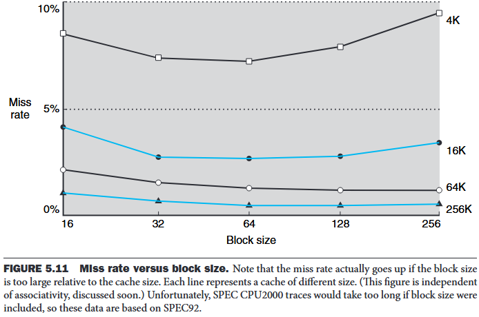

# 5 Large and Fast: Exploiting Memory Hierarchy
## 5.1 Introduction

**The principle of locality**
- **Temporal locality** The locality principle stating that if a data location is referenced then it will tend to be referenced again soon.
- **Spatial locality** The locality principle stating that if a data location is referenced, data locations with nearby addresses will tend to be referenced soon.

> [!note] **memory hierarchy**
A structure that uses multiple levels of memories; as the distance from the processor increases, the size of the memories and the access time both increase.

The data are similarly hierarchical: a level closer to the processor is generally a subset of any level further away, and all the data are stored at the lowest level.

- **block (or line)** The minimum unit of information that can be either present or not present in a cache.
- **hit rate** The fraction of memory accesses found in a level of the memory hierarchy.
- **miss rate** The fraction of memory accesses not found in a level of the memory hierarchy.
- **hit time** The time required to access a level of the memory hierarchy, including the time needed to determine whether the access is a hit or a miss.
- **miss penalty** The time required to fetch a block into a level of the memory hierarchy from the lower level, including the time to *access the block, transmit it from one level to the other, insert it in the level that experienced the miss, and then pass the block to the requestor*.

## 5.2 Memory Technologies

**SRAMs** are simply integrated circuits that are memory arrays with (usually) *a single access port that can provide either a read or a write*. SRAMs have a fixed access time to any datum, though the read and write access times may differ. SRAMs don’t need to refresh and so the access time is very close to the cycle time. SRAMs typically use six to eight transistors per bit to prevent the information from being disturbed when read. SRAM needs only minimal power to retain the charge in standby mode.

In a **dynamic RAM (DRAM)**, the value kept in a cell is stored as a charge in a capacitor. A single transistor is then used to access this stored charge, either to read the value or to overwrite the charge stored there.DRAMs use a two-level decoding structure, and this allows us to refresh an entire row (which shares a word line) with a read cycle followed immediately by a write cycle.

The advantage of **SDRAMs** is that the use of a clock eliminates the time for the memory and processor to synchronize. The speed advantage of synchronous DRAMs comes from the ability to transfer the bits in the burst without having to specify additional address bits.**Double Data Rate (DDR) SDRAM**, whose name means data transfers on both the rising and falling edge of the clock, thereby getting twice as much bandwidth as you might expect based on the clock rate and the data width.

**Address interleaving**: DRAM can be internally organized to read or write from multiple banks, with each having its own row buffer. For example, with four banks, there is just one access time and then accesses rotate between the four banks to supply four times the bandwidth.
**DIMMs**: individual DRAMs, memory for servers is commonly sold on small boards called dual inline memory modules . A DIMM has multiple DRAM chips. Such a subset of chips in EIMM is **memory rank**.

**Flash Memory** is a type of electrically erasable programmable read-only memory (EEPROM).
**wear leveling** Writes can wear out flash memory bits and most flash products include a controller to spread the writes by remapping blocks that have been written many times to less trodden blocks.

**Disk Memory**:
- **track** One of thousands of concentric circles that make up the surface of a magnetic disk.
- **sector** One of the segments that make up a track on a magnetic disk; a sector is the smallest amount of information that is read or written on a disk.

## 5.3 The Basics of Caches

**direct-mapped cache**: A cache structure in which each memory location is mapped to exactly one location in the cache.

**tag**: A field in a table used for a memory hierarchy that contains the address information required to identify whether the associated block in the hierarchy corresponds to a requested word.

$$
(Block\ address) \mod (Number\ of\ blocks\ in\ the\ cache)
$$

**valid bit**: A field in the tables of a memory hierarchy that indicates that the associated block in the hierarchy contains valid data.

### Accessing a Cache

**Temporal locality**: recently referenced words replace less recently referenced words.

e.g.

- 64-bit addresses (assume that data are aligned in memory)
- A direct-mapped cache (the size of the block above was one word (4 bytes))
- The cache size is $2^n$ blocks, so n bits are used for the index
- The block size is $2^m$ words ($2^{m+2}$ bytes), so $m$ bits are used for the word within the block, and two bits are used for the byte part of the address
The size of the tag field is $64-(m+n+2)$. The total number of bits in a direct-mapped cache is

$$
2^n × (block\ size + tag\ size + valid\ field\ size) = 2^n \times (2^m \times 32 +63-m-n)
$$

Larger blocks exploit spatial locality to lower miss rates. But stated alternatively, spatial locality among the words in a block decreases with a very large block; consequently, the benefits to the miss rate become smaller.

The transfer time—and hence *the miss penalty—will likely increase as the block size expands*. Furthermore, the improvement in the miss rate starts to decrease as the blocks become larger. The result is that the increase in the miss penalty overwhelms the decrease in the miss rate for blocks that are too large, and cache performance thus decreases.

Method to hide some of the transfer time so that the miss penalty is effectively smaller.

- **Early restart** resume execution as soon as the requested word of the block is returned, rather than wait for the entire block. (work well for instruction access because instructoin access are largely sequential while the data cache access is less predictable.)
- **Requested word first or critical word first** the requested word is transferred from the memory to the cache first. The remainder of the block is then transferred, starting with the address after the requested word and wrapping around to the beginning of the block

### Handling Cache Misses

**cache miss**：A request for data from the cache that cannot be filled because the data are not present

- Steps to be taken on an instruction cache miss:
1. Send the original PC value to the memory.
2. Instruct main memory to perform a read and wait for the memory to complete its access.
3. Write the cache entry, putting the data from memory in the data portion of the entry, writing the upper bits of the address (from the ALU) into the tag field, and turning the valid bit on.
4. Restart the instruction execution at the first step, which will refetch the instruction, this time finding it in the cache.

### Handling Writes
1. **write-through**: A scheme in which writes always update both the cache and the next lower level of the memory hierarchy, ensuring that data are always consistent between the two.
	**write buffer** A queue that holds data while the data are waiting to be written to memory.
2. **write-back** A scheme that handles writes by updating values only to the block in the cache, then writing the modified block to the lower level of the hierarchy when the block is replaced. (better performance but more complex to implement)

Consider a write miss in write-through:

1. **write allocate** - the block is fetched from memory and overwritten
2. **no write allocate** - update in memory but not put it in the cache.

**Actually implementing stores efficiently in a cache that uses a write-back strategy is more complex than in a write-through cache.** A **write-through** cache can write the data into the cache and read the tag; if the tag mismatches, then a miss occurs. Because the cache is write-through, the overwriting of the block in the cache is not catastrophic, since memory has the correct value. In a **write-back** cache, we must first write the block back to memory if the data in the cache are modified and we have a cache miss. If we simply overwrote the block on a store instruction before we knew whether the store had hit in the cache (as we could for a write-through cache), we would destroy the contents of the block, which is not backed up in the next lower level of the memory hierarchy.
In a **write-back** cache, because we cannot overwrite the block, *stores either require two cycles (a cycle to check for a hit followed by a cycle to actually perform the write) or require a write buffer to hold that data*—effectively allowing the store to take only one cycle by pipelining it. When a store buffer is used, the processor does the cache lookup and places the data in the store buffer during the normal cache access cycle. Assuming a cache hit, the new data are written from the store buffer into the cache on the next unused cache access cycle.By comparison, in a write-through cache, writes can always be done in one cycle. We read the tag and write the data portion of the selected block.

### An Example Cache: The Intrinsity FastMATH Processor

**split cache** A scheme in which a level of the memory hierarchy is composed of two independent caches that operate in parallel with each other, with one handling instructions and one handling data.

## 5.4 Measuring and Improving Cache Performance

$$
CPU\ time = (CPU\ execution\ clock\ cycles + Memory-stall\ clock\ cycles\ Clock\ cycle\ time
$$

Assume that the costs of cache accesses that are hits are part of the normal CPU execution cycles

$$
Memory-stall\ clock\ cycles = (Read-stall\ cycles + Write-stall\ cycles)
$$

$$
Read-stall\ cycles\ Reads  = \frac{Read}{Program} × \ miss\ rate × Read\ miss\ penalty
$$

For write-through:

$$
Write-stall\ cycles\ Writes  = \frac{Write}{Program} × \ miss\ rate × Write\ miss \ penalty+Write buffer stalls
$$

Assume that the write buffer stalls are negligible:

$$
Memory-stall\ clock\ cycles\ = \frac{Memory\ accesses }{Program} × Miss\ rate × Miss\ penalty
$$

$$
Memory-stall\ clock\ cycles\ = \frac{Instruction}{Program} \times \frac{misses}{Instruction}\ \times Miss\ penalty
$$

**average memory access time (AMAT)**

$$
AMAT = Time\ for\ a\ hit + Miss\ rate × Miss\ penalty
$$

### Reducing Cache Misses by More Flexible Placement of Blocks
**fully associative cache** A cache structure in which a block can be placed in any location in the cache.
**set-associative cache** A cache that has a fixed number of locations (at least two) where each block can be placed.
n-way set-associative cache - n locations for a block
Each block in the memory maps to a unique set in the cache given by the index field, and a block can be placed in any element of that set.
The set containing a memory block is given by $(Block\ number) modulo (Number\ of\ sets\ in\ the\ cache)$
Since the block may be placed in any element of the set, all the tags of all the elements of the set must be searched.

The cache access consists of indexing the appropriate set and then searching the tags of the set.

A Content Addressable Memory (CAM) is a circuit that combines comparison and storage in a single device(eight-way and above built using CAMs in 2013).

- Choosing Which Block to Replace
**least recently used (LRU)** A replacement scheme in which the block replaced is the one that has been unused for the longest time. LRU replacement is implemented by keeping track of when each element in a set was used relative to the other elements in the set.
- Reducing the Miss Penalty Using Multilevel Caches
**multilevel cache** A memory hierarchy with multiple levels of caches, rather than just a cache and main memory

## 5.9 Using a Finite-State Machine to Control a Simple Cache

**finite-state machine** A sequential logic function consisting of a set of inputs and outputs, a next-state function that maps the current state and the inputs to a new state, and an output function that maps the current state and possibly the inputs to a set of asserted outputs.

Note that this simple design is called a blocking cache, in that the processor must wait until the cache has finished the request.

Moore machines have potential implementation advantages in speed and size of the control unit. The speed advantages arise because the control outputs, which are needed early in the clock cycle, do not depend on the inputs, but only on the current state.

This simple model could easily be optimized with more states or add a write buffer.

## 5.10 Parallelism and Memory Hierarchy: Cache Coherence

## 5.11 Parallelism and Memory Hierarchy: Redundant Arrays of Inexpensive Disks

## 5.12 Advanced Material: Implementing Cache Controllers

