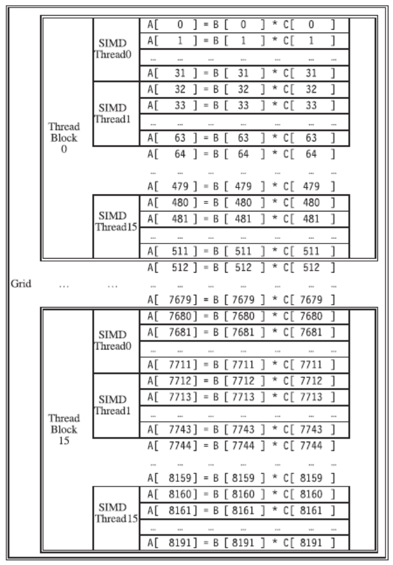

Summary Slides see also CompanionAsset_9780128119051.

# Ch3 Instruction-level Parallelism and Its Exploitation
## Instruction-Level Parallelism
- **Pipelining** become universal technique in 1985
	- Overlaps execution of instructions
	- Exploits “Instruction Level Parallelism”
- Beyond this, there are two main approaches:
	- **Hardware-based dynamic approaches**
		- Used in server and desktop processors
		- Not used as extensively in PMP processors
	- **Compiler-based static approaches**
		- Not as successful outside of scientific applications
- When exploiting instruction-level parallelism, goal is to maximize CPI
	- `Pipeline CPI = Ideal pipeline CPI +Structural stalls +Data hazard stalls +Control stalls`
- Parallelism with basic block is limited
	- Typical size of basic block = 3-6 instructions
	- Must optimize **across branches**

## Dependence

- Loop-Level Parallelism
	- Unroll loop statically or dynamically
	- Use SIMD (vector processors and GPUs)
- Challenges:
	- Data dependency
		- Instruction j is data dependent on instruction i if
			- Instruction i produces a result that may be used by instruction j
			- Instruction j is data dependent on instruction k and instruction k is data dependent on instruction i
- Dependent instructions cannot be executed simultaneously
- Dependencies are a property of programs
- Pipeline organization determines if dependence is detected and if it causes a stall
---
- **Data dependence** conveys:
	- Possibility of a hazard
	- Order in which results must be calculated
	- Upper bound on exploitable instruction level parallelism
- Dependencies that flow through memory locations are difficult to detect
- **Name Dependence**: Two instructions use the same name but no flow of information
	- Not a true data dependence, but is a problem when reordering instructions
	- Antidependence:  instruction j writes a register or memory location that instruction i reads
		- Initial ordering (i before j) must be preserved
	- Output dependence:  instruction i and instruction j write the same register or memory location
		- Ordering must be preserved
- To resolve, use register **renaming** techniques
---
- **Data Hazards**
	- Read after write (RAW)
	- Write after write (WAW)
	- Write after read (WAR)
- **Control Dependence**
	- Ordering of instruction i with respect to a branch instruction
		- Instruction control dependent on a branch cannot be moved before the branch so that its execution is no longer controlled by the branch
		- An instruction not control dependent on a branch cannot be moved after the branch so that its execution is controlled by the branch

## Compiler Techniques for Exposing ILP

- Pipeline scheduling
	- Separate dependent instruction from the source instruction by the pipeline latency of the source instruction
- Example:
`for (i=999; i>=0; i=i-1) x[i] = x[i] + s;`


- **Loop Unrolling**
	- Unroll by a factor of 4 (assume # elements is divisible by 4)
	- Eliminate unnecessary instructions

- **Strip Mining**
- Unknown number of loop iterations?
	- Number of iterations = n
	- Goal:  make k copies of the loop body
	- Generate pair of loops:
		- First executes n mod k times
		- Second executes n / k times
		- “Strip mining”

## Branch Prediction

- Basic 2-bit predictor:
	- For each branch:
		- Predict taken or not taken
		- If the prediction is wrong two consecutive times, change prediction
- Correlating predictor:
	- Multiple 2-bit predictors for each branch
	- One for each possible combination of outcomes of preceding n branches
		- (m, n) predictor:  behavior from last m branches to choose from 2m n-bit predictors
- Tournament predictor:
	- Combine correlating predictor with local predictor


- Tagged Hybrid Predictors
- Need to have predictor for each branch and history
	- Problem:  this implies huge tables
	- Solution:
		- Use hash tables, whose hash value is based on branch address and branch history
		- Longer histories may lead to increased chance of hash collision, so use multiple tables with increasingly shorter histories
 See Also https://github.com/sjdesai16/tage.

## Dynamic Scheduling

- Rearrange order of instructions to reduce stalls while maintaining data flow
	- Advantages:
		- Compiler doesn’t need to have knowledge of microarchitecture
		- Handles cases where dependencies are unknown at compile time
	- Disadvantage:
		- Substantial increase in hardware complexity
		- Complicates exceptions
- Dynamic scheduling implies:
	- Out-of-order execution
	- Out-of-order completion


### Register Renaming

- Tomasulo’s Approach
	- Tracks when operands are available
	- Introduces register renaming in hardware
		- Minimizes WAW and WAR hazards
- Register renaming is provided by reservation stations (RS)
	- Contains:
		- The instruction
		- Buffered operand values (when available)
		- Reservation station number of instruction providing the operand values
- RS fetches and buffers an operand as soon as it becomes available (not necessarily involving register file)
- Pending instructions designate the RS to which they will send their output
	- Result values broadcast on a result bus, called the common data bus (CDB)
- Only the last output updates the register file
- As instructions are issued, the register specifiers are renamed with the reservation station
- May be more reservation stations than registers
- Load and store buffers
	- Contain data and addresses, act like reservation stations
---
- Three Steps:
- Issue
	- Get next instruction from FIFO queue
	- If available RS, issue the instruction to the RS with operand values if available
	- If operand values not available, stall the instruction
- Execute
	- When operand becomes available, store it in any reservation stations waiting for it
	- When all operands are ready, issue the instruction
	- Loads and store maintained in program order through effective address
	- No instruction allowed to initiate execution until all branches that proceed it in program order have completed
- Write result
	- Write result on CDB into reservation stations and store buffers
	- (Stores must wait until address and value are received)
- Example loop:

```c
Loop:  fld f0,0(x1)
  fmul.d f4,f0,f2
  fsd f4,0(x1)
  addi x1,x1,8
  bne x1,x2,Loop // branches if x16 != x2
```


### Hardware-Based Speculation

- **Execute instructions along predicted execution paths but only commit the results if prediction was correct**
- Instruction commit:  allowing an instruction to update the register file when instruction is no longer speculative
- Need an additional piece of hardware to prevent any irrevocable action until an instruction commits
	- I.e. updating state or taking an execution
---
- Reorder buffer – holds the result of instruction between completion and commit
- Four fields:
	- Instruction type:  branch/store/register
	- Destination field:  register number
	- Value field:  output value
	- Ready field:  completed execution?
- Modify reservation stations:
	- Operand source is now reorder buffer instead of functional unit
---
- Issue:
	- Allocate RS and ROB, read available operands
- Execute:
	- Begin execution when operand values are available
- Write result:
	- Write result and ROB tag on CDB
- Commit:
	- When ROB reaches head of ROB, update register
	- When a mispredicted branch reaches head of ROB, discard all entries
---
- Register values and memory values are not written until an instruction commits
	- On misprediction:
		- Speculated entries in ROB are cleared
	- Exceptions:
		- Not recognized until it is ready to commit


### Multiple Issue and Static Scheduling
- To achieve CPI < 1, need to complete multiple instructions per clock
- Solutions:
	- Statically scheduled superscalar processors
	- VLIW (very long instruction word) processors
	- Dynamically scheduled superscalar processors


- VLIW Processors
- Package multiple operations into one instruction
- Example VLIW processor:
	- One integer instruction (or branch)
	- Two independent floating-point operations
	- Two independent memory references
- Must be enough parallelism in code to fill the available slots


- Disadvantages:
	- Statically finding parallelism
	- Code size
	- No hazard detection hardware
	- Binary code compatibility
---
- Modern microarchitectures: Dynamic scheduling + multiple issue + speculation
- Two approaches:
	- Assign reservation stations and update pipeline control table in half clock cycles
		- Only supports 2 instructions/clock
	- Design logic to handle any possible dependencies between the instructions
- Issue logic is the bottleneck in dynamically scheduled superscalars
---
- Multiple Issue
- Examine all the dependencies among the instructions in the bundle
- If dependencies exist in bundle, encode them in reservation stations
- Also need multiple completion/commit
- To simplify RS allocation:
	- Limit the number of instructions of a given class that can be issued in a “bundle”, i.e. on FP, one integer, one load, one store

```c
Loop:  ld x2,0(x1)  //x2=array element
  addi x2,x2,1  //increment x2
  sd x2,0(x1)  //store result
  addi x1,x1,8  //increment pointer
  bne x2,x3,Loop  //branch if not last
```

.png)

.png)

### Branch -Target Buffer
- Need high instruction bandwidth
	- Branch-Target buffers
		- Next PC prediction buffer, indexed by current PC


- Branch Folding
- Optimization:
	- Larger branch-target buffer
	- Add target instruction into buffer to deal with longer decoding time required by larger buffer
	- “Branch folding”
---
- Return Address Predictor
- Most unconditional branches come from function returns
- The same procedure can be called from multiple sites
	- Causes the buffer to potentially forget about the return address from previous calls
	- Create return address buffer organized as a stack
---

### Integrated Instruction Fetch Unit
- Design monolithic unit that performs:
	- Branch prediction
	- Instruction prefetch
		- Fetch ahead
	- Instruction memory access and buffering
		- Deal with crossing cache lines
---
- Register renaming vs. reorder buffers
	- Instead of virtual registers from reservation stations and reorder buffer, create a single register pool
		- Contains visible registers and virtual registers
	- Use hardware-based map to rename registers during issue
	- WAW and WAR hazards are avoided
	- Speculation recovery occurs by copying during commit
	- Still need a ROB-like queue to update table in order
	- Simplifies commit:
		- Record that mapping between architectural register and physical register is no longer speculative
		- Free up physical register used to hold older value
		- In other words:  SWAP physical registers on commit
	- Physical register de-allocation is more difficult
		- Simple approach:  deallocate virtual register when next instruction writes to its mapped architecturally-visibly register
---
- Combining instruction issue with register renaming:
	- Issue logic pre-reserves enough physical registers for the bundle
	- Issue logic finds dependencies within bundle, maps registers as necessary
	- Issue logic finds dependencies between current bundle and already in-flight bundles, maps registers as necessary


---
- How much to speculate
	- Mis-speculation degrades performance and power relative to no speculation
		- May cause additional misses (cache, TLB)
	- Prevent speculative code from causing higher costing misses (e.g. L2)
- Speculating through multiple branches
	- Complicates speculation recovery
- Speculation and energy efficiency
	- Note:  speculation is only energy efficient when it significantly improves performance
---
- Value prediction
	- Uses:
		- Loads that load from a constant pool
		- Instruction that produces a value from a small set of values
- Not incorporated into modern processors
- Similar idea--address aliasing prediction--is used on some processors to determine if two stores or a load and a store reference the same address to allow for reordering

## Fallacies and Pitfalls
- It is easy to predict the performance/energy efficiency of two different versions of the same ISA if we hold the technology constant
- Processors with lower CPIs / faster clock rates will also be faster
- Sometimes bigger and dumber is better
- And sometimes smarter is better than bigger and dumber
- Believing that there are large amounts of ILP available, if only we had the right techniques

# Ch 4 Data-Level Parallelism in Vector, SIMD, and GPU Architectures
- SIMD architectures can exploit significant data-level parallelism for:
	- Matrix-oriented scientific computing
	- Media-oriented image and sound processors
- SIMD is more energy efficient than MIMD
	- Only needs to fetch one instruction per data operation
	- Makes SIMD attractive for personal mobile devices
- SIMD allows programmer to continue to think sequentially

## SIMD Parallelism
- Vector architectures
- SIMD extensions
- Graphics Processor Units (GPUs)
- For x86 processors:
	- Expect two additional cores per chip per year
	- SIMD width to double every four years
	- Potential speedup from SIMD to be twice that from MIMD!

## Vector Architectures

- Basic idea:
	- Read sets of data elements into “vector registers”
	- Operate on those registers
	- Disperse the results back into memory
- Registers are controlled by compiler
	- Used to hide memory latency
	- Leverage memory bandwidth

### VMIPS

- Example architecture:  RV64V
	- Loosely based on Cray-1
	- 32 62-bit vector registers
		- Register file has 16 read ports and 8 write ports
	- Vector functional units
		- Fully pipelined
		- Data and control hazards are detected
	- Vector load-store unit
		- Fully pipelined
		- One word per clock cycle after initial latency
	- Scalar registers
		- 31 general-purpose registers
		- 32 floating-point registers

### Vector Execution Time

- Execution time depends on three factors:
	- Length of operand vectors
	- Structural hazards
	- Data dependencies
- RV64V functional units consume one element per clock cycle
	- Execution time is approximately the vector length
- Convey
	- Set of vector instructions that could potentially execute together

### Chimes
- Sequences with read-after-write dependency hazards placed in same convey via chaining
- Chaining
	- Allows a vector operation to start as soon as the individual elements of its vector source operand become available
- Chime
	- Unit of time to execute one convey
	- m conveys executes in m chimes for vector length n
	- For vector length of n, requires m x n clock cycles

```c
vld  v0,x5  # Load vector X
vmul  v1,v0,f0    # Vector-scalar multiply
vld  v2,x6  # Load vector Y
vadd  v3,v1,v2  # Vector-vector add
vst  v3,x6  # Store the sum

Convoys:
1    vld    vmul
2    vld    vadd
3    vst
```

3 chimes, 2 FP ops per result, cycles per FLOP = 1.5

For 64 element vectors, requires 32 x 3 = 96 clock cycles

---
- Challenges
- Start up time
	- Latency of vector functional unit
	- Assume the same as Cray-1
	- Floating-point add => 6 clock cycles
	- Floating-point multiply => 7 clock cycles
	- Floating-point divide => 20 clock cycles
	- Vector load => 12 clock cycles
- Improvements:
	- > 1 element per clock cycle
	- Non-64 wide vectors
	- IF statements in vector code
	- Memory system optimizations to support vector processors
	- Multiple dimensional matrices
	- Sparse matrices
	- Programming a vector computer

### Multiple Lanes

- Element n of vector register A is “hardwired” to element n of vector register B
	- Allows for multiple hardware lanes


- Consider:

```c
  for (i = 0; i < 64; i=i+1)
	  if (X[i] != 0)
	  	X[i] = X[i] – Y[i];
```

- Use predicate register to “disable” elements:

### Memory Banks

- Memory system must be designed to support high bandwidth for vector loads and stores
- Spread accesses across multiple banks
	- Control bank addresses independently
	- Load or store non sequential words (need independent bank addressing)
	- Support multiple vector processors sharing the same memory
- Example:
	- 32 processors, each generating 4 loads and 2 stores/cycle
	- Processor cycle time is 2.167 ns, SRAM cycle time is 15 ns
	- How many memory banks needed? $32x (4+2) x15/2.167 = ~1330 banks$

### Stride

- Consider:

```c
  for (i = 0; i < 100; i=i+1)
  	for (j = 0; j < 100; j=j+1) {
		  A[i][j] = 0.0;
		  for (k = 0; k < 100; k=k+1)
		  A[i][j] = A[i][j] + B[i][k] * D[k][j];
  }
```

- Must vectorize multiplication of rows of B with columns of D
- Use non-unit stride
- Bank conflict (stall) occurs when the same bank is hit faster than bank busy time:
- $\# banks / LCM (stride, \# banks ) < bank busy time$

### Scatter-Gather

- Consider:

```c
  for (i = 0; i < n; i=i+1)
  	A[K[i]] = A[K[i]] + C[M[i]];
```

- Use index vector:

```c
vsetdcfg  4*FP64  # 4 64b FP vector registers
vld  v0, x7  # Load K[]
vldx  v1, x5, v0  # Load A[K[]]
vld  v2, x28  # Load M[]
vldi  v3, x6, v2  # Load C[M[]]
vadd  v1, v1, v3  # Add them
vstx  v1, x5, v0  # Store A[K[]]
vdisable    # Disable vector registers
```

### Programming Vec. Architectures

- Compilers can provide feedback to programmers
- Programmers can provide hints to compiler

## SIMD Extensions

- Media applications operate on data types narrower than the native word size
	- Example:  disconnect carry chains to “partition” adder
- Limitations, compared to vector instructions:
	- Number of data operands encoded into op code
	- No sophisticated addressing modes (strided, scatter-gather)
	- No mask registers
- Implementations:
	- Intel MMX (1996)
		- Eight 8-bit integer ops or four 16-bit integer ops
	- Streaming SIMD Extensions (SSE) (1999)
		- Eight 16-bit integer ops
		- Four 32-bit integer/fp ops or two 64-bit integer/fp ops
	- Advanced Vector Extensions (2010)
		- Four 64-bit integer/fp ops
	- AVX-512 (2017)
		- Eight 64-bit integer/fp ops
	- Operands must be consecutive and aligned memory locations
- Roofline Performance Model
	- Basic idea:
		- Plot peak floating-point throughput as a function of arithmetic intensity
		- Ties together floating-point performance and memory performance for a target machine
	- Arithmetic intensity
		- Floating-point operations per byte read
	- Examples: Attainable GFLOPs/sec = (Peak Memory BW × Arithmetic Intensity, Peak Floating Point Perf.)

## Graphical Processing Units

- Basic idea:
	- Heterogeneous execution model
		- CPU is the host, GPU is the device
	- Develop a C-like programming language for GPU
	- Unify all forms of GPU parallelism as CUDA thread
	- Programming model is “Single Instruction Multiple Thread”
- A thread is associated with each data element
- Threads are organized into blocks
- Blocks are organized into a grid
- GPU hardware handles thread management, not applications or OS
---
- NVIDIA GPU Architecture
- Similarities to vector machines:
	- Works well with data-level parallel problems
	- Scatter-gather transfers
	- Mask registers
	- Large register files
- Differences:
	- No scalar processor
	- Uses multithreading to hide memory latency
	- Has many functional units, as opposed to a few deeply pipelined units like a vector processor
---
- Example
- Code that works over all elements is the grid
- Thread blocks break this down into manageable sizes
- 512 threads per block
- SIMD instruction executes 32 elements at a time
- Thus grid size = 16 blocks
- Block is analogous to a strip-mined vector loop with vector length of 32
- Block is assigned to a multithreaded SIMD processor by the thread block scheduler
- Current-generation GPUs have 7-15 multithreaded SIMD processors
---
- Terminology
- Each thread is limited to 64 registers
- Groups of 32 threads combined into a SIMD thread or “warp”
	- Mapped to 16 physical lanes
- Up to 32 warps are scheduled on a single SIMD processor
	- Each warp has its own PC
	- Thread scheduler uses scoreboard to dispatch warps
	- By definition, no data dependencies between warps
	- Dispatch warps into pipeline, hide memory latency
- Thread block scheduler schedules blocks to SIMD processors
- Within each SIMD processor:
	- 32 SIMD lanes
	- Wide and shallow compared to vector processors



上图就是 Grid-Thread block-Thread 三级的数据工作分配示意图，是一个软件概念，实现了一个矩阵 - 向量乘。每个向量是 8192 个元素。每个 SIMD thread（warp）执行 32 个元素计算，每个 Thread block 包含 16 个 SIMD Thread，完成 512 个元素计算，Grid 包含 16 个 Thread block，完成整个 8192 个元素计算。Thread block 调度器将 16 个线程块分配到不同的 SM 上执行，只有一个 Thread block 内的 SIMD 线程可以通过 local memory 进行通信。


上图是 GPU 的 SM 组织形式图，可以直观看到 SM 中一个 warp 调度器将线程分配到 16 条 SIMD lane 上，一个 SM 中可能含有多个线程块。每个 lane 包含了 1024 个 32 位的寄存器，warp 调度器支持 32 条独立的 SIMD 线程指令，可以记录 32 条 PC。同一个线程块包含的 warp 可以通过 local memory 来通信。

### NVIDIA Instruction Set Arch

- ISA is an abstraction of the hardware instruction set
	- “Parallel Thread Execution (PTX)”
		- opcode. type d, a, b, c;
	- Uses virtual registers
	- Translation to machine code is performed in software
	- Example:

```c
shl.s32  R8, blockIdx, 9  ; Thread Block ID * Block size (512 or 29)
add.s32  R8, R8, threadIdx  ; R8 = i = my CUDA thread ID
ld.global.f64  RD0, [X+R8]  ; RD0 = X[i]
ld.global.f64  RD2, [Y+R8]  ; RD2 = Y[i]
mul.f64 R0D, RD0, RD4  ; Product in RD0 = RD0 * RD4 (scalar a)
add.f64 R0D, RD0, RD2  ; Sum in RD0 = RD0 + RD2 (Y[i])
st.global.f64 [Y+R8], RD0  ; Y[i] = sum (X[i]*a + Y[i])
```

- Conditional Branching
- Like vector architectures, GPU branch hardware uses internal masks
- Also uses
	- Branch synchronization stack
		- Entries consist of masks for each SIMD lane
		- I.e. which threads commit their results (all threads execute)
	- Instruction markers to manage when a branch diverges into multiple execution paths
		- Push on divergent branch
	- …and when paths converge
		- Act as barriers
		- Pops stack
- Per-thread-lane 1-bit predicate register, specified by programmer
- Example

```c
  if (X[i] != 0) 
	  X[i] = X[i] – Y[i];
  else X[i] = Z[i];

  ld.global.f64  RD0, [X+R8]  ; RD0 = X[i]
  setp.neq.s32  P1, RD0, #0  ; P1 is predicate register 1
  @!P1, bra  ELSE1, *Push  ; Push old mask, set new mask bits
					  ; if P1 false, go to ELSE1
  ld.global.f64  RD2, [Y+R8]  ; RD2 = Y[i]
  sub.f64  RD0, RD0, RD2  ; Difference in RD0
  st.global.f64  [X+R8], RD0  ; X[i] = RD0
  @P1, bra  ENDIF1, *Comp  ; complement mask bits
					  ; if P1 true, go to ENDIF1
ELSE1:  ld.global.f64 RD0, [Z+R8]  ; RD0 = Z[i]
  st.global.f64 [X+R8], RD0  ; X[i] = RD0
ENDIF1:   <next instruction>, *Pop  ; pop to restore old mask
```

### NVIDIA GPU Memory Structures
- Each SIMD Lane has private section of off-chip DRAM
	- “Private memory”
	- Contains stack frame, spilling registers, and private variables
- Each multithreaded SIMD processor also has local memory
	- Shared by SIMD lanes / threads within a block
- Memory shared by SIMD processors is GPU Memory
	- Host can read and write GPU memory

### Pascal Architecture Innovations
- Each SIMD processor has
	- Two or four SIMD thread schedulers, two instruction dispatch units
	- 16 SIMD lanes (SIMD width=32, chime=2 cycles), 16 load-store units, 4 special function units
	- Two threads of SIMD instructions are scheduled every two clock cycles
- Fast single-, double-, and half-precision
- High Bandwidth Memory 2 (HBM2) at 732 GB/s
- NVLink between multiple GPUs (20 GB/s in each direction)
- Unified virtual memory and paging support


### Vector Architectures Vs GPUs

- SIMD processor analogous to vector processor, both have MIMD
- Registers
	- RV64V register file holds entire vectors
	- GPU distributes vectors across the registers of SIMD lanes
	- RV64 has 32 vector registers of 32 elements (1024)
	- GPU has 256 registers with 32 elements each (8K)
	- RV64 has 2 to 8 lanes with vector length of 32, chime is 4 to 16 cycles
	- SIMD processor chime is 2 to 4 cycles
	- GPU vectorized loop is grid
	- All GPU loads are gather instructions and all GPU stores are scatter instructions

### SIMD Architectures Vs GPUs

- GPUs have more  SIMD lanes
- GPUs have hardware support for more threads
- Both have 2:1 ratio between doubleand single-precision performance
- Both have 64-bit addresses, but GPUs have smaller memory
- SIMD architectures have no scatter-gather support

## Loop-Level Parallelism

- Focuses on determining whether data accesses in later iterations are dependent on data values produced in earlier iterations
	- Loop-carried dependence
- Example 1:

```c
  for (i=999; i>=0; i=i-1)
  x[i] = x[i] + s;
```

- No loop-carried dependence
- Example 2:

```c
  for (i=0; i<100; i=i+1) {
	  A[i+1] = A[i] + C[i]; /* S1 */
	  B[i+1] = B[i] + A[i+1]; /* S2 */
  }
```

- S1 and S2 use values computed by S1 in previous iteration
- S2 uses value computed by S1 in same iteration
- Example 3:

```c
  for (i=0; i<100; i=i+1) {
	  A[i] = A[i] + B[i]; /* S1 */
	  B[i+1] = C[i] + D[i]; /* S2 */
  }
```

- S1 uses value computed by S2 in previous iteration but dependence is not circular so loop is parallel
- Transform to:

```c
	  A[0] = A[0] + B[0];
  for (i=0; i<99; i=i+1) {
	  B[i+1] = C[i] + D[i];
	  A[i+1] = A[i+1] + B[i+1];
  }
  B[100] = C[99] + D[99];
```

- Example 4:

```c
  for (i=0;i<100;i=i+1)  {
	  A[i] = B[i] + C[i];
	  D[i] = A[i] * E[i];
  }   
```

- Example 4:

```c
  for (i=0;i<100;i=i+1)  {
	  A[i] = B[i] + C[i];
	  D[i] = A[i] * E[i];
  }
```

- Example 5:

```c
  for (i=1;i<100;i=i+1)  {
	  Y[i] = Y[i-1] + Y[i];
  }
```

### Finding Dependencies

- Assume indices are affine:
	- $a \times i + b$ (i is loop index)
- Assume:
	- Store to a x i + b, then
	- Load from c x i + d
	- i runs from m to n
	- Dependence exists if:
		- Given j, k such that m ≤ j ≤ n, m ≤ k ≤ n
		- Store to a x j + b, load from a x k + d, and a x j + b = c x k + d
- Generally cannot determine at compile time
- Test for absence of a dependence:
	- GCD test:
		- If a dependency exists, GCD (c, a) must evenly divide (d-b)

```c
Example:
for (i=0; i<100; i=i+1) {
  X[2*i+3] = X[2*i] * 5.0;
}
```

```c
Example 2:

for (i=0; i<100; i=i+1) {
  Y[i] = X[i] / c; /* S1 */
  X[i] = X[i] + c; /* S2 */
  Z[i] = Y[i] + c; /* S3 */
  Y[i] = c - Y[i]; /* S4 */
}
```

- Watch for antidependencies and output dependencies

## Fallacies and Pitfalls

- GPUs suffer from being coprocessors
	- GPUs have flexibility to change ISA
- Concentrating on peak performance in vector architectures and ignoring start-up overhead
	- Overheads require long vector lengths to achieve speedup
- Increasing vector performance without comparable increases in scalar performance
- You can get good vector performance without providing memory bandwidth
- On GPUs, just add more threads if you don’t have enough memory performance
