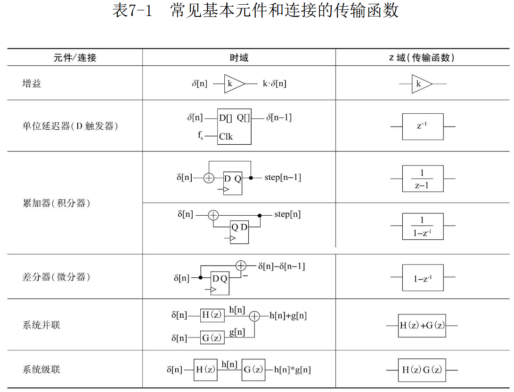
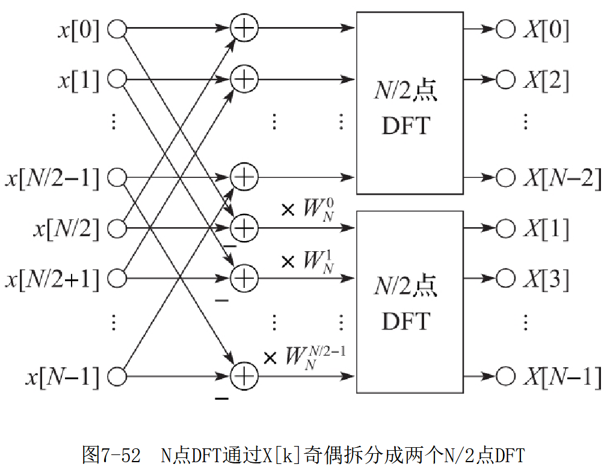
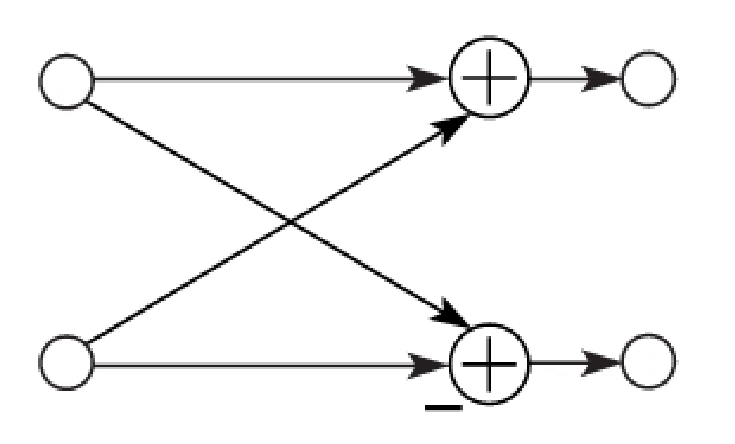
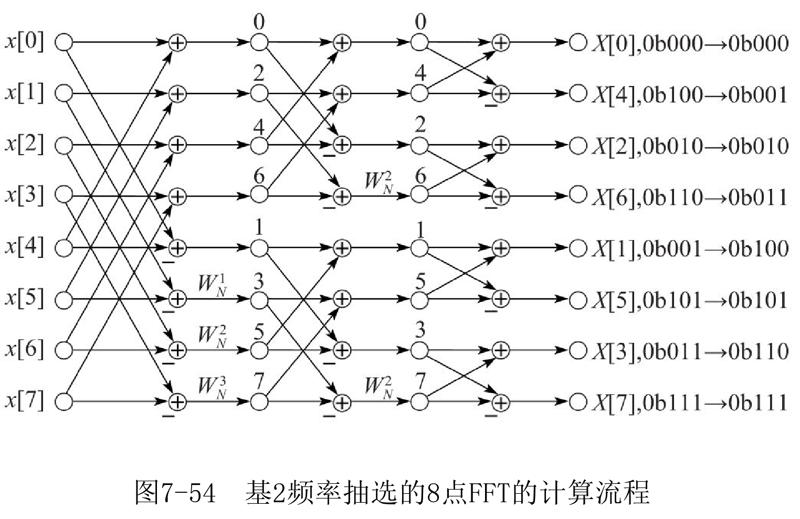
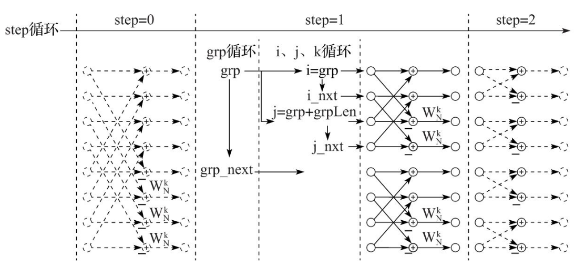

# 数字信号处理应用
## 基础
### LTI

数字域的信号就是时间离散、取值量化的数值序列。

LTI 是**线性时不变系统**。LTI $S\{\cdot\}$ 系统的**单位冲激响应**为输入单位冲激信号的响应：

$$
h[n] = S\{\delta [n]\}
$$

任何输入信号可以表示为无穷个单位冲激响应的加权平移之和，响应可以表示为单位冲激响应的加权和：

$$
\begin{align}
x[n]&=\sum_{k=-\infty}^{\infty}x[k]\delta[n-k]\\
S\{x[n]\}&=y[n]=\sum_{k=-\infty}^{\infty}x[k]h[n-k]
\end{align}
$$

这个求和过程又称**离散卷积**，定义为

$$
x[n]*h[n]\overset{\underset{\mathrm{def}}{}}{=}\sum_{k=-\infty}^{\infty}x[k]h[n-k]
$$

### Z 变换

定义变量 $z=re^{j\Omega}=r(cos\Omega + j sin\Omega)$，定义 **z 变换**：

$$
Z\{x[n]]\}\overset{\underset{\mathrm{def}}{}}{=}\sum_{n=-\infty}^{\infty}x[n]z^{-n}
$$

z 变换将一个序列变换成了复变量 z 的函数，对单位冲击相应 $h[n]$ 作 z 变换：

$$
H(z)=Z\{h[n]\}=\sum_{n=-\infty}^{\infty}h[n]z^{-n}
$$

得到的函数称为系统的**传输函数**。

*单位冲激响应 $h[n]$ 是系统特性在时域的表达，而传输函数 $H (z)$ 则是系统特性在复频域的表达。*

一般情况下，$A(\Omega)=|H(e^{j\Omega})|$ 是系统的幅度 - 频率响应，意为系统对信号归一化角频率 $\Omega$ 分量的增益，当系统归一化角频率单频时，$A (\Omega)$ 即为系统对单频的增益。$P (\Omega)=\angle H(e^{j\Omega})$ 是系统的相位 - 频率响应，意为系统对信号归一化角频率 $\Omega$ 分量的相移，当系统归一化角频率单频时，$P (\Omega)$ 即为输出信和和输入信号的相差。

### 基本元件



### 采样定律

序列中两个相邻数值的时间差称为采样周期，其倒数为采样率，单位 Hz。数字信号处理中常用归一化采样率。

### 离散信号的信号比

## 数值运算
### 乘法/除法

变量和变量的乘法运算符选用专用的乘法单元或通用逻辑单元

变量和常量的乘法，常用移位求和。使用 CSD 表示法，用减法代替一部分加法。依据常量的 CSD 表达来进移位加减, 计算变量与常量之积的乘法器称为 CSD 乘法器，CSD 乘法器比直接移位相加在数量上平均节省 1/3 的加法器。对于常量和变量乘法，FPGA 通常会自动调用通用逻辑来实现 CSD 乘法器。也可以通过多周期移位累加来计算。

对于性能要求不高的场合，除法也可以使用多周期。

## 平方根

与笔算类似，平方根可以用多周期实现。
## CORDIC
坐标旋转机（CORDIC）是再直角坐标系中对向量进行旋转变换
$$

$$
## FIR 滤波器

## IIR 滤波器
### 定点小数
数字信号处理中要表达的数值多半在 $[-1,1]$ 区间内。在数字域，应尽量让信号的数值范围接近数据位宽能表达的范围，以充分利用应有的量化精度，降低量化误差。

两个定点小数 $a (Qm, n), b (Qp, q)$，加法器的位数应该为 $max\{m, p\} + max\{n, q\}$，应将小数点对齐。乘法器需要的位数为 $max(m+n, p+q)$ p

## 快速傅里叶变换

$$
X[k] = \mathcal{F}\{x[n]\}=\sum_{n=0}^N x[n]e^{-j2\pi kn/N},N\in Z^+,k\in[0,N)
$$

称为长度为 N 的离散傅里叶变换 DFT，可以看作 z 变换在 $r=1$ 时的变体。离散傅里叶变换将序列 $x[n]$ 变换成另一个序列 $X[k]$，序列 $X[k]$ 是复数序列，表达了 $x[n]$ 中不同归一化角频率 $\Omega=\frac{2\pi k}{N}$ 的成分的幅度和相位信息，称为**频谱**。时域上两个序列的卷积，等效为对它们经过傅里叶变换后得到的频域序列做逐元素的乘积。

以 $N=4$ 为例，可以将上面式子写成矩阵形式：

$$
\begin{pmatrix} X[0] \\ X[1] \\ X[2] \\ X[3]\end{pmatrix} = \begin{pmatrix} w_N^0 & w_N^0 &w_N^0 &w_N^0 \\ w_N^0 & w_N^1 &w_N^2 &w_N^3 \\w_N^0 & w_N^2 &w_N^4 &w_N^6 \\w_N^0 & w_N^3 &w_N^6 &w_N^9 \end{pmatrix}=\begin{pmatrix} x[0] \\ x[1] \\ x[2] \\ x[3]\end{pmatrix}
$$

其中：$w_N=e^{-j 2\pi /N}, w_N^{nk}=cos\frac{2\pi nk}{N}-jsin\frac{2\pi nk}{N}$，矩阵中的每一行的实部和虚部都为不同频率的余弦和负正弦信号，从上而下，归一化角频率为 $2\pi k/N, k\in\mathbb{Z}_N$，因此频谱中的实项为序列与归一化角频率 $\Omega=2\pi k/N$ 的余弦采样序列的逐元素乘积和，虚部为相应的负正弦序列乘积和。

上面的计算，都需要 $N^2$ 次复数乘法和 $N (N-1)$ 次复数加法，复杂度为 $O (N^2)$。**快速傅里叶变换 FFT** 是离散傅里叶变换的改进，利用 $w_N^{nk}$ 的周期性将大规模运算分解为小单元复用。

如果 $N$ 为偶数，将 $X[k]$ 分为奇偶两部分考虑，对于 $m=0,1,\cdots, N/2 -1$

$$
\begin{align}
X[2m]&=\sum_{n=0}^{N/2 - 1}x[n]w_N^{2mn} + \sum_{n=N/2}^{N - 1}x[n]w_N^{2mn}\\
&=\sum_{n=0}^{N/2 - 1}x[n]w_N^{2mn} + \sum_{n=0}^{N/2 - 1}x[n+N/2]w_N^{2m(n+N/2)}\\
&=\sum_{n=0}^{N/2 - 1}(x[n]+x[n+N/2])w_N^{2mn} \\
X[2m+1]&=\sum_{n=0}^{N/2 - 1}(x[n]-x[n+N/2])w_N^nw_N^{2mn} 
\end{align}
$$

可以得知，偶数部分是关于 $x[n]+x[n+N/2]$ 的长度为 $N/2$ 的 DFT。奇数部分是关于 $x[n]+x[n+N/2] w_N^n$ 的长度为 $N/2$ 的 DFT。长度为 $N$ 的 DFT 拆解为长度为 $N/2$ 的 DFT。若 $N$ 为 2 的整数次幂，可以一致拆解到长度为 1 的 DFT，即 $X[0]=x[0]$。



其中每一次迭代会经历一种蝶形运算单元。



注意最后得到的序列并非顺序，而是按角标的二进制位逆序排列，成为按位逆序。



这样在 $X[k]$ 种分奇偶抽选的 FFT 计算方法成为“基 2 频率抽选”，在 $x[n]$ 中分奇偶抽选计算的方法称为“基 2 时间抽选”, 它们都将算法复杂度从复杂度 $O (N^2)$ 降低到了 $O (N log_2N)$。

离散傅里叶变换的逆变换（IDFT）定义为：

$$
x[n] = \mathcal{F}^{-1}\{X[k]\}=\frac1 N \sum_{k=0}^N X[k]e^{j2\pi kn/N},N\in Z^+,n\in[0,N)
$$

将正变换得到的序列还原，与正变换形式上仅有指数正负和系数 $1/N$ 之差。

### 多周期实现

长度为 N 的 FFT/IFFT 算法需要 $log_2 N$ 个拆分步骤，$step \in [0, log_2 N)$，每个步骤将数据分组，每组有 $GrpLen = N/2/2^{sterp}$ 个数据，前后两个组配对参与和或差的积运算，共有 $N/GrpLen$ 组。伪代码：

```c
// 基 2 频率抽选 FFT 算法的伪代码
M = log2(N);
grp = 0;
grpLen = N/2;
for (step = 0; step < M; step++)
  for (grp = 0; grp < N; grp += 2 * grpLen)
    for (i = grp, j = grp + grpLen, k = 0;
      i < grp + grpLen;
      i++, j++, k += 2^step)
      u = x[i] + x[j];
      v = (x[i] - x[j]) * w[k];
      x[i] = u; x[j] = v;
    endfor
  endfor
  grpLen = grpLen / 2;
endfor
```

各循环变量的意义如下：



对于硬件实现：

- 数据的实部和虚部分别用两个 RAM 存储，字深为 N。
- $w_N^k$ 的实部和虚部分别用两个 RAM 存储，并预先初始化好内容，长度 $N/2$。
- 实现 step, grp, i 三层循环控制。
- 在 i 循环的每一次，可能需要多个时钟分别执行读 x[i]、读 x[j]、读 w[k]、计算、写 x[i]、写 x[j] 的操作，若使用单口 RAM，这些操作需要 4 个周期。

## 流水线实现

存储器接口的 FFT 模块适合作为处理器的外设，由处理器或处理器控制下的 DMA 向其提供数据并控制其运作。流水线实现的 FFT 适合用于流式数据处理


# 通信

## LFSR

https://blog.csdn.net/Loudrs/article/details/130554990?spm=1001.2014.3001.5502