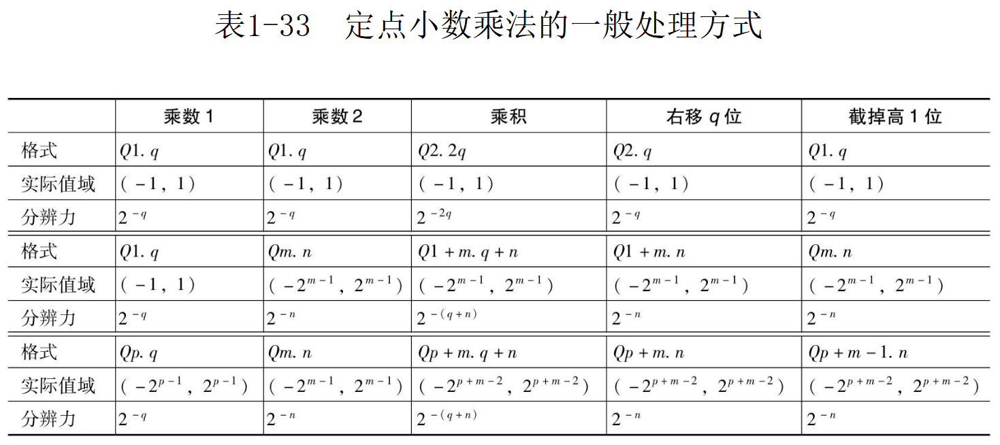

# Wong
# 数字电路

$$
Val = \sum_{i=-F}^{l-1} d_i \cdot 10^i
$$

两个位宽同为 W 位的二进制数 $a, b$ 的和为模，即 $2^W$，称 a 和 b 互为补码。“补码表达”，即在一定的位宽下，使用负数绝对值的补码来表达负数。此时最高位可以称为符号位。补码表达下加减运算的这些一致性和简便性，使得补码成为数字电路和计算机中表达负数几乎唯一的方法。

W 位二进制有符号数可表达的范围是

$$
[-2^{W-1}, 2^{W-1}-1]
$$

W 位二进制无符号数可表达的范围是

$$
[0, 2^{W}-1]
$$

对于加减法运算，为了保证不溢出，结果必须扩展一位。对于乘除法情况要复杂一些。一般需要 2W 位完整表示

- 无符号乘法：两个 W 位无符号数相乘
最小值是 0
最大值的范围 $2^{2W-1}-1 \le (2^W-1)^2 = 2^{2w}-2^{W+1}+1 < 2^{2W} - 1$，当且仅当 $W=1$ 时取等号。因此 $W\ge 2$，$2 W$ 位无符号数能表达所有结果。
- 有符号乘法：两个 W 位有符号数相乘
最小值的范围 $-2^{2W-2}<-2^{W-1}*(2^{W-1}-1)=-2^{2W-2}+2^{W-1}\le-2^{2W-3}, W\ge2$，当且仅当 $W=2$ 时取等号。因此 $W\ge 3$，$2 W$ -1 位能表达所有负数。
最大值的范围 $2^{2W-2}-1 \le (-2^{W-1})^2 = 2^{2w-2}\le2^{2W-1} - 1, W\ge 1$ 当且仅当 $W=1$ 时取等号。为了表达最大值，需要 $2 W$ 位。
次大值 $2^{2W-3}-1 < (-2^{W-1})*(-2^{W-1}+1) = 2^{2w-2}-2^{W-1}<2^{2W-1} - 1, W\ge 2$，因此 $W\ge 2$，这个次大值 $2W-1$ 位就能表达。
这意味着, 在两个有符号数位宽 $W\ge3$ 时 (事实上, 在数字电路和计算机中表达数值的二进制, 很少有 2 位或以下的), 为了表达它们的乘积的所有可能情况, 确实需要 $2W$ 位, 而只要剔除 $-2^{W-1}*(-2^{W-1})$ 这个唯一情况, 便只需要 $2W-1$ 位即可全部表达了

## 组合逻辑
### 编码器、译码器、数据选择器

独热码转二进制码为编码，通常有 4-2/8-3。实际常用的是优先编码器，即只要最低的第 n 位为 1，无论高位，输出为 n。数据选择从多个输入选择一个输出。

### 延迟和竞争冒险

从输入信号变化到输出信号变化的时间延迟为传输延迟。组合逻辑电路因为路径延迟导致输出出现暂时的不正确值的现象称为竞争冒险。竞争冒险可以通过在逻辑中分配冗余项、使用模拟滤波器等方法消除。但在 FPGA 中,基本只会使用同步时序逻辑电路。正常的同步时序逻辑电路天然地不受竞争冒险影响。

### 加法器、乘法器

异或门可以是一个一位半加器

一位全加器可以表示为：

$$
\begin{matrix}
Y = (A\oplus B)\oplus C_i\\
C_o = AB + (A\oplus B)C_i
\end{matrix}
$$

使用多个一位全加器可以构成多位全加器。减法器可以通过将减数求补码再与被减数相加来实现，而有符号加减与无符号加减法电路一致。

多位全加器的构成可以有多种形式。如纹波进位、超前进位。

乘法器可类似笔算顺序。

### 锁存器

组合逻辑的输出只与当前的输入值有关，而锁存器和触发器则能够记忆输入值。锁存器电平敏感。

### 触发器

时钟边沿触发。如果在时钟上升时刻的附近输入 D 正在发生变化, 则主锁存器将长时间不能稳定到高电平或低电平，称为“亚稳态”。时钟有效沿前后的 $T_{SU},T_H$。

## 时序逻辑
### 移位寄存器和串并转换

![[assets/数字电路/4位移位寄存器.png]]

n 个多位触发器即为延迟链。n 阶延迟链实现 z 域函数 $z^{-n}$

### 分频器

D 触发器可构成 2 分频器也即 T 触发器，n 级可构成 $2^n$ 分频

![[assets/数字电路/分频器.png]]

### 计数器

使用计数器使用加法器和触发器实现。进位输出将在计数器输出溢出的前一个周期出现。

![[assets/数字电路/进位计数器.png]]

![[assets/数字电路/进位计数器波形.png]]

有时需要计数器计到特定值后回到 0

![[assets/数字电路/模计数器.png]]

### 累加器

加法器的输入改为多位可构成累加器。

累加器在 DSP 中就是积分器，实现 z 域传输函数 $\frac{1}{z-1}$

## 存储器

存储器是用来存储数据的器件或电路单元，D 锁存器或触发器本身就是 1 位存储器，但通常所说的存储器都是指大量数据的存储单元。

![[assets/数字电路/二进制词头.png]]

存储器按掉电 (即撤去供电) 后数据是否丢失可分为易失性和非易失性两种,易失性意为掉电数据丢失,非易失性为掉电数据依然留存。按存取能力可分为 ROM(只读存储器) 和 RAM(随机访问存储器) 两种。ROM 并非如字面意义上完全不能写入,因为凡是不能直接进行写入,而是要先进行块擦除才能写入的存储器也被分类到 ROM。而 RAM 则可随时读或写任意字或字节。

![[assets/数字电路/常见存储器.png]]

（注：图中 Synchronous 为 static）

NAND Flash 广泛用于固态硬盘、存储卡、闪存盘 (俗称“U 盘”)，而 SDRAM 则主要用于计算机和嵌入式计算

设备的运行内存,SDRAM 根据每个时钟周期读写数据的次数又分为 SDR(Single Data Rate)、DDR(Dual Data Rate) 和 QDR(Quad Data Rate)。

而在 FPGA 中最为常用的则是 SSRAM,主要原因是其速度快、访问灵活,适合数字逻辑中复杂算法数据的存取。CPU 中的高速缓存也是由 SSRAM 构成。高速缓存是 CPU 中重要的组成角色,很多 CPU 中的高速缓存

甚至会占到硅片中一半的面积。

### SRAM

如图是一个 8 位宽、4 字深的 SRAM，行由 2-4 译码器驱动，列由 8 个读写单元控制。

![[assets/数字电路/SRAM.png]]

每个单元由两个非门构成保持环，WL(Word Line) 为高，BL(Bit Line) 为低的一个触发保持环新值（两个非门驱动力较弱），若 BL 未被驱动，可以通过 BL 读取保持环的值。

读写电路中，右侧 Q 驱动差分放大器，WR 为低时，BL 不被驱动，Q 输出被地址译码选中的值，WR 为高时，存储单元被更新。

![[assets/数字电路/SRAM单元.png]]

不需要时钟参与的为异步 SRAM(ASRAM)。

A 称为 SRAM 的地址，地址通常拆分为行列地址。SRAM 的容量为 $Capacity=2^{AW}*DW$。对于多字节位宽的 SRAM，每个字地址对应着多字节，SRAM 会额外提供字节使能输入。

存储器中存储 16 位及更宽的数据时，可将数据的低字节放置在存储器的低字节地址上，称为**小端模式**，也可将数据的高字节放置在存储器的低字节地址上，称为**大端模式**。如果存储数据的起始地址可以被数据的字节数整除，则称为**对齐存储**，否则称为**非对齐存储**。对齐存储可以提高数据访问速率，但可能会浪费一些存储空间。

## 小数

数字信号领域一般将信号值域认为是 $[-1, 1]$。数字电路表达小数有定点和浮点两种形式。定点形式可以有整数运算变化，但其表达范围和分辨率固定，需要精心设计整数和小数位宽，以保证结果不会溢出或累计较大误差的前提下，电路面积尽可能小。浮点形式比较复杂，需要专门的电路来完成，但表达范围大，分辨率也是动态的，一般不考虑溢出和累计误差问题。

使用记号 $Q_{m.n}$ 表示定点小数格式，其中 $m$ 为整数部分（包含符号位），$n$ 为小数部分位数，共 $m+n$ 位，该二进制数表示整数 a，其值 $a_q=\frac{a}{2^n}$。$Q_{m.n}$ 能表达的范围 $v\in[-2^{m-1}, 2^{m-1}-2^n]$，有时也记为 $v\in[-2^{m-1}, 2^{m-1})$，分辨力 $\epsilon =2^{-n}$。

显然，数值进行转换时会有误差，四舍五入的误差最大为 $2^{-n-1}$，截尾误差最大为 $2^{-n}$

### 定点小数

和差运算和整数和差没有区别，结果为 $Q_{m+1.n}$ 格式，如要恢复位数，需要考虑溢出。

对于乘法，两个 $Q_{m. n}$ 小数相乘将得到 $Q_{2m. 2n}$ 格式, 如要恢复到 $Q_{m. n}$ 格式, 需将结果除以 $2n$ , 然后截取低 $W$ 位。定点信号处理中，为了保持数据格式一致，往往要求数据在 $(-1, 1)$ 之间，即在 $[-1+2^{-n}, 1-2^{-n}]$，不同格式乘法的移位和截短处理如下，其中保证了结果格式与乘数 2 格式一致 (或至少小数位数一致)，截短均无溢出，但因右移位均损失了 q 位精度。这个 q 位的精度损失一般是无法避免的，是需要容忍的。



对于除法，两个 $Q_{m. n}$ 小数相除结果没有小数，如要得到 $Q_{m. n}$ 格式，需要将结果乘以 $2^n$。由于有限字长效应，先除后乘将大幅牺牲精度，所以一般先将被除数乘以 $2^n$ 后，再做除法。

### 浮点数

与十进制科学计数法类似，二进制得小数也可以写成下面形式：

$$
(-1)^s\cdot (1+f)\times 2^E, f\in[0,1)
$$

根据范围和精度要求，IEEE 754 规范定义了半精度、单精度、双精度、四精度、八精度。除了非零有效值，规范还利用 $E=-15, E=16$ 两种情况定义了 $\pm NaN，\pm \infty, \pm 0$。

浮点数的分辨力与数值大小动态相关。

## 同步时序逻辑

整个电路使用同一个时钟，触发器的工作与否由使能控制的电路称为同步时序电路。同步时序电路时钟单一，触发器的工作不受到组合逻辑竞争冒险的影响,在 FPGA 中,基本只会使用同步时序逻辑。为使同步时序逻辑电路正常工作，必须保证每一个触发器的数据和时钟都满足建立时间和保持时间的要求。

# Verilog 基本应用
## 组合逻辑

编码器和译码器

```verilog
    always_comb begin
        out = '0;
        for(integer i = 2**OUTW - 1; i >= 0; i--) begin
            if(in[i]) out = OUTW'(i);
        end
    end
```

该逻辑会从高位到低位判断是否为 1，意为只要较低的第 n 位为 1，则无论高位如何，输出为 n。如 $1010->01, 011->0$。

## 时序逻辑

## 跨时钟域

## 存储器

FPGA 中实现 SSRAM（同步 SRAM）按照单口/双口、简/真双口可以分为几种常见模式。单口是输入只有一组数据线和一组地址线，读写共用地址线，输出只有一个端口。简单双口是指两个口一个只能读、一个只能写；真双口指两个口都能独立读写。

## FIFO
## 按键

使用触发器在一般 10 ms 的周期下间歇地查询输入实现去抖，抖动时间一般在 10 ms 左右。


## PWM

脉冲宽度调制（Pulse Width Modulation）是输出矩形波占空比与待调信号瞬时值呈线性关系的调制。可用信号与锯齿波比较得到。


PWM 常用于功率元件的驱动，如开关电源变换器中的开关器件、控制系统中的电机等，也可在低要求场合做数模转换，相当于采样率为 PWM 频率的 DAC。PWM 输出至片外经过低通重构滤波器可以得到与占空比呈正比的输出电压。

### 单端 PWM

输出占空比：$\eta = data/M, data\in [0, M-1]$

输出频率：$f_{PWM}=f_{clk}/M$

输入可能是有符号或无符号。

### 差分 PWM

功率元件常常需要全桥驱动，以便在但功率电源时获得双极性的驱动电压。全桥驱动需要差分 PWM，由 P 和 N 两个信号构成。表达占空比范围为 [-1, 1], 形式也有很多，如差动时间、固定 P 相、固定 N 相、固定低电平和固定高电平。

## FSM

状态机记录当前状态，并依据输入和当前状态来切换状态，同时依据输入和当前状态来决定输出。用 Verilog 描述状态机时，一般分为“状态转换”、“状态驱动”和“输出驱动”三段，称为“三段式状态机描述”。状态转换段由组合逻辑构成，根据当前状态和输入决定下一状态；状态驱动段由触发器逻辑构成，在时钟驱动下，将下一状态锁定到当前状态；输出驱动段可以是触发器逻辑也可以是组合逻辑，用于描述输出。

输出和输入有关则为 Mealy 型状态机。Moore 型状态机较 Mealy 型状态机易于描述。
