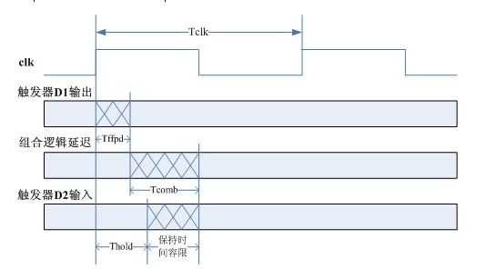

# STA 静态时序分析
### Setup Hold
 **建立时间**（setup time）是指在触发器的时钟信号有效沿到来以前，数据稳定不变的时间
 **保持时间**（hold time）是指在触发器的时钟信号有效沿到来以后，数据稳定不变的时间
 建立时间决定了该触发器之间的组合逻辑的*最大*延迟。保持时间决定了该触发器之间的组合逻辑的*最小*延迟

$建立时间容限＝T_{clk}-T_{ffpd}(max)-T_{comb}(max)-T_{setup}$

$T_{setup}≤T_{clk}-T_{ffpd}(max)-T_{comb}(max)$

$保持时间容限+T_{hold}＝T_{ffpd}(min)+T_{comb}(min)$

$T_{hold}≤T_{ffpd}(min)+T_{comb}(min)$

**总结**
无 skew：
$T>Tco+Tlogic+Tsu$
$Thold<Tco+Tlogic$
有 skew：
$T>Tco+Tlogic+Tsu-Tskew$
$Thold<Tco+Tlogic-Tskew$

从 CMOS 到建立时间和保持时间

https://zhuanlan.zhihu.com/p/120863919

包括复位、时钟域多个概念

产生 setup hold 的原因

### FPGA 时序约束

静态时序分析基础. pdf

UltraFast 设计方法时序收敛快捷参考指南 c_ug 1292-ultrafast-timing-closure-quick-reference

两篇总结的很好的时序约束的文章：

[八小时超长视频教你掌握FPGA时序约束！](https://mp.weixin.qq.com/s/V3qCQNCcxpO_PaWso3GWkw)

结合上面一文整理的时序约束笔记: 时序约束整理. md

[FPGA时序分析—vivado篇](https://mp.weixin.qq.com/s/gkXRNblISyUIIrIxLRmLgw)

[时序约束策略](https://mp.weixin.qq.com/s/dmJck_7vDd57JFvAL3dFpg)
