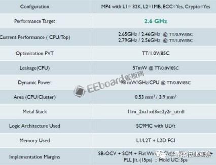

# 后端报告说明

<a href=" https://www.cnblogs.com/gujiangtaoFuture/articles/10095925.html">本文</a>围绕 A53 后端实现结果报告展开解读，介绍芯片制造相关知识，对比高性能与低功耗版设计差异，具体内容如下：

1. **芯片制造工厂与工艺节点**：手机芯片公司可选工厂包括台积电（TSMC）、联电（UMC）等。新工艺常选台积电，降成本时用联电。TSMC 的 16nm 有 FFLL+、FFC 等小节点，特性不同适用于不同芯片。比如手机芯片喜欢漏电低，成本低的，服务器喜欢频率高的，不一而足。
2. **后端报告关键指标解读**
    - **配置（Configuration）**：四核 A53，一级数据缓存 32KB、二级 1MB，开启 ECC 和加解密引擎，影响芯片面积、频率和功耗。
    - **目标频率（Performancetarget）**：后端工程师把频率称作 Performance，后端设计需在频率、功耗、面积（PPA）中选主优化参数，此报告为高性能 A53 设计，频率与面积、漏电正相关。
    - **当前性能（CurrentPerformance）**：包含不同电压和 Corner 下的频率。PVT（Process，Voltage，Temperature）用于分类晶圆上不同点特性，TT/0.9V/85C 是其中一种情况，按照电子漂移速度还可以有 SS，S，TT，F，FF 等等。这一栏有四个频率，上下两组容易区分，就是不同的电压。在频率确定时，动态功耗是电压的 2 次方，这个大家都知道。而左右两组数字的区别就是 Corner 了，分别为 TT 和 SSG。
    - **Signoff 条件**：后端流片有 Signoff 条件（如 SSG），影响芯片良率。按照这个条件出去流片，作为筛选门槛，之下的芯片就会不合格，跑不到所需的频率。所以条件设的越低，良率（Yield）就会越高。但是条件也不能设的太低，不然后端很难做，或者干脆方程无解，跑不出结果
    - **优化 PVT（OptimizationPVT）**：EDA 工具需优化目标，此报告选 1.0V 作为常用频率、功耗和面积的甜点值（SweetSpot），部分 Corner 可降频处理。
    - **漏电（Leakage）**：即静态功耗，它包含了四个CPU中的逻辑和一级缓存的漏电。但是A53本身是不包含二级缓存的，其他的一些小逻辑，比如SCU（SnoopingControlUnit）也在CPU核之外，这些被称作Non-CPU，包含在MP4中。待机时关注此功耗，可通过 powergating 关部分缓存。
    - **动态功耗（DynamicPower）**：常用 Dhrystone 程序测量，因其能最大程度消耗 CPU 核心逻辑功耗。动态功耗与电压、频率、温度相关，电压对其影响大。Dhrystone是个非常古老的跑分程序，基本上就是在做字符串拷贝，非常容易被软件，编译器和硬件优化，作为性能指标基本上只有MCU在看了。但是它有个好处，就是程序很小，数据量也少，可以只运行在一级缓存（如果有的话），这样二级缓存和它之后的电路全都只有漏电。虽然访问二级三级缓存甚至DDR会比访问一级缓存耗费更多的能量，但是它们的延迟也大，此时CPU流水线很可能陷入停顿。这样的后果就是Dhrystone能最大程度的消耗CPU核心逻辑的功耗，比访问二级以上缓存的程序都要高。所以通常都拿Dhrystone来作为CPU最大功耗指标。实际上，是可以写出比Dhrystone更耗电的程序的，称作MaxPowerVector，做SoC功耗估算的时候会用上。
    - **面积（Area）**：与芯片公司毛利率相关，所以在性能符合的情况下，越小越好，甚至可以牺牲功耗，不惜推高电压，所以有了OD（OverDrive）（有个数据，当前28nm上，每个平方毫米差不多是10美分的成本）。苹果 A10 面积大，用于提升 GPU 等模块性能，通过降频、增加处理单元和缓存等方式实现，同时也采取多种功耗控制技术，如 ClockGating、PowerGating 等，但会增加面积和设计复杂度。
	    - 那苹果这么大的面积到底是做什么了？首先，像GPU，Video，Display，基带，ISP这些模块，都是可以轻易的拿面积换性能的，因为可以并行处理。而且，功耗也可以拿面积换，一个最简单的方法就是降频，增加处理单元数。这样漏电虽然增加，但是电压下降，动态功耗可以减少很多。一个例外就是CPU的单核性能，为什么苹果可以做到Kirin960的1.8倍，散热还能接受？和物理库，后端，前端，软件都有关系。
	    - 首先，A10是6发射，同时代的A73只用了2发射。当然，由于受到了数据和指令相关性限制，性能不是三倍提升，而6发射的后果是面积和功耗非线性增加。作为一个比较，我看过ARM的6发射CPU模型，同工艺下，单核每赫兹性能是A73的1.8倍，动态功耗估算超过2倍，面积也接近2倍。当然，它的微结构和A73是有挺大区别的。这个单核芯片跑在16nm，2.5Ghz，单核功耗差不多是1W。而手机芯片的功耗可以维持在2.5W不降频，所以苹果的2.3Ghz的A10算下来还是可行的。
	    - 为了控制功耗，在做RTL的时候就需要插入额外晶体管，做ClockGating，而且这还是分级的，RTL级，模块级，系统级，信号时钟上也有（我看到的SoC时钟通常占了整个逻辑电路功耗的三分之一）。这样一套搞下来，面积起码大1/3. 然后就是PowerGating, 也是分级的。最简单的是每块缓存给一个开关，模块也有一个开关。复杂的根据不同指令，可以计算出哪些Cachebank短时间内不用，直接给它关了。PowerGating需要的延时会比ClockGating大，有的时候如果操作很频繁，PowerGating反而得不偿失，这需要仔细的考量。而且，设计的越复杂，验证也就越难写，这里面需要做一个均衡。除了时钟域，电源域，还有电压域，可以根据不同频率调电压。当然了，域越多，布线越难，面积越大。
	    - 再往上，可以定义出不同的powerstate，让上层软件也参与经来，形成电源管理和调度。
	    - 再回到苹果A10，它还使用了6MB的缓存。这个在手机里面也算大的惊世骇俗。通常高端的A73加2MB，A53加1MB，已经很高大上了，低端的加起来也不超过1MB。我拿SPECINT2K在A53做过一些实验，二级缓存从128KB增加到1MB只会增加15%不到的性能，到6MB那性能/面积收益更不是线性的，这是赤裸裸的面积换性能。而且苹果宣扬的不是SPECINT，而是GeekBench4.0，我怀疑是不是这个跑分对缓存大小更敏感，有空可以做做实验。顺带提一句，安兔兔5.0和缓存大小没半毛钱关系，这让广大高端手机芯片公司情何以堪。到了6.0似乎改了，我还没仔细研究过。至于使用了大面积缓存引起的漏电，倒是有办法解决，那就是部分关闭缓存，用多少开多少，是个精细活，需要软硬件同时配合。
    - **MetalStack**：芯片制造有多层蚀刻，11m 表示 11 层，层数影响走线和成本，也与面积利用率有关，需综合考虑布局布线。
    - **逻辑架构和内存（LogicArchitecture 和 Memory）**：逻辑电路两大模块。uLVT 表示超低电压门限，可用于提升频率但漏电高，和频率是对数关系，也就是说，漏电每增加10倍，最高频率才增加log10%。后端可以给EDA工具设一个限制条件，比如只有不超过1%的需要冲频率的关键路径逻辑电路使用uLVT，其余都使用LVT，SVT或者HVT（电压依次升高，漏电减小），来减小总体漏电。。对于动态功耗，后端还可以定制晶体管的源极和漏极的长度，越窄的电流越大，漏电越高，相应的，最高频率就可以冲的更高。所以我们有时候还能看到uLVTC16，LVTC24之类的参数，这里的C就是指ChannelLength。
    - 内存访问有 read、write 和 setup 三个重要参数，这三个参数可以是同样的时间，也可以不一样。对于一级缓存来说基本用的是同样的时间，并且是一个时钟周期，而且这当中没法流水化。从A73开始，我看到后端的关键路径都是卡在访问一级缓存上。也就是说，这段路径能做多快，CPU就能跑到多快的频率，而一级缓存的大小也决定了索引的大小，越大就越慢，频率越低，所以ARM的高端CPU一级缓存都没超过64KB，这和后端紧密相关。当然，一级缓存增大带来的收益本身也会非线性减小。之后的二三级缓存，可以使用多周期访问，也可以使用多bank交替访问，大小也因此可以放到几百KB/几MB。
    - 逻辑和内存统称为PhysicalLibrary，物理库，它是根据工厂给的每个工艺节点的物理开发包（PDK）设计的，而Library是一个Fabless芯片公司能做到的最底层。能够定制自己的成熟物理库，是这家公司后端领先的标志之一。
    - **Margin**：生产过程有偏差，此指标定义偏差范围。蓝色表示我们刚才说的一些Corner的分布，红色表示生产偏差Variation。必须做一些测试芯片来矫正这些偏差。SB-OCV表示stage-basedon-chipvariation，和其他的几个偏差加在一起，总共+-7%，也就是说会有7%的芯片不在后端设计结束时确定的结果之内。后面还有一些setupUC之类的，表示信号建立时间，保持时间的不确定性（Uncertainty），以及PLL的抖动范围。
3. **低功耗版实现版本对比**：频率降至 1.5 G 左右，每 Ghz 动态功耗减少 10%，静态功耗降至 12.88mW（为原来的 25%），使用 LVT 而非 uLVT，面积基本不变。

# 教程

参考教程：比较完整的流程讲解

[数字asic流程实验（五） ICC布局布线 - sasasatori - 博客园 (cnblogs.com)](https://www.cnblogs.com/sasasatori/p/15068606.html)

[ChuYC292-CSDN博客](https://blog.csdn.net/weixin_46752319)

[IC Compiler (ICC) | 皓宇的筆記 (wordpress.com)](https://timsnote.wordpress.com/digital-ic-design/ic-compiler/)

完整的教程、包括一些技能

[数字后端_zwsange的博客-CSDN博客](https://blog.csdn.net/qq_47485904/category_12191605.html)****

全流程和设计归纳，还有一些 CPU 设计实例

[数字集成电路全流程设计、仿真、综合以及版图等设计，使用centos中EDA软件。包括vcs仿真、DC综合、FM形式验证、Astro版图设计、物理验证、PT时序分析等各步骤_ant检查-CSDN博客](https://blog.csdn.net/weixin_48984764/article/details/130029307)

数字全流程各部分学习方法

[数字ic后端学习ing-CSDN博客](https://blog.csdn.net/weixin_41788560/article/details/117594807)

IC Compiler（以下简称 ICC）是 Synopsis 公司用于把门级网表转换成代工厂可用于掩膜的版图信息的工具。其基本工作流程为

- 数据准备（Data Setup）：将门极网表、约束文件、元件库、工艺文件、物理库、寄生参数模型等输入 ICC；
- 布局规划（Design Planning）：规定芯片尺寸、形状，确定 IO、电源、pad 位置等，放置宏单元，放置标准单元，铺设电源网络；
- 布局（Placement）：将电路中各个基本单元在芯片中进行布局；
- 时钟树综合（Clock Tree Synthesis）：将时钟信号连接至需要驱动的基本单元；
- 布线（Routing）：将各个基本单元对应端口进行连接；
- 可造性设计（Chip Finishing）：连线拓展、加宽连线，冗余通孔插入，插入填充单元，填充金属等；

如下图所示。

![[assets/back_end.png]] 即将 DC 综合后输出的 SDC 约束文件，门极网表，代工厂提供的元件库（.db），物理库（physical lib），工艺文件（.tf），RC 参数文件（tlu+）等输入 ICC 后，通过软件中完成布局布线操作，最终会输出可以提供给代工厂进行芯片加工的版图。

![[assets/data.png]]

观察剖面图可以很容易的看出制作时的分层关系。制作该非门时所需要的版图包括：

- N-well：N 阱
- active：有源区
- N-implant：N 型掺杂
- P-implant：P 型掺杂
- poly：栅
- contact：金属触点
- metal1：金属连线

如下图所示

![[assets/layer.png]]

通过编写运行 TCL 脚本完成 Data Setup 步骤，该步骤主要的目的是将门极网表（.v）、约束文件（.sdc）、单元库（.db，.sdb）、物理库（physical lib）、寄生参数模型（tlu+）等输入 ICC。

本次实验的 TCL 脚本内容如下：
