> 参考
> 《Clock Domain Crossing》翻译与理解（1）亚稳态 - 0431 大小回的文章 - 知乎
>
> https://zhuanlan.zhihu.com/p/359325914
>
> 硬件架构的艺术. pdf 第三章
>
> CDC-- 讲师卢子威. pptx
>
> 总结的文档：CDC 总结. md
> https://www.cnblogs.com/lyc-seu/p/12441366.html

[跨时钟域处理方法](https://www.cnblogs.com/rouwawa/p/7501319.html)

# 跨时钟问题 (Clock Domain Crossing)

异步时序：异步时序设计指的是在设计中有两个或以上的时钟，且时钟之间是同频不同相或不同频率的关系。而异步时序设计的关键就是把数据或控制信号正确地进行跨时钟域传输。

CDC 分为单比特和数据流两种，数据流一般采用异步 FIFO 处理。单比特分为两种：慢时钟到快时钟，因为快时钟肯定可以看见慢时钟的，所以解决办法比较灵活，有取反法和打拍法；快时钟到慢时钟，此时慢时钟已经看不见快时钟了，情况比较复杂，有取反法和握手信号反馈法。

## 亚稳态

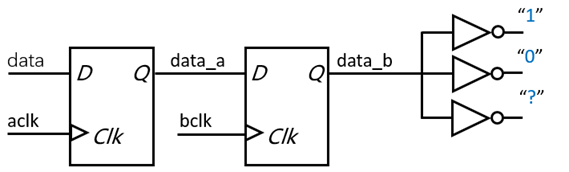

产生原因：每一个触发器都有其规定的建立 (setup) 和保持 (hold) 时间参数, 在这个时间区间内，输入信号需要保持稳定。否则，对其进行采样，得到的结果将是不可预知的，即亚稳态。

解决方案：

​	两级或多级同步器隔离亚稳态

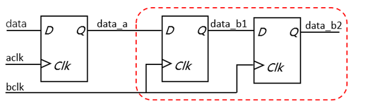

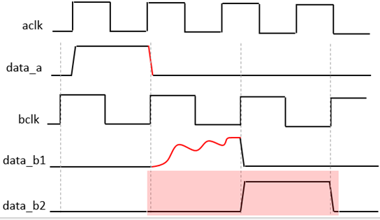

打两拍，就是定义两级寄存器, 对输入的数据进行延拍。两级寄存是一级寄存的平方, 两级并不能完全消除亚稳态危害, 但是提高了可靠性减少其发生概率。总的来讲, 就是一级概率很大, 三级改善不大。

* 亚稳态无法消除
* 亚稳态只能被隔离，降低发生概率
* 两级同步器之间不要有组合逻辑

如何评估其危害——MTBF：故障前的平均时间

* MTBF 定量评估亚稳态对可靠性的影响
* MTBF is a measure of how often, on the average, a metastable event lasts a time tr or longer.

下式适用于一级同步寄存

$$
MTBF=\frac{e^{t_r/t_{sw}}}{Wf_cf_d}
$$

* tr——the resolving time allowed for metastable events
* tsw——device specific
* W——device specific
* fc——system clock frequency
* fd——average asynchronous data frequency

$$
MTBF=\frac{e^{t_r/\tau}}{T_0f\alpha}
$$

$$
MTBF=\frac{1}{f_{clk} * f_{data} * x}
$$

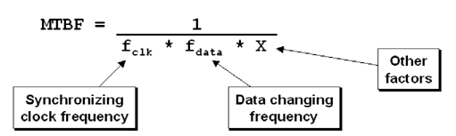

随着同步时钟频率和数据变化频率的提升，MTBF 的值越小，电路出现亚稳态的概率就越高。

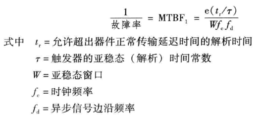

## 数据保持（快时钟域到慢时钟域）

慢时钟很可能无法捕捉快时钟的信号，因此需要采用脉冲同步法或者反馈法把这个脉冲延长。脉冲同步法需要人为控制两个脉冲之间的间隔，反馈法可以自动控制。

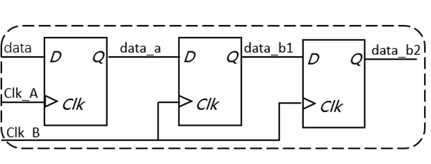

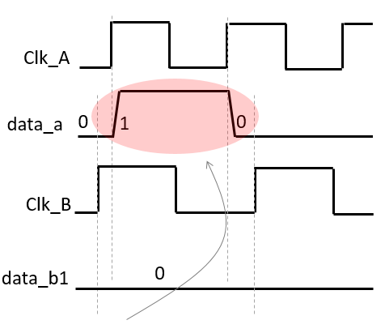

产生原因：​	数据从快时钟域到慢时钟域，数据保持的时间较短，无法被慢时钟域采样

解决方案：

* 数据展宽
* 脉冲同步

### 数据展宽

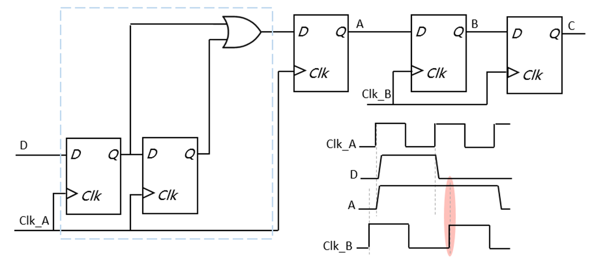

### 脉冲同步器（也适用于低频时钟域到高频时钟域）

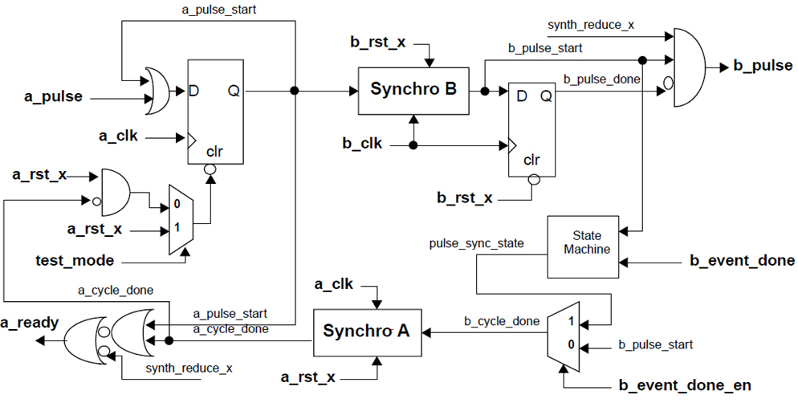

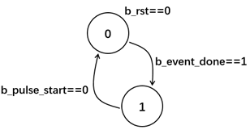

1. 时钟域 A 中采样 a_pulse 后保持
2. 电平信号送到时钟域 B 中同步并生成脉冲信号 b_pulse
3. 在时钟域 A 中生成的电平信号需要复位，在时钟域 B 中生成的复位信号，b_cycle_done 产生
4. b_cycle_done 送到时钟域 A 中同步，产生复位信号

特点：

* 异步复位
* 响应信号，具有握手机制
* 测试模式信号

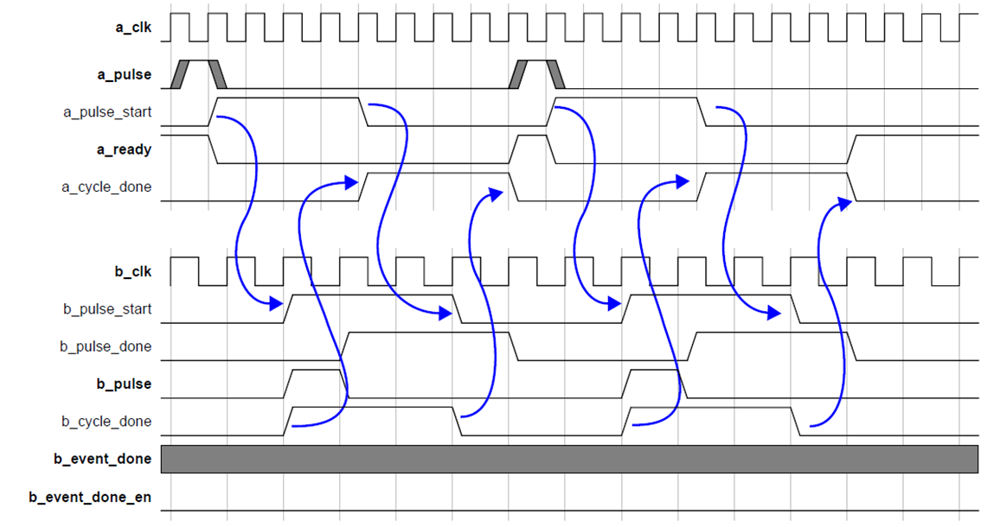

## 数据冗余（慢时钟域到快时钟域）

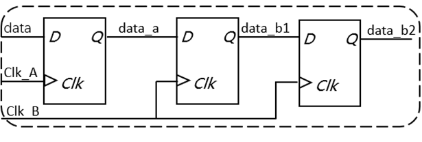

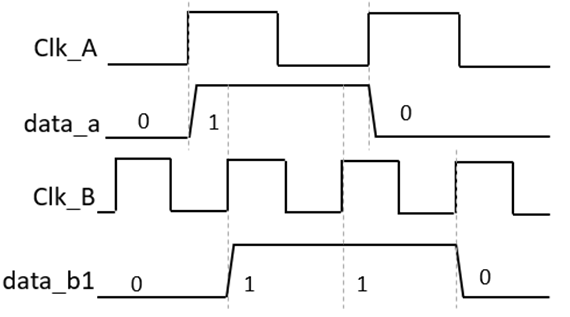

产生原因：​	数据从慢时钟域到快时钟域，数据在目标时钟域被多次采样

解决方案：

* 脉冲同步器
* 边沿检测

边沿检测：快时钟域是一定可以“捕捉”到慢时钟域的，所以可以直接对慢时钟域的脉冲同步信号打两拍来消除亚稳态。然后检测上升沿形成快时钟的脉冲即可。

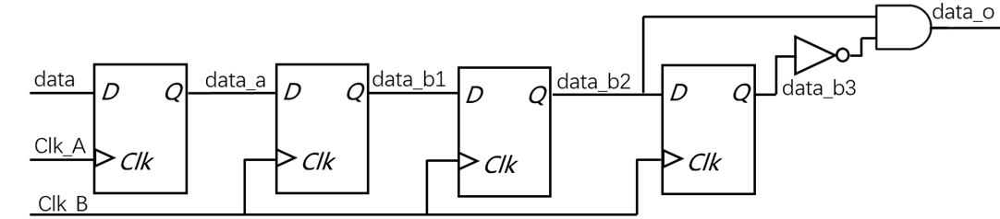

### 数据相关性丢失

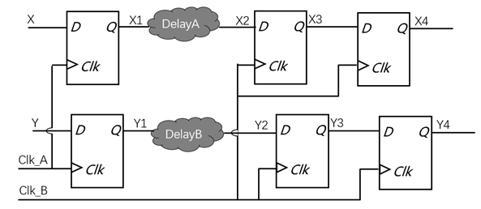

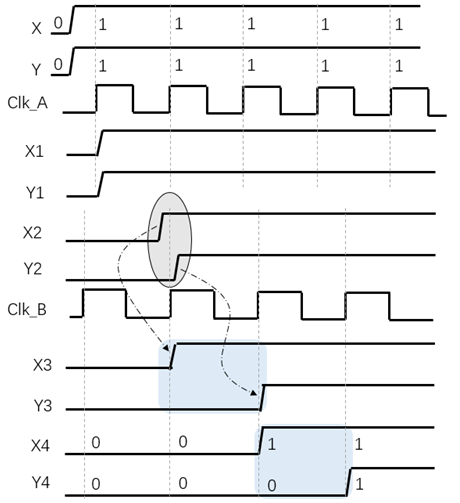

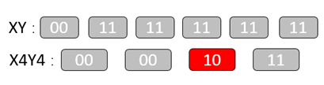

产生原因

​	延迟与时钟不确定性令目标时钟域采样无效数据

解决方案

* 格雷码编码
* 握手机制
* 异步 FIFO
* 门控机制

多位控制信号解决方案

数据相关，按顺序依次变化，地址指针或状态机的状态矢量

解决方案：

格雷码编码

相邻数据间转换时，只有一位产生变化，地址范或状态数量为 2^n 个

二进制编码

| **D0** | **0** | **0** | **0** | **0** | **1** | **1** | **1** | **1** |
| ------ | ----- | ----- | ----- | ----- | ----- | ----- | ----- | ----- |
| **D1** | **0** | **0** | **1** | **1** | **0** | **0** | **1** | **1** |
| **D2** | **0** | **1** | **0** | **1** | **0** | **1** | **0** | **1** |

格雷码编码

| **D0** | **0** | **0** | **0** | **0** | **1** | **1** | **1** | **1** |
| ------ | ----- | ----- | ----- | ----- | ----- | ----- | ----- | ----- |
| **D1** | **0** | **0** | **1** | **1** | **1** | **1** | **0** | **0** |
| **D2** | **0** | **1** | **1** | **0** | **0** | **1** | **1** | **0** |

数据信号解决方案

* 异步 FIFO
* 握手协议
* 使能信号控制

异步 FIFO

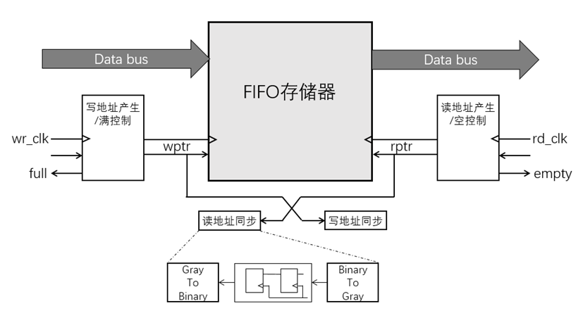

* 读写指针用格雷码编码后同步
* “空信号”在读时钟域产生
* “满信号”在写时钟域产生

握手协议

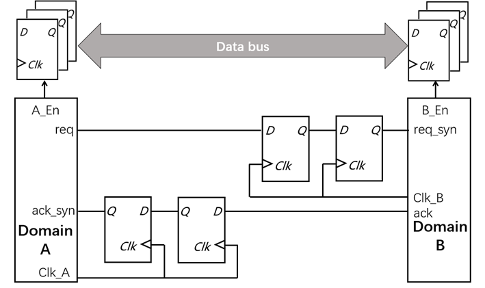

* 'req' 信号同步至 Clk_B
* 'ack' 信号同步至 Clk_A
* 数据保持直到握手完成

使能信号控制

### 注意

前面时钟域的输出必须是时钟同步好的，也就是 DFF 出来的，不能是组合逻辑出来的信号。组合逻辑电路各个输入信号的不一致性以及组合逻辑内部路径的延时时间不一样，运算后的信号存在毛刺，我们无法预先知道后面 clk 的上升沿何时会到来，clk 采样到的信号就无法预知。如下图

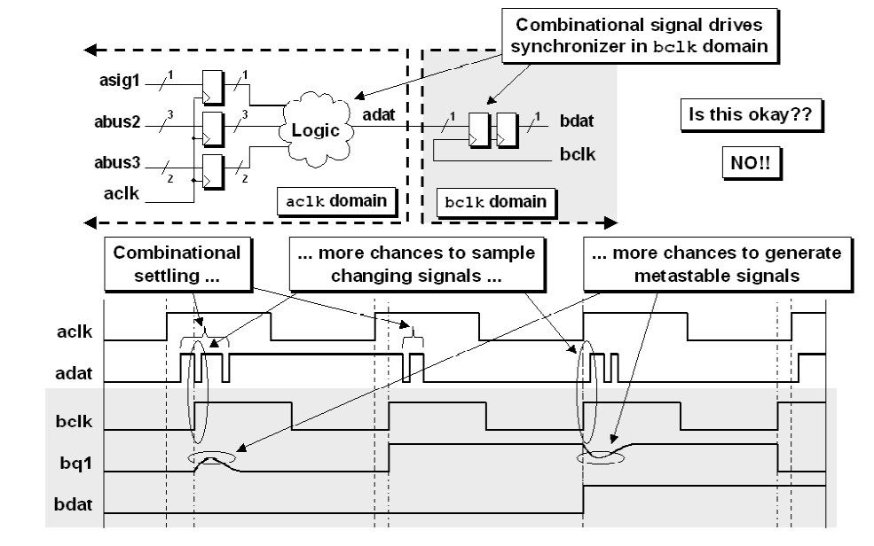

## 复位信号的同步

* 同步时序电路保证
* 复位电平的时长

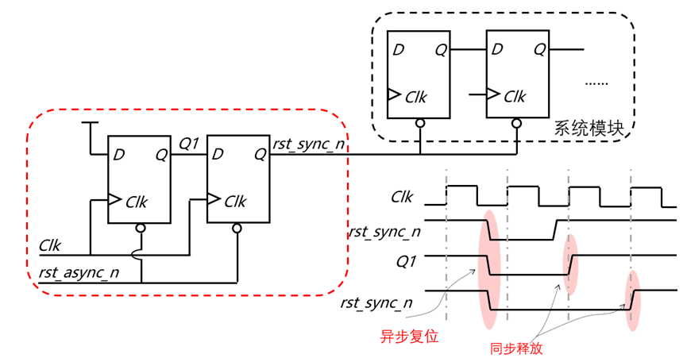

## 无毛刺时钟切换（Glitch Free Clock MUX）

1. 会产生毛刺的时钟切换

   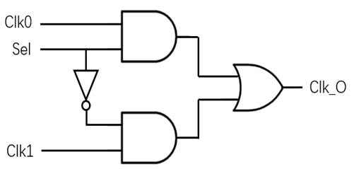

   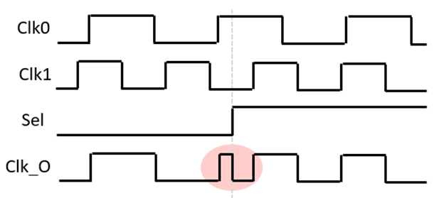

2. 无毛刺的时钟切换

   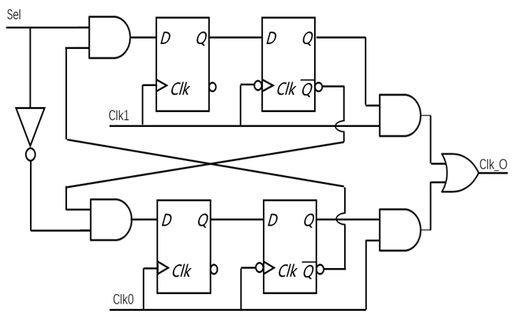

   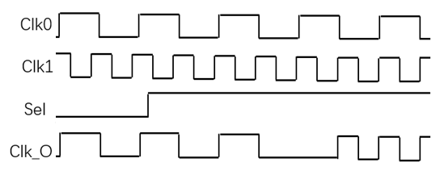

详细参考这篇博客：[Glitch Free时钟切换技术](https://mp.weixin.qq.com/s/w3Wu7HkSr5v94kHrLvRIcw)

[Glitch Free时钟切换技术另一篇博客](https://blog.csdn.net/Reborn_Lee/article/details/90378355?tdsourcetag=s_pctim_aiomsg)

### 同步错误示例

1. 存在信号未同步

   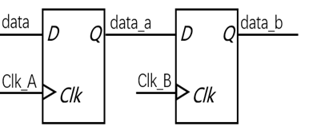

2. 两个或多个时钟源的数据在同步之前相遇

   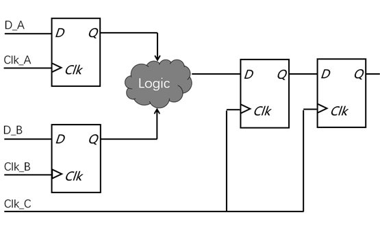

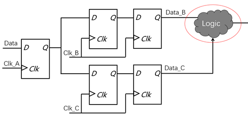
