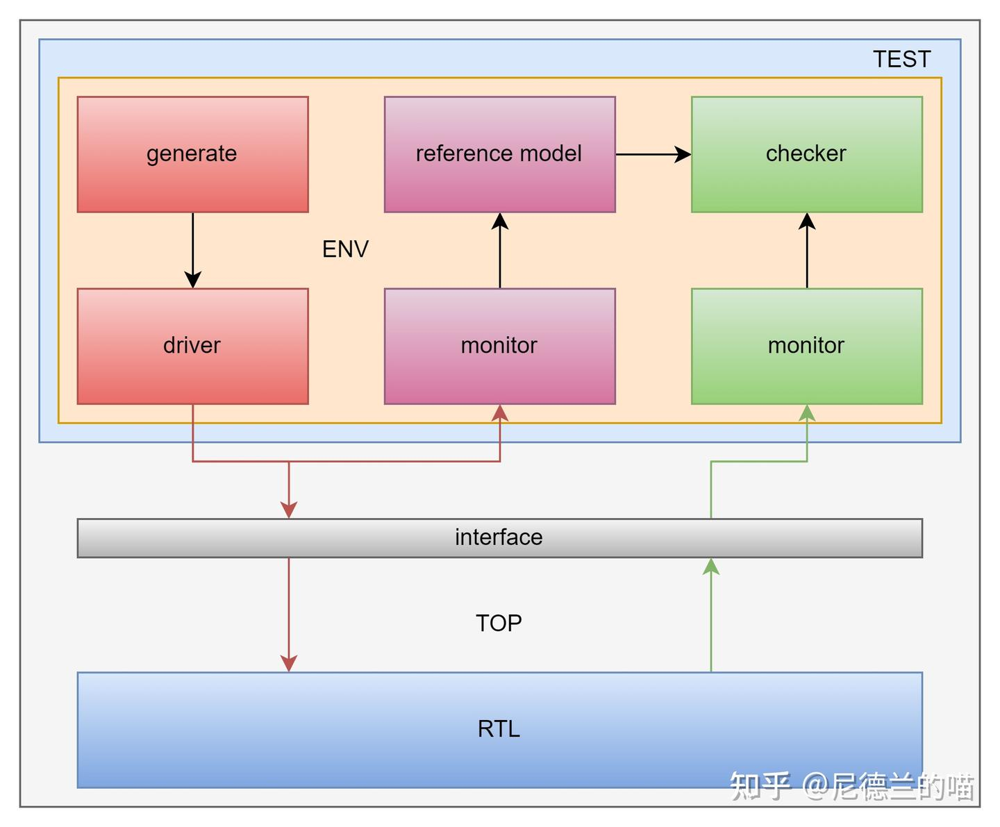

SV tb lab tutorial

一个个人博客 https://easyformal.com/

SV 验证笔记：https://blog.csdn.net/weixin_43370732/article/details/128192566

## SystemVerilog 相关

SystemVerilog 验证 -- 测试平台编写指南：

[SystemVerilog验证](./src/docs/SystemVerilog验证.pdf)

[SystemVerilog覆盖率](https://mp.weixin.qq.com/s/qVSfcVtxHgKDYzXfEelT8w)

[SystemVerilog函数和任务](https://mp.weixin.qq.com/s/kU7g_u4M2vrh1ZHs9TGcpA)

<a href=“ https://zhuanlan.zhihu.com/p/665041921 “>验证环境</a>

# RTL

vld 用于表示数据有效，在数据传输的过程中 vld 可能连续也可能不连续（不过在这个项目里，我们令 vld 必须为连续传输）；sop 用于标记包头，eop 用于标记包尾；data 为传输的数据，包头一般为 ID，包尾一般为校验位（在本项目我们不做区分）。

那么这个模块的功能就是进行包转发，在转发的过程中将每一个包数据与下一拍的数据做亦或称为新的数据发送出去，每个包的最后一个数据因为没有下一拍数据了所以直接输出。

# 验证环境框架
1. 激励，就是给模块模拟外部的输入和真实的工作场景；
2. 预测，就是把 RTL 干的事别管是用 sv 还是 c model 哪怕是 verilog 你环境里再写一遍；
3. 比对，就是把环境预测的结果和 RTL 真实输出的结果比一下，看看到低谁有错；
所以，一个最朴素的验证环境框架就出来了。红色的的 gen 和 drv 用于打激励，紫色的 mon 和 rm 用于搞预测，绿色的 mon 和 chk 用于做比对。interface 用于验证环境和 DUT 之间桥接，其将接口按照功能汇总成若干组，便于环境驱动和采样。那么接着咱们来一步步从低向上实现这个验证环境的所有代码。

## 验证环境编写
### pkt_if

验证环境的编写必然应该从时序层的 interface 和事物层的 transaction 开始，因此先写 interface。通过观察 dut 可以发现他的输入输出接口信号是完全一样的，所以我们只需要做一组 interface 就可以了。

之前我习惯在 interface 之后直接声明一下 virtual interface，virtual interface 是为了解决环境中灵活调用而产生的语法，当然这个地方不声明也无所谓用法很灵活，可以先按着这个来写后面慢慢自己改进。

interface 内必须针对 drv 和 mon 做两个 clocking block 以避免驱动和采样中存在的竞争和冒险，关于这个竞争与冒险建议入门者先不要去管他，之后出错了自然就会了。clocking block 中针对信号分组，指定对于 drv 和 mon 的方向以及驱动和采样相对于时钟沿的偏移：

然后写这个环境的时候我还有个习惯，写了一个 interface pack 的文件作用是把输入和输出的 inf 合成一个文件，方便后面的传递，其本质还是个 inf 就是里面例化了输入和输出接口罢了（不想用的话就散着传也可以）。

接着就是从接口抽象到事务层，我们需要描述这个接口的属性。

### pkt_data

pkt_data 是一个 transaction 是一个事务描述符是一个对接口的属性进行抽象而创建的类。那么我们对 pkt_if 接口进行观察

如果这是一个 ID+payload+ecc 型的包传输，那么显然它的属性包括以下几项：

1.包的长度，也就是从 sop 到 eop 要持续多少拍；

2.sop 的 ID 值；

3.eop 的校验值；

4.包之间的间隔；

5.每拍数据的值；

那么既然这个小项目不考虑头尾数据的特殊属性（当然一会在代码里会看到还是做了 ID），那么 2 和 3 就不需要提炼为属性了。所以汇总来看，需要提取的属性无非就是包长、每拍的值（payload）和包间距。

pkt_dec 是一个用于定义参数和全局常量的文件，将数值定义在其中以便所有的验证文件都能访问到共用的数值。这个名为 pkt_data 的 transaction 的大概结构就是这样了，可以发现所有提取出来的“属性”都用了 rand 前缀，这也正好体现了随机验证和定向用例的差别（如果对定向用例感兴趣，欢迎去用 [auto_verification](https://link.zhihu.com/?target=https%3A//gitee.com/gjm9999/auto_verification) 哈）。

解释下细节，payload_q[$]队列自然就是要发送的事务中的数据信息，pkt_len是包的总长度，interval是两个包之间的间隔。send_over和data[$] 是事务转时序接口时要借助的中间变量。那么之后就可以开始构建约束了：
