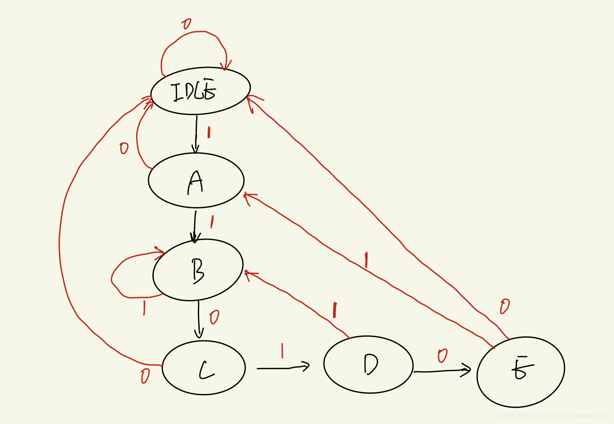

检测 11010，状态 A：1；B: 11; C: 110, D: 1101, E: 11010. 当在 D 状态时，接收到 1 时返回 B，而不是 A！

状态机描述采用三段：时序，状态转移；组合，状态转移；输出。

状态机既可以表示成 mealy 型，又可以是 moore 型。moore 型输出只和状态有关，mealy 型输出和状态及输入有关。mealy 型通常会少几个状态，前一个状态就直接根据输入确定输出了（看情况）。
