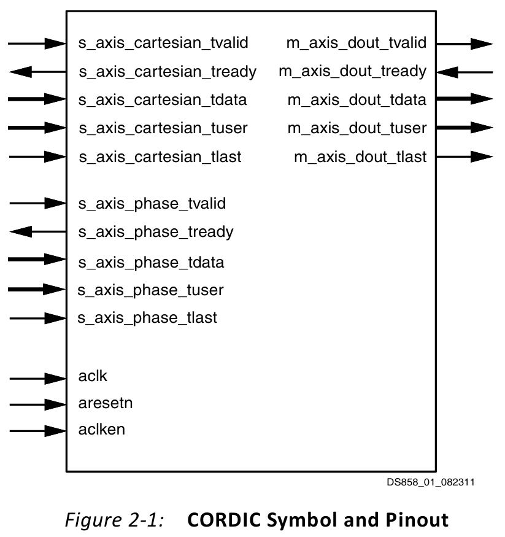
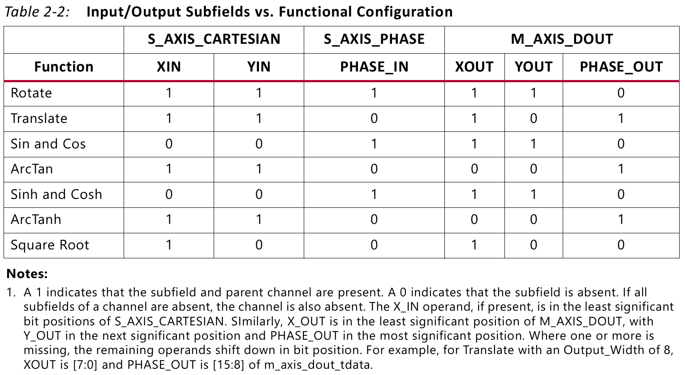

Vivado 中关于 CORDIC IP 的文档：

- [CORDIC v4.0 Datasheet (DS249)](https://docs.amd.com/v/u/en-US/cordic_ds249)
- [CORDIC v6.0 Product Guide (PG105)](https://docs.amd.com/v/u/en-US/pg105-cordic)
- [LogiCORE IP CORDIC v5.0 Data Sheet (AXI)(DS858)](https://docs.amd.com/v/u/en-US/ds858_cordic)
- Vivado Design Suite Reference Guide: Model-Based DSP Design Using System Generator (UG958)：关于 CORDIC 实现不同函数的指南。

# PG 105

This Xilinx® LogiCORE™ IP core implements a generalized coordinate rotational digital computer (CORDIC) algorithm.

The CORDIC core implements a generalized coordinate rotational digital computer (CORDIC) algorithm, initially developed by Volder [Ref 1] to iteratively solve trigonometric equations, and later generalized by Walther [Ref 2] to solve a broader range of equations, including the hyperbolic and square root equations. The CORDIC core implements the following equation types:

- Rectangular <-> Polar Conversion
- Trigonometric
- Hyperbolic
- Square Root

## Performance

The latency and *throughput* of the core is influenced by the selection of Parallel or Serial Architecture. Two architectural configurations are available for the CORDIC core:

- A **fully parallel** configuration with single-cycle data throughput at the expense of silicon area
The CORDIC algorithm requires approximately one shift-addsub operation for each bit of accuracy. A CORDIC core with a parallel architectural configuration implements these shift-addsub operations in parallel **using an array of shift-addsub stages**. A parallel CORDIC core with N bit output width has *a latency of N cycles and produces a new output every cycle*. The implementation size of this parallel circuit is directly proportional to *the internal precision times the number of iterations*.
- A **word serial** implementation with multiple-cycle throughput but occupying a small silicon area
The CORDIC algorithm requires approximately one shift-addsub operation for each bit of accuracy. A CORDIC core implemented with the word serial architectural configuration, implements these shift-addsub operations serially, **using a single shift-addsub stage and feeding back the output**. A word serial CORDIC core with N bit output width has *a latency of N cycles and produces a new output every N cycles*. The implementation size this iterative circuit is directly proportional to the internal precision.

*Latency* is affected by the form of AXI4-Stream protocol selected (Vivado IDE will show the latency). It should be stated that when AXI blocking mode is selected, latency should not be a primary design consideration, because the AXI protocol manages data traffic dynamically.

## Function

A coarse rotation is performed to rotate the input sample **from the full circle into the first quadrant**.

The CORDIC algorithm introduces **a scale factor to the amplitude of the result**, and the CORDIC core provides the option of automatically compensating for the CORDIC scale factor.

## Feature Summary

- Vector rotation (polar to rectangular)
- Vector translation (rectangular to polar)
- Sin a nd Cos
- Sinh and Cosh
- Atan
- Atanh
- Square root

## Port

Supported User Interfaces: AXI4-Stream.

s_axis_cartesian_tdata: Depending on Functional Configuration, this port has one or two subfields; X_IN and Y_IN. These are the Cartesian operands. Each subfield is Input_Width bits wide, padded to the next byte width before being concatenated.

m_axis_dout_tdata: Depending on Functional Configuration this port contains the following subfields; X_OUT, Y_OUT, PHASE_OUT. Each subfield is Output_Width bits wide, padded to the next byte width before concatenation.

## AXI 4 Stream Options

### NonBlocking Mode vs. Blocking Mode
### TDATA
### TLAST TUSER

## Functional Description

The CORDIC algorithm was initially designed to perform a vector rotation, where the vector $(X, Y)$ is rotated through the angle $\theta$ yielding a new vector $(X’, Y’)$.

## Design Flow Steps
