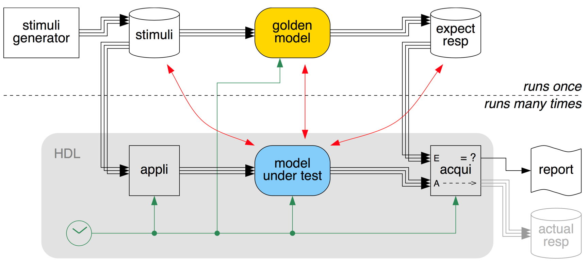
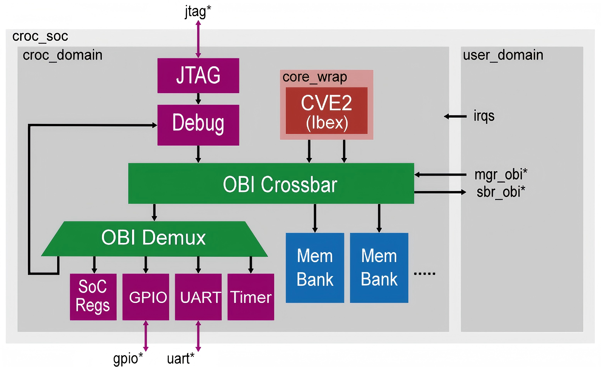
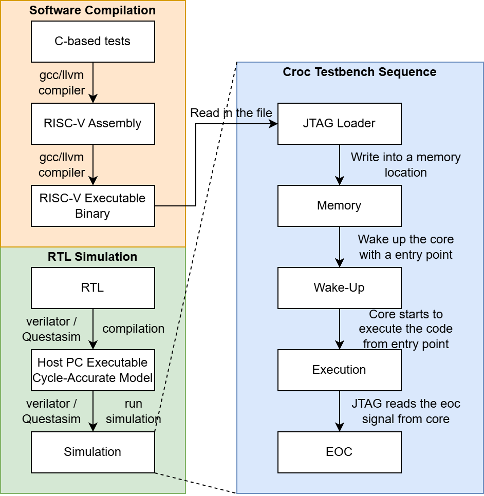

VLSI 2 课程主页 https://vlsi.ethz.ch/wiki/Main_Page

SOC 101 RTL 2 GDS 课程：https://zhuanlan.zhihu.com/c_1746233246805774337，B 站视频 https://www.bilibili.com/video/BV1QZ4y1J76m/?vd_source=bc07d988d4ccb4ab77470cec6bb87b69

一生一心笔记：https://zhuanlan.zhihu.com/p/632506219

# Lectures

参考书：Top-Down Digital VLSI Design From Architectures to Gate-Level Circuits and FPGAs (vol 1 Free online)

计算结构参考网站：https://computationstructures.org/lectures/info/info.html

# Simulation Flow

The file-based testbench written in SystemVerilog typically consists of three main processes:

- Clock and Reset Generation
    - Generates a periodic clock until the end-of-computation (`eoc`) signal is asserted.
    - Generates a low-active reset (`reset_n`) signal at the beginning of the test to initialize the DUT.
    - The clock period and duty cycle are usually configurable through parameters at the start of the testbench.
- Stimuli Application
    - Reads the pre-generated input stimuli from a file into an array.
    - Applies each stimulus from the array on every clock cycle until all stimuli have been processed.
    - Ends the simulation by asserting the `eoc` signal when all stimuli have been applied.
- Response Acquisition and Verification
    - Reads the expected responses from a file.
    - Compares the DUT’s actual outputs against the expected responses.
    - If a mismatch is detected, error information is displayed for debugging.

# Croc SoC

here’s a brief introduction:

- [Croc]( https://vlsi.ethz.ch/wiki/Croc "Croc") is a 32-bit miscrocontroller system based on the [RISC-V]( https://vlsi.ethz.ch/w/index.php?title=RISC-V&action=edit&redlink=1 "RISC-V (page does not exist)") architecture.
- The system includes two SRAM banks, separating instruction memory and data memory.
- This Harvard-style separation improves performance by allowing simultaneous instruction and data access, reducing bottlenecks.
- The [Croc]( https://vlsi.ethz.ch/wiki/Croc "Croc") SoC supports on-chip debugging and programming via a standard JTAG interface, enabled by the RISC-V debug module (illustrated in Figure 4).

The complete simulation flow for the [Croc]( https://vlsi.ethz.ch/wiki/Croc "Croc") SoC is illustrated in Figure 5, where the process is divided into the following key steps:

- Software Compilation
    - The simulation starts with C-based tests, which are compiled into RISC-V assembly code and RISC-V executable binaries.
    - The input stimuli and expected responses are typically embedded within these C-based tests.
- RTL Simulation
    - Similar to the Adder8 example, the RTL source code is compiled into an executable model for the host PC.
    - The simulation is then launched, executing the compiled binary.
- JTAG-Driven Execution in Simulation
    - During simulation, the JTAG module in the [Croc](https://vlsi.ethz.ch/wiki/Croc "Croc") SoC reads the RISC-V executable binary and loads it into the SRAM banks.
    - Once loaded, the core is woken up and begins executing instructions from the entry-point address.
    - The core writes to a memory-mapped register, asserting the eoc (end-of-computation) signal upon completion.
    - The JTAG module continuously polls this register until the eoc signal is detected, at which point the simulation ends.

See below the architecture of [Croc](https://vlsi.ethz.ch/wiki/Croc "Croc") (details are available in the dedicated page). The main processor core is [CVE2](https://vlsi.ethz.ch/wiki/CVE2 "CVE2"): a fork of the RISC-V 32 Ibex core. This core is connected to the rest of the system (memory and peripherals) via a system bus using the [OBI](https://vlsi.ethz.ch/wiki/OBI "OBI") protocol.

## CVE 2
## Introduction

The [CVE2](https://github.com/openhwgroup/cve2) Core, specifically represented by the CV32E20, is a production-grade, open-source 32-bit RISC-V CPU core designed for low-cost and embedded control applications. As part of the OpenHW Group's CORE-V family, CV32E20 features a two-stage pipeline architecture derived from the Zero-riscy project. It supports RISC-V extensions, including Integer (I), Embedded (E), Integer Multiplication and Division (M), and Compressed (C), making it versatile for power-efficient tasks. The core incorporates a sleep unit from the CV32E4 family and achieves Technology Readiness Level 5 (TRL5) through industrial-grade verification under the OpenHW core-v-verif framework. Its open-source nature fosters community collaboration and innovation, ensuring it meets both academic and industrial standards.

## Integration on Croc

The CVE2 core is a central component of the [croc_domain](https://vlsi.ethz.ch/wiki/Croc_domain "Croc domain"), responsible for managing memory and peripheral transactions via the OBI protocol. It connects to both instruction and data buses, which are routed through an [OBI crossbar](https://vlsi.ethz.ch/wiki/OBI_crossbar "OBI crossbar"). This crossbar facilitates communication between the core, external peripherals, and memory banks, with the core operating as a manager within the system.

In addition to handling regular transactions, the CVE2 core supports debugging through a dedicated debug module, which receives and processes JTAG signals. The core is also equipped to manage interrupts, such as those generated by the Timer module, ensuring timely and appropriate responses to system events.
