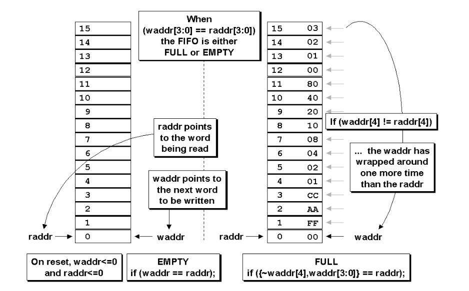
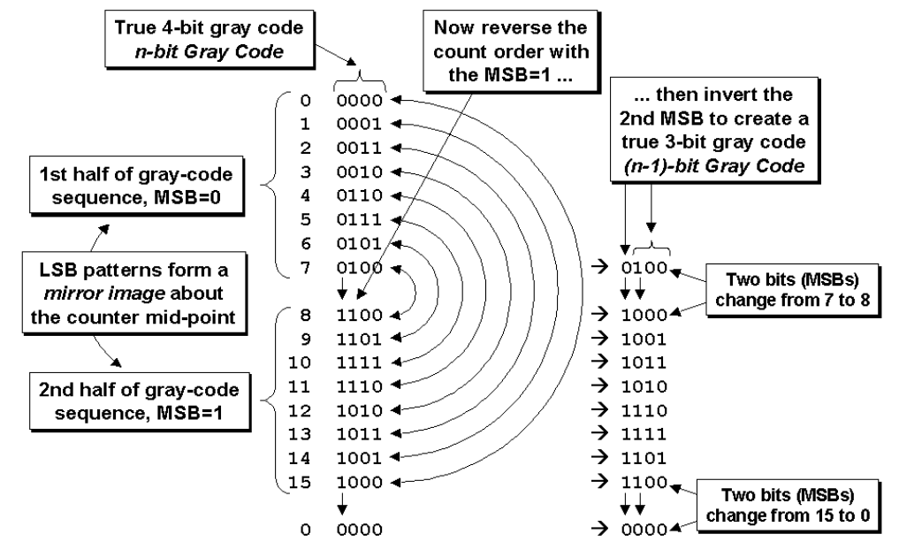

# 异步 FIFO

### 格雷码

**1. 二进制转格雷码**

从二进制码的最右边一位（最低位）起，依次将每一位与左边一位进行异或运算，作为对应格雷码该位的值，而最左边高位不变。


```verilog
assign gray_value = binary_value ^ (binary >> 1);
```

**2. 格雷码转二进制码**

从格雷码左边第二位（次高位）起，将每一位与其左边一位解码后的值异或，作为该位解码后的值，而最左边一位（最高位）不变就是它本身。

```verilog
assign bin[N-1] = gray[N-1]; //据格雷码的最高位，得到二进制的最高位
genvar i;
generate
    for(i = N-2; i >= 0; i = i - 1) begin: gray_2_bin
        assign bin[i] = bin[i + 1] ^ gray[i];  //二进制码的最高位与格雷码的次高位相异或，得到二进制的次高位
    end
endgenerate
```


或者描述为：

```verilog
integer i
always @ (gray)
    for (i = 0; i <= SIZE; i = i + 1)
        bin[i] = ^(gray >> i);
```

**格雷码计数器**


### 异步 FIFO

异步 FIFO 原理如下图所示：


为了区分空满标志，读写指针增加 1bit。异步 FIFO 空满标志的判定：



**FIFO 空条件的产生**

当读指针与同步后的写指针相匹配时，FIFO 为空，这时应该在 FIFO 的读时钟域内马上产生 FIFO 空标记。

```verilog
always @ (posedge rclk or negedge reset_n)
    begin: fifo_empty_gen
        if(~reset_n)
            fifo_empty <= 1'b1;
        else
            fifo_empty <= (rd_gtemp == wr_ptr_sync);
    end
```

**FIFO 满条件的产生**

满的条件为 `{~waddr[4], waddr[3:0] == raddr}`



根据格雷码的特点，在以下三个条件都为真时，FIFO 满标志置起。

1. 同步后的读指针 (rd_ptr_sync) 的 MSB 应该与写指针 (wr_gtemp) 的下一个格雷码值的 MSB 不同。
2. 写时钟域中下一个格雷码计数值对应二进制码的第二个 MSB(wr_gtemp)，应该与同步到写时钟域内读指针的 MSB 相同 (rd_ptr_sync)。
3. 两个指针中所有省略掉的 LSB 都应该匹配。

*注意*

上面第 2 点中的第二个 MSB 通过将指针前两个 MSB 异或后计算出来。（如果 MSB 为高，对两个 MSB 进行异或操作会使第二个 MSB 取反。）

```verilog
wire rd_2nd_msb = rd_ptr_sync[SIZE] ^ rd_ptr_sync[SIZE-1];
wire wr_2nd_msb = wr_gtemp[SIZE] ^ wr_gtem[SIZE-1];
always @ (posedge wclk or negedge reset_n)
    begin: fifo_full_gen
        if(~reset_n)
            fifo_full <= 1'b0;
        else
            fifo_full <= ((wr_gtemp[SIZE] != rd_ptr_sync[SIZE]) &&
                          (rd_2nd_msb == wr_2nd_msb) &&
                          (wr_gtemp[SIZE-2:0] == rd_ptr_sync[SIZE-2:0]));
    end
```

### 附录

一个四位十六个状态的格雷码计数器，起始值为 1001，经过 100 个时钟脉冲作用之后的值为（）。

**解析：** 先计算出 100 个脉冲后跑了多少个 16 状态，100/16=6 余 4；故需要知道 1001 后的第四个状态是哪个？1001 转为二进制为 1110，1110 为十进制 14，再后 4 个数是 15，0,1，2；故第四个数为 2，转为格雷码为：**0011**

# 深度计算

https://blog.csdn.net/wuzhikaidetb/article/details/121659618

总结：FIFO 深度的计算建立在满足一次突发传输的基础上。全部写入的数据量 - 已经被读走的数据量 = 需要缓存到 FIFO 的数据量，即异步 FIFO 的最小深度
