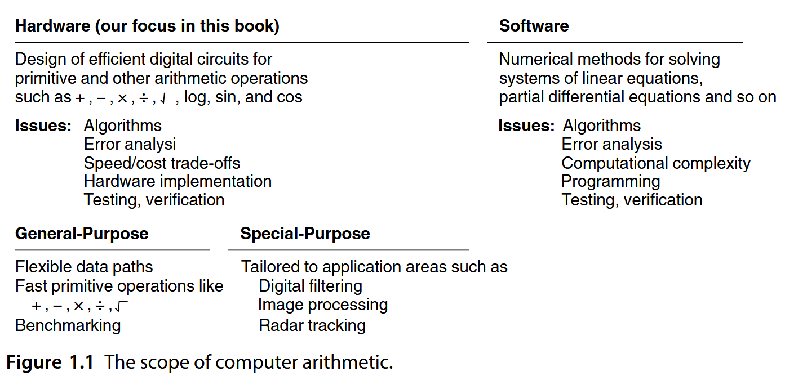
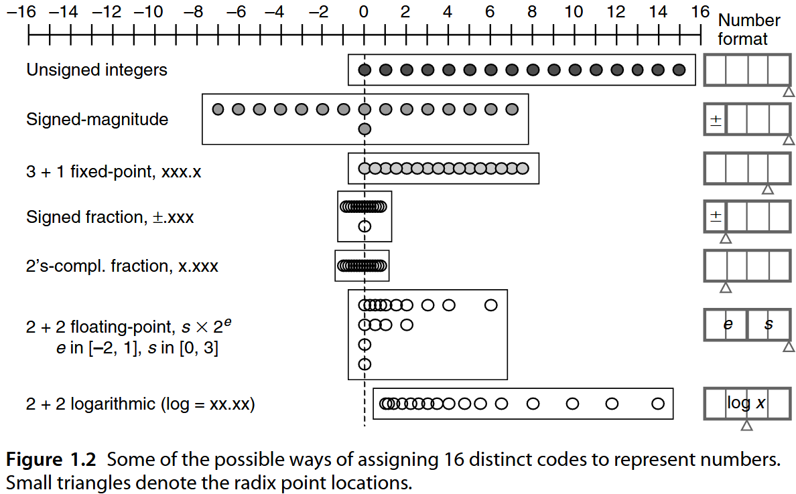
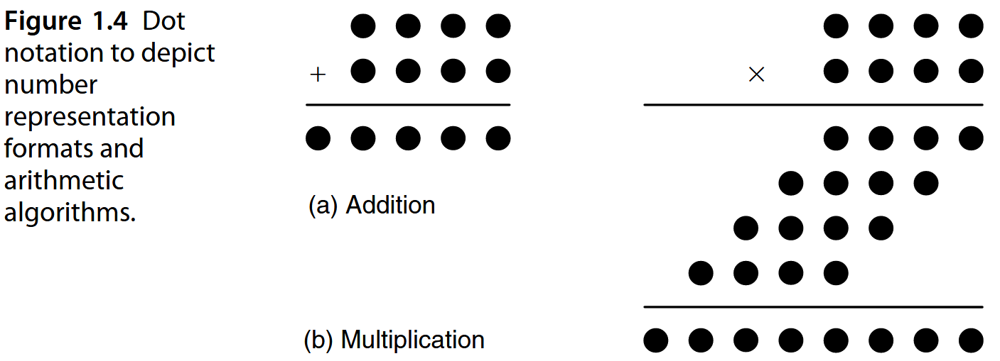
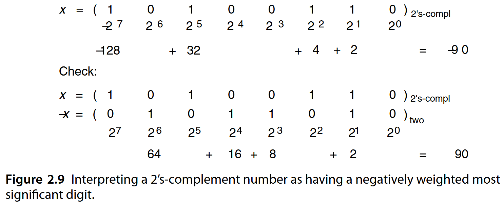

《COMPUTER ARITHMETIC : Algorithms and Hardware Designs》SECOND EDITION

[【目录序言翻译】计算机硬件算法《COMPUTER ARITHMETIC : Algorithms and Hardware Designs》2nd - 知乎 (zhihu.com)](https://zhuanlan.zhihu.com/p/258679655)

书本内容可以结合该博客，主要讲了各种风格的计算单元实现

https://www.zhihu.com/people/zhishangtanxin/posts?page=1

该书有一个对应课程：<a href=" https://web.ece.ucsb.edu/Faculty/Parhami/ece_252b.htm">UC ECE 252 B 课程网站</a>，<a href="https://www.bilibili.com/video/BV1qsSuYHE9T/?spm_id_from=333.337.search-card.all.click&vd_source=bc07d988d4ccb4ab77470cec6bb87b69">B 站对应视频</a>

讲师网站：https://web.ece.ucsb.edu/~parhami/ece_252b.htm

课本网页，包含 PPT：https://web.ece.ucsb.edu/~parhami/text_comp_arit.htm#slides

- **[第一部分] 数的表示 NUMBER REPRESENTATION**

- [1] 数与算术 Numbers and Arithmetic
- [2] 有符号数的表示 Representing Signed Numbers
- [3] 冗余数系统 Redundant Number Systems
- [4] 剩余数系统 Residue Number Systems

- **[第二部分] 加法与减法 ADDITION SUBTRACTION**

- [5] 基础的加法与计数方案 Basic Addition and Counting
- [6] 超前进位加法器 Cary-Lookahead Adders
- [7] 其它高速加法器 Variations in Fast Adders
- [8] 多操作数加法 Multioperand Addition

- **[第三部分] 乘法 MULTIPLICATION**

- [9] 基础的乘法方案 Basic Mutiplication Schemes
- [10] 高基乘法器 High-Radix Mutipliers
- [11] 树型乘法器与阵列乘法器 Tree and Array Multipliers
- [12] 其它乘法器 Variations in Multipliers
- **[第四部分] 除法 DIVISION**
- [13] 基础除法方案 Basic Division Schemes
- [14] 高基除法器 High-Radix Dividers
- [15] 其它除法器 Variations in Dividers
- [16] 除法的收敛算法 Division by Convergence
- **[第五部分] 实数算数 REAL ARITHMETIC**
- [17] 浮点数表示 Floating-Point Representations
- [18] 浮点数运算 Floating-Point Operations
- [19] 误差与误差控制 Errors and Error Control
- [20] 精确可靠的算术 Precise and Certifiable Arithmetic
- **[第六部分] 特殊函数求值 FUNCTION EVALUATION**
- [21] 平方根算法 Square Rooting Methods
- [22] CORDIC 算法 The CORDIC Algorithms
- [23] 其它函数求值方法 Variations in Function Evaluation
- [24] 查表法算术 Arithmetic by Table Lookup
- **[第七部分] 实践主题 IMPLEMENTATION TOPICS**
- [25] 高吞吐量算术 High-Throughput Arithmetic
- [26] 低功耗算术 Low Power Arithmetic
- [27] 容错算术 Fault-Tolerant Arithmetic
- [28] 可重构算术 Reconfigurable Arithmetic
- **附页 APPENDIX**

- [A] 附页: 过去现在和未来 Appendix: Past, Present, and Future

# PART 1 NUMBER REPRESENTATION

> “Mathematics, like the Nile, begins in minuteness, but ends in magnificence.” CHARLES CALEB COLTON

# Ch 1 Numbers and Arithmetic







# Ch 2 Representing Signed Numbers




# Part2

A DDITION IS THE MOST COMMON ARITHMETIC OPERATION AND ALSO SERVES AS a building block for synthesizing many other operations.

# Ch5 Basic Addition and Counting

# Ch7 Number Theory

## 7.4 Montgomery Multiplication

The best way to deal the nuisance of modular arithmetic is to avoid modulo operation altogether, delaying or replacing it with predication:

```cpp
const int M = 1e9 + 7;

// input: array of n integers in the [0, M) range
// output: sum modulo M
int slow_sum(int *a, int n) {
    int s = 0;
    for (int i = 0; i < n; i++)
        s = (s + a[i]) % M;
    return s;
}

int fast_sum(int *a, int n) {
    int s = 0;
    for (int i = 0; i < n; i++) {
        s += a[i]; // s < 2 * M
        s = (s >= M ? s - M : s); // will be replaced with cmov
    }
    return s;
}

int faster_sum(int *a, int n) {
    long long s = 0; // 64-bit integer to handle overflow
    for (int i = 0; i < n; i++)
        s += a[i]; // will be vectorized
    return s % M;
}
```

### Montgomery Space

$$
\begin{matrix}
\bar x=x\cdot r\ mod\ n\\
x\cdot r+y\cdot r=(x+y)\cdot r\ mod \ n\\
\bar x*\bar y=\bar x \cdot \bar y\cdot r^{-1}\ mod\ n
\end{matrix}
$$

The multiplication in the Montgomery space is defined as \*. This means that, after we normally multiply two numbers in the Montgomery space, we need to _reduce_ the result by multiplying it by $𝑟^{−1}$ and taking the modulo — and there is an efficient way to do this particular operation.

### Montgomery Reduction
