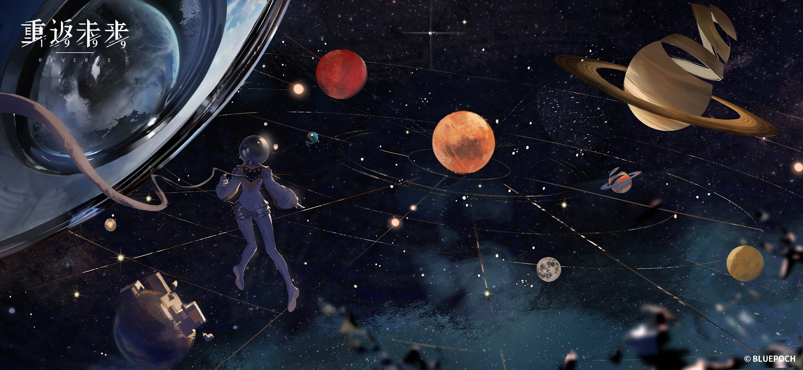

---
tags:
  - SelfDevelopment
  - AI
  - Architecture
  - CS
---

<div align="center">
    
  <h3 align="center">欢迎来到数字公园</h3>
  <p align="center">
    探索计算机体系结构、高性能计算、机器学习系统。
  </p>
  <p align="center">
 <em style="color: #0088FF;">Where nanoseconds meet neurons</em>
  </p>
</div>

# 📜 A High Performance Computing Explorer's Atlas | Ongoing Learning Repository

> *"Standing on the shoulders of giants and occasionally peeking through their notes"*
> — An evolving handbook for hardware-centric learning

---

## 📊 Overview

| **Attribute**      | **Details**                                                                           |
| ------------------ | ------------------------------------------------------------------------------------- |
| **Status**         | Actively Curating (Knowledge lava cooling into crystallized, organized notes)         |
| **Core Focus**     | VLSI Digital IC Design + High Performance Computing (HPC) + AI System Optimization    |
| **Ethical Note**   | Contains reconstructed knowledge from cited sources—strictly for educational purposes |
| **Digital Garden** | [Here is my digital garden](https://jr-wesley.github.io/MyDigitalGarden/)             |

## Repository Manifesto

>This repository archives my (**not well organized**) learning journey through **VLSI Digital IC design**, incorporating:

- 🧠 **Heterogeneous Computing**: GPU/FPGA/CGRA workload partitioning
- ⚙️ **AI-Tailored Architectures**: Tensor cores to neuromorphic accelerators
- 🔗 **RISC-V Ecosystem**: Custom extension development (Vector, AI/ML)
- 🚨 **VLSI-Scale Verification**: Formal methods for billion-gate designs

## Guiding Principles for AI-Era Learning

In the age of LLMs, permanent learning requires intentional practices to avoid superficial understanding. These four pillars shape the structure of this repository:

1. **Systemic View**: Bidirectional insight from _top-down_ (system architecture) and _bottom-up_ (circuit-level details) to connect isolated concepts.
2. **First Principles**: Ground all learning in fundamental laws (e.g., digital logic, parallel computing fundamentals) to enable critical thinking.
3. **Hands-On Practice**: Prioritize "getting hands dirty"—from code implementation to hardware design—to turn theoretical knowledge into skill.
4. **AI Assistance**: Treat LLMs as co-evolutionary tools (not replacements) for accelerating research, debugging, and knowledge synthesis.

---

## 🌐 Knowledge Matrix

```shell
.
├── 00-ToolKit
│   ├── assets
│   ├── Scripts
│   └── Template
├── 01-ComputerScience
│   ├── Architecture
│   ├── Network
│   ├── OperatingSystem
│   ├── Programming
│   ├── SoC
│   └── SystemBasics
├── 02-AISystem
│   ├── Acceleration
│   ├── AICompiler
│   ├── AISysReview
│   ├── AlgorithmAndModel
│   ├── ClusterAndHardware
│   ├── Distributed
│   ├── GPU
│   ├── HPCBasics
│   ├── JobInterview
│   ├── MLFramework
│   └── Quantization
├── 03-Algorithm
│   ├── BasicAlgorithm
│   ├── Compression
│   ├── Encryption
│   ├── HDC
│   └── Vision
├── 04-IntegratedCircuit
│   ├── Accelerator
│   ├── AsicFlow
│   ├── Basics
│   └── IP
├── 05-SelfDevelopment
│   ├── Career
│   ├── Civilization
│   ├── Language
│   ├── Literature
│   ├── Medicine&Food
│   ├── Philosophy
│   ├── Psychology
│   ├── Reading
│   └── Recreation
└── Educated
```

![[Knowledge Matrix.png]]

## 🛠️ Usage & Navigation

### Highlight

I've arranged my notes into 6 parts:

- 🗂️ [[01-ComputerScience/01-ComputerScience|01-ComputerScience]]: Foundational pillars of computing, from hardware to software.
- 🗂️ [[02-AISystem/02-AISystem|02-AISystem]]: Deep dive into the architecture and infrastructure powering AI.
- 🗂️ [[03-Algorithm/03-Algorithm|03-Algorithm]]: Core computational methods and specialized techniques for problem-solving.
- 🗂️ [[04-IntegratedCircuit/04-IntegratedCircuit|04-IntegratedCircuit]]: Design, flow, and technology behind modern semiconductor chips.
	- A Guide to RISCV CPU architecture
	- Roadmap of YSYX（一生一芯）
- 🗂️ [[05-SelfDevelopment/05-SelfDevelopment|05-SelfDevelopment]]: Resources for personal growth, career, and well-being.
	- Medicine
- 🗂️ [[00-ToolKit|00-ToolKit]]: Essential tools, scripts, and assets to boost productivity.
	- Enabling high efficiency using Linux, shell, etc.

### Recommended Exploration Paths

- **System of Computer Science**

- **AI Full-Stack System Optimization**

- **High Performance CPU Design**

- **Hardware Accelerator Design**

- **Silicon Implementation Flow**

## 🔐 License Matrix

<a href="https://creativecommons.org/licenses/by-nc-sa/4.0/">CC BY-NC-SA 4.0</a>

## 🌟 Roadmap to Enlightenment
