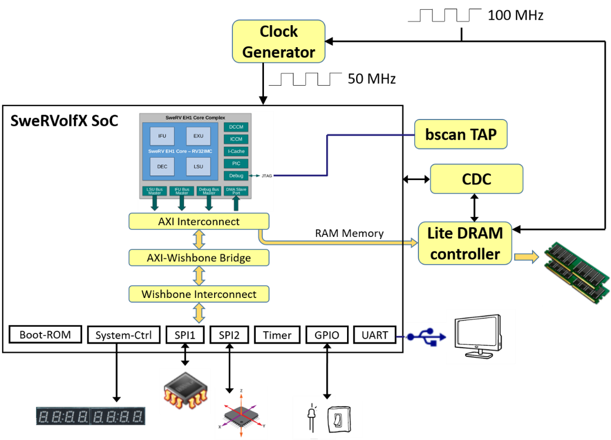

两门课程：

1. RISC-V FPGA 系统围绕 Chips Alliance 的 **SweRVolf SoC**（基于 Western Digital RISC-V **SweRV EH1 内核**构建）
2. RVfpga-SoC 关于构建 RISC-V SoC，Zephhyr RTOS 运行程序

-1-10: 在 Vivado 中编译 RVfpga 系统,编程 RVfpga 系统,通过添加外设扩展 RVfpga 系统
-11-20: 分析和修改 RVfpga 的 RISC-V 内核和存储器系统

# RVFPGA

|   |   |
|---|---|
|名称|说明|
|SweRV EH1 内核|由 Western Digital 开发的开源商用 RISC-V 内核（[https://github.com/chipsalliance/Cores-SweRV](https://github.com/chipsalliance/Cores-SweRV)）。|
|SweRV EH1 内核组合|一种增加了存储器（ICCM、DCCM 和指令高速缓存）、可编程中断控制器（Programmable Interrupt Controller，PIC）、总线接口和调试单元的 SweRV EH1 内核（[https://github.com/chipsalliance/Cores-SweRV](https://github.com/chipsalliance/Cores-SweRV)）。|
|SweRVolfX  （扩展 SweRVolf）|我们在 RVfpga 课程中使用的片上系统。它是 SweRVolf 的扩展。  SweRVolf（[https://github.com/chipsalliance/Cores-SweRVolf](https://github.com/chipsalliance/Cores-SweRVolf)）：一种围绕 SweRV EH1 内核组合构建的开源 SoC。它增加了引导 ROM、UART 接口、系统控制器、互连（AXI 互连、Wishbone 互连和 AXI 转 Wishbone 桥）以及 SPI 控制器。  SweRVolfX：与 SweRVolf 相比增加了 4 个新外设：GPIO、PTC、一个额外的 SPI 以及用于 8 位 7 段显示屏的控制器。|
|RVfpgaNexys|以 Nexys A7 开发板及其外设为目标的 SweRVolfX SoC。它增加了 DDR2 接口、CDC（时钟域交叉）单元、BSCAN 逻辑（用于 JTAG 接口）和时钟发生器。  RVfpgaNexys 与 SweRVolf Nexys 基本相同（[https://github.com/chipsalliance/Cores-SweRVolf](https://github.com/chipsalliance/Cores-SweRVolf)），只是后者基于 SweRVolf。|
|RVfpgaSim|SweRVolfX SoC 具有配套的测试平台和用于仿真的 AXI 内存。  RVfpgaSim 与 SweRVolf Sim 基本相同（[https://github.com/chipsalliance/Cores-SweRVolf](https://github.com/chipsalliance/Cores-SweRVolf)），只是后者基于 SweRVolf。|

## SweRV EH 1 内核

- Western Digital 的开源内核
- 32 位（RV32ICM）超标量内核，具有双发射 9 级流水线
- 独立的指令和数据存储器（ICCM 和 DCCM），与内核紧密耦合
- 4 路组相连指令缓存，具有奇偶校验或 ECC 保护
- 可编程中断控制器
- 符合 RISC-V 调试规范的内核调试单元
- 系统总线：AXI4 或 AHB-Lite

Western Digital 在过去几年中开发了三种 RISC-V 内核:SweRV EH1(RVfpga 系统中使用的内核)、SweRV EH2 和 SweRV EL2 (RVfpga 的未来版本中可能包含这些内核)。SweRV EH1 是一个 32 位内核,采用 2 路超标量和 9 级流水线设计。SweRV Core EH2 建立在 EH1 内核基础上并对其进行了扩展,支持双线程功能,性能得到了提升。SweRV Core EL2 是一种小型内核,可提供中等性能。

SweRV EH1 内核是一种仅限机器模式 (M 模式) 的 32 位 CPU 内核, 支持 RISC-V 的整数 (I)、压缩指令 (C) 以及整数乘法和除法 (M) 扩展。参考手册 RISC-V_SweRV_EH1_PRM. pdf)。SweRV EH1 是超标量内核,采用双发射 9 级流水线设计 (参见图 18),支持四个算术逻辑单元 (Arithmetic Logic Unit,ALU),这些单元在两条流水线 I0 和 I1 中标记为 EX1 至 EX4。两路流水线均支持 ALU 运算。其中一路流水线支持装载/存储,另一路具有 3 周期延时乘法器。处理器还具有一个非流水线式 34 周期的延时除法器。流水线中存在四个停顿点:“取指 1”、“对齐”、“译码”和“提交”。“取指 1”级包括 Gshare 分支预测器。在“对齐”级,从三个缓冲区中进行取指。在“译码”级,最多对四个指令缓冲区中的两条指令进行译码。在“提交”级,每个周期最多提交两条指令。最后,在“回写”级,更新架构寄存器。

Western Digital 还提供了 SweRV EH1 内核的扩展,称为 SweRV EH1 内核组合 (参见图 20),此扩展在上述 EH1 内核的基础上增加了以下元件, 如图中蓝色部分所示:

- 两个专用存储器, 一个用于存储指令 (ICCM), 另一个用于存储数据 (DCCM), 它们与内核紧密耦合。这两个存储器提供低延时访问和 SECDED ECC(单一误差校正和双重误差检测纠错码) 保护。每个存储器可以配置为 4、8、16、32、48、64、128、
256 或 512KB。
- 可选的 4 路组相连指令高速缓存, 具有奇偶校验或 ECC 保护。可选的可编程中断控制器 (Programmable Interrupt Controller, PIC), 最多支持 255 个外部中断。
- 四个系统总线接口,用于取指 (IFU 总线主控)、数据访问 (LSU 总线主控)、调试访问 (调试总线主控) 和外部 DMA 访问 (DMA 从端口) 紧密耦合的存储器 (可配置为 64 位 AXI4 或 AHB-Lite 总线)。
- 符合 RISC-V 调试规范的内核调试单元。

## SweRVolfX SoC

- Chips Alliance 的开源片上系统（SoC）
- SweRVolf 使用 SweRV EH1 内核。SweRVolf 包括引导 ROM、UART、系统控制器和 SPI 控制器（SPI1）
- SweRVolfX 通过添加另一个 SPI 控制器（SPI2）、GPIO（通用输入/输出）、8 位 7 段显示屏和 PTC（以红色显示）扩展 SweRVolf。
- SweRV EH1 内核使用 AXI 总线，而外设使用 Wishbone 总线，因此 SoC 还具有 AXI 转 Wishbone 桥

|       |                         |
| ----- | ----------------------- |
| 系统    | 地址                      |
| 引导 ROM | 0x80000000 - 0x80000FFF |
| 系统控制器 | 0x80001000 - 0x8000103F |
| SPI1  | 0x80001040 - 0x8000107F |
| SPI2  | 0x80001100 - 0x8000113F |
| 定时器   | 0x80001200 - 0x8000123F |
| GPIO  | 0x80001400 - 0x8000143F |
| UART  | 0x80002000 - 0x80002FFF ||

## RVfpgaNexys

- RVfpgaNexys：以 Nexys A7 FPGA 开发板为目标的 SweRVolfX SoC（添加若干外设）：
- 内核和系统：
	- SweRVolfX SoC
	- Lite DRAM 控制器
	- 时钟发生器、时钟域和 JTAG 端口的 BSCAN 逻辑
	- Nexys A7 FPGA 开发板上使用的外设：
- DDR2 存储器
	- 采用 USB 连接的 UART
	- SPI 闪存
	- 16 个 LED 和 16 个开关
	- SPI 加速计
	- 8 位 7 段显示屏

## RVfpgaSim

- SweRVolfX SoC 还可以包括 Verilog 测试程序以允许其进行仿真。
- RVfpgaSim 是包装在 HDL 仿真器所用测试平台中的 SweRVolfX SoC。
