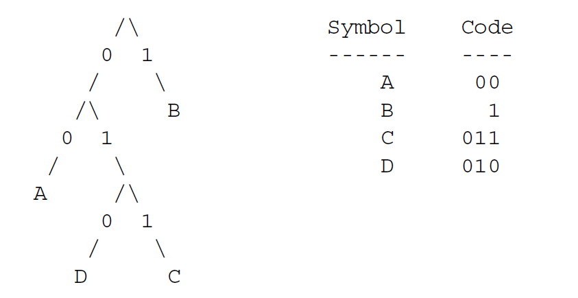
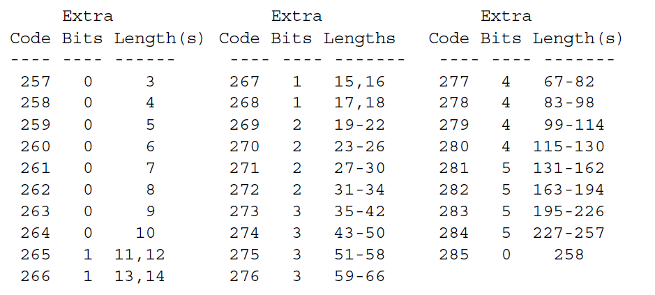
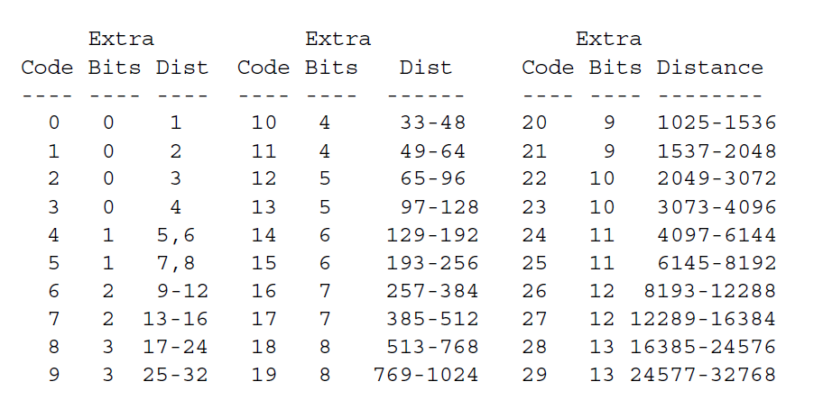
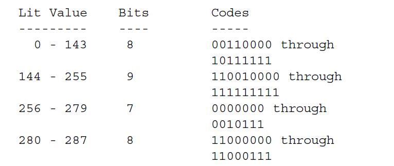
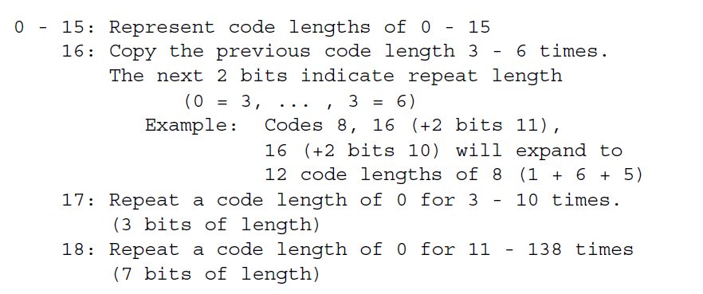
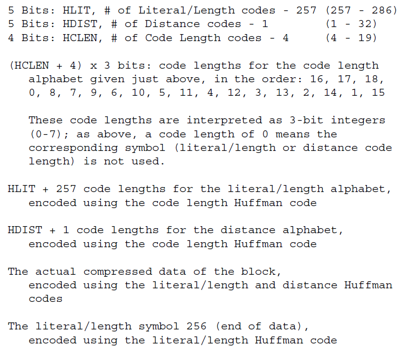
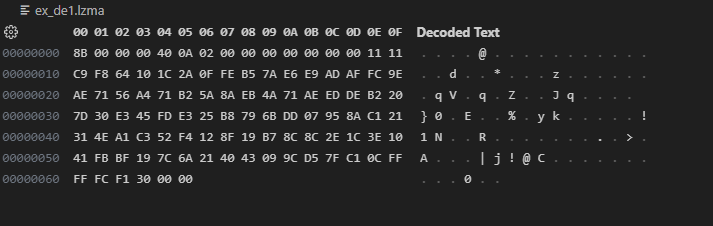

# 关于 7-zip 中LZMA算法原理的源代码分析


参考文章：

[关于7-zip中Lzma算法原理的源代码分析 - 神洲一号 - 博客园 (cnblogs.com)](https://www.cnblogs.com/tigerzyj/articles/15334742.html)

LZMAwiki 转载：[Lempel–Ziv–Markov chain algorithm - From Wikipedia, the free encyclopedia（转载） - 神洲一号 - 博客园 (cnblogs.com)](https://www.cnblogs.com/tigerzyj/p/15334782.html)文章其它地方说得比较清楚，但DP优化说得很简单，不太好理解，看了源码花了N个小时才算看明白。具体看的源码是lzma1900的cs实现，这个实现与java实现比较容易理解。下载地址为
https://www.7-zip.org/a/lzma1900.7z


[RFC1951 - 神洲一号 - 博客园 (cnblogs.com)](https://www.cnblogs.com/tigerzyj/p/15341431.html)

[区间编码算法的分析与实现 - 百度文库 (baidu.com)](https://wenku.baidu.com/view/a52f6f80d4d8d15abe234e28?_wkts_=1702348119800)

动态马尔科夫压缩相关信息可以参考https://webhome.cs.uvic.ca/~nigelh/Publications/DMC.pdf

[数据压缩算法---霍夫曼编码的分析与实现 - DreamGo - 博客园 (cnblogs.com)](https://www.cnblogs.com/idreamo/p/9201966.html#autoid-0-6-0)


一、 DEFLATE中的LZ77算法实现，具体研究的是github上的一个精简版实现miniz，源码可见https://gitee.com/tigerzyj/miniz。

有几个要点要注意，一是基于字节流的字典匹配，二是哈夫曼编码，详情可以参阅RFC1951，那里说的很清楚了。有特色是哈夫曼编码的ALISTAIR MOFFAT实现方法，有些难理解，找到他的论文并亲自在纸上推算一下就能理解了。


二、 7zip中的LZMA编码是在LZ77算法上加入了基于比特流及马尔科夫链上下文的区间编码(range code)以及基于动态规划（Dynamic Programming）的深度优化，并扩大了DEFLATE中32K的字典到默认的8M(或16M，根据版本不同），理论上最大可以到4G，实际实现中最大为1536 MB，32位7zip实现中最大为128M。


采用马尔科夫链主要利用马尔科夫随机过程来消除原始文件中的基于上下文的冗余（如英文中字母Q后面紧接的字母为U的概率远较其它字母大），而不仅仅是哈夫曼编码中单纯的基于字符出现的随机统计概率，其利用的上下文主要有当前待编码的字节位置（literal bits 【lb】\position bits 【pb】）、待编码字节的前一字节内容(literal contexts 【lc】)，匹配状态以及当前编码状态机的实时状态（state）等非常复杂的机制，利用这些参数组合成一系列很复杂的状态机以匹配不同的上下文场景。不同的上下文分别对应自己的区间编码动态概率表，区间编码使用这些概率表来进行相应的编码工作。


动态规划优化主要是利用了动态规划算法（DP）来计算如何编码一段在字典中已经查到的匹配字符串，主要代码在函数GetOptimum()中，常规方法就是简单的将一对Len+Distance符号进行区间编码，而DP优化则是将这一段匹配字符串所有2到n-1阶子串的区间编码(range code)长度与常规编码长度进行比较，其中充分利用了最近用过的N（默认为4）个匹配长度来参与编码，（这样编码对象中减少一个Distance）可以有效减小常规编码长度。注意只有当最大匹配长度小于numFastBytes（fb，默认为32）参数值时DP优化才参与编码，否则就只用常规的Len+Distance来编码，这就是numFastBytes中fast的来历，因为fb越大消耗时间也越长。另外GetOptimum()函数中还利用了贪心算法以争取编码长度最小化，因此_optimum[]数组的长度被定为4096，而不只是273，就是在不断应用贪心算法过程中可能会使此优化数组变长。

DP优化中要预估区间编码的长度，以判断哪种编码策略最优，这里无法精确计算某个编码策略的实际长度，只有通过估计来实现，具体方法是将区间编码所用的RANGE内每个累积区间假定一个权重，权重的确定遵循熵编码“概率越大编码长度越小”的原则。LZMA中这个权重表是用一个二重循环人工生成的。

区间编码的具体说明可以参考叶叶的这篇论文，《[区间编码的分析与实现](https://wenku.baidu.com/view/a52f6f80d4d8d15abe234e28)》，写得很详细。值得説明的一点是这篇论文的区间编码是基于字节流的，编码字符只有不超过256，而LZMA的区间编码是基于比特流的，每次只编码一个比特，因此概率表的设计就很关键。

字典查询匹配字串可以用哈希链表，也可以用二进制树，参数mf可以设为（bt2、bt3、bt4或hc4）

字典匹配字串搜索次数可以由参数mc确定，默认为(16 + number_of_fast_bytes / 2) for BT* match finders and (8 + number_of_fast_bytes / 4) for HC4


# 一、DEFLATE(RFC1951) lz77

[(11 封私信 / 80 条消息) DBinary - 知乎 (zhihu.com)](https://www.zhihu.com/people/DBinary/posts)

PNG的数据压缩使用的是DEFLATE压缩。DEFLATE算法本质是范式Huffman算法和LZ77算法的结合体,Huffman算法及LZ77算法本身并不复杂,但在RFC1951中,一些细节问题讲解并不详细,因此deflate实现的麻烦点主要在数据结构的处理上,这也是本文讨论的重点,笔者将内容尽可能整理到比较简略的模式,以便各位看官能够快速的恰到RFC1951中的一些坑点及关键点,同时,本文讨论的更多是原理结构上的问题,因此,如何达到压缩的最优值,并不在本文的讨论范围内，最后deflate、inflate的代码你都可以在PainterEngine中的PX_RFC1951.x PX_Huffman.x PX_LZ77.x中找到。

## 1. 范式Huffman树

例子：a,b,c,c,c,d,d,d,d,d,d

得出各个值的概率

| symbol | freq |
| ------ | ---- |
| a      | 1    |
| b      | 1    |
| c      | 3    |
| d      | 6    |

依据这个频率,我们建立一个典型的Huffman树


如果我们将左边以0编码,右边以1进行编码,那么,每个字母(Symbol)都可以编码为一个"Code" ,那么,huffman树可以构造成一个类似下表的结构:

| symbol | code | bit(s) length |
| ------ | ---- | ------------- |
| a      | 000  | 3             |
| b      | 001  | 3             |
| c      | 01   | 2             |
| d      | 1    | 1             |

因此,如果是常规的huffman树,我们需要保存huffman树每个symbol对应的code,和code对应的位长度(bits length)

那么什么是范式huffman呢,范式huffman本质是确定了code的一个结构,就是把code的内容规范化,比如上面这个huffman树,a是000,b是001,那么如果换成a是001,b是000,这样重新构造的huffman树也是完全成立的,但范式huffman树说不行,a可以通过它的bits length计算出来,它的值一定是确定的,那么我们就可以通过只保存bits length来重建huffman树,省了不少空间

| 常规huffman树             | 范式huffman树                                             |
| ------------------------- | --------------------------------------------------------- |
| 需要保存code和bits length | 只需要bit length就行了,因为code可以通过bit length计算出来 |

那么,剩下的问题就是如何通过bit length来还原code了,在这里,RFC1951还是说的很清楚了,我引用什么的例子重新计算一遍:

1.首先,我们保存了a,b,c,d的位长(bits length),它们分别是(3,3,2,1)
2.然后,我们计算位长出现的频率,比如位长3出现2次,2和1只出现1次,我们根据这个构造下表

| bits length | count |
| ----------- | ----- |
| 0           | -     |
| 1           | 1     |
| 2           | 1     |
| 3           | 2     |

然后我们需要构造next_code,next_code构造如下代码(MAX_BITS为最大位长,比如这里是3)

```c
code = 0;
bl_count[0] = 0;
for (bits = 1; bits <= MAX_BITS; bits++) 
{
    code = (code + bl_count[bits-1]) << 1;
    next_code[bits] = code;
}
```

这样我们就可以构造出next_code了


| bits length | count | next_code |
| ----------- | ----- | --------- |
| 0           | -     | -         |
| 1           | 1     | 0         |
| 2           | 1     | 2         |
| 3           | 2     | 6         |

最后,我们依据位长出现频率构造出code(其实就是next_code根据频次累加),代码如下

```c
for (n = 0;  n <= max_code; n++) 
{
    len = tree[n].Len;
    if (len != 0) {
    Code[n] = next_code[len];
    next_code[len]++;
    }
}
```

| symbol | 位长(bits length) | code  | code的二进制 |
| ------ | ----------------- | ----- | ------------ |
| a      | 3                 | 6     | (110)        |
| b      | 3                 | 6+1=7 | (111)        |
| c      | 2                 | 2     | (10)         |
| d      | 1                 | 0     | (0)          |

于是,我们的范式huffman树,仅仅需要保存bit length就能够还原了,大大节省了存储空间

### 一个思考,bit length一定能生成合法的huffman树么?

Huffman树有一个原则,一个短的Code,不可能和一个长的Code重合 例如,下面的Code

> 000; 010; 0101

第一个code不和其它两个code冲突,但第二个code和第三个冲突,你可以注意到了,长度4的code前三个bit的010和第二个code是重复的,这显然是不合理的

因此在使用Bits Length构造Huffman树的时候,我们需要检查生成的Code是否存在冲突问题,如果存在冲突问题,那么这个BitS Length表就无法构造一个合法的huffman树,例如位长序列{2,2,2,2,3}肯定无法构造一个合法的huffman数,因为位长2已经把00,01,10,11占满了,位长3无论是什么都肯定和位长2的会有冲突.


## 2. huffman编码算法

**哈夫曼（Huffman）编码算法**是基于二叉树构建编码压缩结构的，它是数据压缩中经典的一种算法。算法根据文本字符出现的频率，重新对字符进行编码。因为为了缩短编码的长度，我们自然希望频率越高的词，编码越短，这样最终才能最大化压缩存储文本数据的空间。

假设现在我们要对下面这句歌词“we will we will r u”进行压缩。我们可以想象，如果是使用ASCII码对这句话编码结果则为：119 101 32 119 105 108 108 32 119 101 32 119 105 108 108 32 114 32 117（十进制表示）。我们可以看出需要19个字节，也就是至少需要152位的内存空间去存储这些数据。

很显然直接ASCII码编码是很浪费空间的，Unicode就更不用说了，下面我们先来统计一下这句话中每个字符出现的频率。如下表，按频率高低已排序：

### **1 哈夫曼二叉树构建**

#### **1.1 初始队列**

　　那么我们按出现频率高低将其放入一个优先级队列中，从左到右依次为频率逐渐增加。

>u r i e l w ' '

​	下面我们需要将这个队列转换成哈夫曼二叉树，哈夫曼二叉树是一颗带权重的二叉树，权重是由队列中每个字符出现的次数所决定的。并且哈夫曼二叉树始终保证权重越大的字符出现在越高的地方。

#### **1.2 第一步合并**

　　首先我们从左到右进行合并，依次构建二叉树。第一步取前两个字符u和r来构造初始二叉树，第一个字符作为左节点，第二个元素作为右节点，然后两个元素相加作为新空元素，并且两者权重相加作为新元素的权重。


#### **1.3 重新调整队列**

　　上图新元素权重相加后结果是变大了，需要对权重进行重新排序。


　经过多步操作之后，得到以下的哈夫曼二叉树结构，也就是一个带有权重的二叉树：


这样依次遍历这颗二叉树就可以获取得到所有字符的编码了。例如：‘ ’的编码为10，‘l’的编码为00，‘u’的编码为11100等等。**经过这个编码设置之后我们可以发现，出现频率越高的字符越会在上层，这样它的编码越短；出现频率越低的字符越会在下层，编码越短。经过这样的设计，最终整个文本存储空间才会最大化的缩减。**
　　最终我们可以得到下面这张编码表：


#### **1.4 字符串编码**

　　有了上面的编码表之后，”we will we will r u”这句重新进行编码就可以得到很大的压缩，编码表示为：01 110 10 01 1111 00 00 10 01 110 10 01 1111 00 00 10 11101 10 11100。这样最终我们只需50位内存，比原ASCII码表示节约了2/3空间，效果还是很理想的。当然现实中不是简单这样表示的，还需要考虑很多问题。

#### **1.5 补充**

　　**我们需要弄明白哈夫曼二叉树概念，它是带权路径达到最小的二叉树，也叫最优二叉树。它不一定是完全二叉树，也不一定是平衡二叉树，它们描述的完全不是一件事情，完全没有概念上的重叠关系。**


[数据压缩算法---霍夫曼编码的分析与实现 - DreamGo - 博客园 (cnblogs.com)](https://www.cnblogs.com/idreamo/p/9201966.html)

霍夫曼编码是一种基于最小冗余编码的压缩算法。最小冗余编码是指，如果知道一组数据中符号出现的频率，就可以用一种特殊的方式来表示符号从而减少数据需要的存储空间。一种方法是使用较少的位对出现频率高的符号编码，用较多的位对出现频率低的符号编码。我们要意识到，一个符号不一定必须是文本字符，它可以是任何大小的数据，但往往它只占一个字节。

### 熵和最小冗余

**每个数据集都有一定的信息量，这就是所谓的熵**。**一组数据的熵是数据中每个符号熵的总和**。符号z的熵S定义为：
$$
S_z = -log_2 P_z
$$
其中，**Pz就数据集中z出现的频率**。来看一个例子，如果z在有32个符号的数据集中出现了8次，也就是1/4的概率，那么z的熵就是：-lg 2(1/4) = 2位

这意味着如果用超过两位的数来表示z将是一种浪费。如果在一般情况下用一个字节（即8位）来表示一个符号，那么在这种情况下使用压缩算法可以大幅减小数据的容量。

下表展示如何计算一个有72个数据实例熵的例子（其中有5个不同的符号）。要做到这一点，需将每个字符的熵相加。以U为例，它在数据集中出现了12次，所以每个U的实例的熵计算如下：

| 符号 | 概率  | 每个实例的熵 | 总的熵    |
| ---- | ----- | ------------ | --------- |
| U    | 12/72 | 2.584 963    | 31.019 55 |
| V    | 18/72 | 2.000 000    | 36.000 00 |
| W    | 7/72  | 3.362 570    | 23.537 99 |
| X    | 15/72 | 2.263 034    | 33.945 52 |
| Y    | 20/72 | 1.847 997    | 36.959 94 |

-lg2(12/72) = 2.584 963 位

由于U在数据中出现了12次，因此整个数据的熵为：

2.584 963 * 12 = 31.019 55 位

**为了计算数据集整体的熵，将每个字符所贡献的熵相加。**每个字符的熵在表中已经计算出来了：

31.019 55 + 36.000 00 + 23.537 99 + 33.945 52 + 36.959 94 = 161.463 00 位

如果使用8位来表示每个符号，需要72 * 8 = 576位的空间，所以理论上来说，可以最多将此数据压缩：

1 - （161.463 000/576） = 72%


### 构造霍夫曼树

**霍夫曼编码展现了一种基于熵的数据近似的最佳表现形式**。**它首先生成一个称为霍夫曼树的数据结构，霍夫曼树本身是一棵二叉树，用它来生成霍夫曼编码。霍夫曼编码是用来表示数据集合中符号的编码，用这种编码的方式达到数据压缩的目的。**然而，霍夫曼编码的压缩结果往往只能接近于数据的熵，因为符号的熵往往是有小数位的，而在实际中，霍夫曼编码所用的位数不可能有小数位，所以有些代码会超过实际最优的代码位数。

 下图展示了用上表中的数据来构建一棵霍夫曼树的过程。构建的过程往往是从叶子结点向上进行。**首先，将每个符号和频率放到它自身的树中（步骤1）**。**然后，将两个频率最小的根结点的树合并，并将其频率之和放到树的新结点中（步骤2）**。**这个过程反复持续下去，直到最后只剩下一棵树（这棵树就是霍夫曼树，步骤5）**。**霍夫曼的根结点包含数据中符号的总个数，它的叶子结点包含原始的符号和符号的频率**。由于霍夫曼编码就是在不断寻找两棵最适合合并的树，因此它是贪婪算法的一个很好的例子。

### 压缩和解压缩数据

建立一棵霍夫曼树是数据压缩和解压缩的一部分。

**用霍夫曼树压缩数据，给定一个具体的符号**，**从树的根开始，然后沿着树的叶向叶子结点追踪。在向下追踪的过程中，当向左分支移动时，向当前编码的末尾追加0；当向右移动时，向当前编码的末尾追加1。**在上图中，追踪“U”的霍夫曼编码，首先向右移动（1），然后向左移动（10），然后再向右（101）。图中符号的霍夫曼编码分别为：

U=101，V=01，W=100，X=00，Y=11

**要解压缩用霍夫曼树编码的数据，要一位一位地读取压缩数据。从树的根开始，当在数据中遇到0时，向树的左分支移动；当遇到1时，向右分支移动。一旦到达一个叶子结点就找到了符号。接着从头开始，重复以上过程，直到所有的压缩数据都找出。**用这种方法来解压缩数据是可能的，这是因为霍夫曼树是属于前缀树。前缀树是指一组代码中，任何一个编码都不是另一个编码的前缀。这就保证了编码被解码时不会有多义性。例如，“V”的编码是01，01不会是任何其他编码的前缀。因此，只要在压缩数据中碰到了01，就可以确定它表示的符号是“V”。

### 霍夫曼编码的效率

为了确定霍夫曼编码降低了多大容量的存储空间，**首先要计算每个符号出现的次数与其编码位数的乘积，然后将其求和**。所以，上表中压缩后的数据的大小为：

12*3 + 18*2 + 7*3 + 15*2 +20*2 = 163位

假设不使用压缩算法的72个字符均用8位表示，那么其总共所占的数据大小为576位，所以其压缩比计算如下：

1 - （163/576）=71.7%

再次强调的是，在实际中无法用小数来表示霍夫曼编码，所以在很多情况下这个压缩比并没有数据的熵效果那么好。但也非常接近于最佳压缩比。

在通常情况下，霍夫曼编码并不是最高效的压缩方法，但它压缩和解压缩的速度非常快。一般来说，造成霍夫曼编码比较耗时的原因是它需要扫描两次数据：一次用来计算频率；另一次才是用来压缩数据。而解压缩数据非常高效，因为解码每个符号的序列只需要扫描一次霍夫曼树。


## 2 实现

## 接口定义

huffman_compress

------

int huffman_compress(const unsigned char *original, unsigned char **compressed, int size);

**返回值**：如果数据压缩成功，返回压缩后数据的字节数；否则返回-1。

**描述**：用霍夫曼编码的方法压缩缓冲区original中的数据，original包含size字节的空间。压缩后的数据存入缓冲区compressed中。由于函数调用者并不知道compressed需要多大的空间，因此需要通过函数调用malloc来动态分配存储空间。当这块存储空间不再使用时，由调用者调用函数free来释放空间。

**复杂度**：O（n），其中n代表原始数据中符号的个数。

huffman_uncompress

------

int huffman_uncompress(const unsigned char *compressed, unsigned char **original);

**返回值**：如果解压缩成功，返回恢复后数据的字节数；否则返回-1。

**描述**：用霍夫曼的方法解压缩缓冲区compressed中的数据。假定缓冲区包含的数据是由Huffman_compress压缩产生的。恢复后的数据存入缓冲区original中。由于函数调用者并不知道original需要多大的**空间**，因此要通过函数调用malloc来动态分配存储空间。当这块存储空间不再使用时，由调用者调用free来释放空间。

**复杂度**：O（n），其中n是原始数据中符号的个数。

###  霍夫曼编码的分析与实现

通过霍夫曼编码，在压缩过程中，我们将符号按照霍夫曼树进行编码从而压缩数据。在解压缩时，重建压缩过程中的霍夫曼树，同时将编码解码成符号本身。在本节介绍的实现过程中，一个原始符号都是用一个字节表示。

#### huffman_compress

huffman_compress操作使用霍夫曼编码来压缩数据。首先，它扫描数据，确定每个符号出现的频率。将频率存放到数组freqs中。完成对数据的扫描后，频率得到一定程度的缩放，因此它们可以只用一个字节来表示。当确定数据中某个符号的最大出现频率，并且相应确定其他频率后，这个扫描过程结束。由于数据中没有出现的符号，应该只是频率值为0的符号，所以执行一个简单的测试来确保当任何非0频率值其缩减为小于1时，最终应该将其值设为1而不是0。

一旦计算出了所有的频率，就调用函数build_tree来建立霍夫曼树。此函数首先将数据中至少出现过一次的符号插入优先队列中（实际上是一棵二叉树）。树中的结点由数据结构HuffNode定义。此结构包含两个成员：symbol为数据中的符号（仅在叶子结点中使用）；freq为频率。每棵树初始状态下只包含一个结点，此结点存储一个符号和它的缩放频率（就像在数据freqs中记录和缩放的一样）。

要建立霍夫曼树，通过优先队列用一个循环对树做size-1次合并。在每次迭代过程中，两次调用pqueue_extract来提取根结点频率最小的两棵二叉树。然后，将两棵树合并到一棵新树中，将两棵树的频率和存放到新树的根结点中，接着把新的树保存回优先级队列中。这个过程会一直持续下去，直到size-1次迭代完成，此时优先级队列中只有一棵二叉树，这就是霍夫曼树。

利用上一步建立的霍夫曼树，调用函数build_table来建立一个霍夫曼编码表，此表指明每个符号的编码。表中每个条目都是一个HuffCode结构。此结构包含3个成员：used是一个默认为1的标志位，它指示此条目是否已经存放一个代码；code是存放在条目中的霍夫曼编码；size是编码包含的位数。每个编码都是一个短整数，因为可以证明当所有的频率调整到可以用一个字节来表示时，没有编码会大于16位。

使用一个有序的遍历方法来遍历霍夫曼树，从而构建这个表。在每次执行build_table的过程中，code 记录当前生成的编码，size保存编码的位数。在遍历树时，每当选择左分支时，将0追加到编码的末尾中；每当选择右分支时，将1追加到编码的末尾中。一旦到达一个叶子结点，就将霍夫曼编码存放到编码表合适的条目中。在存放每个编码的同时，调用函数htons，以确保编码是以大端字节格式存放。这一步非常重要，因为在下一步生成压缩数据时需要用大端格式，同样在解压缩过程中也需要大端格式。

在产生压缩数据的同时，使用ipos来保存原始数据中正在处理的当前字节，并用opos来保存向压缩数据缓冲区写入的当前位。首先，缩写一个头文件，这有助于在huffman_uncompress中重建霍夫曼树。这个头文件包含一个四字节的值，表示待编码的符号个数，后面跟着的是所有256个可能的符号出现的缩放频率，也包括0。最后对数据编码，一次读取一个符号，在表中查找到它的霍夫曼编码，并将每个编码存放到压缩缓冲区中。在压缩缓冲区中为每个字节分配空间。

huffman_compress的时间复杂度为O（n），其中n是原始数据中符号的数量。

#### huffman_uncompress

huffman_uncompress操作解压缩由huffman_compress压缩的数据。首先，此操作读取追加到压缩数据的头。回想一下，头的前4个字节包含编码符号的数量。这个值存放在size中。接下来的256个字节包含所有符号的缩放频率。

利用存放在头中的信息，调用build_tree重建压缩过程中用到的霍夫曼树。一旦重建了树，接下来就要生成已恢复数据的缓冲区。要做到这一点，从压缩数据中逐位读取数据。从霍夫曼树的根开始，只要遇到位数0，就选择左分支；只要遇到位数1，就选择右分支。一旦到达叶子结点，就获取一个符号的霍夫曼编码。解码符号存储在叶子中。所以， 将此符号写入已恢复数据的缓冲区中。写入数据之后，重新回到根部，然后重复以上过程。使用ipos来保存向压缩数据缓冲区写入的当前位，并用opos来保存写入恢复缓冲区中的当前字节。一旦opos到达size，就从原始数据中生成了所有的符号。

huffman_uncompress的时间复杂度为O(n)。其中n是原始数据中符号的数量。这是因为对每个要解码符号来说，在霍夫曼树中向下寻找的深度是一个有界常量，这个常量依赖于数据中不同符号的数量。在本节的实现中，这个常量是256.建立霍夫曼树的过程不影响huffman_uncompress的复杂度，因为这个过程只依赖于数据中不同符号的个数。

[哈夫曼树编码的实现+图解（含全部代码）_哈夫曼编码-CSDN博客](https://blog.csdn.net/Initial_Mind/article/details/124354318)


# 二、LZ77

DEEFALT中的LZ77应该算其一个简单的变种,LZ77算法比较简单,因此其编码原理这里也不多重复了,应该都能很快写出来 简略概括就是后面的数据可能是前面数据的重复,因此,要还原后面的数据:

1.存储其在前面那个位置开始 2.存储其重复的长度

就可以还原出之后的数据了,举个栗子,例如下面的序列:

[1,2,3,a,b,c,a,b,c,a,b]

我们从左往右边扫描,直到这个位置:

[1,2,3,a,b,c | a,b,c,a,b ]

我们发现,分割符|右边的a,b,c和左边的重复了,因此上面序列可以等价为

[1,2,3,a,b,c | (重复长度为3,位置在前3个字母),a,b ]

其中,"重复长度"顾名思义

而"位置在前3个字母"是描述位置的信息,综合上述,我们其实可以更进一步,如果我们定义(重复长度是5,位置在前3个字母)如何

显然的,因为a,b,c,a,b后面的两个独立的a,b仍然在a,b,c,a,b,c,a....的循环嵌套内,因此长度比距离大,这种描述仍然能够正确工作,因此,我们可以把上面的序列编码为下面的表达方式

[1,2,3,a,b,c,(5,3)];

是不是很方便.


# 三、[DEFLATE(RFC1951)速成解读 (三)---无压缩及固定huffman压缩

## 位操作

好了,前面两个章节我们简要的阐述了一下huffman和lz77压缩算法,那么前期的基础准备工作也算基本做完了,现在我们正式进入DEFLATE麻烦的部分.  

在此之前,我们先简略对位操作做个定义,众所周知,一字节为8个bits,如果我们将二进制位视作一个流式的过程,我们从左到右依次写入 1010 0101 1111 0000 那么是怎么样的呢?  

我们定义,流式的二进制写入从低位开始,然后是高位,直到写满8字节,再到第二个字节里的低位开始写,因此,上述二进制bits写入后,按一般的低位在右,高位在左的表达方式,上面的二进制流在字节流一般表示为

| 1010 | 0101 | 0000 | 1111 |
| ---- | ---- | ---- | ---- |
| A    | 5    | 0    | F    |

即字节序列A50F，

我们定义2个函数ReadBits(x,b)和WriteBits(x,b),其中ReadBits(x,b)表示从缓存区x中流式的读取b个bits
同样的,先读取到的比特会放入字节的低位,后读到的放入高位,WriteBit表示写入二进制位,x是一个字节流,b表示写入的位数,例如WriteBits(5,3)表示写入101.

## 压缩方式速读

Deflate的压缩是分块压缩的,什么意思捏,例如你想要压缩数据100字节,Deflate压缩可能会把它分成3个块,第一个块压缩20个字节,第二个块压缩30字节,第三个块压缩50字节  

如果我们把每个块的字节序列表示成x,那么,x的第一个bit表示这个是不是最后一个块   

| ReadBits(x,1) | 意义              |
| ------------- | ----------------- |
| 0             | 不是最后一个block |
| 1             | 最后一个block     |

紧接着接下来2个bits表示这个block的压缩方式  

| ReadBits(x,2) | 意义            |
| ------------- | --------------- |
| 0             | 无压缩          |
| 1             | 固定huffman压缩 |
| 2             | 动态huffman压缩 |

观众朋友可以要问了,为什么有三种方式呢,显然的,范式huffman树的bit length本身也要占用空间,如果一段数据的信息熵很高,那么huffman压缩后加上存储bit length比原数据还大,那还不如不压缩,固定huffman是内置的bit length编码,可能会比不压缩稍微好一点,但有时也会压得比原数据还大,第三种就是存储范式huffman bit length,总的来说,三种压缩方式中,我们选取压缩率最低的,以获取更优压缩率.

## 无压缩编码格式

无压缩格式的解析是三种中最简单的格式

当你读完前3个bits之后,跳过之后的5个没有实际意义的bits凑够1字节,之后你就可以读取无压缩block的长度了,如下表所示

| Block第一个字节    | 第二个字节     | 第三个字节     |
| ------------------ | -------------- | -------------- |
| 前3 bits为压缩方式 | 无压缩数据地位 | 无压缩数据高位 |

如果我们用block[]数组表示Block的字节序列,那么,无压缩数据的长度len可以表示为
len=block[1]+(block[2]<<8)
接下来我们还要继续读取第三第四个字节并将它拼接为nlen
nlen=block[3]+(block[4]<<8)
其中
len+nlen须等于65535 之后就只需要根据len读取后面的字节,这些字节都是无压缩的,不需要额外的处理

### LZ77压缩后的数据

在讨论完无压缩编码格式后,下面将要讨论的固定huffman压缩和动态huffman压缩,都是处理LZ77压缩后的数据  

在deflate中的symbol是以字节为单位的,而1字节8位,其范围是0-255,但除了0-255,我们还需要存储lz77压缩后的(长度,位置),因此我们每一个数据还得继续扩大,并给予大于255的数值一些额外的意义

在DEFLATE中,我们把每一个数字叫做lz77_code  

注意!注意!注意!这里有一个重点

DEFLATE的编码/解码使用2套不同的huffman tree,我们分别把它们叫literal tree和 distance tree,前面那个tree用于编码0-285的lz77_code,后面那个tree比较小,编码一个0-30的lz77_code,它仅在指示lz77的(length,distance)时会被用到

在解码开始时,我们先用literal tree对原比特流进行解码,得到一个lz77_code,当:  

lz77_code=256时表示这段数据的结束,也就是当你读到256时,表示这个Block已经解压缩完成了

lz77_code大于256小于286的数据,表示这是一个LZ77的(长度 length,位置距离 distance)指示器(不明白的请翻阅前一章节内容),要求其长度和距离怎么办呢,在这之前,我们需要先打4张表,它们分别是

```c
//长度表
unsigned int length_table[29] = {3, 4, 5, 6, 7, 8, 9, 10, 11, 13, 15, 17, 19, 23, 27, 31, 35, 43, 51, 59,67, 83, 99, 115, 131, 163, 195, 227, 258};

unsigned int  length_extra[29] = {0, 0, 0, 0, 0, 0, 0, 0, 1, 1, 1, 1, 2, 2, 2, 2, 3, 3, 3, 3, 4, 4, 4, 4, 5,5, 5, 5, 0};

//距离表
unsigned int  distance_table[30] = {1, 2, 3, 4, 5, 7, 9, 13, 17, 25, 33, 49, 65, 97, 129, 193, 257, 385, 513,769, 1025, 1537, 2049, 3073, 4097, 6145, 8193, 12289, 16385, 24577};

unsigned int  distance_extra[30] = {0, 0, 0, 0, 1, 1, 2, 2, 3, 3, 4, 4, 5, 5, 6, 6, 7, 7, 8, 8, 9, 9, 10, 10,11, 11, 12, 12, 13, 13};
```

为了方便说明,让我们举一个例子怎么通过lz77_code求解出(length,distance),我们假设通过literal tree解码得到的: lz77_code=265;
1.index=lz77_code-257; 显然的,index=8


2.length=length_table[index]; 读取长度的第一部分,参照第一个长度表 

3.length=length+PX_ReadBits(x,length_extra[index]); 通过查第二个表得知,length_extra[8]还有1个bit,因此我们再读取1个bit,并加到length上,最终得到完整的length 

4.注意,然后通过distance tree继续读取下一个lz77_code 

5.index=lz77_code;

6.distance=distance_table[index];//和length表类似的做法 

7.distance=distance+PX_ReadBits(x,distance_extra[index]);//如上,得到最终的distance

这样我们最终就能得到完整的lz77压缩数据了

### 固定huffman压缩

固定huffman压缩顾名思义,即huffman的code和bit length是固定的,这类huffman会基于统计意义生成一个尽可能适合大部分数据编码的huffman树,这样就能够节省保存huffman树结构的空间.

那么,这个huffman树的 symbol(下表中的lit value),bits length(下表中的 bits),code (下表中的codes)对照图如下所示


```c
px_void PX_HuffmanBuildFixedSymbolTable(px_dword code_table[288], px_dword code_bit_length[288])
{
    px_dword i,t;
    t = 0;
    for (i=48;i<=191;i++)
    {
        code_bit_length[t] = 8;
        code_table[t] = i;
        t++;
    }


    for (i = 400; i <= 511; i++)
    {
        code_bit_length[t] = 9;
        code_table[t] = i;
        t++;
    }


    for (i=0;i<=23;i++)
    {
        code_bit_length[t] = 7;
        code_table[t] = i;
        t++;
    }


    for (i = 192; i <= 199; i++)
    {
        code_bit_length[t] = 8;
        code_table[t] = i;
        t++;
    }

}
```

> 注意! ReadBits是从低位开始向高位读的,但Huffman Code是从高位开始向低位读的,例如,我们读取到了一个Code的二进制表示为 100,那么我们要对其进行huffman树的编码解码,读取到的第一个bit是最左边的1而不是最右边的0,至于1表示树的坐标还是右边,这个倒并不重要并不会影响编码或解码的结果.
>  注意!symbol(上面中的lit value)范围是0-287,但动态huffman的值范围是0-285,其中286,287并用不到,但是!如果在存储动态huffman的过程中,literal tree的bits_length_table长度超过286,那么在调用Zlib进行解码的库中,将会直接报错!


# [DEFLATE(RFC1951)速成解读 (四)---动态huffman压缩](https://zhuanlan.zhihu.com/p/558786442)

让我们回顾第一章范式huffman的内容,显然的如果给出一段数据,比如我们叫它literal data,如果要对它进行动态的huffman压缩,压缩之后肯定分为2个部分: 第一部分是压缩后的比特流 第二部分就是原始数据每一个值的bits_length,我们可以把这个bits_length视作一个数组,如果literal data中每一个值的范围是0-287,那么,bits_length就是一个大小为288的数组 现在又要划重点了,因为我们知道,bit_length的长度本质上就是该节点在huffman树中的深度,如果literal data的样本足够大,并且足够的"巧合",那么,这个bits_length最深可以达到288-1,显然那么深的bits_length是不可接受的,但如果我们稍微变通一下,限制一下literal data输入的长度,因为huffman树本质上是通过literal频率生成的,因此即使是最坏的情况下,huffman数的深度都不会超过 log2lengthlog2^{length}log2^{length} 比如说literal data的长度是4,那么深度最坏情况下也是2,如果长度是8,最坏情况也是3

>重点来了,在Deflate中,我们限制literal data生成huffman树的深度也就是bits length不能超过15,那是不是说输入的literal data长度不能超过32768呢?其实也不对,只有在极度倒霉的情况下,32768长度的深度才会达到15,大部分时候,大于这个尺度并不会导致位深超过15,而16,17,18被赋予了额外的意义,因此如果你需要用动态huffman编码,一定要选择一个合适的literal data长度.
>第二个重点也来了,我们知道literal data是已经被lz77压缩后的结果,在上一章我们有讲述到,当literal的值大于256时,它是一个(length,distance)类型的数据,但是distance其实是一个参照了map table也就是映射表的数值,它本质上是一个0-29范围的索引数值,deflate为了把压缩进行到极致,单独为distance indices设置了一个范式huffman树来编码,因此,对原始数据的构造其实是2个huffman树,一个是literal tree,一个是distance tree.

现在让我们观察下图,我们使用范式huffman对literal data进行了编码,生成了一个literal compressed data和一个literal bits length,当然就和上面说的一样,distance indices也要建立一个huffman树来编码,我们就叫它distance compressed data和distance bits length.


这波操作下来,有一定成效.但对DEFLATE要把压缩进一步发挥的算法来说,还不够,因为literal bits length和distance bits length,我们可以合起来,再用huffman算法压缩一次


你以为这就结束了,当然没有,依据大部分数据的统计ld bits length那些出现的比较多的值,我们可以做成一个映射表放到前面去,而出现的比较少的值放到后面去,这样一来,我们就可以再节省几个bit的空间:


当然,都做到这一步了,索性把压缩做到底,我们literal bits length,distance bits length,ld bits length肯定有很多的0,索性我们存储2个表前面有数值的个数,这样还能再节省一些空间,下图中的hlt,hdist,hclen就是干这个的


最后,我们只需要存储map indices就可以还原整个压缩流程中用到的huffman树了

> 又一个重点来了,ld bits length的长度是使用3个bits存储的,也就是说,ld bits length中的每一个值不能超过7,当然,整个和你数据长度和到底里面有什么有关系.  
>  之前那个literal bits length说到的16,17,18额外的意义是指16表示重复前一个值n次,这个n通过接下去读的2个bits获得的,17表示重复0值n次,这个次数是通过3加上接下来读的3个bits获得的,18表示重复0值n次,这个次数是通过11加上接下来读的7个bits获得的

为了进一步说明动态huffman树的解析流程,我们举个简短的栗子

1.依据上一章内容,我们先读取3个bit,然后发现这个block是用动态huffman编码的 

2.读取5个bits,然后加上257,就是hlit的值 

3.读取5个bits,然后加上1,就是hdist的值 

4.读取4个bits,然后加上4,就是hclen的值

 5.循环hclen次,每次读取3个bits,参照map indices,重建ld bits length,然后创建ld tree 

6.循环hlit次,使用ld tree解码,code的意义可以参考上文,还原literal bits length.(lhit后面的值都是0),构造literal tree 

7.循环hdist次,使用ld tree解码code,code意义同上(hdist后面同样都是0),还原distance bits length,构造distance tree 

8.通过literal tree和distance tree解码原始lz77_code数据 

9.通过lz77_code还原最初的原始数据.


# [DEFLATE速成解读(五)----总结](https://zhuanlan.zhihu.com/p/559157785)

好了,到这里为止,我们将DEFLATE算法中用到的点基本说了一遍,但在本文中不再给出相关的实现代码,你可以在PainterEngine/Core中的PX_LZ77,PX_Huffman,PX_RFC1951中找到相关的代码.  

总的来说,DEFLATE的解码过程是一个循环读取3个bits,判断压缩方式,解压缩的一个循环过程

但DEFLATE的编码过程会复杂的多,你需要多次的用不同的方案不同的参数进行尝试,以选取最优的压缩方式(当然你也可以偷偷懒,毕竟又不是不能用)


# RFC 1951 specification

## 1 介绍

### 1.1 目的

该规范的目的是定义一种无损压缩数据格式：

- 与CPU类型、操作系统、文件系统、字符集独立，因此可以用于交换
- 即使对于任意长的顺序呈现的输入数据流，仅使用先验有界数量的中间存储，因此可以用于数据通信或类似的结构，如Unix过滤器
- 压缩数据的效率与目前可用的最佳通用压缩方法相当，特别是比“压缩”程序好得多；
- 可以以专利未涵盖的方式容易地实现，因此可以自由实践；
- 与当前广泛使用的gzip实用程序生成的文件格式兼容，因为符合要求的解压缩程序将能够读取现有gzip压缩器生成的数据。

当前规范定义的数据格式还没有尝试：

- 允许随机访问压缩数据；
- 压缩专用数据（例如光栅图形）以及当前可用的最佳专用算法

一个简单的计数论点表明，没有一种无损压缩算法可以压缩每一个可能的输入数据集。对于这里定义的格式，最坏情况下的扩展是每32K字节块5个字节，即大型数据集的大小增长率为0.015%。英语文本通常压缩2.5到3倍；可执行文件文件通常压缩较少；诸如光栅图像之类的图形数据可以压缩得更多。

### 1.2 目标受众

本规范旨在供软件实现者使用，以将数据压缩为“deflate”格式和/或从“deflate”格式解压缩数据。
规范的文本假定了位和其他原语级别的编程的基本背景数据表示。熟悉霍夫曼编码技术是有帮助的，但不是必需的

### 1.3 范围

该规范规定了一种将字节序列表示为（通常较短的）比特序列的方法，以及将后一个比特序列打包为字节的方法。

### 1.4 服从

除非以下另有说明，否则兼容的解压缩器必须能够接受和解压缩符合此处提供的所有规范的任何数据集；兼容的压缩器必须生成以下数据集符合此处提供的所有规范。

### 1.5 使用的术语和管理的定义

字节：8比特

## 2 编码表示概述

压缩数据集有一列块组成，对应着输入数据的连续块。块的大小是任意的，除了非压缩的块限制65535字节

每个块都是用LZ77算法和霍夫曼编码进行压缩。每个块的霍夫曼树都是独立于这个其前后的块；LZ77会对之前块重复的字符串使用索引，最大32K输入

每个块由两个部分组成：一对霍夫曼代码树，用于描述压缩的数据部分和压缩数据部分。（霍夫曼树本身是使用霍夫曼压缩的编码。）压缩数据由两种类型的一系列元素组成：文字字节（字符串的没有被检测为在先前的32K输入字节内重复）以及指向重复字符串的指针，其中指针表示为一对＜长度，向后距离＞。“deflate”中使用的表示格式将距离限制为32K字节并且长度限制为258字节，除了如上所述受到限制的不可压缩块之外。压缩数据中的每种类型的值（文字、距离和长度）都使用霍夫曼表示代码，使用一个代码树表示文字和长度，使用单独的代码树表示距离。的代码树每个块以紧凑的形式出现在该块的压缩数据之前。


## 3.2  压缩块格式

### 3.2.1 前缀与霍夫曼编码简介

前缀编码方式描述了一种可以从位序列预知的字母表。每个符号有一个编码，其特点是不同的符号有不同的长度的位序列。但是解析器可以明白的解析出编码的内容。

我们根据一个二进制树来进行前缀编码。两边的非叶子结点依次的标上0,1，而叶子结点则一个一人的标记上字母表中的字符。这样，每个字符的编码就是一个从根结点到叶子结点的0,1的序列了，如：



 解码器可以解码输入的内容：让输入的流从这个树的根结点走到叶子结点，每次的前进都选择与流中下一位相同的一边。

给出一个已知使用频率的字母表，Huffman规则允许解释成一个最佳的前缀编码，这样的编码被称作Huffman 编码。

 注意，在"deflate"格式中，Huffman 编码对于不同的字母表来说不可以超过最大的编码长度。这个规定使得通过使用频率来计算编码长度的算法变得复杂了。详细内容见第五节。

### 3.2.2 在"deflate"格式中使用Huffman编码

在"deflate"格式中，每一个字母表使用的Huffman编码方式都有两条附加规则：

- 给定比特长度的所有代码都具有字典连续值，其顺序与它们所表示的符号相同；
- 较短的代码按字典顺序排列在较长的代码之前。

我们可以依照这些规则来重新编码上面的例子，假定字母表中的顺序是ABCD：

| SYMBOL | CODE |
| ------ | ---- |
| A      | 10   |
| B      | 0    |
| C      | 110  |
| D      | 111  |

 0在10的前面，10在11X的前面。110和111在字典序上是连续的。

有了这个规则，我们可以通过按顺序给定字母表中每一个符号的位长度来为一个字母表定义Huffman编码。在我们的例子中，编码由位长度的序列（2，1，3，3）所完全定义。下面的算法将编码生成为整数，规定为从最重要的位读向最不重要的位。编码长度为tree[I].len，编码则存在于tree[I].Code中。

1)  为每一个编码长度计算编码的数量。使bl_count[N]为长度为N(N>=1)的编码的数量。
2)  为每一个编码长度找到最小编码的数值

```c
code = 0;
bl_count[0] = 0;
for(bits = 1; bits <= MAX_BITS; bits++){
    code = (code + bl_count[bits-1]) << 1;
    next_code[bits] = code;
}
```

3. 将数值赋给所有的编码：以第二步中找到的(next_code[bits])为基础，为相同长度的所有编码连续的赋值。没有用过的编码（bit length = 0）不赋值

```c
for (n = 0; n <= max_code; n++) {
    len = tree[n].Len;
    if (len != 0) {
    	tree[n].Code = next code[len];
    	next code[len]++;
	}
}
```

例子：字母表ABCDEFGH各自bit length(3, 3, 3, 3, 3,  2, 4, 4)

第一步：

| N    | bl_count |
| ---- | -------- |
| 2    | 1        |
| 3    | 5        |
| 4    | 2        |

第二步：

| N    | bl_count | next_count    |
| ---- | -------- | ------------- |
| 1    | 0        | 0             |
| 2    | 1        | (0+ 0)*2 = 0  |
| 3    | 5        | (0+1)*2 = 2   |
| 4    | 2        | (2+ 5)*2 = 14 |

第三步：

| symbol | length | cod                  |
| ------ | ------ | -------------------- |
| A      | 3      | 010                  |
| B      | 3      | 011                  |
| C      | 3      | 100                  |
| D      | 3      | 101                  |
| E      | 3      | 110（从2开始递增）   |
| F      | 2      | 00（从0开始）        |
| G      | 4      | 1110（从14开始递增） |
| H      | 4      | 1111                 |

### 3.3.3 块模式的细节

每个压缩数据块的以三个头比特开始，包含下面数据：

| first bit/next 2 bits |                                  |
| --------------------- | -------------------------------- |
| BFINAL                | 当且仅当这是该数据集的最后一个块 |
| BTYPE                 |                                  |
| 00                    | 无压缩                           |
| 01                    | 使用固定huffman编码压缩          |
| 10                    | 使用动态huffman编码压缩          |
| 11                    | 保留（错误）                     |

注意，头比特不一定在比特范围开始，因为一个块不一定占据整数倍比特。

两种压缩方式的差异是huffman编码对于字面值/长度和字典距离是如何定义的。

所有的情况下，对于具体数据的解码算法如下：

```c
do
	read block header from input stream.
	if stored with no compression
        skip any remaining bits in current partially processed byte
        read LEN and NLEN (see next section)
        copy LEN bytes of data to output
	otherwise
		if compressed with dynamic Huffman codes
			read representation of code trees (see subsection below)
		loop (until end of block code recognized)
			decode literal/length value from input stream
			if value < 256
				copy value (literal byte) to output stream
			otherwise
				if value = end of block (256)
					break from loop
				otherwise (value = 257..285)
					decode distance from input stream
                    move backwards distance bytes in the output
                    stream, and copy length bytes from this
                    position to the output stream.
            end loop
while not last block
```

注意：一个复制的字符串索引可能指向前一个块的字符串，即后向距离可能跨越一个或多个块边界。然而一个距离不能指向跨越输出流（应用使用一个preset的字典可能抛弃部分输出流，距离可能指向输出流）。

注意索引的字符串可能覆盖当前的位置，比如，如果最后两个字节编码有值X和Y，字符串索引<长度5， 距离2>将X, Y, X, Y, X添加至输出流。

### 3.2.4 无压缩块（BTYPE=00）

到下一个字节边界的所有输入比特都被忽略，块的剩余由以下信息组成。

0-1 LEN; 2-3 NLEN; 4... LEN bytes of literal data

LEN是该块中数据字节的数量，NLEN是LEN的补码

### 3.2.5  压缩编码（length&distance codes）

根据上述，以”deflate“格式编码的数据块由字符序列由从三个概念上不同的字母表中提取的符号序列组成：或者字面字节（0-255从比特值得字母表）或者<长度，后向距离>对，其中长度从（3...258），距离范围（1...32768）。事实上，字面值和长度字母表被合并进了单个字母表（0-285），其中值似乎用0-55表示字面值，值256表示块得结束，值257-285表示长度编码（有可能和符号编码后得额外比特结合）如下：



额外的比特诠释为MSB最先的机器整数，如比特1110表示值14



### 3.2.6 固定huffman编码压缩（BTYPE=01）

两个字母表的huffman编码是固定的，不在数据种显式表示，字面值/长度字母表的huffman编码长度是：



编码长度足够生成实际的码，我们展示了编码。字面值/长度值286-287不会实际在压缩数据中出现，但是会参与编码构造。

距离编码0-31用固定长度5位表示，如上图可能有额外的比特。距离比特30-31不会出现在压缩数据中

### 3.2.7 动态huffman编码（BTYPE=10）

块中的两个字母表的huffman编码在头比特之后，在实际压缩数据前，首先是字面值/长度编码然后是距离编码。每个编码都由一串长度编码序列定义，如3.2.2所示。对于更紧密的情况，长度序列本身使用huffman编码压缩，编码长度的字母表如下：



编码长度0代表对应的字面值/长度或距离的符号不会出现在block中，不应该参与之前说的huffman编码构建算法。如果仅使用了一个距离编码，它用一比特编码而非零个；这种情况下有单独一个编码长度一个未使用的码。零比特的一个就码表示没有没有使用距离码（数据就是所有的字面值）

我们可以定义块的格式：



重复的编码长度可以跨越HLIT+257到HDIST+1 编码长度，也就是说，所有的编码长度形成了HLIT+HDIST+258个值


## 4 压缩算法细节

虽然本文档旨在定义“deflate”压缩数据格式，而不参考任何特定的压缩算法，该格式都与LZ77产生的压缩格式有关（Lempel-Ziv 1977，见下文参考文献[2]）；由于LZ77的许多变体都获得了专利，强烈建议使用
压缩器的实现者遵循这里提出的通用算法，本身不是专利。本节中的材料本身不是规范定义的一部分，
并且压缩机不需要跟随它以便顺应。
当压缩器确定启动具有新树的新块时，终止块会有用，或者当块大小填满压缩器的块缓冲区时。
压缩器使用链式哈希表来查找重复的字符串，使用的哈希函数3字节序列。在压缩过程中的任何给定点，让XYZ是接下来要检查的3个输入字节（当然，不一定完全不同）。首先，压缩器检查XYZ的哈希链。如果链条如果为空，压缩器只需写出X作为文字字节，并在输入中前进一个字节。如果散列链不是空的，这表明序列XYZ（或者，如果我们运气不好，其他3个字节也有散列函数值），压缩器将XYZ散列链上的所有字符串与从当前点开始的实际输入数据序列，并选择最长的匹配。

压缩器从最近的字符串开始搜索哈希链，以支持小距离和从而利用霍夫曼编码。哈希链是单独链接的。没有从中删除散列链；该算法只是丢弃一些太旧的碎片。为了避免最坏的情况，非常长散列链被任意截断到由运行时参数确定的某个长度。为了提高整体压缩，压缩器可以选择推迟匹配的选择（“延迟匹配”）：
在找到长度为N的匹配后，压缩器从下一个输入字节。如果它找到一个较长的匹配，它会将上一个匹配截断为一的长度（从而产生单个文字字节），然后发出长匹配。否则，它将发出原始匹配，并且，如所述在继续之前前进N个字节。

运行时参数也控制这个“延迟匹配”过程。如果压缩比是最重要的，则压缩器尝试完整的第二搜索，而与第一匹配的长度无关。在正常情况下，如果当前匹配“足够长”，压缩器将减少对更长匹配的搜索，从而加快搜索速度加快进程。如果速度是最重要的，压缩器只在没有的情况下才在哈希表中插入新字符串找到匹配项，或者当匹配项不是“太长”时。这降低了压缩比，但节省了时间因为存在更少的插入和更少的搜索。


# range coder

## 1.介绍

区间编码(Range Coding/Range Encoding)是一种熵编码，1979年G. Nigel N. Martin在论文《Range encoding: an algorithm for removing redundancy from a digitised message》提出。

## 2.区间编码如何工作？

从概念上讲，区间编码将消息(message)中的所有字符编码成一个数字。**是的，一个数字！**霍夫曼编码(Huffman coding)对每个字符分配一串二进制数字(bit-patter)，然后将这些数据拼接起来。霍夫曼编码中，每个字符至少分配一位(bit)二进制的数字。因此，区间编码可以实现更高的压缩率，同时，它可以避免霍夫曼编码中字符概率不是2的指数时低效的问题。

区间编码的核心概念是：给一个足够大的数字，和每个字符出现概率的概率表，最初的区间可以依据每个字符的概率按比例划分为多个子区间。消息中的每个字符就可以依此进行编码，将区间缩小为当前字符对应的子区间，然后进行下一个字符的编码。解码器使用与编码器相同的概率表，概率表可以提前保存，可以从已经发送的数据中获取，也可以使用固定的（作为压缩程序和解压程序的一部分）。

当所有的字符都被成功编码，仅仅使用子区间就足以传递整个消息。使用该区间的一个整数就可以代表这个区间，甚至可以不用传递完整的整数（见例子）。


## 概念

信息熵是用来衡量事物的信息量的，度量公式为：
$$
H = \sum_{i=1}^{n} p_i log \frac{1}{p_i}
$$
在等概率情况下，简单的理解就是，但需要使用多少bit来存储某个数据。

熵编码：根据信息论的原理，对原始数据进行编码，达到数据压缩。熵编码分三种：哈夫曼编码，区间编码（算数编码），ANS。

### 区间编码

区间编码就是利用区间的变化，来承载数据。

#### 基础的区间编码过程

##### 编码

为了简化计算过程，假设只有4个符号，分别为A,B,C,D且每个符号的概率相等，都为0.25
初始区间为[0,512]，这样编码依次编码AABB，过程如下：

1.编码的时候，按照符号的概率划分区间大小。然后根据符号的顺序，得到对应的区间。
比如，约定A,B，C，D分别对应第1，2，3，4区间。但编码A后，就得到第一个区间，区间的大小等于原始区间*A的概率。

2.编码结束后，从区间取任意一个数都可以作为编码结果。比如，编码完后，区间变成[10,12],取11可以作为编码结果。


##### 解码

| 编码 | 区间    | 解码出的符号                             | 新区间  |
| ---- | ------- | ---------------------------------------- | ------- |
| 11   | [0,512] | A,因为11在第一个区间[0,128]，所以解码出A | [0,128] |
| 11   | [0,128] | A,因为11在第一个区间中[0,32]             | [0,32]  |
| 11   | [0,32]  | B,因为11在第二个区间中[8,16]             | [8,16]  |
| 11   | [8,16]  | B，因为11在第二个区间中[10,12]           | 结束    |

区间编码的证明

| 原始区间 | 编码后的区间 |
| -------- | ------------ |
| range    | range*p      |

一个区间可以容纳range个值，所以区间能够容纳的信息为 log(range)编码前后信息差量为$log(range)-log(range*p)=-log(p) $，正好等于符号的信息量。

#### 基础的区间编码面临的问题

1. 区间在不断的缩小，到后面无法编码新的符号。

   区间容纳的信息有限，所以区间大小会趋于0，无法继续编码。
   解决方案：如果把数字转成二进制，可以看到，编码后，区间上下沿的部分高位相同，而且后续编码中，该部分不会再变化。因此可以输出出来，来对区间进行扩展。
   编码：


解码：


2. 当区间上下沿，高位不同，但区间却比较小，比如
   [0111 1111，1000 0000]，这是因为区间中存在延时数字，无法输出，导致区间无法扩展。这个也需要特殊的处理，可以将上下沿同时减去一个数后，在进行区间扩展。


3. 区间共享
   在zstd，lzma这些算法，是先通过lz77获取三元组序列，在对三元组序列进行熵编码，三元组中的各个数据在概率上来说并没有关联性，所以分开统计概率在进行熵编码能够得到更高的压缩率。
   如果各自创建一个区间，并根据概率去编码就会产生麻烦，因为区间编码每个符号时，输出的bit并不是固定的，这样各个数据通过熵编码后的输出混合在一起后，解码的时候没法区分
   解决方法：
   通过观察可以知道，解码时候的跟区间没关系，跟概率表有关系。不管用什么区间去编码，只要使用的是同一套概率表，解码时，就能够解码出正确的符号。所以可以各个数据共用一个区间，然后应用各自的概率表对区间进行编码并输出。

4.固定概率 or 预测概率

- 固定概率：
  可以先统计出三元组中各个符号的概率，然后应用熵编码进行编码。
  缺点：需要提前扫描全部的三元组，增加计算量，同时输出的数据中需要保存概率表
- 预测概率
  可以预设一个概率，然后编码的过程中，不断的调整概率表。如果不算固定概率方式中概率表的存储空间，这种方式的压缩率会稍微低一点，因为概率不准确。
  备注：区间编码的原理比较简单，但是真正能够在压缩中使用时，就得解决上述问题，上述问题对应的解决方法，不容易理解，也不好表达，而且区间编码资料本身就很少，作者自己也是花了很大功夫，突然顿悟才想到解决方案。

大家如果从事区间编码研究的，可以参考一下我的代码，看能得到灵感不。https://github.com/sunny-shu/rangecode

另外第三个问题的解决办法，在这个项目中，https://github.com/sunny-shu/lzrc


# dynamic programming

# 哈希


# Dynamic Markov Modelling

## Abstract

predict future message characters and can therefore be used as a basis for data compression

## Intro

All data compression methods rely on priori assumptions about the structure of the source data.

We assume that the source data is a stream of bits generated by a discrete-parameter Markov chain model

# LZMA wiki

[Lempel–Ziv–Markov chain algorithm - From Wikipedia, the free encyclopedia（转载） - 神洲一号 - 博客园 (cnblogs.com)](https://www.cnblogs.com/tigerzyj/p/15334782.html)

 **Lempel–Ziv–Markov chain algorithm** 是一种无损数据压缩算法，首次用于7-zip的7z格式，该算法使用的字典压缩类似 [Abraham Lempel](https://en.wikipedia.org/wiki/Abraham_Lempel) 和 [Jacob Ziv](https://en.wikipedia.org/wiki/Jacob_Ziv) 1977发布的1977，具有高压缩比和可变的压缩字典大小，保持与其他压缩算法相似的解压缩速度。

LZMA2 是一种简单的容器格式，可以包含未压缩数据和 LZMA 数据，可能具有多个不同的 LZMA 编码参数。LZMA2支持任意扩展的多线程压缩和解压缩，支持部分不可压缩数据的高效压缩。然而，据称它不安全且效率低于LZMA。

- [1 Overview](https://www.cnblogs.com/tigerzyj/p/15334782.html#Overview)
- [2 Compressed format overview](https://www.cnblogs.com/tigerzyj/p/15334782.html#Compressed_format_overview)
- 3 Decompression algorithm details
  - [3.1 Range coding of bits](https://www.cnblogs.com/tigerzyj/p/15334782.html#Range_coding_of_bits)
  - [3.2 Range coding of integers](https://www.cnblogs.com/tigerzyj/p/15334782.html#Range_coding_of_integers)
  - [3.3 LZMA configuration](https://www.cnblogs.com/tigerzyj/p/15334782.html#LZMA_configuration)
  - [3.4 LZMA coding contexts](https://www.cnblogs.com/tigerzyj/p/15334782.html#LZMA_coding_contexts)
  - [3.5 LZMA2 format](https://www.cnblogs.com/tigerzyj/p/15334782.html#LZMA2_format)
  - [3.6 xz and 7z formats](https://www.cnblogs.com/tigerzyj/p/15334782.html#xz_and_7z_formats)
- 4 Compression algorithm details
  - [4.1 Range encoder](https://www.cnblogs.com/tigerzyj/p/15334782.html#Range_encoder)
  - 4.2 Dictionary search data structures
    - [4.2.1 Hash chains](https://www.cnblogs.com/tigerzyj/p/15334782.html#Hash_chains)
    - [4.2.2 Binary trees](https://www.cnblogs.com/tigerzyj/p/15334782.html#Binary_trees)
    - [4.2.3 Patricia tries](https://www.cnblogs.com/tigerzyj/p/15334782.html#Patricia_tries)
  - 4.3 LZMA encoder
    - [4.3.1 Fast encoder](https://www.cnblogs.com/tigerzyj/p/15334782.html#Fast_encoder)
    - [4.3.2 Normal encoder](https://www.cnblogs.com/tigerzyj/p/15334782.html#Normal_encoder)
  - [4.4 LZMA2 encoder](https://www.cnblogs.com/tigerzyj/p/15334782.html#LZMA2_encoder)
  - [4.5 Upper encoding layers](https://www.cnblogs.com/tigerzyj/p/15334782.html#Upper_encoding_layers)
- [5 7-Zip reference implementation](https://www.cnblogs.com/tigerzyj/p/15334782.html#7-Zip_reference_implementation)
- [6 Other implementations](https://www.cnblogs.com/tigerzyj/p/15334782.html#Other_implementations)
- [7 LZHAM](https://www.cnblogs.com/tigerzyj/p/15334782.html#LZHAM)
- [8 References](https://www.cnblogs.com/tigerzyj/p/15334782.html#References)
- [9 External links](https://www.cnblogs.com/tigerzyj/p/15334782.html#External_links)


## 1 概述

- LZMA 使用 **dictionary compression algorithm**（LZ77的变体，具有大的字典大小和对重复使用的匹配距离的特殊支持）
- 然后使用 **Range_encoding** 对其输出进行编码，使用复杂的模型对每个位进行概率预测。
- 字典压缩器使用复杂的字典数据结构查找匹配项，并生成文本符号和短语引用流，这些符号和短语引用由范围编码器一次编码一位：
- 可以进行多种编码，并使用 **Dynamic programming** 算法在特定近似值下选择最佳编码。

在LZMA之前，大多数编码器模型都是纯粹基于字节的（即，它们仅使用级联上下文来编码每个位，以表示对同一字节中前一个位的依赖关系）。LZMA 的主要创新在于，LZMA 的模型不是基于通用字节的模型，而是使用特定于文本或短语的每个表示中的位字段的上下文：这几乎与基于字节的通用模型一样简单，但提供了更好的压缩，因为它避免了在同一上下文中将不相关的位混合在一起。

此外，与经典的字典压缩（例如 [zip](https://en.wikipedia.org/wiki/ZIP_(file_format)) 和 [gzip](https://en.wikipedia.org/wiki/Gzip) 格式中使用的压缩）相比，字典大小可以而且通常要大得多，从而利用了现代系统上可用的大量内存。

## 2 压缩格式概述

在 LZMA 压缩中，压缩流是使用自适应二进制范围编码器编码的比特流。流被划分为多个数据包，每个数据包描述单个字节或 LZ77 序列，其长度和距离被隐式或显式编码。每个数据包的每个部分都使用独立的上下文进行建模，因此每个位的概率预测与该位的值（以及来自同一字段的相关位）在相同类型的先前数据包中相关联。lzip 和 LZMA SDK 文档都描述了这种流格式。

数据包有7种类型：

| Packed code (bit sequence) | Packet name | Packet description                                           |
| -------------------------- | ----------- | ------------------------------------------------------------ |
| 0 + byteCode               | LIT         | A single byte encoded using an adaptive binary range coder.  |
| 1+0 + len + dist           | MATCH       | A typical LZ77 sequence describing sequence length and distance. |
| 1+1+0+0                    | SHORTREP    | A one-byte LZ77 sequence. Distance is equal to the last used LZ77 distance. |
| 1+1+0+1 + len              | LONGREP[0]  | An LZ77 sequence. Distance is equal to the last used LZ77 distance. |
| 1+1+1+0 + len              | LONGREP[1]  | An LZ77 sequence. Distance is equal to the second last used LZ77 distance. |
| 1+1+1+1+0 + len            | LONGREP[2]  | An LZ77 sequence. Distance is equal to the third last used LZ77 distance. |
| 1+1+1+1+1 + len            | LONGREP[3]  | An LZ77 sequence. Distance is equal to the fourth last used LZ77 distance. |

LONGREP[*] 是指 LONGREP[0-3] 数据包，*REP 是指 LONGREP 和 SHORTREP，*MATCH 是指 MATCH 和 *REP。

LONGREP[n] 数据包从最近距离列表中删除使用的距离，并将其重新插入前面，以避免无用的重复输入，而 MATCH 只是将距离添加到前面，即使列表中已经存在，并且 SHORTREP 和 LONGREP[0] 不会更改列表。

长度编码如下：

| Length code (bit sequence) | Description                                                  |
| -------------------------- | ------------------------------------------------------------ |
| 0+ 3 bits                  | The length encoded using 3 bits, gives the lengths range from 2 to 9. |
| 1+0+ 3 bits                | The length encoded using 3 bits, gives the lengths range from 10 to 17. |
| 1+1+ 8 bits                | The length encoded using 8 bits, gives the lengths range from 18 to 273. |

与 LZ77 一样，长度不受距离的限制，因为从字典中复制被定义为逐字节执行复制，保持距离恒定。

距离在逻辑上是 32 位，距离 0 指向字典中最近添加的字节。

距离编码以 6 位“距离槽”开始，这决定了还需要多少位。根据下表，距离被解码为二进制串联，从最高有效到最低有效，取决于距离槽的两个位，一些位以固定的 0.5 概率编码，一些上下文编码位，如下表所示（距离槽 0−3 直接编码距离 0−3）。

| 6-bit distance slot | Highest 2 bits | Fixed 0.5 probability bits | Context encoded bits |
| ------------------- | -------------- | -------------------------- | -------------------- |
| 0                   | 00             | 0                          | 0                    |
| 1                   | 01             | 0                          | 0                    |
| 2                   | 10             | 0                          | 0                    |
| 3                   | 11             | 0                          | 0                    |
| 4                   | 10             | 0                          | 1                    |
| 5                   | 11             | 0                          | 1                    |
| 6                   | 10             | 0                          | 2                    |
| 7                   | 11             | 0                          | 2                    |
| 8                   | 10             | 0                          | 3                    |
| 9                   | 11             | 0                          | 3                    |
| 10                  | 10             | 0                          | 4                    |
| 11                  | 11             | 0                          | 4                    |
| 12                  | 10             | 0                          | 5                    |
| 13                  | 11             | 0                          | 5                    |
| 14–62 (even)        | 10             | ((slot / 2) − 5)           | 4                    |
| 15–63 (odd)         | 11             | (((slot − 1) / 2) − 5)     | 4                    |

## 3 解压缩算法细节

除了以下文本中尝试的规范外，似乎不存在压缩格式的完整自然语言规范。

下面的描述基于 Linux 内核源代码中包含的 Lasse Collin 的紧凑型 [XZ](https://en.wikipedia.org/wiki/XZ_Utils) Embedded 解码器[[9\]](https://www.cnblogs.com/tigerzyj/p/15334782.html#cite_note-9)，从中可以相对容易地推断出 LZMA 和 LZMA2 算法的细节： 因此，虽然引用源代码作为参考并不理想，但任何程序员都应该能够通过几个小时的工作来检查下面的声明。

### 比特范围编码

LZMA数据在最低级别，由范围解码器在LZMA解码器的方向上一次解码一位。

基于上下文的范围解码由 LZMA 算法调用，向其传递对“上下文”的引用，该引用由无符号 11 位变量 *prob*（通常使用 16 位数据类型实现）组成，表示位为 0 的预测概率，该概率由范围解码器读取和更新（应初始化为 2^10， 表示 0.5 概率）。

固定概率范围解码假定概率为 0.5，但其操作方式与基于上下文的范围解码略有不同。

范围解码器状态由两个无符号的 32 位变量组成：*range*（表示范围大小）和 *code*（表示范围内的编码点）。

范围解码器的初始化包括将*范围*设置为 2^32 − 1，*并将代码*设置为从流中的第二个字节开始的32 位值，解释为 big-endian;流中的第一个字节将被完全忽略。

规范化以这种方式进行：

1. *将范围*和*代码*都左移 8 位
2. 从压缩流中读取一个字节
3. 将最低有效 8 位*代码*设置为读取的字节值

使用 *prob* 概率变量对位进行基于上下文的范围解码是以这种方式进行的：

1. 如果*范围*小于 2^24，则执行归一化
2. 设置*绑定*到 floor（*range* / 2^11） * *prob*
3. 如果*代码*小于*绑定*：
   1. 将*范围*设置为*绑定*
   2. 将 prob 设置为 *prob* + floor（（2^11 - *prob*） / 2^5）
   3. 返回位 0
4. 否则（如果*代码*大于或等于*边界*）：
   1. *将范围*设置为*范围* - *绑定*
   2. 将*代码*设置为*代码* - *绑定*
   3. 将 prob 设置为 *prob* - floor（*prob* / 2^5）
   4. 返回位 1

比特的固定概率范围解码以这种方式进行：

1. 如果*范围*小于 2^24，则执行归一化
2. 将范围设置为楼层（*范围* / 2）
3. 如果*代码*小于*范围*：
   1. 返回位 0
4. 否则（如果*代码*大于或等于*范围*）：
   1. 将代码设置为*代码* - *范围*
   2. 返回位 1

出于性能原因，rc_direct中固定概率解码的 Linux 内核实现不包括条件分支，而是无条件地从代码中减去范围，并使用生成的符号位来决定要返回的位，并生成与*代码*组合并添加到*范围*的掩码。

请注意：

1. 在乘法之前完成计算*绑定*和下限运算时，除以 2^11（显然是为了避免对 64 位结果的 32 位乘法进行快速硬件支持）
2. 固定概率解码并不严格等同于具有任何 prob 值的基于上下文的范围解码，因为基于上下文的范围解码会丢弃较低的 11 位*范围*，然后再乘以 *prob*，而固定概率解码仅丢弃最后一位

### 整数的范围编码[[编辑](https://en.wikipedia.org/w/index.php?title=Lempel–Ziv–Markov_chain_algorithm&action=edit&section=5)]

范围解码器还提供位树、反向位树和固定概率整数解码工具，用于解码整数，并泛化上述单比特解码。为了解码小于*限制*的无符号整数，提供了一个 （*limit* − 1） 11 位概率变量数组，这些变量在概念上被安排为具有*限制*叶的完整二叉树的内部节点。

非反向位树解码的工作原理是保留指向变量树的指针，变量树从根开始。只要指针不指向叶，就会使用指针指示的变量对位进行解码，并且根据该位是 0 还是 1，将指针移动到左侧或右侧子项;当指针指向叶时，将返回与叶关联的数字。

因此，非反向位树解码从最高有效位到最低有效位发生，当有效范围内只有一个值时停止（这在概念上允许范围大小不是 2 的幂，即使 LZMA 没有使用它）。

相反，反向位树解码是从最低有效位到最高有效位的解码，因此仅支持2的幂范围，并且始终解码相同数量的位。它相当于执行非反向位树解码，幂*为2限制*，并反转结果的最后一个log2（*limit*）位。

在 Linux 内核的 rc_bittree 函数中，整数实际上是在 [limit， 2 * limit） 范围内返回的（概念值中加*了 limit*），数组中索引 0 处的变量未使用，索引 1 处的变量是根，左右子索引计算为 2 i 和 2*i* + 1。相反，rc_bittree_reverse 函数将 [0， limit） 范围内的整数添加到调用方提供的变量中，其中 *limit* 由其对数隐式表示，并且出于效率原因具有自己的独立实现。

固定概率整数解码只是重复执行固定概率位解码，从最有效到最不重要的位读取。

### LZMA配置[[编辑](https://en.wikipedia.org/w/index.php?title=Lempel–Ziv–Markov_chain_algorithm&action=edit&section=6)]

LZMA 解码器由 *lclppb*“属性”字节和字典大小配置。*lclppb* 字节的值为 *lc* + *lp* * 9 + *pb* * 9 * 5，其中：

- *lc* 是前一个字节的高位数，用作文字编码的上下文（LZMA SDK 使用的默认值为 3）
- *lp* 是要包含在 *literal_pos_state* 中的字典位置的低位数（LZMA SDK 使用的默认值为 0）
- *pb* 是要包含在 *pos_state* 中的字典位置的低位数（LZMA SDK 使用的默认值为 2）

在非 LZMA2 流中，*lc* 不得大于 *8，lp* 和 *pb* 不得大于 4。在 LZMA2 流中，（*lc* + *lp*） 和 *pb* 不得大于 4。

在 7-zip LZMA 文件格式中，配置由包含“properties”字节的标头执行，后跟 32 位 little-endian 字典大小（以字节为单位）。在 LZMA2 中，可以选择在 LZMA2 LZMA 数据包开始时更改属性字节，而字典大小在 LZMA2 标头中指定，如下所述。

### LZMA编码上下文[[编辑](https://en.wikipedia.org/w/index.php?title=Lempel–Ziv–Markov_chain_algorithm&action=edit&section=7)]

LZMA 数据包格式已经描述过了，本节指定了 LZMA 如何对 LZ 编码的流进行统计建模，或者换句话说，将哪些概率变量传递给范围解码器以解码每个位。

这些概率变量以多维数组的形式实现;在引入它们之前，先定义一些在这些多维数组中用作索引的值。

从概念上讲，状态值基于下表中的哪些模式与最新看到的 2-4 种数据包类型匹配，并作为状态机*状态*实现，每次输出数据包时都会根据表中列出的转换表进行更新。

初始状态为 0，因此假定开始之前的数据包是 LIT 数据包。

| state  | previous packets | next state when next packet is |              |            |      |       |            |          |
| ------ | ---------------- | ------------------------------ | ------------ | ---------- | ---- | ----- | ---------- | -------- |
|        | 4th previous     | 3rd previous                   | 2nd previous | previous   | LIT  | MATCH | LONGREP[*] | SHORTREP |
| 0      |                  | LIT                            | LIT          | LIT        | 0    | 7     | 8          | 9        |
| 1      |                  | MATCH                          | LIT          | LIT        | 0    | 7     | 8          | 9        |
| 2      |                  | LONGREP[*]                     | LIT          | LIT        | 0    | 7     | 8          | 9        |
| *MATCH | SHORTREP         |                                |              |            |      |       |            |          |
| 3      | LIT              | SHORTREP                       | LIT          | LIT        | 0    | 7     | 8          | 9        |
| 4      |                  |                                | MATCH        | LIT        | 1    | 7     | 8          | 9        |
| 5      |                  |                                | LONGREP[*]   | LIT        | 2    | 7     | 8          | 9        |
| *MATCH | SHORTREP         |                                |              |            |      |       |            |          |
| 6      |                  | LIT                            | SHORTREP     | LIT        | 3    | 7     | 8          | 9        |
| 7      |                  |                                | LIT          | MATCH      | 4    | 10    | 11         | 11       |
| 8      |                  |                                | LIT          | LONGREP[*] | 5    | 10    | 11         | 11       |
| 9      |                  |                                | LIT          | SHORTREP   | 6    | 10    | 11         | 11       |
| 10     |                  |                                | *MATCH       | MATCH      | 4    | 10    | 11         | 11       |
| 11     |                  |                                | *MATCH       | *REP       | 5    | 10    | 11         | 11       |

*pos_state* 和 *literal_pos_state* 值分别由 *pb* 和 *lp*（最多 4，来自 LZMA 标头或 LZMA2 属性包）字典位置的最低有效位（自上次字典重置以来编码的字节数取模字典大小）组成。请注意，字典大小通常是 2 的幂的倍数，因此这些值等效地描述为自上次字典重置以来看到的未压缩字节数的最低有效位。

*prev_byte_lc_msbs*值设置为前一个未压缩字节的最高有效*位（最多* 4 位，来自 LZMA 标头或 LZMA2 属性数据包）。

*is_REP*值表示包含长度的数据包是 LONGREP 还是 MATCH。

*match_byte*值是使用 SHORTREP 数据包时解码的字节（换句话说，在字典中上次使用距离处找到的字节）;它仅在 *MATCH 数据包之后使用。

*literal_bit_mode* 是一个由 0-2 范围内的 8 个值组成的数组，一个字节中的每个位位置一个，如果前一个数据包是 *MATCH，则为 1 或 2，并且它是最高有效位位置，或者文本中所有要编码/解码的更高有效位都等于 *match_byte* 中相应位置的位， 否则为 0;1 或 2 值之间的选择取决于 *match_byte* 中相同位置的位值。

literal/Literal 变量集可以看作是类似于位树的“伪位树”，但每个节点都有 3 个变量而不是 1 个变量，根据下一个位位置的 *literal_bit_mode* 值进行选择，以在节点表示的位树上下文之后进行解码。

在一些来源中发现的说法是，*MATCH 之后的文字被编码为字节值的异或，*match_byte*是不正确的;相反，它们被简单地编码为它们的字节值，但使用刚才描述的伪位树和下表中列出的其他上下文。

LZMA 中使用的概率变量组包括：

| XZ name         | LZMA SDK name | Parameterized by                                             | Used when                                                  | Coding mode                                       | If bit 0 then         | If bit 1 then |
| --------------- | ------------- | ------------------------------------------------------------ | ---------------------------------------------------------- | ------------------------------------------------- | --------------------- | ------------- |
| is_match        | IsMatch       | *state*, *pos_state*                                         | packet start                                               | bit                                               | LIT                   | *MATCH        |
| is_rep          | IsRep         | *state*                                                      | after bit sequence 1                                       | bit                                               | MATCH                 | *REP          |
| is_rep0         | IsRepG0       | *state*                                                      | after bit sequence 11                                      | bit                                               | SHORTREP/LONGREP[0]   | LONGREP[1-3]  |
| is_rep0_long    | IsRep0Long    | *state*, *pos_state*                                         | after bit sequence 110                                     | bit                                               | SHORTREP              | LONGREP[0]    |
| is_rep1         | IsRepG1       | *state*                                                      | after bit sequence 111                                     | bit                                               | LONGREP[1]            | LONGREP[2/3]  |
| is_rep2         | IsRepG2       | *state*                                                      | after bit sequence 1111                                    | bit                                               | LONGREP[2]            | LONGREP[3]    |
| literal         | Literal       | *prev_byte_lc_msbs*, *literal_pos_state*, *literal_bit_mode*[bit position], bit-tree context | after bit sequence 0                                       | 256 values pseudo-bit-tree                        | literal byte value    |               |
| dist_slot       | PosSlot       | min(*match_length*, 5), bit-tree context                     | distance: start                                            | 64 values bit-tree                                | distance slot         |               |
| dist_special    | SpecPos       | *distance_slot*, reverse bit-tree context                    | distance: 4–13 distance slots                              | ((*distance_slot* >> 1) − 1)-bit reverse bit-tree | low bits of distance  |               |
| dist_align      | Align         | reverse bit-tree context                                     | distance: 14+ distance slots, after fixed probability bits | 4-bit reverse bit-tree                            | low bits of distance  |               |
| len_dec.choice  | LenChoice     | *is_REP*                                                     | match length: start                                        | bit                                               | 2–9 length            | 10+ length    |
| len_dec.choice2 | LenChoice2    | *is_REP*                                                     | match length: after bit sequence 1                         | bit                                               | 10–17 length          | 18+ length    |
| len_dec.low     | LenLow        | *is_REP*, *pos_state*, bit-tree context                      | match length: after bit sequence 0                         | 8 values bit-tree                                 | low bits of length    |               |
| len_dec.mid     | LenMid        | *is_REP*, *pos_state*, bit-tree context                      | match length: after bit sequence 10                        | 8 values bit-tree                                 | middle bits of length |               |
| len_dec.high    | LenHigh       | *is_REP*, bit-tree context                                   | match length: after bit sequence 11                        | 256 values bit-tree                               | high bits of length   |               |

### LZMA2格式[[编辑](https://en.wikipedia.org/w/index.php?title=Lempel–Ziv–Markov_chain_algorithm&action=edit&section=8)]


## 压缩算法细节[[编辑](https://en.wikipedia.org/w/index.php?title=Lempel–Ziv–Markov_chain_algorithm&action=edit&section=10)]

与解压缩格式情况类似，除了以下文本中尝试的编码技术外，似乎不存在 [7-zip](https://en.wikipedia.org/wiki/7-zip) 或 [xz](https://en.wikipedia.org/wiki/XZ_Utils) 编码技术的完整自然语言规范。

下面的描述是基于 Lasse Collin 的 XZ for Java 编码器[[12\]](https://www.cnblogs.com/tigerzyj/p/15334782.html#cite_note-12)，它似乎是使用相同算法对原始 7-zip 的几次重写中最易读的： 同样，虽然引用源代码作为参考并不理想，但任何程序员都应该能够通过几个小时的工作来检查下面的声明。

### range encoder

range encoder 无法做出任何有趣的选择，并且可以很容易地根据解码器描述进行构建。

初始化和终止尚未完全确定;XZ 编码器输出 0 作为解压缩器忽略的第一个字节，并对范围的下限进行编码（这对最终字节很重要）。

xz 编码器使用一个名为 *low* 的无符号 33 位变量（通常实现为 64 位整数，初始化为 0）、一个名为 *range* 的无符号 32 位变量（初始化为 232 − 1）、一个名为 *cache* 的无符号 8 位变量（初始化为 0）和一个名为 *cache_size* 的无符号变量，该变量需要足够大才能存储未压缩的大小（初始化为 1， 通常实现为 64 位整数）。

*cache*/*cache_size* 变量用于正确处理进位，并表示由大端序列定义的数字，该序列从*缓存*值开始，后跟 *cache_size* 个 0xff 字节，该字节已移出*低*寄存器，但尚未写入，因为它可能由于进位而递增 1。

请注意，第一个字节输出将始终为 0，因为 *cache* 和 *low* 初始化为 0，并且编码器实现;XZ 解码器忽略此字节。

规范化以这种方式进行：

1. 如果 *low* 小于 （2^32 - 2^24）：
   1. 将*缓存*中存储的字节输出到压缩流
   2. 输出*cache_size* - 1 个字节，0xff值
   3. *将缓存*设置为*低电平*的 24-31 位
   4. 将 *cache_size* 设置为 0
2. 如果 *low* 大于或等于 2^32：
   1. 将*缓存*中存储的字节加一个输出到压缩流
   2. 输出*cache_size* - 1 个字节，值为 0
   3. *将缓存*设置为*低电平*的 24-31 位
   4. 将 *cache_size* 设置为 0
3. 增量*cache_size*
4. *设置为低至*最低 24 位*，低*移左移 8 位
5. 将*范围*设置为向左移动 8 位*的范围*

使用 *prob* 概率变量对位进行基于上下文的范围编码的方式如下：

1. 如果*范围*小于 2^24，则执行归一化
2. 设置*绑定*到 floor（*range* / 2^11） * *prob*
3. 如果编码为 0 位：
   1. 将*范围*设置为*绑定*
   2. 将 prob 设置为 *prob* + floor（（2^11 - *prob*） / 2^5）
4. 否则（如果编码为 1 位）：
   1. *将范围*设置为*范围* - *绑定*
   2. *设置为低至*低 + *边界*
   3. 将 prob 设置为 *prob* - floor（*prob* / 2^5）

比特的固定概率范围编码以这种方式进行：

1. 如果*范围*小于 2^24，则执行归一化
2. 将范围设置为楼层（*范围* / 2）
3. 如果编码为 1 位：
   1. *设置*低到*低* + *范围*

终止按以下方式进行：

1. 执行归一化 5 次

位树编码的执行方式与解码类似，不同之处在于位值是从要编码的输入整数中获取的，而不是从位解码函数的结果中获取的。

对于尝试使用最短的后距离编码大小计算编码的算法，编码器还需要提供该大小的估计值。

### 字典搜索数据结构

编码器需要能够在字典中快速找到匹配项。由于 LZMA 使用非常大的字典（可能达到千兆字节）来提高压缩率，因此简单地扫描整个字典会导致编码器速度太慢而无法实际使用，因此需要复杂的数据结构来支持快速匹配搜索。

#### 哈希链

最简单的方法称为“哈希链”，由常数 N 参数化，该常数可以是 2、3 或 4，通常选择该常数，以便 2^（8×N） 大于或等于字典大小。

它包括为每个小于或等于 *N* 的 k 创建一个由 k 字节元组索引的哈希表，其中每个存储桶都包含前 *k* 个字节散列为与该哈希表存储桶关联的哈希值的最后一个位置。

链接是通过一个附加数组实现的，该数组为每个字典位置存储最后看到的先前位置，该位置的前 N 个字节哈希值与相关位置的前 *N* 个字节的值相同。

要查找长度为 N 或更高的匹配项，请使用 *N* 大小的哈希表开始搜索，然后继续使用哈希链数组;在遍历了预定义数量的哈希链节点后，或者当哈希链“环绕”时，搜索停止，表示已到达字典中已覆盖的输入部分。

相反，只需查看相应的哈希表即可找到大小小于 *N* 的匹配项，该表包含最新的此类匹配项（如果有），或者哈希值为相同值的字符串;在后一种情况下，编码器将无法找到匹配项。对于使用多个文本的远距离短匹配，可能需要较少的位，并且附近字符串中发生哈希冲突的可能性相对较小，因此可以缓解此问题;使用较大的哈希表甚至直接查找表可以减少问题，但代价是缓存未命中率更高，从而降低性能。

请注意，需要验证所有匹配项，以检查当前在该特定字典位置的实际字节是否匹配，因为哈希机制仅保证在过去某个时间有字符哈希到哈希表存储桶索引（某些实现甚至可能不保证这一点，因为它们不会初始化数据结构）。

LZMA使用[马尔可夫链](https://en.wikipedia.org/wiki/Markov_chains)，正如其名称中的“M”所暗示的那样。

#### 二叉树

二叉树方法遵循哈希链方法，不同之处在于它在逻辑上使用二叉树而不是链表进行链接。

二叉树被维护，因此它始终是相对于后缀词典顺序的搜索树，以及字典位置[的最大堆[13\]](https://www.cnblogs.com/tigerzyj/p/15334782.html#cite_note-solomon-13)（换句话说，根始终是最新的字符串，并且子字符串不能比其父字符串更晚添加）： 假设所有字符串都按字典顺序排列， 这些条件显然唯一地决定了二叉树（这可以通过对树的大小进行归纳来证明）。

由于要搜索的字符串和要插入的字符串相同，因此可以在单个树遍历中同时执行字典搜索和插入（这需要旋转树）。

#### Patricia tries

一些旧的LZMA编码器也支持基于[Patricia尝试](https://en.wikipedia.org/wiki/Patricia_trie)的数据结构，但这种支持已经被放弃了，因为它被认为不如其他选项。[[注13\]](https://www.cnblogs.com/tigerzyj/p/15334782.html#cite_note-solomon-13)

### LZMA编码器[[编辑](https://en.wikipedia.org/w/index.php?title=Lempel–Ziv–Markov_chain_algorithm&action=edit&section=16)]

LZMA 编码器可以自由决定输出哪个匹配项，或者是否忽略匹配项和输出文字的存在。

能够调用最近使用的 4 个距离意味着，原则上，使用具有稍后将再次需要的距离的匹配可能是全局最优的，即使它不是局部最优的，因此，最佳 LZMA 压缩可能需要了解整个输入，并且可能需要太慢而无法在实践中使用的算法。

因此，实际实现倾向于采用非全局启发式方法。

xz 编码器使用称为 nice_len 的值（默认值为 64）：当找到长度至少为 *nice_len* 的任何匹配项时，编码器将停止搜索并输出最大匹配长度。

#### 快速编码器[[编辑](https://en.wikipedia.org/w/index.php?title=Lempel–Ziv–Markov_chain_algorithm&action=edit&section=17)]

XZ快速编码器[[14\]](https://www.cnblogs.com/tigerzyj/p/15334782.html#cite_note-14)（源自7-zip快速编码器）是xz源代码树中最短的LZMA编码器。

它的工作原理如下：

1. 在字典数据结构中执行组合搜索和插入
2. 如果任何重复的距离与长度匹配，则至少*nice_len*：
   - 使用 REP 数据包输出最常用的此类距离
3. 如果找到长度至少*为 nice_len* 的匹配项：
   - 用 MATCH 数据包输出
4. 将主匹配项设置为最长匹配项
5. 按长度递减顺序查看每个长度的最接近匹配项，直到无法进行替换：
   - 将主匹配项替换为短一个字符的匹配项，但其距离小于当前主匹配项距离的 1/128
6. 如果当前主匹配的长度为 2 且距离至少为 128，则将主匹配长度设置为 1
7. 如果找到重复匹配项，并且它最多比主匹配项短 1 个字符：
   - 输出带有 REP 数据包的重复匹配
8. 如果找到重复匹配项，并且它比主匹配项最多短 2 个字符，并且主匹配距离至少为 512：
   - 输出带有 REP 数据包的重复匹配
9. 如果找到重复匹配项，并且它比主匹配项最多短 3 个字符，并且主匹配距离至少为 32768：
   - 输出带有 REP 数据包的重复匹配
10. 如果主匹配大小小于 2（或没有任何匹配）：
    - 输出 LIT 数据包
11. 执行字典搜索下一个字节
12. 如果下一个字节比主匹配项最多短 1 个字符，距离小于主匹配项距离的 1/128 倍，并且主匹配长度至少为 3：
    - 输出 LIT 数据包
13. 如果下一个字节的匹配项至少与主匹配项一样长，并且距离小于主匹配项：
    - 输出 LIT 数据包
14. 如果下一个字节的匹配项至少比主匹配项长一个字符，并且其距离的 1/128 小于或等于主匹配距离：
    - 输出 LIT 数据包
15. 如果下一个字节的匹配项比主匹配项长一个以上的字符：
    - 输出 LIT 数据包
16. 如果任何重复匹配项比主匹配项最多短 1 个字符：
    - 使用 REP 数据包输出最常用的此类距离
17. 使用 MATCH 数据包输出主匹配

#### 普通编码器[[编辑](https://en.wikipedia.org/w/index.php?title=Lempel–Ziv–Markov_chain_algorithm&action=edit&section=18)]

XZ普通编码器[[15\]](https://www.cnblogs.com/tigerzyj/p/15334782.html#cite_note-15)（源自7-zip普通编码器）是xz源代码树中的另一个LZMA编码器，它采用了一种更复杂的方法，试图最小化生成的数据包的后范围编码大小。

具体来说，它使用动态规划算法的结果对部分输入进行编码，其中子问题从被压缩的字节开始，找到长度为 L 的子字符串的近似最佳编码（具有最小后范围编码大小的编码）。

动态规划算法中处理的输入部分的大小被确定为最长字典匹配和在起始位置找到的最长重复匹配之间的最大值（以最大 LZMA 匹配长度 273 为上限）;此外，如果在刚刚定义的范围内的任何点发现比 *nice_len* 长的匹配项，则动态规划算法将停止，输出到该点为止的子问题的解，输出 *nice_len* 大小的匹配项，并在输出匹配项后在字节处启动新的动态规划问题实例。

子问题候选解使用候选编码进行增量更新，采用长度为 L' 的较短子串的解构建，使用所有可能的“尾部”进行扩展，或具有特定约束的 1-3 个数据包集，这些约束对 L' 位置的输入进行编码。找到子问题的最终解后，将计算 LZMA 状态和其最少使用距离，然后用于适当计算其扩展的后范围编码大小。

在动态规划优化结束时，将输出所考虑的最长子字符串的整个最优编码，并在更新 LZMA 状态和最少使用距离后，在尚未编码的第一个未压缩字节处继续编码。

每个子问题都由一个数据包序列扩展，我们称之为“tail”，该序列必须与以下模式之一匹配：

| 1st packet | 2nd packet | 3rd packet |
| ---------- | ---------- | ---------- |
| any        |            |            |
| LIT        | LONGREP[0] |            |
| *MATCH     | LIT        | LONGREP[0] |

不仅使用单个数据包进行扩展的原因是，出于性能和算法复杂性的原因，子问题仅将子字符串长度作为参数，而最优动态规划方法还需要将上次使用的距离和 LZMA *状态*作为参数;因此，使用多个数据包进行扩展可以更好地近似最佳解决方案，特别是更好地利用 LONGREP[0] 数据包。

为每个子问题存储以下数据（当然，存储的值是*针对价格最低*的候选解决方案的），其中“尾部”是指扩展较小子问题解决方案的数据包，这些数据包直接在以下结构中描述：

| XZ for Java member name | description                                                  |
| ----------------------- | ------------------------------------------------------------ |
| price                   | quantity to be minimized: number of post-range-encoding bits needed to encode the string |
| optPrev                 | uncompressed size of the substring encoded by all packets except the last one |
| backPrev                | -1 if the last packet is LIT, 0-3 if it is a repetition using the last used distance number 0–3, 4 + *distance* if it is a MATCH (this is always 0 if prev1IsLiteral is true, since the last packet can only be a LONGREP[0] in that case) |
| prev1IsLiteral          | true if the "tail" contains more than one packet (in which case the one before the last is a LIT) |
| hasPrev2                | true if the "tail" contains 3 packets (only valid if prev1IsLiteral is true) |
| optPrev2                | uncompressed size of the substring encoded by all packets except the "tail" (only valid if prev1IsLiteral and hasPrev2 are true) |
| backPrev2               | -1 if the first packet in the "tail" is LIT, 0-3 if it is a repetition using the last used distance number 0–3, 4 + *distance* if it is a MATCH (only valid if prev1IsLiteral and hasPrev2 are true) |
| reps[4]                 | the values of the 4 last used distances after the packets in the solution (computed only after the best subproblem solution has been determined) |
| state                   | the LZMA *state* value after the packets in the solution (computed only after the best subproblem solution has been determined) |

请注意，在 XZ for Java 实现中，*optPrev 和 backPrev* 成员被重用来存储数据包的正向单链表，作为输出最终解决方案的一部分。

### LZMA2编码器


# TinyLZMA 解析

## 核心编码函数

```c
// p_src	读取的源文件转换为 uint8_t*
// src_len	读取源文件长度
// p_dst	创建的目标文件指针
// p_dst_len目标文件长度
int tinyLzmaCompress (const uint8_t *p_src, size_t src_len, uint8_t *p_dst, size_t *p_dst_len) {
    size_t hdr_len, cmprs_len;
    
    hdr_len = *p_dst_len;
    // set available space for header length
    
    RET_IF_ERROR( writeLzmaHeader(p_dst, &hdr_len, src_len, 1) );              // 
    
    cmprs_len = *p_dst_len - hdr_len;
    // set available space for compressed data length
    
    RET_IF_ERROR( lzmaEncode(p_src, src_len, p_dst+hdr_len, &cmprs_len, 1) );
    // do compression
    
    *p_dst_len = hdr_len + cmprs_len;
    // the final output data length = LZMA file header len + compressed data len
    
    return R_OK;
}

```

预设的长度`dst_len = src_len + (src_len>>2) + 4096;`

`p_dst_len`最后为`hdr_len+cmprs_len`，分别调用处理header和encode

以下面文本为例分析

>"Good morning Dr. Chandra. This is Hal. I am ready for my first lesson." 
>"Good morning Dr. Chandra. This is Hal. I am ready for my first lesson." 
>"Good morning Dr. Chandra. This is Hal. I am ready for my first lesson." 
>"Good morning Dr. Chandra. This is Hal. I am ready for my first lesson." 
>"Good morning Dr. Chandra. This is Hal. I am ready for my first lesson." 
>"Good morning Dr. Chandra. This is Hal. I am ready for my first lesson." 
>"Good morning Dr. Chandra. This is Hal. I am ready for my first lesson."


### 宏定义

```c
#define RET_IF_ERROR(expression)  {     \
    int res = (expression);             \
    if (res != R_OK)                    \
        return res;                     \
}


/////////////////////////////////////////////////////////////////////
// LZ {length, distance} searching algorithm
/////////////////////////////////////////////////////////////////////

#define    LZ_LEN_MAX                          273
//#define    LZ_DIST_MAX_PLUS1                   0xFFFFFFFF
#define    LZ_DIST_MAX_PLUS1                   0x40000000

/////////////////////////////////////////////////////////////////////
// LZMA Encoder
/////////////////////////////////////////////////////////////////////

#define   N_STATES                                  12
#define   N_LIT_STATES                              7

#define   LC                                        4                  // valid range : 0~8
#define   N_PREV_BYTE_LC_MSBS                       (1 << LC)
#define   LC_SHIFT                                  (8 - LC)
#define   LC_MASK                                   ((1 << LC) - 1)

#define   LP                                        0                  // valid range : 0~4
#define   N_LIT_POS_STATES                          (1 << LP)
#define   LP_MASK                                   ((1 << LP) - 1)

#define   PB                                        3                  // valid range : 0~4
#define   N_POS_STATES                              (1 << PB)
#define   PB_MASK                                   ((1 << PB) - 1)

#define   LCLPPB_BYTE                               ((uint8_t)( (PB * 5 + LP) * 9 + LC ))

/////////////////////////////////////////////////////////////////////
// LZMA compress function, output data is packed in ".zip" format, with a single file in this zip package
/////////////////////////////////////////////////////////////////////

static size_t getStringLength (const char *string) {
    size_t i;
    for (i=0; *string; string++, i++);
    return i;
}

#define   ZIP_LZMA_PROPERTY_LEN             9
#define   ZIP_HEADER_LEN_EXCLUDE_FILENAME   30
#define   ZIP_FOOTER_LEN_EXCLUDE_FILENAME   (46 + 22)

#define   FILE_NAME_IN_ZIP_MAX_LEN          ((size_t)0xFF00)
#define   ZIP_UNCOMPRESSED_MAX_LEN          ((size_t)0xFFFF0000)
#define   ZIP_COMPRESSED_MAX_LEN            ((size_t)0xFFFF0000)
```


## write LZMA header

```c
/////////////////////////////////////////////////////////////////////
// LZMA compress function, output data is packed in ".lzma" format
/////////////////////////////////////////////////////////////////////

#define   LZMA_DIC_MIN                             4096
#define   LZMA_DIC_LEN                             ((LZ_DIST_MAX_PLUS1>LZMA_DIC_MIN) ? LZ_DIST_MAX_PLUS1 : LZMA_DIC_MIN)

#define   LZMA_HEADER_LEN                          13

RET_IF_ERROR( writeLzmaHeader(p_dst, &hdr_len, src_len, 1) );

// 写入p_dst, p_dst_len
// 读取src_len未编码的长度
static int writeLzmaHeader (uint8_t *p_dst, size_t *p_dst_len, size_t uncompressed_len, uint8_t uncompressed_len_known = 1)
{
    uint32_t i;
    
    if (*p_dst_len < LZMA_HEADER_LEN)
        return R_ERR_OUTPUT_OVERFLOW;
    
    *p_dst_len = LZMA_HEADER_LEN;
    
    *(p_dst++) = LCLPPB_BYTE;
    
    for (i=0; i<4; i++)
        *(p_dst++) = (uint8_t)(LZMA_DIC_LEN >> (i*8));
    
    for (i=0; i<8; i++) {
        if (uncompressed_len_known) {
            *(p_dst++) = (uint8_t)uncompressed_len;
            uncompressed_len >>= 8;
        } else {
            *(p_dst++) = 0xFF;
        }
    }
    
    return R_OK;
}
// p_dst_len: hdr_len = *p_dst_len 预设为目标文件长度
```


传入的`hdr_len`首先赋值`LZMA_HEADER_LEN`，`*p_dst`赋值`LCLPPB_BYTE = (3*5+0)*9+4 = 139`

后续4个地址：`p_dst`依次赋值`LZMA_DIC_LEN=0x40000000`的字节从低位到高位即`00 00 00 40`

后续8个地址：`p_dst`依次赋值`uncompressed_len=src_len`，本例赋值522即`0x0A020000_00000000`

执行完之后，`p_dst_len=13`

`cmprs_len = p_dst_len - 13`

## lzmaEncoder

```c
RET_IF_ERROR( lzmaEncode(p_src, src_len, p_dst+hdr_len, &cmprs_len, 1) );  // do compression
    
// 参数 p_src指针，长度src_len,p_dst_len
// p_dst此时指向p_dst+hdr_len，头字节之后，
static int lzmaEncode (const uint8_t *p_src, size_t src_len, uint8_t *p_dst, size_t *p_dst_len, uint8_t with_end_mark = 1);
```

初始的一些状态：

```c
uint8_t  state = 0;                           // valid value : 0~12
size_t   pos   = 0;                           // position of uncompressed data (p_dst)
uint32_t rep0  = 1;
uint32_t rep1  = 1;
uint32_t rep2  = 1;
uint32_t rep3  = 1;
uint32_t n_bypass=0, len_bypass=0, dist_bypass=0;
```

首先生成区间编码器：

```c
RangeEncoder_t coder = newRangeEncoder(p_dst, *p_dst_len);

typedef struct {
    uint8_t  overflow;
    uint8_t  cache;
    uint8_t  low_msb;            // the 32th bit (high 1 bit) of "low"
    uint32_t low_lsb;            // the 31~0th bit (low 32 bits) of "low". Note that ((low_msb<<32) | low_lsb) forms a 33-bit unsigned integer. The goal is to avoid using 64-bit integer type.
    uint32_t range;
    size_t   cache_size;
    uint8_t *p_dst;
    uint8_t *p_dst_limit;
} RangeEncoder_t;

static RangeEncoder_t newRangeEncoder (uint8_t *p_dst, size_t dst_len) {
    RangeEncoder_t coder;
    coder.cache       = 0;
    coder.low_msb     = 0;
    coder.low_lsb     = 0;
    coder.range       = 0xFFFFFFFF;
    coder.cache_size  = 1;
    coder.p_dst       = p_dst;
    coder.p_dst_limit = p_dst + dst_len;
    coder.overflow    = 0;
    return coder;
}
```

生成`Hash`表

```c
#define    HASH_LEVEL                          16
#define    HASH_N                              21
#define    HASH_SIZE                           (1<<HASH_N)
#define    HASH_MASK                           ((1<<HASH_N)-1)

#define    INVALID_HASH_ITEM                   (~((size_t)0))               // use maximum value of size_t as invalid hash entry

#define    INIT_HASH_TABLE(hash_table) {            \
    uint32_t i, j;                                  \
    for (i=0; i<HASH_SIZE; i++)                     \
        for (j=0; j<HASH_LEVEL; j++)                \
            hash_table[i][j] = INVALID_HASH_ITEM;   \
}

// size_t hash_table [HASH_SIZE][HASH_LEVEL];                                            // if HASH_LEVEL and HASH_SIZE is small, you can use this instead of malloc

size_t (*hash_table) [HASH_LEVEL];

hash_table = (size_t (*) [HASH_LEVEL]) malloc (sizeof(size_t) * HASH_SIZE * HASH_LEVEL); // if HASH_LEVEL and HASH_SIZE is large, we must use malloc instead of local variables to prevent stack-overflow
```

hast_table大小`HASH_LEVEL=16 * HASH_SIZE=1<<21`

生成`probability arrays`，调用`INIT`宏定义

```c
#define   INIT_PROBS(probs)                         {                  \
    uint16_t *p = (uint16_t*)(probs);                                  \
    uint16_t *q = p + (sizeof(probs) / sizeof(uint16_t));              \
    for (; p<q; p++)                                                   \
        *p = RANGE_CODE_HALF_PROBABILITY;                              \
}                                                                       // all probabilities are init to 50% (half probability)
```

`RANGE_CODE_HALF_PROBABILITY = (1<<11) >>1`

### 主循环

定义的数据结构 

```c
typedef enum {          // packet_type
    PKT_LIT,
    PKT_MATCH,
    PKT_SHORTREP,
    PKT_REP0,           // LONGREP0
    PKT_REP1,           // LONGREP1
    PKT_REP2,           // LONGREP2
    PKT_REP3            // LONGREP3
} PACKET_t;
```

```c
const uint32_t lit_pos_state = LP_MASK & (uint32_t)pos;
const uint32_t pos_state     = PB_MASK & (uint32_t)pos;
uint32_t curr_byte=0, match_byte=0, prev_byte_lc_msbs=0;
uint32_t dist=0, len=0;
PACKET_t type;
```

`LP_MASK`0位全1，`PB_MASK`13位全1，`pos=0`

匹配：

```c
uint8_t  state = 0;                           // valid value : 0~12
size_t   pos   = 0;                           // position of uncompressed data (p_dst)
uint32_t rep0  = 1;
uint32_t rep1  = 1;
uint32_t rep2  = 1;
uint32_t rep3  = 1;
uint32_t n_bypass=0, len_bypass=0, dist_bypass=0;


if (pos < src_len)
    curr_byte = p_src[pos];
// 当前byte设为p_src[pos]比特

if (pos > 0) {
    match_byte        =  p_src[pos-rep0];
    prev_byte_lc_msbs = (p_src[pos-1] >> LC_SHIFT) & LC_MASK;
}
// 大于源文件，结束

if (pos >= src_len) {                                                    // input end (no more data to be encoded)
    if (!with_end_mark)                                                  // if user dont want to encode end marker
        break;                                                           // finish immediently
    with_end_mark = 0;                                                   // clear with_end_mark. we will finish at the next loop
    type = PKT_MATCH;                                                    // the end marker is regarded as a MATCH packet
    len  = 2;                                                            // this MATCH packet's len = 2
    dist = 0;                                                            // this MATCH packet's dist = 0, in next steps, we will encode dist-1 (0xFFFFFFFF), aka end marker

}
```


## 匹配 编码

### 1 搜索

```c
if (n_bypass > 0) {
    len  = 0;
    dist = 0;
    n_bypass --;
} else if (len_bypass > 0) {
    len  = len_bypass;
    dist = dist_bypass;
    len_bypass  = 0;
    dist_bypass = 0;
} else {
    
// 初始为0，
    lzSearch(p_src, src_len, pos, rep0, rep1, rep2, rep3, hash_table, &len, &dist);

    if ((src_len-pos)>8 && len>=2) {
        const uint32_t score0 = lenDistScore(len, dist, rep0, rep1, rep2, rep3);
        uint32_t len1=0, dist1=0, score1=0;
        uint32_t len2=0, dist2=0, score2=0;

        lzSearch(p_src, src_len, pos+1, rep0, rep1, rep2, rep3, hash_table, &len1, &dist1);
        score1 = lenDistScore(len1, dist1, rep0, rep1, rep2, rep3);

        if (len >= 3) {
            lzSearch(p_src, src_len, pos+2, rep0, rep1, rep2, rep3, hash_table, &len2, &dist2);
            score2 = lenDistScore(len2, dist2, rep0, rep1, rep2, rep3) - 1;
        }

        if (score2 > score0 && score2 > score1) {
            len  = 0;
            dist = 0;
            lzSearchRep(p_src, src_len, pos, rep0, rep1, rep2, rep3, 2, &len, &dist);
            len_bypass  = len2;
            dist_bypass = dist2;
            n_bypass = (len<2) ? 1 : 0;
        } else if (score1 > score0) {
            len  = 0;
            dist = 0;
            len_bypass  = len1;
            dist_bypass = dist1;
            n_bypass = 0;
        }
    }
}
```


- lzSearch

```c
static void lzSearch (const uint8_t *p_src, size_t src_len, size_t pos, uint32_t rep0, uint32_t rep1, uint32_t rep2, uint32_t rep3, size_t hash_table [][HASH_LEVEL], uint32_t *p_len, uint32_t *p_dist) {
    uint32_t rlen, rdist;
    uint32_t mlen, mdist;
    
    lzSearchRep(p_src, src_len, pos, rep0, rep1, rep2, rep3, 0xFFFFFFFF, &rlen, &rdist);
    lzSearchMatch(p_src, src_len, pos, hash_table, &mlen, &mdist);
    
    if ( lenDistScore(rlen, rdist, rep0, rep1, rep2, rep3) >= lenDistScore(mlen, mdist, rep0, rep1, rep2, rep3) ) {
        *p_len  = rlen;
        *p_dist = rdist;
    } else {
        *p_len  = mlen;
        *p_dist = mdist;
    }
}
```

Rep, Match分别比较

```c
static void lzSearchRep (const uint8_t *p_src, size_t src_len, size_t pos, uint32_t rep0, uint32_t rep1, uint32_t rep2, uint32_t rep3, uint32_t len_limit, uint32_t *p_len, uint32_t *p_dist) {
    uint32_t len_max = ((src_len-pos) < LZ_LEN_MAX) ? (src_len-pos) : LZ_LEN_MAX;
    // 取min，LZ_LEN_MAX=273
    uint32_t reps [4];
    uint32_t i, j;
    
    if (len_max > len_limit)
        len_max = len_limit;
    
    reps[0] = rep0;   reps[1] = rep1;   reps[2] = rep2;   reps[3] = rep3;
    
    *p_len  = 0;
    *p_dist = 0;
    
    for (i=0; i<4; i++) {
        if (reps[i] <= pos) {
            // 对每个reps比较，若大于
            size_t ppos = pos - reps[i];
            for (j=0; j<len_max; j++)
                if (p_src[pos+j] != p_src[ppos+j])
                    break;
            // 逐个比较
            if (j >= 2 && j > *p_len) {
                *p_len  = j;
                *p_dist = reps[i];
            }
            // 若大于指定长度，赋值响应len, dist
        }
    }
}
```

```c
static void lzSearchMatch (const uint8_t *p_src, size_t src_len, size_t pos, size_t hash_table [][HASH_LEVEL], uint32_t *p_len, uint32_t *p_dist) {
    const uint32_t len_max = ((src_len-pos) < LZ_LEN_MAX) ? (src_len-pos) : LZ_LEN_MAX;
    // 取min，LZ_LEN_MAX=273
    const uint32_t hash = getHash(p_src, src_len, pos);
    uint32_t i, j, score1, score2;
    
    *p_len  = 0;
    *p_dist = 0;
    
    score1 = lenDistScore(0, 0xFFFFFFFF, 0, 0, 0, 0);
    
    for (i=0; i<HASH_LEVEL+2; i++) {
        size_t ppos = (i<HASH_LEVEL) ? hash_table[hash][i] : (pos-1-(i-HASH_LEVEL));
        if (ppos != INVALID_HASH_ITEM && ppos < pos && (pos - ppos) < LZ_DIST_MAX_PLUS1) {
            for (j=0; j<len_max; j++)
                if (p_src[pos+j] != p_src[ppos+j])
                    break;
            score2 = lenDistScore(j, (pos-ppos), 0, 0, 0, 0);
            if (j >= 2 && score1 < score2) {
                score1  = score2;
                *p_len  = j;
                *p_dist = pos - ppos;
            }
        }
    }
}

```

比较m和r

得到哈希值

```c
static uint32_t getHash (const uint8_t *p_src, size_t src_len, size_t pos) {
    if (pos >= src_len || pos+1 == src_len || pos+2 == src_len)
        return 0 ;
    else

        return ((p_src[pos+2]<<16) + (p_src[pos+1]<<8) + p_src[pos]) & HASH_MASK;

}
```

哈希值为该位置三个字节与21位全1

根据len,dist计算score

```c
static uint32_t lenDistScore (uint32_t len, uint32_t dist, uint32_t rep0, uint32_t rep1, uint32_t rep2, uint32_t rep3) {
    #define D 12
    static const uint32_t TABLE_THRESHOLDS [] = {D*D*D*D*D*5, D*D*D*D*4, D*D*D*3, D*D*2, D};
    uint32_t score;
    
    if (dist == rep0 || dist == rep1 || dist == rep2 || dist == rep3) {
        score = 5;
    } else {
        for (score=4; score>0; score--)
            if (dist <= TABLE_THRESHOLDS[score])
                break;
    }
    
    if      (len <  2)
        return 8 + 5;
    else if (len == 2)
        return 8 + score + 1;
    else
        return 8 + score + len;
}
```


### 2. 根据搜索比分

```c
if ((src_len-pos)>8 && len>=2) {
    const uint32_t score0 = lenDistScore(len, dist, rep0, rep1, rep2, rep3);
    uint32_t len1=0, dist1=0, score1=0;
    uint32_t len2=0, dist2=0, score2=0;

    lzSearch(p_src, src_len, pos+1, rep0, rep1, rep2, rep3, hash_table, &len1, &dist1);
    score1 = lenDistScore(len1, dist1, rep0, rep1, rep2, rep3);

    if (len >= 3) {
        lzSearch(p_src, src_len, pos+2, rep0, rep1, rep2, rep3, hash_table, &len2, &dist2);
        score2 = lenDistScore(len2, dist2, rep0, rep1, rep2, rep3) - 1;
    }

    if (score2 > score0 && score2 > score1) {
        len  = 0;
        dist = 0;
        lzSearchRep(p_src, src_len, pos, rep0, rep1, rep2, rep3, 2, &len, &dist);
        len_bypass  = len2;
        dist_bypass = dist2;
        n_bypass = (len<2) ? 1 : 0;
    } else if (score1 > score0) {
        len  = 0;
        dist = 0;
        len_bypass  = len1;
        dist_bypass = dist1;
        n_bypass = 0;
    }
}
```

### 3 判断包类型

```c
if        (len <  2) {
    type = isShortRep(p_src, src_len, pos, rep0) ? PKT_SHORTREP : PKT_LIT;
} else if (dist == rep0) {
    type = PKT_REP0;
} else if (dist == rep1) {
    type = PKT_REP1;
    rep1 = rep0;
    rep0 = dist;
} else if (dist == rep2) {
    type = PKT_REP2;
    rep2 = rep1;
    rep1 = rep0;
    rep0 = dist;
} else if (dist == rep3) {
    type = PKT_REP3;
    rep3 = rep2;
    rep2 = rep1;
    rep1 = rep0;
    rep0 = dist;
} else {
    type = PKT_MATCH;
    rep3 = rep2;
    rep2 = rep1;
    rep1 = rep0;
    rep0 = dist;
}
```

isShortRep判断是否需要利用最近的匹配串。若pos大于rep0且当前字符等于最近匹配字符

```c
static uint8_t isShortRep (const uint8_t *p_src, size_t src_len, size_t pos, uint32_t rep0) {
    return (pos >= rep0 && (p_src[pos] == p_src[pos-rep0])) ? 1 : 0;
}
```


### 4 更新哈希表

```c
{
    const size_t pos2 = pos + ((type==PKT_LIT || type==PKT_SHORTREP) ? 1 : len);
    for (; pos<pos2; pos++)
        updateHashTable(p_src, src_len, pos, hash_table);
}
```

将源文件位置`pos ~ pos+len`对应的数据填入hash_table

`hash_table[1<<21]\[HASH_LEVEL = 16\]`二维数组。

`updateHashTable`函数参数`pos/hash_table`

```c
static void updateHashTable (const uint8_t *p_src, size_t src_len, size_t pos, size_t hash_table [][HASH_LEVEL]) {
    const uint32_t hash = getHash(p_src, src_len, pos);
    uint32_t i, oldest_i = 0;
    size_t   oldest_pos = INVALID_HASH_ITEM;
    
    if (pos >= src_len)
        return;
    
    for (i=0; i<HASH_LEVEL; i++) {
        if (hash_table[hash][i] == INVALID_HASH_ITEM) {      // find a invalid (empty) hash item
            hash_table[hash][i] = pos;                       // fill it
            return;                                          // return immediently
        }
        if (oldest_pos > hash_table[hash][i]) {              // search the oldest hash item
            oldest_pos = hash_table[hash][i];
            oldest_i   = i;
        }
    }
    
    hash_table[hash][oldest_i] = pos;
}
```

获得`Hash`值，返回连续三个字符，对低21位掩码

```c
static uint32_t getHash (const uint8_t *p_src, size_t src_len, size_t pos) {
    if (pos >= src_len || pos+1 == src_len || pos+2 == src_len)
        return 0 ;
    else
#if HASH_N < 24
        return ((p_src[pos+2]<<16) + (p_src[pos+1]<<8) + p_src[pos]) & HASH_MASK;
#else
        return ((p_src[pos+2]<<16) + (p_src[pos+1]<<8) + p_src[pos]);
#endif
}
```

在`hash_table[hash][i]`从0开始寻找：若为未无效节点，则填入pos；若有数据，则判断和`INVALID_HASH_ITEM`大小，改变`oldest_pos`。


根据匹配方式选择不同编码

```c
switch (type) {
    case PKT_LIT :
        rangeEncodeBit(&coder, &probs_is_match    [state][pos_state], 0);
        break;
    case PKT_MATCH :
        rangeEncodeBit(&coder, &probs_is_match    [state][pos_state], 1);
        rangeEncodeBit(&coder, &probs_is_rep      [state]           , 0);
        break;
    case PKT_SHORTREP :
        rangeEncodeBit(&coder, &probs_is_match    [state][pos_state], 1);
        rangeEncodeBit(&coder, &probs_is_rep      [state]           , 1);
        rangeEncodeBit(&coder, &probs_is_rep0     [state]           , 0);
        rangeEncodeBit(&coder, &probs_is_rep0_long[state][pos_state], 0);
        break;
    case PKT_REP0     :
        rangeEncodeBit(&coder, &probs_is_match    [state][pos_state], 1);
        rangeEncodeBit(&coder, &probs_is_rep      [state]           , 1);
        rangeEncodeBit(&coder, &probs_is_rep0     [state]           , 0);
        rangeEncodeBit(&coder, &probs_is_rep0_long[state][pos_state], 1);
        break;
    case PKT_REP1     :
        rangeEncodeBit(&coder, &probs_is_match    [state][pos_state], 1);
        rangeEncodeBit(&coder, &probs_is_rep      [state]           , 1);
        rangeEncodeBit(&coder, &probs_is_rep0     [state]           , 1);
        rangeEncodeBit(&coder, &probs_is_rep1     [state]           , 0);
        break;
    case PKT_REP2     :
        rangeEncodeBit(&coder, &probs_is_match    [state][pos_state], 1);
        rangeEncodeBit(&coder, &probs_is_rep      [state]           , 1);
        rangeEncodeBit(&coder, &probs_is_rep0     [state]           , 1);
        rangeEncodeBit(&coder, &probs_is_rep1     [state]           , 1);
        rangeEncodeBit(&coder, &probs_is_rep2     [state]           , 0);
        break;
    default :  // PKT_REP3
        rangeEncodeBit(&coder, &probs_is_match    [state][pos_state], 1);
        rangeEncodeBit(&coder, &probs_is_rep      [state]           , 1);
        rangeEncodeBit(&coder, &probs_is_rep0     [state]           , 1);
        rangeEncodeBit(&coder, &probs_is_rep1     [state]           , 1);
        rangeEncodeBit(&coder, &probs_is_rep2     [state]           , 1);
        break;
}
```

配置不同包的头几个比特。


```c
if (type == PKT_LIT) {
    if (state < N_LIT_STATES)
        rangeEncodeInt        (&coder, probs_literal[lit_pos_state][prev_byte_lc_msbs], curr_byte, 8);
    else
        rangeEncodeByteMatched(&coder, probs_literal[lit_pos_state][prev_byte_lc_msbs], curr_byte, match_byte);
}

if (type == PKT_MATCH || type == PKT_REP0 || type == PKT_REP1 || type == PKT_REP2 || type == PKT_REP3) {
    const uint8_t isrep = (type != PKT_MATCH);
    if        (len < 10) {                                                          // len = 2~9
        rangeEncodeBit(&coder, &probs_len_choice [isrep], 0);
        rangeEncodeInt(&coder,  probs_len_low    [isrep][pos_state], len-2 , 3);
    } else if (len < 18) {                                                          // len = 10~17
        rangeEncodeBit(&coder, &probs_len_choice [isrep], 1);
        rangeEncodeBit(&coder, &probs_len_choice2[isrep], 0);
        rangeEncodeInt(&coder,  probs_len_mid    [isrep][pos_state], len-10, 3);
    } else {                                                                        // len = 18~273
        rangeEncodeBit(&coder, &probs_len_choice [isrep], 1);
        rangeEncodeBit(&coder, &probs_len_choice2[isrep], 1);
        rangeEncodeInt(&coder,  probs_len_high   [isrep],            len-18, 8);
    }
}

if (type == PKT_MATCH) {
    const uint32_t len_min5_minus2 = (len>5) ? 3 : (len-2);
    uint32_t dist_slot, bcnt, bits;

    dist --;

    if (dist < 4) {
        dist_slot = dist;
    } else {
        dist_slot = countBit(dist) - 1;
        dist_slot = (dist_slot<<1) | ((dist>>(dist_slot-1)) & 1);
    }

    rangeEncodeInt(&coder, probs_dist_slot[len_min5_minus2], dist_slot, 6);

    if (dist_slot >= 14) {                                                          // dist slot = 14~63
        bcnt = (dist_slot >> 1) - 5;
        bits = (dist>>4) & ((1<<bcnt)-1);
        rangeEncodeIntByFixedProb(&coder, bits, bcnt);

        bcnt = 4;
        bits = dist & ((1<<bcnt)-1);
        bits = bitsReverse(bits, bcnt);
        rangeEncodeInt(&coder, probs_dist_align, bits, bcnt);
    } else if (dist_slot >= 4) {                                                    // dist slot = 4~13
        bcnt = (dist_slot >> 1) - 1;
        bits = dist & ((1<<bcnt)-1);
        bits = bitsReverse(bits, bcnt);
        rangeEncodeInt(&coder, probs_dist_special[dist_slot-4], bits, bcnt);
    }
}
```


## rangeEncodeBit

```c
/////////////////////////////////////////////////////////////////////
// Range Encoder
////////////////////////////////////////////////////////////////////////////////////////

#define   RANGE_CODE_NORMALIZE_THRESHOLD           (1 << 24)
#define   RANGE_CODE_MOVE_BITS                     5
#define   RANGE_CODE_N_BIT_MODEL_TOTAL_BITS        11
#define   RANGE_CODE_BIT_MODEL_TOTAL               (1 << RANGE_CODE_N_BIT_MODEL_TOTAL_BITS)
#define   RANGE_CODE_HALF_PROBABILITY              (RANGE_CODE_BIT_MODEL_TOTAL >> 1)

#define   RANGE_CODE_CACHE_SIZE_MAX                (~((size_t)0))

static void rangeEncodeBit (RangeEncoder_t *e, uint16_t *p_prob, uint8_t bit) {
    uint32_t prob = *p_prob;
    uint32_t bound;
    
    rangeEncodeNormalize(e);
    
    bound = (e->range >> RANGE_CODE_N_BIT_MODEL_TOTAL_BITS) * prob;
    
    if (!bit) {                                           // encode bit 0
        e->range = bound;
        *p_prob = (uint16_t)(prob + ((RANGE_CODE_BIT_MODEL_TOTAL - prob) >> RANGE_CODE_MOVE_BITS));
    } else {                                              // encode bit 1
        e->range -= bound;
        if ((e->low_lsb + bound) < e->low_lsb)            // if low_lsb + bound overflow from 32-bit unsigned integer
            e->low_msb = 1;
        e->low_lsb += bound;w
        *p_prob = (uint16_t)(prob - (prob >> RANGE_CODE_MOVE_BITS));
    }
}
```

Normalize。当`e->range`初始0xffffffff，小于1<<24时

```c
static void rangeEncodeNormalize (RangeEncoder_t *e) {
    if (e->range < RANGE_CODE_NORMALIZE_THRESHOLD) {
        if (e->low_msb) {                                  // if "low" is greater than or equal to (1<<32)
            rangeEncodeOutByte(e, e->cache+1);
            for (; e->cache_size>1; e->cache_size--)
                rangeEncodeOutByte(e, 0x00);
            e->cache = (uint8_t)((e->low_lsb) >> 24);
            e->cache_size = 0;
            
        } else if (e->low_lsb < 0xFF000000) {              // if "low" is less than ((1<<32)-(1<<24))
            rangeEncodeOutByte(e, e->cache);
            for (; e->cache_size>1; e->cache_size--)
                rangeEncodeOutByte(e, 0xFF);
            e->cache = (uint8_t)((e->low_lsb) >> 24);
            e->cache_size = 0;
        }
        
        if (e->cache_size < RANGE_CODE_CACHE_SIZE_MAX)
            e->cache_size ++;
        
        e->low_msb = 0;
        e->low_lsb <<= 8;
        e->range <<= 8;
    }
}
```

`bound `为e->range = 0xFFFFFFFF右移11位，乘prob= (1 << 11) >>1，结果为`(0xFFFFFFFF >> 11)* 1024`

编码0，bit=0，`e->range = bound`，`p_prob`增加一定的概率值

编码1，bit=1，`e->range -= bound`

## rangeEncodeOutByte

```c
static void rangeEncodeOutByte (RangeEncoder_t *e, uint8_t byte) {
    if (e->p_dst != e->p_dst_limit)
        *(e->p_dst++) = byte;
    else
        e->overflow = 1;
}
```

判断p_dst位置，写入当前byte


## rangeEncodeInt

```c
static void rangeEncodeInt (RangeEncoder_t *e, uint16_t *p_prob, uint32_t val, uint32_t bit_count) {
    uint32_t treepos = 1;
    for (; bit_count>0; bit_count--) {
        uint8_t bit = (uint8_t)(1 & (val >> (bit_count-1)));
        rangeEncodeBit(e, p_prob+(treepos-1), bit);
        treepos <<= 1;
        if (bit)
            treepos |= 1;
    }
}
```

bit_count为需要编码的比特数量；val为需要编码的字节。

使用bit依次从高位取比特，调用rangeEncodeBit编码bit，概率增加(1 << - 1)


## 状态转换

```c
state = stateTransition(state, type);

static uint8_t stateTransition (uint8_t state, PACKET_t type) {
    switch (state) {
        case  0 : return (type==PKT_LIT) ?  0 : (type==PKT_MATCH) ?  7 : (type==PKT_SHORTREP) ?  9 :  8;
        case  1 : return (type==PKT_LIT) ?  0 : (type==PKT_MATCH) ?  7 : (type==PKT_SHORTREP) ?  9 :  8;
        case  2 : return (type==PKT_LIT) ?  0 : (type==PKT_MATCH) ?  7 : (type==PKT_SHORTREP) ?  9 :  8;
        case  3 : return (type==PKT_LIT) ?  0 : (type==PKT_MATCH) ?  7 : (type==PKT_SHORTREP) ?  9 :  8;
        case  4 : return (type==PKT_LIT) ?  1 : (type==PKT_MATCH) ?  7 : (type==PKT_SHORTREP) ?  9 :  8;
        case  5 : return (type==PKT_LIT) ?  2 : (type==PKT_MATCH) ?  7 : (type==PKT_SHORTREP) ?  9 :  8;
        case  6 : return (type==PKT_LIT) ?  3 : (type==PKT_MATCH) ?  7 : (type==PKT_SHORTREP) ?  9 :  8;
        case  7 : return (type==PKT_LIT) ?  4 : (type==PKT_MATCH) ? 10 : (type==PKT_SHORTREP) ? 11 : 11;
        case  8 : return (type==PKT_LIT) ?  5 : (type==PKT_MATCH) ? 10 : (type==PKT_SHORTREP) ? 11 : 11;
        case  9 : return (type==PKT_LIT) ?  6 : (type==PKT_MATCH) ? 10 : (type==PKT_SHORTREP) ? 11 : 11;
        case 10 : return (type==PKT_LIT) ?  4 : (type==PKT_MATCH) ? 10 : (type==PKT_SHORTREP) ? 11 : 11;
        case 11 : return (type==PKT_LIT) ?  5 : (type==PKT_MATCH) ? 10 : (type==PKT_SHORTREP) ? 11 : 11;
        default : return 0xFF;                                                                              // 0xFF is invalid state which will never appear
    }
}
```

该函数即实现了LZMA编码上下文的转换方式


## 结束

```c
free(hash_table);

rangeEncodeTerminate(&coder);

if (coder.overflow)
    return R_ERR_OUTPUT_OVERFLOW;

*p_dst_len = coder.p_dst - p_dst;

return R_OK;
```


# TinyLZMA decompressor

## 核心解码函数

```c
int tinyLzmaDecompress (const uint8_t *p_src, size_t src_len, uint8_t *p_dst, size_t *p_dst_len) {
    uint8_t  lc, lp, pb;                                             // lc=0~8   lp=0~4   pb=0~4
    uint32_t dict_len, uncompressed_len_known;
    size_t   uncompressed_len = 0;
    
    // 小于头文件长度，报错
    if (src_len < LZMA_HEADER_LEN)
        return R_ERR_INPUT_OVERFLOW;
    
    RET_IF_ERROR( parseLzmaHeader(p_src, &lc, &lp, &pb, &dict_len, &uncompressed_len, &uncompressed_len_known) )
    
    //printf("[LZMAd] lc=%d   lp=%d   pb=%d   dict_len=%u\n", lc, lp, pb, dict_len);
    
    if (uncompressed_len_known) {
        if (uncompressed_len > *p_dst_len)
            return R_ERR_OUTPUT_OVERFLOW;
        *p_dst_len = uncompressed_len;
        //printf("[LZMAd] uncompressed length = %lu (parsed from header)\n"                                  , *p_dst_len);
    } else {
        //printf("[LZMAd] uncompressed length is not in header, decoding using output buffer length = %lu\n" , *p_dst_len);
    }
    
    RET_IF_ERROR( lzmaDecode(p_src+LZMA_HEADER_LEN, src_len-LZMA_HEADER_LEN, p_dst, p_dst_len, lc, lp, pb) );
    
    if (uncompressed_len_known && uncompressed_len != *p_dst_len)
        return R_ERR_OUTPUT_LEN_MISMATCH;
    
    return R_OK;
}
```


## 划分文件头

```c
/////////////////////////////////////////////////////////////////////////////////////////////////////////////////////////////////////////////////////////////
// LZMA decompress (include parsing ".lzma" format's header)
/////////////////////////////////////////////////////////////////////////////////////////////////////////////////////////////////////////////////////////////

#define   LZMA_HEADER_LEN                           13
#define   LZMA_DIC_MIN                              (1 << 12)

static int parseLzmaHeader (const uint8_t *p_src, uint8_t *p_lc, uint8_t *p_lp, uint8_t *p_pb, uint32_t *p_dict_len, size_t *p_uncompressed_len, uint32_t *p_uncompressed_len_known) {
    uint8_t byte0 = p_src[0];
    
    *p_dict_len = ((uint32_t)p_src[1] ) | ((uint32_t)p_src[2] <<8) | ((uint32_t)p_src[3] <<16) | ((uint32_t)p_src[4] <<24) ;
    
    if (*p_dict_len < LZMA_DIC_MIN)
        *p_dict_len = LZMA_DIC_MIN;
    
    if (p_src[5] == 0xFF && p_src[6] == 0xFF && p_src[7] == 0xFF && p_src[8] == 0xFF && p_src[9] == 0xFF && p_src[10] == 0xFF && p_src[11] == 0xFF && p_src[12] == 0xFF) {
        *p_uncompressed_len_known = 0;
    } else {
        uint32_t i;
        *p_uncompressed_len_known = 1;
        *p_uncompressed_len = 0;
        for (i=0; i<8; i++) {
            if (i < sizeof(size_t)) {
                *p_uncompressed_len |= (((size_t)p_src[5+i]) << (i<<3));    // get (sizeof(size_t)) bytes from p_src, and put it to (*p_uncompressed_len)
            } else if (p_src[5+i] > 0) {
                return R_ERR_OUTPUT_OVERFLOW;                               // uncompressed length overflow from the machine's memory address limit
            }
        }
    }

    *p_lc = (uint8_t)(byte0 % 9);
    byte0 /= 9;
    *p_lp = (uint8_t)(byte0 % 5);
    *p_pb = (uint8_t)(byte0 / 5);
    
    if (*p_lc > MAX_LC || *p_lp > MAX_LP || *p_pb > MAX_PB)
        return R_ERR_UNSUPPORTED;
    
    return R_OK;
}
```




byte0 = p_src[0] 分别得到`lc, lp, pb`。139分别得到`lc= 139%9 4, lp=15%0, pb=15/3`

p_dict_len字典长度取1-4个字节重排为`0x40<<24`

p_uncompressed_len根据5-12个字节依次取或

Header共13个字节，解码从p_src+13开始

## 解码


## RangeDecoder

```c
/////////////////////////////////////////////////////////////////////////////////////////////////////////////////////////////////////////////////////////////
// Range Decoder
/////////////////////////////////////////////////////////////////////////////////////////////////////////////////////////////////////////////////////////////

#define   RANGE_CODE_NORMALIZE_THRESHOLD           (1 << 24)
#define   RANGE_CODE_MOVE_BITS                     5
#define   RANGE_CODE_N_BIT_MODEL_TOTAL_BITS        11
#define   RANGE_CODE_BIT_MODEL_TOTAL               (1 << RANGE_CODE_N_BIT_MODEL_TOTAL_BITS)
#define   RANGE_CODE_HALF_PROBABILITY              (RANGE_CODE_BIT_MODEL_TOTAL >> 1)


typedef struct {
    uint32_t       code;
    uint32_t       range;
    const uint8_t *p_src;
    const uint8_t *p_src_limit;
    uint8_t        overflow;
} RangeDecoder_t;

static RangeDecoder_t newRangeDecoder (const uint8_t *p_src, size_t src_len) {
    RangeDecoder_t coder;
    coder.code        = 0;
    coder.range       = 0;
    coder.p_src       = p_src;
    coder.p_src_limit = p_src + src_len;
    coder.overflow    = 0;
    rangeDecodeNormalize(&coder);
    rangeDecodeNormalize(&coder);
    rangeDecodeNormalize(&coder);
    rangeDecodeNormalize(&coder);
    rangeDecodeNormalize(&coder);
    coder.range       = 0xFFFFFFFF;
    return coder;
}
```

首先，创建一个RangeDecoder，在rangeDecodeNormalize中，仅将p_src递增。

递增5次，p_src指针，指向第（5 + 8 + 5 = 18）位，上文0x64。

range = 0xFFFFFFFF = 4294967295

code 取13-17位，即0x001111C9F8 = 286378488

- 概率变量

```c
···// probability arrays ---------------------------------------
uint16_t probs_is_match     [N_STATES] [N_POS_STATES] ;
uint16_t probs_is_rep       [N_STATES] ;
uint16_t probs_is_rep0      [N_STATES] ;
uint16_t probs_is_rep0_long [N_STATES] [N_POS_STATES] ;
uint16_t probs_is_rep1      [N_STATES] ;
uint16_t probs_is_rep2      [N_STATES] ;
uint16_t probs_dist_slot    [4]  [(1<<6)-1];
uint16_t probs_dist_special [10] [(1<<5)-1];
uint16_t probs_dist_align   [(1<<4)-1];
uint16_t probs_len_choice   [2];
uint16_t probs_len_choice2  [2];
uint16_t probs_len_low      [2] [N_POS_STATES] [(1<<3)-1];
uint16_t probs_len_mid      [2] [N_POS_STATES] [(1<<3)-1];
uint16_t probs_len_high     [2] [(1<<8)-1];

// uint16_t probs_literal   [N_PREV_BYTE_LC_MSBS] [N_LIT_POS_STATES] [3*(1<<8)];

uint16_t (*probs_literal) [N_LIT_POS_STATES] [3*(1<<8)];

probs_literal = (uint16_t (*) [N_LIT_POS_STATES] [3*(1<<8)]) malloc (sizeof(uint16_t) * N_PREV_BYTE_LC_MSBS * N_LIT_POS_STATES * 3*(1<<8));    // since this array is quiet large (3145728 items, 6MB), we need to use malloc

if (probs_literal == 0)
    return R_ERR_MEMORY_RUNOUT;

INIT_PROBS(probs_is_match);
INIT_PROBS(probs_is_rep);
INIT_PROBS(probs_is_rep0);
INIT_PROBS(probs_is_rep0_long);
INIT_PROBS(probs_is_rep1);
INIT_PROBS(probs_is_rep2);
INIT_PROBS(probs_dist_slot);
INIT_PROBS(probs_dist_special);
INIT_PROBS(probs_dist_align);
INIT_PROBS(probs_len_choice);
INIT_PROBS(probs_len_choice2);
INIT_PROBS(probs_len_low);
INIT_PROBS(probs_len_mid);
INIT_PROBS(probs_len_high);
//INIT_PROBS(probs_literal);
INIT_PROBS_LITERAL(probs_literal);
```

所有prob初始化为50%

```c
#define   N_STATES                                  12
#define   N_LIT_STATES                              7

#define   MAX_LC                                    8                    // max value of lc is 8, see LZMA specification
#define   N_PREV_BYTE_LC_MSBS                       (1 << MAX_LC)

#define   MAX_LP                                    4                    // max value of lp is 4, see LZMA specification
#define   N_LIT_POS_STATES                          (1 << MAX_LP)

#define   MAX_PB                                    4                    // max value of pb is 4, see LZMA specification
#define   N_POS_STATES                              (1 << MAX_PB)


#define   INIT_PROBS(probs)                         {                  \
    uint16_t *p = (uint16_t*)(probs);                                  \
    uint16_t *q = p + (sizeof(probs) / sizeof(uint16_t));              \
    for (; p<q; p++)                                                   \
        *p = RANGE_CODE_HALF_PROBABILITY;                              \
}                                                                       // all probabilities are init to 50% (half probability)


#define   INIT_PROBS_LITERAL(probs)                 {                  \
    uint16_t *p = (uint16_t*)(probs);                                  \
    uint16_t *q = p + (N_PREV_BYTE_LC_MSBS*N_LIT_POS_STATES*3*(1<<8)); \
    for (; p<q; p++)                                                   \
        *p = RANGE_CODE_HALF_PROBABILITY;                              \
}                                                                       // all probabilities are init to 50% (half probability)
```

*p赋值为 1 << 10，全部位数11位


## 核心功能

```c
while (pos < *p_dst_len) {                                                                                // main loop
    const uint32_t pos_state         = pb_mask & (uint32_t)pos;

    if (coder.overflow)
        return R_ERR_INPUT_OVERFLOW;

    if ( !rangeDecodeBit(&coder, &probs_is_match[state][pos_state]) ) {                                   // decoded bit sequence = 0 (packet LIT)
        const uint32_t literal_pos_state = lp_mask & (uint32_t)pos;
        uint32_t       prev_byte_lc_msbs = 0;
        uint32_t       curr_byte;

        if (pos > 0)
            prev_byte_lc_msbs = lc_mask & (p_dst[pos-1] >> lc_shift);

        if (state < N_LIT_STATES) {
            curr_byte = rangeDecodeInt(&coder, probs_literal[prev_byte_lc_msbs][literal_pos_state], 8);
        } else {
            if (pos < (size_t)rep0)
                return R_ERR_DATA;
            curr_byte = rangeDecodeByteMatched(&coder, probs_literal[prev_byte_lc_msbs][literal_pos_state], p_dst[pos-rep0]);
        }

        //printf("[LZMAd]   @%08lx PKT_LIT   decoded_byte=%02x   state=%d\n", pos, curr_byte, state);

        if (pos == *p_dst_len)
            return R_ERR_OUTPUT_OVERFLOW;

        p_dst[pos] = (uint8_t)curr_byte;
        pos ++;

        state = stateTransition(state, PKT_LIT);

    } else {                                                                                             // decoded bit sequence = 1 (packet MATCH, SHORTREP, or LONGREP*)
        uint32_t dist=0, len=0;

        if ( !rangeDecodeBit(&coder, &probs_is_rep[state]) ) {                                           // decoded bit sequence = 10 (packet MATCH)
            rep3 = rep2;
            rep2 = rep1;
            rep1 = rep0;
            //printf("[LZMAd]   @%08lx PKT_MATCH   state=%d\n", pos, state);
            state = stateTransition(state, PKT_MATCH);
        } else if ( !rangeDecodeBit(&coder, &probs_is_rep0[state]) ) {                                   // decoded bit sequence = 110 (packet SHORTREP or LONGREP0)
            dist = rep0;
            if ( !rangeDecodeBit(&coder, &probs_is_rep0_long[state][pos_state]) ) {                      // decoded bit sequence = 1100 (packet SHORTREP)
                len = 1;
                //printf("[LZMAd]   @%08lx PKT_SHORTREP   state=%d\n", pos, state);
                state = stateTransition(state, PKT_SHORTREP);
            } else {                                                                                     // decoded bit sequence = 1101 (packet LONGREP0)
                //printf("[LZMAd]   @%08lx PKT_REP0   state=%d\n", pos, state);
                state = stateTransition(state, PKT_REP0);
            }
        } else if ( !rangeDecodeBit(&coder, &probs_is_rep1[state]) ) {                                   // decoded bit sequence = 1110 (packet LONGREP1)
            dist = rep1;
            rep1 = rep0;
            //printf("[LZMAd]   @%08lx PKT_REP1   state=%d\n", pos, state);
            state = stateTransition(state, PKT_REP1);
        } else if ( !rangeDecodeBit(&coder, &probs_is_rep2[state]) ) {                                   // decoded bit sequence = 11110 (packet LONGREP2)
            dist = rep2;
            rep2 = rep1;
            rep1 = rep0;
            //printf("[LZMAd]   @%08lx PKT_REP2   state=%d\n", pos, state);
            state = stateTransition(state, PKT_REP2);
        } else {                                                                                         // decoded bit sequence = 11111 (packet LONGREP3)
            dist = rep3;
            rep3 = rep2;
            rep2 = rep1;
            rep1 = rep0;
            //printf("[LZMAd]   @%08lx PKT_REP3   state=%d\n", pos, state);
            state = stateTransition(state, PKT_REP3);
        }

        if (len == 0) {                                                                                  // unknown length, need to decode
            if      ( !rangeDecodeBit(&coder, &probs_len_choice [dist==0]) )
                len =   2 + rangeDecodeInt(&coder, probs_len_low[dist==0][pos_state], 3);                // len = 2~9
            else if ( !rangeDecodeBit(&coder, &probs_len_choice2[dist==0]) )
                len =  10 + rangeDecodeInt(&coder, probs_len_mid[dist==0][pos_state], 3);                // len = 10~17
            else
                len =  18 + rangeDecodeInt(&coder,probs_len_high[dist==0], 8);                           // len = 18~273
            //printf("[LZMAd]   len = %u\n", len);
        }

        if (dist == 0) {                                                                                 // unknown distance, need to decode
            const uint32_t len_min5_minus2 = (len>5) ? 3 : (len-2);
            uint32_t dist_slot;
            uint32_t mid_bcnt = 0;
            uint32_t low_bcnt = 0;
            uint32_t low_bits = 0;

            dist_slot = rangeDecodeInt(&coder, probs_dist_slot[len_min5_minus2], 6);                     // decode distance slot (0~63)

            if        (dist_slot >=14) {                                                                 // dist slot = 14~63
                dist = (2 | (dist_slot & 1));                                                            // high 2 bits of dist
                mid_bcnt = (dist_slot >> 1) - 5;
                low_bcnt = 4;
            } else if (dist_slot >=4 ) {                                                                 // dist slot = 4~13
                dist = (2 | (dist_slot & 1));                                                            // high 2 bits of dist
                low_bcnt = (dist_slot >> 1) - 1;
            } else {                                                                                     // dist slot = 0~3
                dist = dist_slot;
            }

            dist <<= mid_bcnt;
            dist  |= rangeDecodeIntByFixedProb(&coder, mid_bcnt);

            if      (dist_slot >=14)                                                                     // dist slot = 14~63
                low_bits = rangeDecodeInt(&coder, probs_dist_align               , low_bcnt);
            else if (dist_slot >=4 )                                                                     // dist slot = 4~13
                low_bits = rangeDecodeInt(&coder, probs_dist_special[dist_slot-4], low_bcnt);

            low_bits = bitsReverse(low_bits, low_bcnt);

            dist <<= low_bcnt;
            dist  |= low_bits;

            if (dist == 0xFFFFFFFF) {
                //printf("[LZMAd]   meet end marker\n");
                break;
            }

            dist ++;

            //printf("[LZMAd]   dist_slot = %u   dist = %u\n", dist_slot, dist);
        }

        rep0 = dist;

        if (dist > pos || dist == 0)
            return R_ERR_DATA;

        for (; len>0; len--) {
            if (pos == *p_dst_len)
                return R_ERR_OUTPUT_OVERFLOW;
            p_dst[pos] = p_dst[pos-dist];
            pos ++;
        }
    }
}

free(probs_literal);

*p_dst_len = pos;

return R_OK;
}

```


### rangdeDecode

区间解码

- 编码单个Bit

```c
static uint32_t rangeDecodeBit (RangeDecoder_t *d, uint16_t *p_prob) {
    uint32_t prob = *p_prob;
    uint32_t bound;
    rangeDecodeNormalize(d);
    bound = (d->range >> RANGE_CODE_N_BIT_MODEL_TOTAL_BITS) * prob;
    if (d->code < bound) {
        d->range = bound;
        *p_prob = (uint16_t)(prob + ((RANGE_CODE_BIT_MODEL_TOTAL - prob) >> RANGE_CODE_MOVE_BITS));
        return 0;
    } else {
        d->range -= bound;
        d->code  -= bound;
        *p_prob = (uint16_t)(prob - (prob >> RANGE_CODE_MOVE_BITS));
        return 1;
    }
}
```

rangeDecodeNormalize：若d->range小于阈值 1 << 24，则执行；d->range初始化为0xFFFFFFFF。

```c
static void rangeDecodeNormalize (RangeDecoder_t *d) {
    if (d->range < RANGE_CODE_NORMALIZE_THRESHOLD) {
        if (d->p_src != d->p_src_limit) {
            d->range <<= 8;
            d->code  <<= 8;
            d->code  |= (uint32_t)(*(d->p_src));
            d->p_src ++;
        } else {
            d->overflow = 1;
        }
    }
}
```

根据bound和 d->code比较。返回0/1，改变d->range = bound, *p_prob + ；若返回1，d->range, d->code 均-bound。

若为0，则为LIT类包，

​	根据pos

​	根据state数值，读取8位

若为1，则为MATCH类。

- 编码Int

根据bit_count，依次比较。

```c
static uint32_t rangeDecodeInt (RangeDecoder_t *d, uint16_t *p_prob, uint32_t bit_count) {
    uint32_t val = 1;
    uint32_t i;
    for (i=0; i<bit_count; i++) {
        if ( ! rangeDecodeBit(d, p_prob+val-1) ) {                // get bit 0
            val <<= 1;
        } else {                                                  // get bit 1
            val <<= 1;
            val  |= 1;
        }
    }
    return val & ((1<<bit_count)-1) ;
}
```


```c
static uint32_t rangeDecodeIntByFixedProb (RangeDecoder_t *d, uint32_t bit_count) {
    uint32_t val=0, b;
    for (; bit_count>0; bit_count--) {
        rangeDecodeNormalize(d);
        d->range >>= 1;
        d->code -= d->range;
        b = !(1 & (d->code >> 31));
        if (!b)
            d->code += d->range;
        val <<= 1;
        val  |= b;
    }
    return val;
}


static uint32_t rangeDecodeByteMatched (RangeDecoder_t *d, uint16_t *p_prob, uint32_t match_byte) {
    uint32_t i, val = 1, off0 = 0x100, off1;                       // off0 and off1 can only be 0x000 or 0x100
    for (i=0; i<8; i++) {
        match_byte <<= 1;
        off1 = off0;
        off0 &= match_byte;
        if ( ! rangeDecodeBit(d, (p_prob+(off0+off1+val-1))) ) {  // get bit 0
            val <<= 1;
            off0 ^= off1;
        } else {                                                  // get bit 1
            val <<= 1;
            val  |= 1;
        }
    }
    return val & 0xFF;
}

```


## 状态转换

```c
static uint8_t stateTransition (uint8_t state, PACKET_t type) {
    switch (state) {
        case  0 : return (type==PKT_LIT) ?  0 : (type==PKT_MATCH) ?  7 : (type==PKT_SHORTREP) ?  9 :  8;
        case  1 : return (type==PKT_LIT) ?  0 : (type==PKT_MATCH) ?  7 : (type==PKT_SHORTREP) ?  9 :  8;
        case  2 : return (type==PKT_LIT) ?  0 : (type==PKT_MATCH) ?  7 : (type==PKT_SHORTREP) ?  9 :  8;
        case  3 : return (type==PKT_LIT) ?  0 : (type==PKT_MATCH) ?  7 : (type==PKT_SHORTREP) ?  9 :  8;
        case  4 : return (type==PKT_LIT) ?  1 : (type==PKT_MATCH) ?  7 : (type==PKT_SHORTREP) ?  9 :  8;
        case  5 : return (type==PKT_LIT) ?  2 : (type==PKT_MATCH) ?  7 : (type==PKT_SHORTREP) ?  9 :  8;
        case  6 : return (type==PKT_LIT) ?  3 : (type==PKT_MATCH) ?  7 : (type==PKT_SHORTREP) ?  9 :  8;
        case  7 : return (type==PKT_LIT) ?  4 : (type==PKT_MATCH) ? 10 : (type==PKT_SHORTREP) ? 11 : 11;
        case  8 : return (type==PKT_LIT) ?  5 : (type==PKT_MATCH) ? 10 : (type==PKT_SHORTREP) ? 11 : 11;
        case  9 : return (type==PKT_LIT) ?  6 : (type==PKT_MATCH) ? 10 : (type==PKT_SHORTREP) ? 11 : 11;
        case 10 : return (type==PKT_LIT) ?  4 : (type==PKT_MATCH) ? 10 : (type==PKT_SHORTREP) ? 11 : 11;
        case 11 : return (type==PKT_LIT) ?  5 : (type==PKT_MATCH) ? 10 : (type==PKT_SHORTREP) ? 11 : 11;
        default : return 0xFF;                                                                              // 0xFF is invalid state which will never appear
    }
}
```

