<a href=" https://nycu-caslab.github.io/AAML2024/labs/lab_2.html">CSIC30066 台湾课程</a>
# Basics
- Dennard scaling allowed voltage to shrink with transistor size
- Dark Silicon: Not turn on all transistors on the chip

trend

- Stagnant single and multi-thread performance on general-purpose cores
	- GPP is not getting faster and power-efficient because of Slowdown of Moore’s Law and Dennard Scaling
- What do accelerators matter
	- Dark silicon (emphasis on power-efficient throughput)
	- End of scaling
- Emergence of machine learning
	- Facilitate the pervasive of hardware acceleration as machine learning emerges as a solution for “everything”.

Neuromorphic Hardware

Emulating the human brain

- Low power – the brain consumes only 20 W
- Fault tolerant – the brain loses neurons all the time
- No programming required – the brain learns by itself

## Deep Convolutional Neural Networks

Each neuron only sees a “local receptive field”

Dimension Parameters:

- N – Number of input fmaps/output fmaps (batch size)
- C – Number of 2D input fmaps/filters (channels)
- H – Height of input fmap (activations)
- W – Width of input fmap (activations)
- R – Height of 2D filter (weights)
- S – Width of 2D filter (weights)
- M – Number of 2D output fmaps (channels)
- F – Width of output fmap (activations)
- E – Height of output fmap (activations)
Shape Parameters:
- N - fmap batch size
- M - \# of filters or \# of output fmap channels
- C - \# of input fmap or \# of filter channels
- U - Convolution stride
CONV Layer Tensor Computation:

$$
\begin{align}
Y[n][m][x][y]&=Activation(B[m] + \sum_{i=0}^{R-1}\sum_{j=0}^{S-1}\sum_{k=0}^{C-1}X[n][k][Ux+i][Uy+j] \times Y[m][k][i][j])\\
0 \le n& \le N, 0 \le m \le M, 0 \le y \le E, 0 \le x \le F\\
E &= (H-R+U)/U, F=(W-S+U)/U
\end{align}
$$

 CONV Layer Implementation:

```c++
// For each output fmap value
for (n = 0; n < ) {
	for (m = 0; m < M; m++) {
		for (x = 0; x < F; x++) {
			for ( y = 0; y < E; y++) {
			
			// CONV & Activation
				Y[n][m][x][y] = B[m];
				for ( i = 0; i < R; i++) {
					for ( j = 0; j < S; j++) {
						for ( k = 0; k < C; k++) {
							Y[n][m][x][y] += X[n][k][Ux+i][Uy+j] x W[m][k][i][j];
							}
						}
					}
				Y[n][m][x][y] = Activation(Y[n][m][x][y]);
			}
		}
	}
}
```

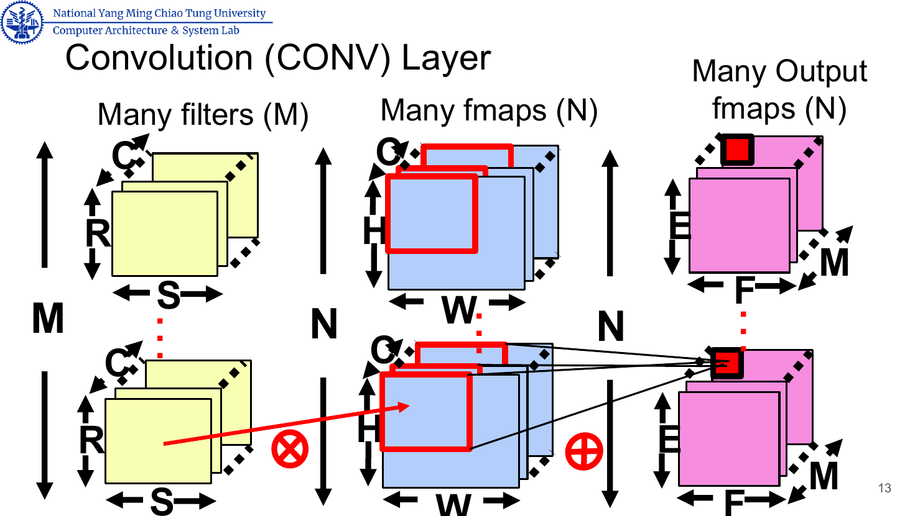

Pooling: Further reduce the network

```c++
// for each pooled value
max = -Inf
for ( i = 0; i < R; i++) {
	for ( j = 0; j < S; j++) {
		if ( X[n][m][Ux+i][Uy+j] > max) {
			max = X[n][m][Ux+i][Uy+j];
 // Find the max in each window
 		}
 	}
 }
Y[n][m][x][y] = max;
```

In GoogleNet, $1\times 1$ CONV filter is used which decreases the number of parameters (weights and biases) and increases the depth of the network. It can also reduce ops using dimension reduction as a bottleneck layer.

ResNet Add layers to fit a residual mapping instead of fitting a desired underlying mapping directly.

MobileNet v1: Depthwise Separable CONV

Word representation: one-hot encoding/ word embedding

Positional Encoding (PE)

## Transformer and LLaMA

# Quantization

Memory is expensive and low bit-width operations are cheap. Quantization is the process of constraining an input from a continuous or large set of values to a discrete set.

## Numeric Data Types
- Fixed-point number
- IEEE 765 Single Precision Float Point (FP 32) : (1+8+23) $Value = (-1)^{Sign}\times 2^{e-127}\times (1+\sum_{i=1}^{23}b_{23-i}2^{-i})$
	- Exponent Width -> Range; Fraction Width-> Precision
- IEEE FP 16, BF-16, TF 32, AMD FP 24
- INT 32, INT 16, INT 8
Small bit width cannot adapt to every DNN models very well (training). Accuracy varies with the different bit widths in layers

## Types of Quantization

 K -Means-based Quantization

 Linear Quantization

 Binary and Ternary Quantization

# Model Pruning

Neural Network Pruning: Make neural network smaller by removing synapses and neurons

# Systolic Accelerator

Lessons from DSA

- **Logic improves much faster than wires and SRAM.**
- Leverage prior compiler optimization
- Some inference applications need floating point arithmetic. Quantized arithmetic grants area and power savings But may reduce quality, delayed deployment and some apps don’t work well when quantized.
- Production inference needs multi-tenancy
- DNN workloads evolve with DNN breakthroughs: The importance of programmability and flexibility for inference DSAs to track DNN progress
- DNNs grow ~1.5X per year in memory and compute. Architects should provide headroom so DSAs can remain useful over their full lifetime

## TPU

Instruction Set Architectures:

- TPU instruction follows the CISC fashion
- Average clock cycles per instructions > 10
- No program counter and branch instruction
- In-order issue
- SW controls buffer, pipeline synchronization
- A dozen instructions overall, five key ones
 Read_Host_Memory
 Read_Weights
 MatrixMultiply/Convole
 Activate
 Write_Host_Memory


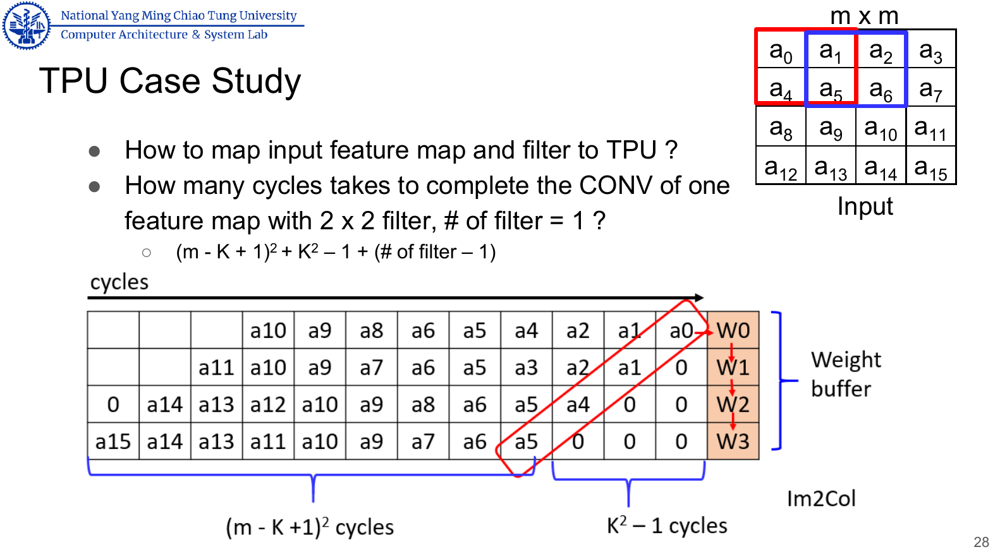

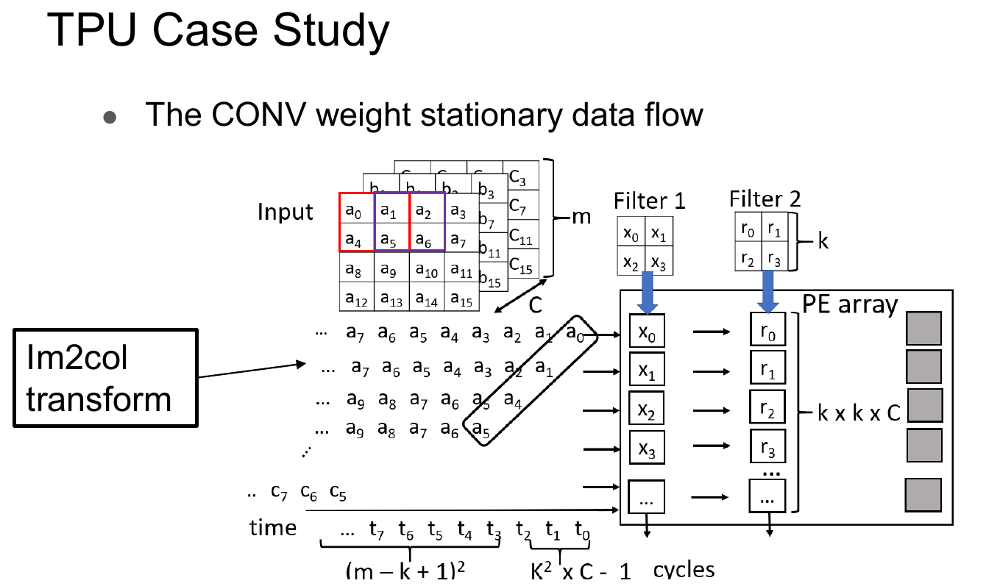

For multiple input and output channels, it takes $(m-k+1)*(m-k+1)*(k*k*iC*oC))$ ops to complete a CONV in the systolic array.

Systolic array contains multiple PEs. Each filter element is placed on the local buffer of each PE.

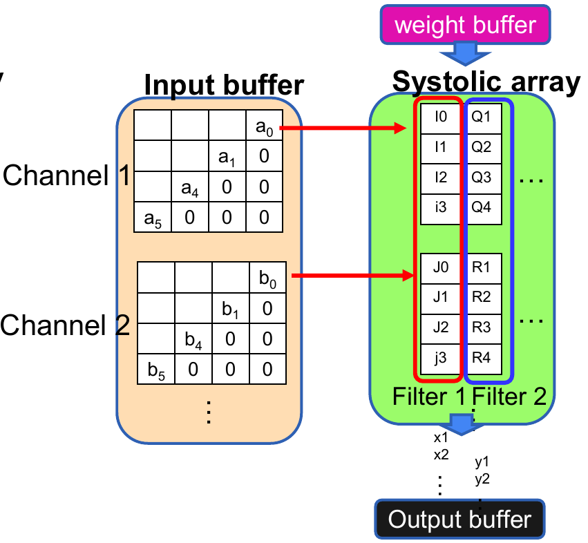

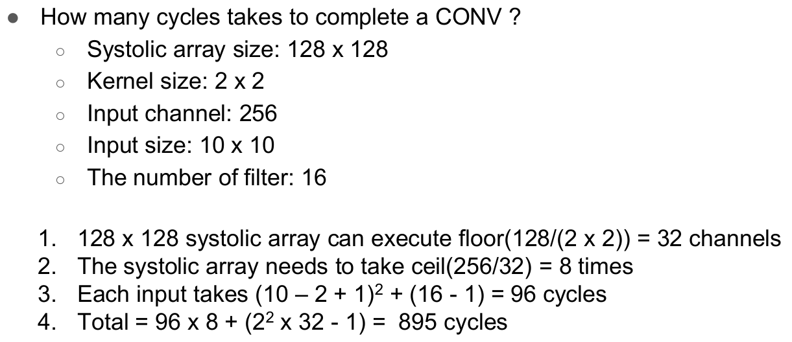

## Dataflow DNN Accelerator

Temporal Accelerator (TA)

- Centralized control for ALUs
- ALUs can only fetch data from the memory hierarchy
- ALUs “cannot” communicate directly with each other
- Design aspects for DNN workloads
	- Reduce # of multiplication -> increase throughput
	- Ordered computation (tiling) -> improve memory subsystem

Spatial Accelerator (SA)

- ALUs
	- Can pass data from one to another directly
	- Can have its own control logics and local memory (registers)
- Dataflow processing
	- Programmable -> dynamic vs static graphs
	- Dynamic Mapping -> increase data reuse -> energy-efficiency
- SA are popular

**Systolic array see lecture 5**

### Weight-stationary

### Output-stationary

### Input-stationary

# Digital DNN Accelerator

**SambaNova Reconfigurable Dataflow Unit (RDU) / Plasticine Architecture** see lecture 6

## Reconfigurable Deep Learning Accelerators

AI accelerators improves 100X performance/energy compared to general-purpose processor

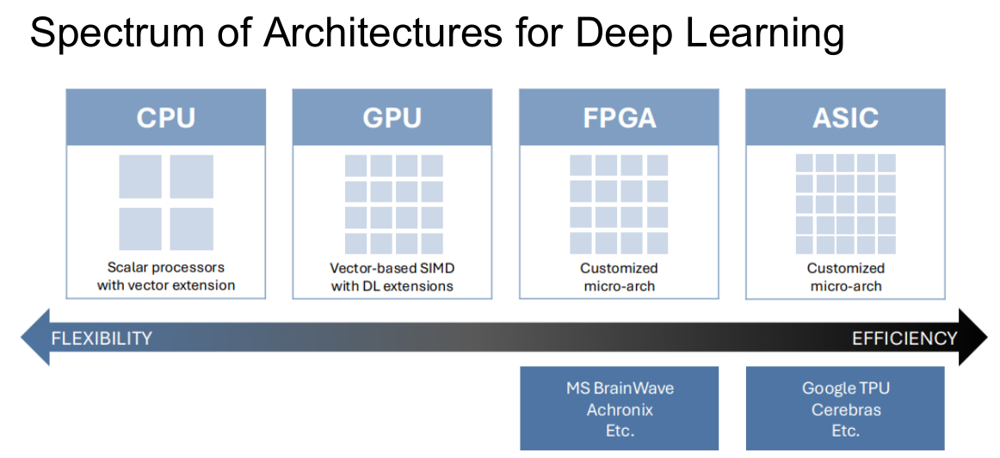

Basic ideas of Reconfigurable computing: a spatial array of processing elements (PEs) & memories with a configurable network. Map computation spatially onto the array.

 FPGA overlay[Hong, MICRO, 2022], FlightLLM[Zeng, FPGA, 2024], HLS

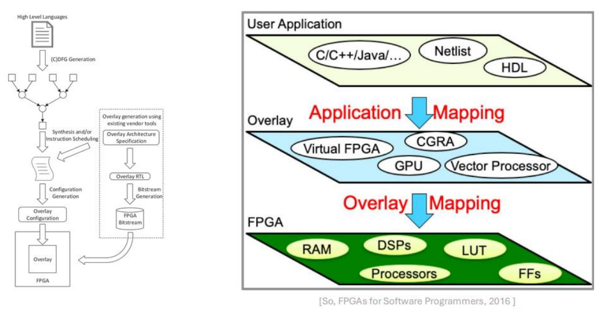

Challenges of FPGAs on LLM Inference

- Low computation efficiency
	- Hard to efficiently map sparse matrices onto DSP chains
- Underutilized memory bandwidth
	- Repeated off-chip memory accesses for each fine-grained kernel
- Huge instruction storage
	- Store instructions for all possible token lengths

# GPGPU

See Lecture 7

GPU = Graphics Processing Units, accelerates computer graphics rendering and rasterization.

- Discrete GPU uses GDDR memory. CPU DRAM optimizes for low latency access. GPU DRAM is optimized for high throughput.
- A (PCIe) bus connecting the CPU and GPU
- Separate DRAM memory spaces: CPU (system memory) and the GPU (device memory)
- Integrated GPU share Cache with CPU.

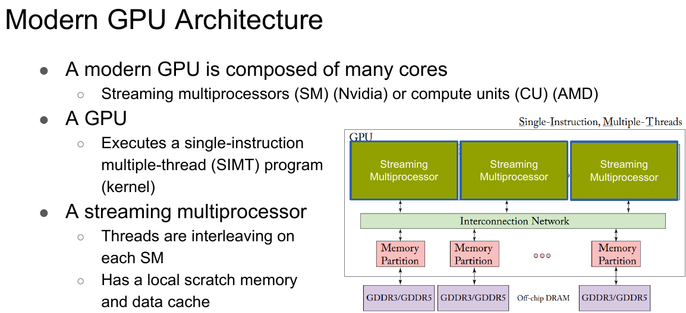

# Tensor Core

See Lecture 7

# Sparse DNN Accelerator
## Compressed Sparse Row (CSR) Format

A matrix M (m * n) is represented by three 1-D vectors

- The A vector: stores value of non-zero elements, **row-by-row** traversing order
- The IA vector: stores the cumulative number of non-zero elements with size $m+1$.
$IA[0]=0, IA[i]=IA[i-1]+ \# of non-zero elements in (i-1) th row of the M$
- The JA vector: stores the column index of each element in the A vector
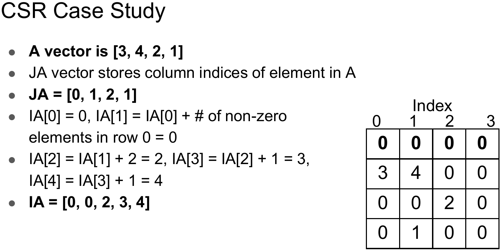
- The sparsity of the matrix: $(total \#- non-zero \#)/total \#$
- The direct array based representation requires memory $3*NNZ(non-zero\#)$
- CSR format requires $2*NNZ + m + 1$
- CSR matrices are memory efficient when $NNZ<(m*(n-1) - 1)/2$

## Compressed Sparse Column (CSC) Format
- A matrix M (m * n) is represented by three 1-D vectors
- The A vector stores values of non-zero elements, column-by-column traversing order
- The IA vector stores the cumulative number of non-zero elements with size $n + 1$
$IA[0] = 0, IA[i] = IA[I - 1] + \# of non-zero elements in (i-1) th column of the M$
- The JA vector stores the row index of each element in the A vector

## Sparse Matrix Vector Multiplication (SpMV)

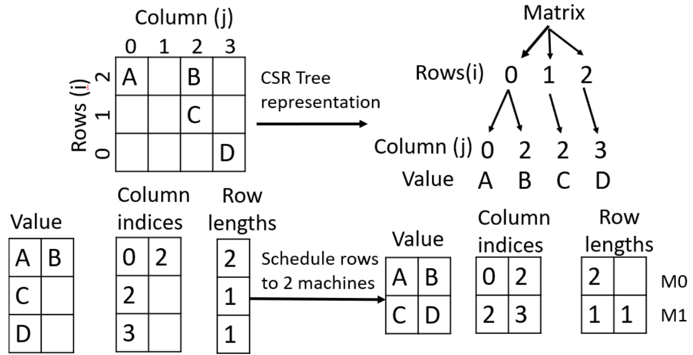

## Efficient Inference Engine (EIE)

The first DNN accelerator for sparse data, compressed model

- for matrices up to 50% dense
- exploit both weight sparsity and activation sparsity
- skipping zero, compressing data
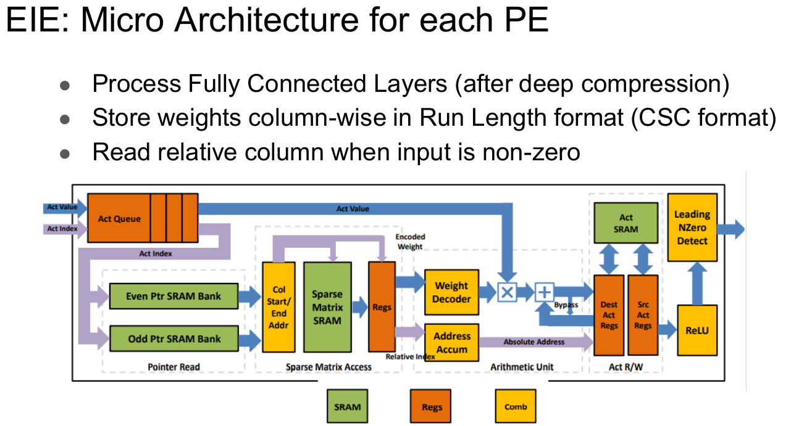

## Cnvlutin
- Work on CONV layer
- skips zero to shorten the execution time

## Nvidia Tensor Core

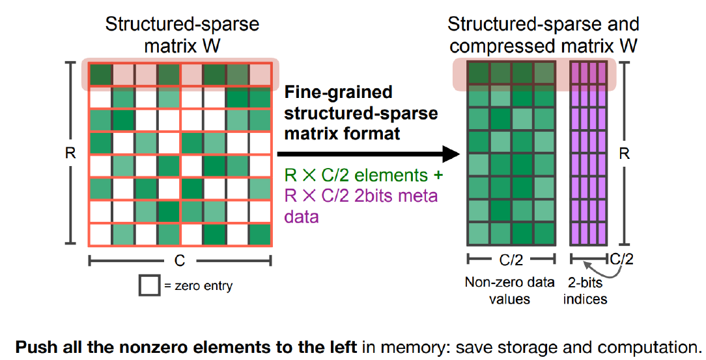

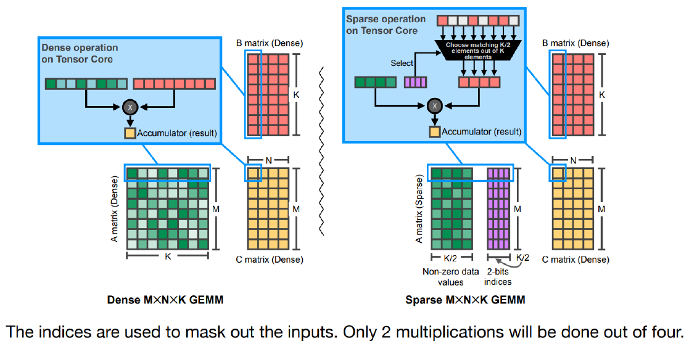

## TorchSparse (TODO)

Chiplet DNN Accelerator See Lecture 10

# Lab

<a href=" https://nycu-caslab.github.io/AAML2024/index.html">实验网站</a>

# Lab 3 Systolic Array

## Prerequisite

- Python3 with numpy library installed
- `iverilog` or `VCS` or `irun`
- `nWave` or `Verdi` or `GTKWave` or anything that can read `.vcd` or `.fsdb`
- Makefile

<a href=" https://nycu-caslab.github.io/CO2024/index.html">Computer Org Lab</a>
