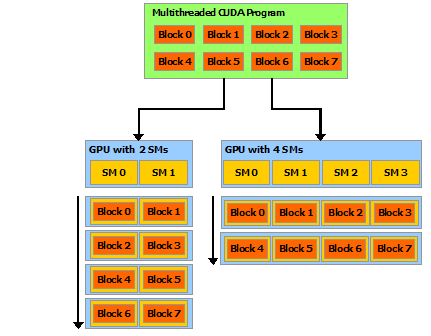

# 1. CUDA 简介

## 为什么要使用 GPU

GPU（Graphics Processing Unit）在相同的价格和功率范围内，比 CPU 提供更高的指令吞吐量和内存带宽。许多应用程序利用这些更高的能力，使得自己在 GPU 上比在 CPU 上运行得更快 (参见 [GPU应用程序](https://www.nvidia.com/object/gpu-applications.html))。其他计算设备，如 FPGA，也非常节能，但提供的编程灵活性要比 GPU 少得多。

GPU 和 CPU 之间的主要区别在于设计思想的不同。CPU 的设计初衷是为了实现在执行一系列操作时达到尽可能高的性能，其中每个操作称之为一个 thread，同时可能只能实现其中数十个线程的并行化，GPU 的设计初衷是为了实现在在并行执行数千个线程时达到尽可能高的性能（通过分摊较慢的单线程程序以实现更高的吞吐量）。

为了能够实现更高强度的并行计算，GPU 将更多的晶体管用于数据计算而不是数据缓存或控制流。

下图显示了 CPU 与 GPU 的芯片资源分布示例。


一般来说，应用程序有并行和串行部分，所以系统可以利用 GPU 和 CPU 的混搭来获得更高的整体性能。对于并行度高的程序也可以利用 GPU 的大规模并行特性来实现比 CPU 更高的性能。

## CUDA：通用并行计算平台和程序模型

CUDA（Compute Unified Device Architecture）是 NVIDIA 推出的通用并行计算平台和程序模型，它利用 NVIDIA GPU 中的并行计算引擎以比 CPU 更有效的方式加速计算密集型任务（如图形处理、深度学习、科学计算）。

CUDA 可以直接链接到 GPU 的虚拟指令集和并行计算单元，从而在 GPU 中完成内核函数的计算。CUDA 提供 C/C++/Fortran 接口，也有许多高性能计算或深度学习库提供包装后的 Python 接口。如下图所示，支持其他语言、应用程序编程接口或基于指令的方法，例如 FORTRAN、DirectCompute、OpenACC。


- **核心优势**：
    - 利用 GPU 数千个核心实现并行计算，速度比 CPU 快数十倍甚至百倍。
    - 支持 C/C++、Python（通过 PyCUDA、Numba）等编程语言，兼容主流深度学习框架（TensorFlow、PyTorch）。

## A Scalable Programming Model

多核 CPU 和超多核 (manycore) GPU 的出现，意味着主流处理器进入并行时代。当下开发应用程序的挑战在于能够利用不断增加的处理器核数实现对于程序并行性透明地扩展，例如 3D 图像应用可以透明地拓展其并行性来适应内核数量不同的 GPUs 硬件。

CUDA 并行程序模型主要为克服这一挑战而设计，其对于程序员具有较小的学习难度，因为其使用了标准编程语言。其核心是三个关键抽象——**线程组的层次结构、共享内存和屏障同步**——它们只是作为最小的语言扩展集向程序员公开。

这些抽象提供了细粒度的数据并行性和线程并行性，并将嵌套在粗粒度的数据并行和任务并行中。它们指导程序员将主问题拆解为可以线程块独立并行解决的粗粒度子问题，同时每个子问题可以被进一步细分为更小的组成部分，其可以被每个线程块中的线程通过并行合作的方式解决。

这种拆解通过运行线程在解决子问题时使用合作机制，保留了语言的表达能力，同时也为系统提供了自动的可拓展性。实际上，每个线程块可以被异步或同步地调度给 GPU 上任意一个多处理器 (Multiprocessors)。故 CUDA 程序可以被执行在具有任意 kernel 数据的 GPU 中，如下图所示，同时在运行时阶段，系统只需要给出物理多处理器地个数。

这种可扩展的程序模型允许 GPU 架构通过简单地扩展多处理器和内存分区的数量来跨越广泛的市场范围：高性能发烧友 GeForce GPU，专业的 Quadro 和 Tesla 计算产品 (有关所有支持 CUDA 的 GPU 的列表，请参阅 [支持 CUDA 的 GPU](https://docs.nvidia.com/cuda/cuda-c-programming-guide/index.html#cuda-enabled-gpus)）。



注意：GPU 是围绕一系列流式多处理器 (SM: Streaming Multiprocessors) 构建的（有关详细信息，请参 [阅硬件实现](https://docs.nvidia.com/cuda/cuda-c-programming-guide/index.html#hardware-implementation)）。多线程程序被划分为彼此独立执行的线程块，因此具有更多多处理器的 GPU 将比具有更少多处理器的 GPU 在更短的时间内完成程序执行。

## GPU 架构

GPU 并不是一个独立运行的计算平台，而需要与 CPU 协同工作，可以看成是 CPU 的协处理器，因此当我们在说 GPU 并行计算时，其实是指的基于 CPU+GPU 的异构计算架构。在异构计算架构中，GPU 与 CPU 通过 [PCIe总线](https://zhida.zhihu.com/search?content_id=6024941&content_type=Article&match_order=1&q=PCIe%E6%80%BB%E7%BA%BF&zhida_source=entity) 连接在一起来协同工作，CPU 所在位置称为为主机端（host），而 GPU 所在位置称为设备端（device），如下图所示。CPU 起控制作用，一般称为主机 host，GPU 看作 CPU 协处理器，一般称为设备 device，主机和设备之间内存访问一般通过 PCIe 总线链接。


基于 CPU+GPU 的异构计算. 来源：Preofessional CUDA® C Programming

可以看到 GPU 包括更多的运算核心，其特别适合数据并行的计算密集型任务，如大型矩阵运算，而 CPU 的运算核心较少，但是其可以实现复杂的逻辑运算，因此其适合控制密集型任务。另外，CPU 上的线程是重量级的，上下文切换开销大，但是 GPU 由于存在很多核心，其线程是轻量级的。因此，基于 CPU+GPU 的异构计算平台可以优势互补，CPU 负责处理逻辑复杂的串行程序，而 GPU 重点处理数据密集型的并行计算程序，从而发挥最大功效。


基于 CPU+GPU 的异构计算应用执行逻辑. 来源：Preofessional CUDA® C Programming

CUDA 是 NVIDIA 公司所开发的 GPU 编程模型，它提供了 GPU 编程的简易接口，基于 CUDA 编程可以构建基于 GPU 计算的应用程序。CUDA 提供了对其它编程语言的支持，如 C/C++，Python，Fortran 等语言

# 安装

- 在 Linux 系统下安装 [NVIDIA Driver](https://link.zhihu.com/?target=https%3A//www.nvidia.com/Download/index.aspx) 和 [CUDA Toolkit](https://link.zhihu.com/?target=https%3A//developer.nvidia.com/cuda-toolkit)
- 使用 [nvcc](https://link.zhihu.com/?target=https%3A//docs.nvidia.com/cuda/cuda-compiler-driver-nvcc/index.html) 编译器进行 GPU 加速的 C/C++ 编程
- 使用 [Numba](https://link.zhihu.com/?target=https%3A//numba.pydata.org/), [PyCUDA](https://link.zhihu.com/?target=https%3A//mathema.tician.de/software/pycuda/), [PyTorch](https://link.zhihu.com/?target=https%3A//pytorch.org/), [TensorFlow](https://link.zhihu.com/?target=https%3A//www.tensorflow.org/) 等扩展库进行 GPU 加速的 Python 编程

## Driver Toolkit

https://developer.nvidia.com/cuda-downloads?target_os=Linux&target_arch=x86_64&Distribution=WSL-Ubuntu&target_version=2.0&target_type=runfile_local

可以在路径

```text
/usr/local/cuda-10.1/extras/demo_suite
```

路径下找到一些样例程序。deviceQuery 将输出 CUDA 的相关信息。CUDA 的各种特性：纹理内存 (texture memory)、常量内存 (constant memory)、共享内存 (shared memory)、块 (block)、线程 (thread)、统一寻址 (unified addressing) 都包含在以上信息中。了解这些特性是进行 CUDA C/C++ 编程的基础。

## 使用 Numba 进行 CUDA Python 编程

https://numba.pydata.org/numba-doc/dev/index.html

Numba 是用于高性能计算的 Python 扩展库，它利用即时编译机制 (JIT) 将 Python 和 NumPy 的一部分代码转换为机器指令，从而大幅提高程序的运行速度。

推荐使用 Anaconda 管理包括 Numba 在内的各种 Python 扩展库。使用 conda 安装的 CUDA Toolkit 位于 Anaconda 中，并且只能用于 Python。C/C++ 和 Anaconda 使用的 CUDA Toolkit 相互**独立**，可以同时存在且**互不影响**。使用 Anaconda 安装的 CUDA Toolkit 的版本不能超过 NVIDIA Driver 支持的最新的 CUDA 版本。

# GPU 性能指标

1. 核心数
2. GPU 显存容量
3. GPU 计算峰值
4. 显存带宽

A 100 架构解析：https://zhuanlan.zhihu.com/p/1908285912053453831

### **GPU 代际新特性**

#### **NVIDIA 主流架构演进**

| 架构     | 代号    | 关键新特性                          | 发布时间 |
| ------ | ----- | ------------------------------ | ---- |
| Kepler | GK110 | 动态并行、Maxwell 双精度提升             | 2012 |
| Pascal | GP100 | Tensor Core（FP16）、HBM2 内存      | 2016 |
| Volta  | GV100 | Tensor Core（FP16/INT8）、混合精度    | 2017 |
| Turing | TU102 | RT Core（光线追踪）、DLSS             | 2018 |
| Ampere | GA100 | Tensor Core（BF16/FP64）、多实例 GPU | 2020 |
| Ada    | AD102 | FP8 Tensor Core、第四代张量核心        | 2022 |
| Hopper | H100  | FP8/TF32 Tensor Core、内存压缩      | 2023 |

## CUDA 基础模型

CUDA（Compute Unified Device Architecture）的基础架构是支撑 GPU 并行计算的底层硬件与软件抽象的结合，其设计核心是通过硬件层面的并行计算单元和软件层面的编程模型，实现高效的通用计算。以下从**硬件模型**和**编程模型**两方面详细说明：

### 一、硬件模型（GPU 硬件架构）

CUDA 的硬件基础是 NVIDIA GPU，其架构经过多代演进（如 Fermi、Kepler、Maxwell、Pascal、Volta、Turing、Ampere、Hopper 等），核心设计围绕 “大规模并行计算” 展开，核心组件包括**流式多处理器（SM）**、**内存层次结构**和**线程调度机制**。

#### 1. 流式多处理器（Streaming Multiprocessor, SM）

SM 是 GPU 的基本计算单元，也是并行计算的核心。一块 GPU 通常包含数十到数百个 SM（数量随 GPU 型号变化，如 A100 有 108 个 SM，H100 有 144 个 SM），每个 SM 可独立执行大量线程，实现并行计算。

每个 SM 的核心组成包括：

- **计算核心**：
    - CUDA Core：负责浮点运算（如 FP32、FP64）和整数运算，是通用计算的基础单元。
    - Tensor Core：专为矩阵运算（如深度学习中的矩阵乘累加）优化，支持 FP16、BF16、INT8 等低精度计算，大幅提升 AI 任务效率。
    - RT Core：用于实时光线追踪，支持几何交集计算（主要面向图形渲染，部分通用计算场景也可利用）。
- **控制与调度单元**：
    - warp 调度器（Warp Scheduler）：以 “Warp” 为单位调度线程（Warp 是 32 个线程的集合，GPU 硬件天然支持 32 线程同步执行，是并行调度的基本单位）。
    - 指令发射单元：将调度器分配的指令发送到计算核心执行。
- **片上内存与缓存**：
    - 寄存器（Registers）：每个线程私有，速度最快（纳秒级访问），用于存储线程执行时的临时变量（如局部变量）。
    - 共享内存（Shared Memory）：线程块（Block）内的线程共享，速度接近寄存器（十纳秒级），容量较小（每个 SM 通常为 64KB~128KB），可用于线程块内的数据交换和重用，减少对全局内存的访问。
    - L1 缓存：每个 SM 私有，用于缓存全局内存或共享内存的数据（部分架构中 L1 与共享内存可配置容量比例）。
    - L2 缓存：所有 SM 共享，用于缓存全局内存、常量内存等数据，容量较大（如 H100 的 L2 缓存达 50MB），缓解全局内存带宽压力。

#### 2. 内存层次结构（GPU Memory Hierarchy）

GPU 的内存设计为 “多级缓存 + 全局内存” 的层次结构，核心目标是平衡**访问速度**和**容量**，适配并行计算中 “高吞吐量” 的需求。从快到慢、从私有到全局分为以下层级：

|内存类型|访问范围|容量（典型值）|访问速度|用途|
|---|---|---|---|---|
|寄存器|线程私有|每个 SM 数万寄存器|纳秒级|存储线程局部变量（如循环索引、临时计算结果）|
|共享内存|线程块内共享|每个 SM 64KB~128KB|十纳秒级|线程块内数据交换、数据重用（如矩阵分块计算）|
|L1 缓存|每个 SM 私有|每个 SM 16KB~64KB|十纳秒级|缓存全局内存数据，减少重复访问|
|L2 缓存|所有 SM 共享|几 MB 到几十 MB|百纳秒级|全局缓存，协调多 SM 的数据访问|
|全局内存（Global Memory）|整个 GPU 设备共享|几 GB 到几十 GB|微秒级|存储设备全局数据（主机与设备间传输的数据）|
|常量内存（Constant Memory）|整个 GPU 设备共享|64KB|百纳秒级（缓存后）|存储只读常量（如神经网络权重），通过常量缓存加速访问|
|纹理内存（Texture Memory）|整个 GPU 设备共享|与全局内存共享容量|百纳秒级（缓存后）|优化 2D/3D 数据访问（如图像纹理），支持地址越界处理和滤波|

#### 3. 线程调度机制

GPU 的并行性通过 “多线程并发” 实现，其调度机制围绕 “Warp” 设计，核心特点是 “单指令多线程（SIMT）”：

- **Warp（线程束）**：32 个线程组成一个 Warp，是 GPU 硬件调度的最小单位。同一 Warp 内的线程执行相同的指令（但可操作不同数据），若线程因分支（如 `if-else`）执行不同指令，会导致 “分支发散”（Warp 需分阶段执行不同分支，降低效率）。
- **调度过程**：当 Kernel 函数启动时，线程块（Block）被分配到 SM 上执行；每个 SM 将 Block 拆分为 Warp，由 warp 调度器按周期选择就绪的 Warp（无数据依赖、资源充足的 Warp），发射指令到计算核心。由于 SM 通常可同时容纳数百个 Warp（如 A100 的每个 SM 支持 64 个 Warp），调度器可通过 “隐藏延迟”（当一个 Warp 等待内存访问时，调度另一个 Warp 执行）保持计算核心的高利用率。

### 二、编程模型（软件抽象）

CUDA 编程模型通过抽象硬件细节，让开发者无需直接操作 GPU 硬件，即可高效编写并行程序。其核心是 “主机 - 设备分离” 和 “分层线程组织”。

#### 1. 主机（Host）与设备（Device）分离

- **主机（Host）**：指 CPU 及其内存，负责控制程序流程、数据预处理、启动 GPU 计算任务（Kernel），并接收计算结果。
- **设备（Device）**：指 GPU 及其内存，负责执行并行计算任务（Kernel 函数），仅能通过主机显式调用。

两者通过 PCIe 总线通信，数据需通过 CUDA API（如 `cudaMemcpy`）在主机内存与设备内存间传输（统一内存技术可简化这一过程）。

#### 2. Kernel 函数（核函数）

Kernel 是在 GPU 上执行的并行函数，是 CUDA 并行计算的核心载体，由 `__global__` 关键字修饰。其特点包括：

- 由主机通过 `<<<gridDim, blockDim>>>` 语法启动（如 `kernel<<<10, 256>>>(args);`），其中 `gridDim` 和 `blockDim` 分别指定线程网格和线程块的维度。
- 启动后，GPU 会创建大量线程（数量 = gridDim.x * gridDim.y * gridDim.z * blockDim.x * blockDim.y * blockDim.z），每个线程独立执行 Kernel 函数的代码。

#### 3. 线程组织（分层结构）

为了高效管理大规模线程（通常数百万到数亿），CUDA 将线程按 “网格（Grid）→ 线程块（Block）→ 线程（Thread）” 的层次组织：

- **线程（Thread）**：最基本的执行单元，每个线程有唯一 ID（`threadIdx`），执行 Kernel 函数的独立实例。
- **线程块（Block）**：由多个线程组成（通常 128~1024 个线程，需满足 SM 的资源限制），块内线程可通过共享内存和 `__syncthreads()` 同步。一个 Block 只能在单个 SM 上执行（但一个 SM 可同时运行多个 Block）。
- **线程网格（Grid）**：由多个 Block 组成，可分布在多个 SM 上执行。Grid 内的 Block 间无直接同步机制（需通过全局内存或主机同步）。
- **索引计算**：每个线程通过内置变量确定自身在 Grid 和 Block 中的位置，从而定位处理的数据。

### 总结

CUDA 基础架构通过**硬件层面**的 SM、多级内存、Warp 调度，提供了强大的并行计算能力；通过**软件层面**的主机 - 设备分离、Kernel 函数、分层线程组织，降低了并行编程门槛。理解这一架构是编写高效 CUDA 程序的前提 —— 例如，利用共享内存减少全局内存访问、避免分支发散以提高 Warp 效率、合理设置 Block 大小以匹配 SM 资源等，均需基于对硬件和编程模型的深入理解。
