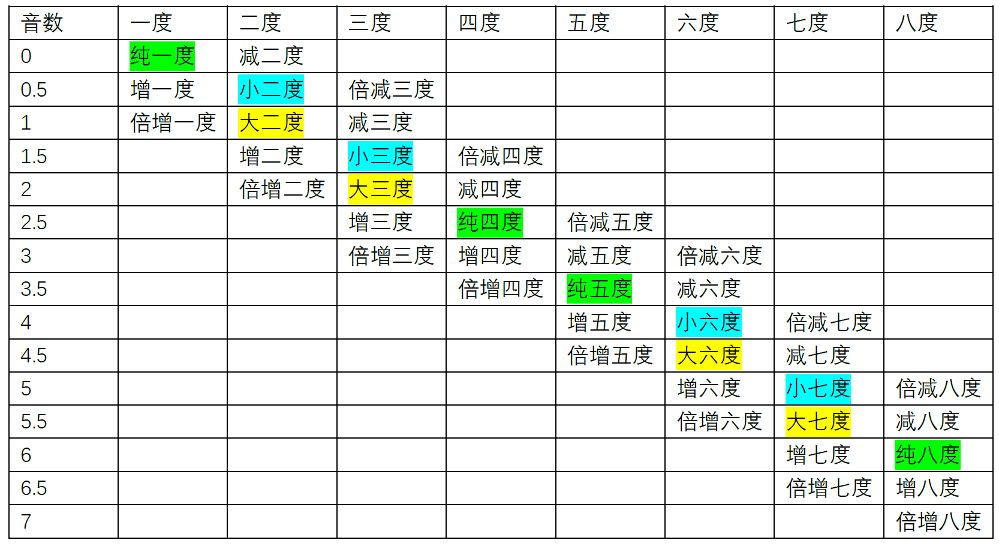

<a href="https://renahah.github.io/%E9%9F%B3%E4%B9%90/%E4%B9%90%E7%90%86/%E4%B9%90%E7%90%86%E7%AC%94%E8%AE%B006-%E9%9F%B3%E7%A8%8B/">renahah 个人笔记 </a>

符号：𝄞 ♯ ♭♮


# ABC Notation

乐谱使用 ABC 表示

<a href=" https://paulrosen.github.io/abcjs/overview/abc-notation.html">abc-notation 的插件</a>

<a href=" https://abcnotation.com/" >abc notation 官方网站</a>
<a href=" https://abcnotation.com/wiki/abc:standard:v2.1#qtempo">abc standard</a>

## Tutorial
<a href=" https://trillian.mit.edu/~jc/music/abc/doc/ABC.html">MIT tutorial</a>

<a href="http://www.lesession.co.uk/abc/abc_notation.htm">tutorial by S.M.</a>

```music-abc
K: G
M: 4/4
L: 1/4
"C"[CEG], D, E,C | DEFG | ABcd| efga | b
```

## 示例

```music-abc
X:1
T:The Legacy Jig
M:6/8
L:1/8
R:jig
K:G
GFG BAB | gfg gab | GFG BAB | d2A AFD |
GFG BAB | gfg gab | age edB |1 dBA AFD :|2 dBA ABd |:
efe edB | dBA ABd | efe edB | gdB ABd |
efe edB | d2d def | gfe edB |1 dBA ABd :|2 dBA AFD |]
```

```music-abc
X: 1
T: Chorus
V: T1 clef=treble name="Soprano"
V: T2 clef=treble name="Alto"
V: B1 clef=bass name="Tenor"
V: B2 clef=bass name="Bass"
L:1/8
K:G
P:First Part
[V: T1]"C"ed"Am"ed "F"cd"G7"gf |
[V: T2]GGAA- A2BB |
[V: B1]C3D- DF,3 |
[V: B2]C,2A,,2 F,,2G,,2 |
```

`{"instrument": "violin"}`

```music-abc
{
  "tablature": []
}
---
X:1
T: Cooley's
M: 4/4
L: 1/8
R: reel
K: G
|:D2|EB{c}BA B2 EB|~B2 AB dBAG|FDAD BDAD|FDAD dAFD|
```

# 音程

音程，即**音与音的音高距离**，如半音、全音都是音程。

## 度数

两个音，**忽略音名升降号，只看音名的字母**，从低音到高音数有几个字母，就称几度。

如 E4 到 A4 经过了 E4, F4, G4, A4 四个字母，就称 E4 到 A4 有四度；

再如 E4♭到 A4♯，去掉升降号为 E4 与 A4，仍然经过 E4, F4, G4, A4 四个字母，故 E4♭到 A4♯ 也是四度。

## 音数

表示两个音之间有多少个全音与半音。一个全音的音数为 1，一个半音的音数为 0.5，两个音的音数等于其间隔的 $全音数 \times 1+ 半音数 \times0.5$。

换一种说法，音数等于两个音之间的 $键数距离 \times 0.5$，这里的键包括白键与黑键。如 E4 到 A4 间有一个半音 (E4->F4) 与两个全音 (F4->G4,G4->A4)，故 E4 到 A4 的音数为 2.5。也可以数两个键的距离，E4->F4->F4♯->G4->G4♯->A4，显然 E4 到 A4 间是五个半音的距离，音数为 2.5。

### 全音与半音

所有音数为 0.5 的音程（增一度、小二度、倍减三度）都是半音，所有音数为 1 的音程（减三度、大二度、倍增一度）都是全音。

## 音程总结表



注意，**E-F/B-C** 之间是半音。所以，不包含升降号的情况下，根据是否包含二者：二三度，包含一个的为小，不包含为大；四度，包含一个，为纯，都不包含为增；五度，包含一个，为纯，都包含，为增；六七度，包含一个，为大，都包含为小。

超过八度的音程，先确定两个音的度数，再将两个音放在八度以内，判断八度以内的音程，来确定音程度数前面的前缀。

### 等音程

音数相等的音程被称作等音程。如减三度、大二度、倍增一度互为等音程，它们的音数都是 1。

### 三全音

所有音数为 3 的音程（倍增三度、增四度、减五度、倍减六度）都是三全音，倍增与倍减的情况较为罕见，因此三全音通常指的是增四度或减五度。

三全音的听觉感受极不协和。

### 音程名字的简写

主要的音程前缀有——**大 (Major)、小 (minor,m 为小写)、增 (Augmented)、减 (Diminished)、纯 (Perfect 或 Pure)**。（倍增与倍减不常见）

简写时就采用前缀首字母 + 数字的形式，如大三度记为 M3，小七度记为 m7，增五度记为 A5。

亦可用 Major 与 minor 形容调式，如 C 大调记为 C Major，D 小调记为 D minor。

## 其他音程定义
### 根音与冠音

两个音中的低音是根音，高音是冠音。如 E4 与 A4 中的 E4 是根音，A4 是冠音。

### 旋律音程与和声音程

两个音先后弹奏时，称为旋律音程。

两个音同时弹奏时，称为和声音程。

### 自然音程与变化音程

在“自然大小调音阶”里直接存在的音程称为自然音程。**可以由两个白键形成的音程**（不需要两个是白键）称为自然音程。在“自然大小调音阶”里不存在的音程称为变化音程，要通过临时升降音产生变化而形成。自然音程之外的音程称为变化音程。

如 C4♯到 F4♯是纯四度，C4♯与 F4♯形成的是自然音程。再如 C4 到 A4♯是增六度，增六度不是能由两个白键形成的音程，因此 C4 到 A4♯形成的是变化音程。

超过八度的音程，将两个音放在八度以内，判断八度以内的音程从而判断其是自然音程还是变化音程。

### 协和音程与不协和音程

协和音程分为三种：

1. 极完全协和音程——纯一度、纯八度…纯 ($1+7n$) 度（n 为整数且 $n≥0$）
2. 完全协和音程——纯四度、纯五度…纯 ( $4 或 5+7n$) 度（n 为整数且 $n>=0$）
3. 不完全协和音程——大三度、小三度、大六度、小六度…大或小 (3 或 6+7n) 度（n 为整数且 n≥0）

协和音程之外的音程称为不协和音程：

- 大二度、小二度、大七度、小七度…大或小 (2 或 7+7n) 度（n 为整数且 n≥0）
- 所有增音程、减音程、倍增音程、倍减音程。

C4 到 A4♭是小六度，是不完全协和音程，而 C4 到 G4♯是增五度，是不协和音程。虽然 A4 &#x266F ♭与 G4♯ 是等音，小六度与增五度是等音程，C4 到 A4♭与 C4 到 G4♯在弹奏时的音高完全相同，但它们所处的音乐语境不同，即在一段连续的音乐中，通过与其他声音，其他和弦，其他音程的对比，所体现出的协和程度是不一样的。

### 音程转位

转位指改变两个音的高低顺序。如 C4 到 E4，可以转位得到 E4 到 C5、E3 到 C4、E4 到 C6、E5 到 C6 等等（只要是 E-C 就行）。而通常情况下转位得到的是 E4 到 C5、E3 到 C4（原位中的一个音不动，转位后在八度以内）。

可以根据原位的音程名字，推出转位后的音程名字。音程名字前缀对应关系为：大<->小、纯<->︎纯、增<->减、倍增<->︎倍减。原位的音数大于 0 且小于 6 时，原位与转位的音程度数之和为 9。如 C4-D4 是大二度，其转位 D4-C5 是小七度。

原位的音数等于 0 或大于 6 时，不满足“原位与转位的音程度数之和为 9”这一规律。如纯一度的转位仍为纯一度，纯八度的转位仍为纯八度。增七度的转位为减九度（如 D4♭到 C5♯为增七度，其转位 C3♯到 D4♭为减九度。其转位不是 C4♯到 D4♭，是因为 C4♯与 D4♭等音，而转位要求两个音的高低顺序彻底改变）。

原位音程与转位音程的各类性质（自然音程还是变化音程，协和音程还是不协和音程）不会改变。

如 C4 到 F4𝄪是倍增四度，其转位 F4𝄪到 C5 是倍减五度。倍增四度与倍减五度都是变化音程，不协和音程。

度数大于八的音程，先缩小到八度以内，再转位。

# 和弦
### 和弦

三个音或者三个以上的音构成的集体称为和弦。在特定风格或条件下，有些和弦会规律性地省略自己内部的一些音，导致这些和弦看上去只有 1 或 2 个音。

### 和声

和声指不同的和弦组合、连接、运用方式、细节处理等。强调不同和弦连接而形成的整体。

### 三和弦

三个音，按照三度叠置的关系形成的和弦称为三和弦。三个音由低到高分别为根音、三音与五音。根音到三音，三音到五音的音程皆为三度。

#### 大三和弦与小三和弦

根音到三音是大三度，三音到五音是小三度，称为大三和弦（大 + 小）。听起来通常感觉明亮、温馨。

根音到三音是小三度，三音到五音是大三度，称为小三和弦（小 + 大）。听起来通常感觉暗淡、忧伤。

大三和弦与小三和弦的根音到五音是纯五度，是协和音程，听起来顺耳。

#### 增三和弦与减三和弦

根音到三音是大三度，三音到五音是大三度，称为增三和弦（大 + 大）。

根音到三音是小三度，三音到五音是小三度，称为减三和弦（小 + 小）。

增三和弦与减三和弦的根音到五音是增五度/减五度，是不协和音程，听起来紧张、压抑。

增三和弦是需要扩张的紧张、压抑，后面通常接大六度；减三和弦是需要收缩的紧张、压抑，后面通常接纯四度或大三度；

#### 三和弦的转位

三和弦的第一转位，指将原位的根音提高八度，三音与五音保持不变。所得和弦低音（三音）与根音的距离是六度，故又称为六和弦。

三和弦的第二转位，指将原位的根音与三音提高八度，五音保持不变。所得和弦低音（五音）与根音的距离是四度，低音（五音）与三音的距离是六度，故又称为四六和弦。

注意转位后音高最低的音（低音）不是根音。

如图为大三和弦的转位，小三和弦、增三和弦、减三和弦同理，其转位后的名称前缀与原位三和弦的前缀相同。

```music-abc
L: 1
"原位"[CEG] "第一转位"[EGc] "第二转位"[Gce]
```

### 七和弦

四个音，按照三度叠置的关系形成的和弦称为七和弦。四个音由低到高分别为根音、三音、五音、七音。根音到三音，三音到五音，五音到七音的音程皆为三度。

#### 七和弦的命名规则

七和弦名字前有两个前缀，第一个前缀与其根音、三音、五音形成的三和弦前缀相同，第二个前缀与其根音与七音形成的音程前缀相同。
如 C4、E4、G4、B4 构成的七和弦，其根三五音为 CEG，是大三和弦；根音与七音是大七度。分别取两者的前缀，得到七和弦的名称为“大大七和弦”（有两个“大”的情况通常会省略一个，称其为“大七和弦”）。
如 B4、D5、F5、A5 构成的七和弦，其根三五音是减三和弦；根音与七音是小七度。分别取两者的前缀，得到七和弦的名称为“减小七和弦”。

#### 常用七和弦及其简称

常用的七和弦一共有7种，如下表所示：

表1 常用七和弦及其简称

| 全称    | 简称/别称             | 举例           |
| ----- | ----------------- | ------------ |
| 大大七和弦 | 大七和弦              | C4、E4、G4、B4  |
| 大小七和弦 | 属七和弦              | G4、B4、D5、F5  |
| 小大七和弦 |                   | D4、F4、A4、C5♯ |
| 小小七和弦 | 小七和弦              | E4、G4、B4、D5  |
| 减小七和弦 | 半减七和弦  <br>小七降五和弦 | B3、D4、F4、A4  |
| 减减七和弦 | 减七和弦              | B3、D4、F4、A4♭ |
| 增大七和弦 | 半增七和弦  <br>大七升五和弦 | F4、A4、C5♯、E5 |

这里减小七和弦又称“半减七和弦”，指的是相较于“减减七和弦”，减小七和弦只有一个减。半增七和弦同理。  
这里减小七和弦又称“小七降五和弦”，是指将小七和弦的五音降低一个半音，就可以得到减小七和弦。增大七和弦同理，可以将大七和弦的五音升一个半音来得到，故可称为“大七升五和弦”。