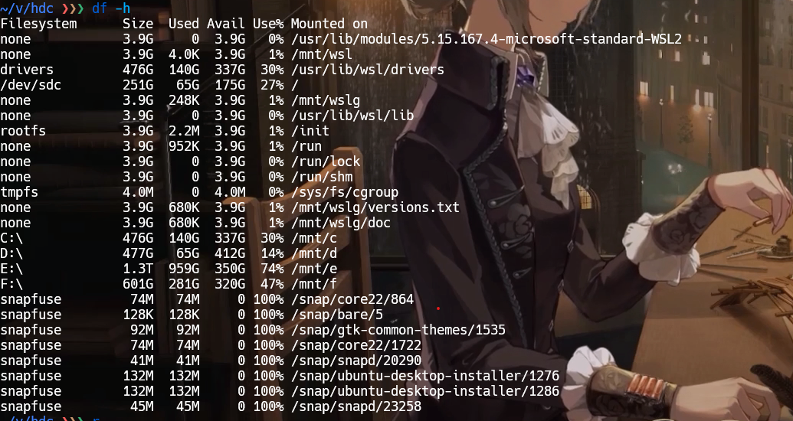

# 讲义内容
- [x] 安装 linux，了解用法。
- [x] ysyx 代码安装配置。

<a href=" https://ysyx.oscc.cc/docs/ics-pa/PA0.html">ysyx PA 0</a>, <a href="https://nju-projectn.github.io/ics-pa-gitbook/ics2024/">NJU PA 0</a>

- 其他资源
	- PA 习题课 why @b
	- ICS 理论课袁春风 @MOOC
	- ICS 计算机组成构造，@b
	- OS 课，jyy @b

工具：<a href="https://dir.scmor.com/">镜像和各种搜索引擎</a>

x 86/ riscv 32 (64)/ ISA 无关的手册

<a href=" https://nju-projectn.github.io/ics-pa-gitbook/ics2024/blank.html">杂项各种</a>

> [!warning]
PA 的某些特性会依赖于 64 位平台和图形显示.

## 推荐阅读
- <a href=" https://101.ustclug.org/">中国科学技术大学 Linux 用户协会发起 linux 101</a>
- <a href="总结了很多常用的命令行工具">总结了很多常用的命令行工具 The Art of Command Line</a>
- <a href=" https://missing-semester-cn.github.io/">MIT The Missing Semester of Your CS Education</a>：shell vim 数据整理命令行 git
- <a href=" https://ysyx.oscc.cc/docs/ics-pa/PA0.html">MIT Academic Integrity</a>

## 总结

安装、配置、熟悉使用了 wsl。关于 linux/man/shell/regular expression 还有很多需要学习的东西。

> [!note] 持续学习
[GNU diff format](http://www.gnu.org/software/diffutils/manual/html_node/Unified-Format.html)
<a href=" https://nju-projectn.github.io/ics-pa-gitbook/ics2024/0.4.html">讲义还给出了更多 vim 配置，结合其他资料选择</a>。
[Harley Hahn's Guide to Unix and Linux](http://www.harley.com/books/sg3.html).
[鸟哥的Linux私房菜](http://linux.vbird.org/linux_basic)
> <a href=" https://linuxconfig.org/gdb-debugging-tutorial-for-beginners">GNU 教程、还有其他资料</a>

## Linux 教程

<a href=" https://ysyx.oscc.cc/docs/ics-pa/linux.html#%E5%9C%A8linux%E4%B8%8B%E7%BC%96%E5%86%99hello-world%E7%A8%8B%E5%BA%8F">PA 给出的教程</a>

Different GNU/Linux distribution has different package manager. In Ubuntu, the package manager is called `apt`.

命令行格式：

```shell
命令名称 参数1 参数2 参数3 …
```

`reboot` 为重启命令。

`poweroff` 为关机命令。

`mount` 用于挂载一个文件系统

`umount` 与 `mount` 相反，是卸载一个挂载点，即取消该入口。

`whereis` 用于查找文件、手册等。

`whoami` 显示自身的用户名称，本指令相当于执行 "id -un" 指令。

# Shell

## Shell 脚本基础语法
### 1. **脚本结构与执行**
   - 脚本首行 `#!/bin/bash`。
   - 赋予执行权限：`chmod +x script.sh`。
   - 运行脚本：`./script.sh` 或 `bash script.sh`。

### 2. **变量与数据类型**
   - 变量定义：`var=value`（**无空格**）。
   - 变量引用：`$var` 或 `${var}`。
   - 特殊变量：`$0`（脚本名）、`$1`（参数 1）、`$?`（退出码）、`$$`（进程 ID）。

### 3. **引号与字符串**
   - 单引号 `'`（原样输出）、双引号 `"`（解析变量）、反引号 `` ` ``（执行命令）。
   - 字符串拼接：`str="Hello, ${name}!"`。

### 4. **条件判断**
   - `if-then-elif-else-fi` 结构。
   - 条件表达式：

     ```bash
     if [ "$a" -eq "$b" ]; then  # 数值比较
     if [[ "$str" == "pattern" ]]; then  # 字符串匹配（推荐双中括号）
     ```

   - 文件测试：`-f`（文件存在）、`-d`（目录存在）、`-x`（可执行）。

### 5. **循环结构**
   - `for` 循环：

 ```bash
     for i in {1..5}; do
         echo $i
     done
 ```

   - `while` 循环：

```bash
     while read line; do
         echo $line
     done < file.txt
```

### 6. **函数**
   - 定义函数：

```bash
     function greet() {
         echo "Hello, $1!"
     }
     greet "Alice"  # 调用函数
 ```

### 7. **输入输出重定向**
   - 标准输入（`<`）、标准输出（`>`）、追加（`>>`）、错误输出（`2>`）。
   - 管道符 `|`：`cat file.txt | grep "error"`。

---

## Shell 脚本核心技能

### **1. 文件与目录操作**

| 命令       | 用途         | 核心功能                     |
|------------|--------------|----------------------------|
| `ls`       | **查看**     | 列出目录内容                 |
| `cd`       | **跳转**     | 切换工作目录                 |
| `cp`       | **复制**     | 复制文件或目录               |
| `mv`       | **移动**     | 移动/重命名文件或目录         |
| `rm`       | **删除**     | 删除文件或目录               |
| `mkdir`    | **创建**     | 新建目录                     |
| `touch`    | **新建**     | 创建空文件或更新文件时间戳     |
| `find`     | **搜索**     | 按条件递归查找文件            |
| `chmod`    | **权限**     | 修改文件权限                 |

`cat more less` 用于显示，`cat` 只展示最后布满屏幕的内容，`more` 逐行显示，`less` 支持上下滚动。

---

### **2. 文本处理与查看**

| 命令       | 用途         | 核心功能                     |
|------------|--------------|----------------------------|
| `cat`      | **合并**     | 显示/拼接文件内容             |
| `grep`     | **过滤**     | 按模式匹配文本行              |
| `sed`      | **替换**     | 流式文本编辑（替换/删除）|
| `awk`      | **解析**     | 结构化文本数据处理            |
| `head`     | **截取**     | 显示文件头部内容              |
| `tail`     | **追踪**     | 显示文件尾部或实时追加内容      |
| `wc`       | **统计**     | 计算行数、词数、字节数         |
| `sort`     | **排序**     | 对文本行排序                 |
| `uniq`     | **去重**     | 去除重复相邻行                |

---

### **3. 系统与进程管理**

| 命令       | 用途         | 核心功能                     |
|------------|--------------|----------------------------|
| `ps`       | **查看**     | 显示当前进程状态              |
| `top`      | **监控**     | 动态显示系统资源占用           |
| `kill`     | **终止**     | 发送信号终止进程              |
| `df`       | **容量**     | 查看磁盘空间使用情况           |
| `du`       | **统计**     | 计算目录/文件占用空间          |
| `free`     | **内存**     | 显示内存和交换分区使用量        |
| `uname`    | **信息**     | 查看系统内核版本信息           |
| `shutdown` | **关机**     | 关机或重启系统               |

---

### **4. 网络与通信**

| 命令       | 用途         | 核心功能                     |
|------------|--------------|----------------------------|
| `ping`     | **连通**     | 测试网络连通性               |
| `curl`     | **传输**     | 支持多协议的数据下载/上传      |
| `wget`     | **下载**     | 递归下载网络资源              |
| `ssh`      | **远程**     | 安全登录远程服务器            |
| `scp`      | **传输**     | 安全复制文件到远程主机         |
| `netstat`  | **状态**     | 显示网络连接和端口监听状态      |
| `ifconfig` | **配置**     | 查看/配置网络接口信息          |
| `traceroute`| **路由**    | 追踪数据包传输路径            |

---

### **5. 压缩与归档**

| 命令       | 用途         | 核心功能                     |
|------------|--------------|----------------------------|
| `tar`      | **打包**     | 归档文件（可结合压缩算法）|
| `gzip`     | **压缩**     | 使用 GZIP 算法压缩文件         |
| `zip`      | **封装**     | 创建 ZIP 格式压缩包           |
| `unzip`    | **解压**     | 解压 ZIP 文件                |
| `rsync`    | **同步**     | 增量备份和文件同步工具         |

---

### **6. 用户与权限**

| 命令       | 用途         | 核心功能                     |
|------------|--------------|----------------------------|
| `sudo`     | **提权**     | 以超级用户权限执行命令         |
| `useradd`  | **创建**     | 添加新用户账户               |
| `passwd`   | **密码**     | 修改用户密码                |
| `chown`    | **归属**     | 修改文件所有者               |
| `groups`   | **组别**     | 查看用户所属组               |

---

### **7. 开发与调试**

| 命令       | 用途         | 核心功能                     |
|------------|--------------|----------------------------|
| `gdb`      | **调试**     | GNU 调试器分析程序运行       |
| `make`     | **构建**     | 自动化编译管理工具           |
| `git`      | **版本**     | 代码版本控制工具             |
| `strace`   | **追踪**     | 跟踪程序系统调用和信号        |
| `diff`     | **对比**     | 比较文件差异                |

---

### **8.高级技巧**
   - **调试脚本**：
     - `set -x`（开启调试）、`set +x`（关闭调试）。
   - **错误处理**：
     - `set -e`（脚本遇到错误立即退出）、`trap`（捕获信号）。
   - **性能优化**：
     - 避免频繁启动子进程（如用 Shell 内置功能替代 `awk`）。
   - **正则表达式**：
     - 学习基础正则表达式（BRE）和扩展正则表达式（ERE）。
   - **进程管理**：
     - `&`（后台运行）、`wait`（等待子进程）、`nohup`（脱离终端运行）。

---

## 常用工具
### `ln`

`ln` 主要用于在两个文件中创建链接，链接又分为 `Hard Links` (硬链接) 和 `Symbolic Links` (符号链接或软链接)，其中默认为创建**硬链接**，使用 `-s` 参数指定创建软链接。

- 硬链接主要是增加一个文件的链接数，只要该文件的链接数不为 `0` ，该文件就不会被物理删除，所以删除一个具有多个硬链接数的文件，必须删除所有它的硬链接才可删除。
- 软链接简单来说是为文件创建了一个类似快捷方式的东西，通过该链接可以访问文件，修改文件，但不会增加该文件的链接数，删除一个软链接并不会删除源文件，即使源文件被删除，软链接也存在，当重新创建一个同名的源文件，该软链接则指向新创建的文件。
- 硬链接只可链接两个文件，不可链接目录，而软链接可链接目录，所以软链接是非常灵活的。

### `chmod`

永远更改一个文件的权限，主要有 **读取** 、 **写入** 、 **执行** ，三种权限，其中 **所有者** 、 **用户组** 、 **其他** 各占三个。`r=read` ， `w=write` ， `x=execute`

```shell
chmod +x filename        ### 为 user ，group ，others 添加执行权限
chmod -x filename        ### 取消 user ， group ，others 的执行权限
chmod ugo=rwx filename   ### 设置 user ，group ，others 具有 读取、写入、执行权限
```

### Tar

`tar` 主要用于创建归档文件，和解压归档文件，其本身是没有压缩功能的，但可以调用 `gzip` 、 `bzip2` 进行压缩处理。

参数解释：

- `-c` 创建归档
- `-x` 解压归档
- `-v` 显示处理过程
- `-f` 目标文件，其后必须紧跟 目标文件
- `-j` 调用 `bzip2` 进行解压缩
- `-z` 调用 `gzip` 进行解压缩
- `-t` 列出归档中的文件

```shell
tar -cvf filename.tar .       ### 将当前目录所有文件归档，但不压缩，注意后面有个 ’.‘ ，不可省略，代表当前目录的意思` 
tar -xvf filename.tar         ### 解压 filename.tar 到当前文件夹`
tar -cvjf filename.tar.bz2 .  ### 使用 bzip2 压缩`
tar -xvjf  filename.tar.bz2   ### 解压 filename.tar.bz2 到当前文件夹`
tar -cvzf filename.tar.gz     ### 使用 gzip  压缩`
tar -xvzf filename.tar.gz     ### 解压 filename.tar.gz 到当前文件夹`
tar -tf   filename            ### 只查看 filename 归档中的文件，不解压`
```

### Df

在 windows wsl 2 下 `df -h`：



1. **Filesystem**: 显示文件系统的类型或挂载来源。
2. **Size**: 文件系统的总大小。
3. **Used**: 已使用的磁盘空间。
4. **Avail**: 可用的磁盘空间。
5. **Use%**: 已使用的磁盘空间百分比。
6. **Mounted on**: 文件系统挂载的路径。
一些关键条目的解释：

- **none**: 表示这是一个内存文件系统，不占用实际的磁盘空间。例如，`/usr/lib/modules/5.15.167.4-microsoft-standard-WSL2` 和 `/mnt/wsl` 等都是内存文件系统，它们用于特定的系统功能，如模块存储和 WSL 的挂载点。
- **drivers**: 这是 WSL 的一个特殊文件系统，用于存储和管理 WSL 的驱动程序。
- **/dev/sdc**: 这通常是连接到您计算机的物理磁盘设备。在这个例子中，它显示为根文件系统 `/`，意味着您的 WSL 环境的主目录。
- **none**: 再次出现，表示其他内存文件系统，用于不同的系统功能。
- **tmpfs**: 这是一个临时文件存储系统，通常用于存放临时文件，它存在于内存中，所以速度很快，但在系统重启后会丢失数据。
- **C:\ D:\ E:\ F:\ **: 这些是您的 Windows 驱动器在 WSL 中的挂载点。例如，`C:\` 挂载在 `/mnt/c`，这意味着您可以通过 WSL 访问 C 盘的内容。
- **snapfuse**: 这是用于挂载 Snap 包的文件系统。Snap 是 Ubuntu 和其他 Linux 发行版中用于软件分发的系统。例如，`/snap/core22/864` 是一个特定的 Snap 包实例。
- **rootfs**: 这是 WSL 的根文件系统，类似于 Linux 系统中的 `/`。
- **run**: 这是一个临时文件系统，用于存放运行时数据，包括锁文件和会话特定的数据。

请注意，`snapfuse` 下的文件系统显示 100% 使用率，这可能是因为 Snap 包的挂载点没有正确释放空间，或者 Snap 包本身存在问题。如果这些 Snap 包不再需要，可以考虑卸载它们以释放空间。

`/dev/sdc` 显示为 251G，这很可能是您的 WSL2 分配的磁盘空间大小。对于 `/dev/sdc`，已使用的空间是 65G，这意味着在您的 WSL2 环境中，已经有 65GB 的空间被使用。

### **man**

> [!man man]
> man - an interface to the system reference manuals

A key preceded by a caret indicates the Ctrl key; thus `^K` is `ctrl-K`.

`CR` 代表回车键

## Shell 例子

### 统计代码行数

```shell
find . | grep '\.c$\|\.h$' | xargs wc -l
```

`find` 是搜索目录中的文件。`find .` 实际能够列出当前目录下的所有文件. 如果在文件很多的地方键入 `find .`, 将会看到过多的文件, 此时可以按 `CTRL + c` 退出。

我们的 `grep` 有一个参数, 它能够匹配以 `.c` 或 `.h` 结束的文件

## 列出一个 C 语言项目中所有被包含过的头文件

**如何列出一个 C 语言项目中所有被包含过的头文件?** 这个例子比刚才的稍微复杂一些, 但在 Windows 下你几乎无法通过 GUI 工具高效地做到它. 在 Linux 中, 我们只需要通过一行命令就可以做到了:

```
find . -name "*.[ch]" | xargs grep "#include" | sort | uniq
```

# 正则表达式

Regular Expression 正则表达式是通过一些特殊字元的排列组合，用来“搜索/取代/删除”，也即再字串上的表达式。他是一种字符串处理的标准，需要支持的工具，如 vi, sed, awk。

## 元字符和特性
### 字符匹配

- 普通字符：普通字符按照字面意义进行匹配，例如匹配字母 "a" 将匹配到文本中的 "a" 字符。
- 元字符：元字符具有特殊的含义。

### 元字符

`\s` 是所有空白字符，包括换行，`\S` 是所有非空白字符，不包括换行。`\d` 匹配任意数字字符，`\w` 匹配任意字母数字字符，`.` 匹配任意字符（除了换行符）等。

### 量词、限定符

- `*`：匹配前面的模式零次或多次。
- `+`：匹配前面的模式一次或多次。`*` 和 `+` 限定符都是贪婪的，因为它们会尽可能多的匹配文字，只有在它们的后面加上一个 `?` 就可以实现非贪婪或最小匹配。
- `?`：匹配前面的模式零次或一次。
- `{n}`：匹配前面的模式恰好 n 次。
- `{n,}`：匹配前面的模式至少 n 次。
- `{n,m}`：匹配前面的模式至少 n 次且不超过 m 次。

### 字符类

- `[ ]`：匹配括号内的任意一个字符。例如，`[abc]` 匹配字符 "a"、"b" 或 "c"。
- `[^ ]`：匹配除了括号内的字符以外的任意一个字符。例如，`[^abc]` 匹配除了字符 "a"、"b" 或 "c" 以外的任意字符。

### 边界匹配

- `^`：匹配字符串的开头。
- `$`：匹配字符串的结尾。
- `\b`：匹配单词边界。
- `\B`：匹配非单词边界。

### 分组和捕获

- `( )`：用于分组和捕获子表达式。标记一个子表达式的开始和结束位置。
- `(?: )`：用于分组但不捕获子表达式。

### 特殊字符

- `\`：转义字符，用于匹配特殊字符本身。
- `.`：匹配任意字符（除了换行符 `\n、\r`）。
- `|`：用于指定多个模式的选择。

例子：`^[a-zA-Z0-9_-]{3,15}$`。匹配任意字母、数字、`_-` 字符，3 到 15 次。

# Git

<a href=" https://www.runoob.com/git/git-tutorial.html">runoob git 教程</a> <a href=" https://blog.csdn.net/m0_63230155/article/details/134607239">常用命令</a>

[Visualizing Git Concepts with D3](http://onlywei.github.io/explain-git-with-d3)

<a href="https://git-scm.com/docs">git 官方文档</a>

<a href=" https://www.runoob.com/manual/git-guide/">简明指南</a>

特点

- Git 是一个开源的分布式版本控制系统，用于敏捷高效地处理任何或小或大的项目。
- Git 是 Linus Torvalds 为了帮助管理 Linux 内核开发而开发的一个开放源码的版本控制软件。
- Git 与常用的版本控制工具 CVS, Subversion 等不同，它采用了分布式版本库的方式，不必服务器端软件支持。

```shell
# 设置
git config --global user.name "Your Name" $ 
git config --global user.email "email@example.com"

### …or create a new repository on the command line
echo "# Tools" >> README.md
# 创建新仓库
git init
# 你可以提出更改（把它们添加到暂存区）
git add README.md
# 实际提交改动
git commit -m "first commit"
git branch -M main
git remote add origin https://github.com/JR-Wesley/Tools.git
# 将这些改动提交到远端仓库
git push -u origin main

### …or push an existing repository from the command line
# 将你的仓库连接到某个远程服务器
git remote add origin https://github.com/JR-Wesley/Tools.git
# 修改 url
git remote set-url origin git@github.com:someaccount/someproject.git

git branch -M main # 这个 main 对应分支的名字
git push -u origin main
```

`git config --global url.ssh://git@github.com/.insteadOf https://github.com/` 把默认 htpps 改成 ssh。<a href="https://stackoverflow.com/questions/11200237/how-do-i-get-git-to-default-to-ssh-and-not-https-for-new-repositories">参考</a>

## 检出仓库

执行如下命令以创建一个本地仓库的克隆版本：

`git clone /path/to/repository`

如果是远端服务器上的仓库，你的命令会是这个样子：

`git clone username@host:/path/to/repository`

## 分支

```shell
# 查看当前分支
git branch
# 创建分支 $ 
git branch dev
# 切换分支
git checkout dev
# 创建一个叫做 dev 的分支，并切换过去
git checkout -b dev

# 合并分支
git merge dev
# 删除分支 $ 
git branch -d dev
# 重命名当前分支为 main
git branch -M main
```

除非你将分支推送到远端仓库，不然该分支就是 _不为他人所见的_：

## 更新与合并

要更新你的本地仓库至最新改动，执行：

`git pull`

以在你的工作目录中 _获取（fetch）_ 并 _合并（merge）_ 远端的改动。

要合并其他分支到你的当前分支（例如 master），执行：

`git merge <branch>`

在这两种情况下，git 都会尝试去自动合并改动。遗憾的是，这可能并非每次都成功，并可能出现 _ 冲突（conflicts）_。这时候就需要你修改这些文件来手动合并这些 _ 冲突（conflicts）_。改完之后，你需要执行如下命令以将它们标记为合并成功：

`git add <filename>`

在合并改动之前，你可以使用如下命令预览差异：

`git diff <source_branch> <target_branch>`

## 替换本地改动

假如你操作失误（当然，这最好永远不要发生），你可以使用如下命令替换掉本地改动：

`git checkout -- <filename>`

此命令会使用 HEAD 中的最新内容替换掉你的工作目录中的文件。已添加到暂存区的改动以及新文件都不会受到影响。

假如你想丢弃你在本地的所有改动与提交，可以到服务器上获取最新的版本历史，并将你本地主分支指向它：

`git fetch origin`

`git reset --hard origin/master`

## 忽视

<a href=" https://blog.csdn.net/m0_63230155/article/details/134471033">通过 `. gitignore` 忽视指定文件</a>

## Lazygit

<a href=" https://github.com/jesseduffield/lazygit/blob/master/docs/Config.md">lazygit 默认配置</a>

Default path for the global config file:

- Linux: `~/.config/lazygit/config.yml
关闭 `autoFetch`

# **一、Makefile 基础**
#### 1. **核心概念**
   - **目标（Target）**：需要生成的文件或执行的命令标签。
   - **依赖（Dependencies）**：目标构建所需的文件或其他目标。
   - **命令（Recipe）**：生成目标的具体 Shell 命令。
   - **规则（Rule）**：目标、依赖和命令的组合，格式为：

     ```makefile
     target: dependencies
         recipe
     ```

#### 2. **基本语法**
   - **变量定义**：

     ```makefile
     CC = gcc
     CFLAGS = -Wall -O2
     ```

   - **使用变量**：`$(CC)` 或 `${CC}`。
   - **默认目标**：第一个目标是默认目标（通常命名为 `all`）。
   - **伪目标（Phony Target）**：不生成文件的目标（如 `clean`），需声明：

     ```makefile
     .PHONY: clean
     ```

#### 3. **简单示例**

   ```makefile
   # 编译 main.c 和 utils.c
   all: program

   program: main.o utils.o
       $(CC) $(CFLAGS) -o $@ $^

   main.o: main.c
       $(CC) $(CFLAGS) -c $<

   utils.o: utils.c
       $(CC) $(CFLAGS) -c $<

   clean:
       rm -f *.o program
   ```

---

### **二、Makefile 进阶**
#### 1. **自动变量（Automatic Variables）**
   - `$@`：当前目标名。
   - `$<`：第一个依赖文件名。
   - `$^`：所有依赖文件列表。
   - `$?`：比目标更新的依赖文件列表。

#### 2. **模式规则（Pattern Rules）**
   - 使用通配符 `%` 定义通用规则：

     ```makefile
     %.o: %.c
         $(CC) $(CFLAGS) -c $< -o $@
     ```

#### 3. **函数**
   - **文本处理**：
     - `$(wildcard *.c)`：获取所有 `.c` 文件。
     - `$(patsubst %.c,%.o,$(SRC))`：将 `.c` 替换为 `.o`。
   - **条件判断**：

     ```makefile
     ifeq ($(OS),Windows)
         RM = del
     else
         RM = rm -f
     endif
     ```

#### 4. **多目录项目**
   - **递归构建**：

     ```makefile
     SUBDIRS = src lib tests
     all:
         $(foreach dir,$(SUBDIRS),$(MAKE) -C $(dir);)
     ```

   - **路径管理**：

     ```makefile
     VPATH = src:include   # 指定源文件搜索路径
     ```

#### 5. **依赖自动生成**
   - 使用 `-MMD` 选项生成依赖文件：

     ```makefile
     CFLAGS += -MMD
     -include $(OBJ:.o=.d)  # 包含 .d 依赖文件
     ```

---

### **三、Makefile 高级技巧**
#### 1. **条件编译**
   - 根据变量控制编译选项：

     ```makefile
     DEBUG = 1
     ifdef DEBUG
         CFLAGS += -g
     endif
     ```

#### 2. **并行构建**
   - 使用 `-j` 选项加速构建：

     ```bash
     make -j4  # 使用4个线程并行编译
     ```

#### 3. **构建日志和调试**
   - **调试输出**：

     ```makefile
     $(info Building target: $@)
     ```

   - **详细日志**：

     ```bash
     make --debug=basic
     ```

#### 4. **交叉编译支持**
   - 定义交叉编译工具链：

     ```makefile
     CC = arm-linux-gnueabi-gcc
     ```

---

### **四、学习路径与资源**
#### 1. **学习路径**
   - **阶段 1：基础语法**
     掌握目标、依赖、命令、变量和简单规则。
   - **阶段 2：自动化构建**
     学习模式规则、自动变量和函数。
   - **阶段 3：复杂项目管理**
     处理多目录、依赖生成和条件编译。
   - **阶段 4：高级优化**
     并行构建、调试和跨平台支持。

#### 2. **推荐资源**
   - **书籍**：
     - 《Managing Projects with GNU Make》（权威指南）
     - 《GNU Make Manual》（[官方文档](https://www.gnu.org/software/make/manual/)）
   - **在线教程**：
     - [Makefile Tutorial](https://makefiletutorial.com/)
     - [Learn Makefiles](https://opensource.com/article/18/8/what-how-makefile)
   - **实战项目**：
     - 为现有 C/C++ 项目编写 Makefile。
     - 参与开源项目（如 Linux 内核）学习复杂构建系统。

#### 3. **工具链**
   - **构建工具**：结合 CMake 或 Autotools 生成 Makefile。
   - **调试工具**：`make -n`（模拟运行）、`make -p`（打印数据库）。

---

### **五、常见陷阱与最佳实践**
#### 1. **陷阱**
   - **Tab 与空格**：命令必须用 Tab 缩进，否则报错。
   - **变量覆盖**：避免递归定义变量（使用 `:=` 即时赋值）。
   - **通配符滥用**：`wildcard` 可能导致意外文件匹配。

#### 2. **最佳实践**
   - **模块化**：拆分 Makefile 为 `Makefile.common` 和子目录 Makefile。
   - **可移植性**：使用 POSIX 标准命令（如 `rm -f` 而非 `del`）。
   - **文档化**：在 Makefile 中添加注释说明目标用途。

---

### **六、总结**

Makefile 是构建系统的核心工具，掌握它能显著提升项目管理效率。通过逐步实践从简单编译到复杂多目录构建，结合调试和优化技巧，最终可以设计出高效、健壮的构建系统。
